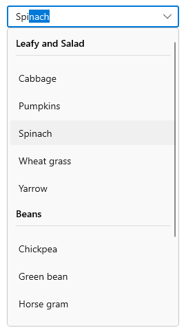

# Grouping in WinUI ComboBox

This section explains about the grouping support available in SfComboBox.

## Enable grouping

To display grouped data in SfComboBox control, set the `ItemsSource` property to a [CollectionViewSource](https://docs.microsoft.com/en-us/windows/winui/api/microsoft.ui.xaml.data.collectionviewsource?view=winui-3.0) with the `IsSourceGrouped` property set to true. The CollectionViewSource acts as a proxy over the collection class to enable grouping support.

Also, the appearance of groups in a drop-down list can be defined by using the `GroupStyle` property. The default value of `GroupStyle` is `null`.

In the following example, define a CollectionViewSource that wraps a collection of vegetable objects and specifies a property to group on (the vegetable category). Then, bind the `View` property of CollectionViewSource to the `ItemsSource` property of ComboBox control.




//Model.cs
public class Vegetable
{
    public string Name { get; set; }
    public string Category { get; set; }
}

//ViewModel.cs
public class VegetablesViewModel
{
    public object Vegetables { get; set; }

    public VegetablesViewModel()
    {
        var vegetables = new ObservableCollection<Vegetable>();
        vegetables.Add(new Vegetable {
            Name = "Cabbage",
            Category = "Leafy and Salad",
        });
        vegetables.Add(new Vegetable {
            Name = "Chickpea",
            Category = "Beans",
        });
        vegetables.Add(new Vegetable {
            Name = "Garlic",
            Category = "Bulb and Stem",
        });
        vegetables.Add(new Vegetable {
            Name = "Green bean",
            Category = "Beans",
        });
        vegetables.Add(new Vegetable {
            Name = "Horse gram",
            Category = "Beans",
        });
        vegetables.Add(new Vegetable {
            Name = "Nopal",
            Category = "Bulb and Stem",
        });
        vegetables.Add(new Vegetable {
            Name = "Onion",
            Category = "Bulb and Stem",
        });
        vegetables.Add(new Vegetable {
            Name = "Pumpkins",
            Category = "Leafy and Salad",
        });
        vegetables.Add(new Vegetable {
            Name = "Spinach",
            Category = "Leafy and Salad",
        });

        //Groups the elements based on value of Vegetable's Category.
        this.Vegetables = vegetables.GroupBy(item => item.Category);
    }
}







<Grid>
    <Grid.DataContext>
        <local:VegetablesViewModel/>
    </Grid.DataContext>
    <Grid.Resources>
        <CollectionViewSource 
            x:Name="VegetablesCollection" 
            Source="{Binding Vegetables}"
            IsSourceGrouped="True"/>
    </Grid.Resources>
    <editors:SfComboBox 
        x:Name="sfComboBox"
        Width="250"
        IsEditable="True"
        PlaceholderText="Select a vegetable"
        MaxDropDownHeight="435"
        TextMemberPath="Name"
        DisplayMemberPath="Name"
        ItemsSource="{x:Bind VegetablesCollection.View, Mode=OneWay}">
        <editors:SfComboBox.GroupStyle>
            <GroupStyle>
                <GroupStyle.HeaderTemplate>
                    <DataTemplate>
                        <Grid>
                            <TextBlock
                                FontWeight="SemiBold"
                                FontSize="14"
                                FontFamily="{ThemeResource ContentControlThemeFontFamily}"
                                VerticalAlignment="Center"
                                Text="{Binding Key}" />
                        </Grid>
                    </DataTemplate>
                </GroupStyle.HeaderTemplate>
            </GroupStyle>
        </editors:SfComboBox.GroupStyle>
    </editors:SfComboBox >
</Grid>




