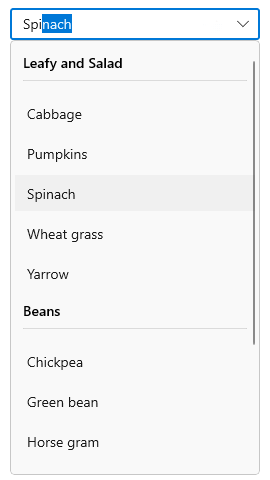

# Grouping in WinUI ComboBox (SfComboBox)

This section describes the grouping support available in [ComboBox](https://help.syncfusion.com/cr/winui/Syncfusion.UI.Xaml.Editors.SfComboBox.html).

## Enable grouping

N> The [Syncfusion.Editors.WinUI](https://www.nuget.org/packages/Syncfusion.Editors.WinUI) NuGet package is required to use the `SfComboBox` control. Refer to [Getting Started](https://help.syncfusion.com/winui/combobox/getting-started) for setup details.

To display grouped data in `ComboBox` control, set the [ItemsSource](https://help.syncfusion.com/cr/winui/Syncfusion.UI.Xaml.Editors.DropDownListBase.html?tabs=tabid-1#Syncfusion_UI_Xaml_Editors_DropDownListBase_ItemsSource) property to a [CollectionViewSource](https://learn.microsoft.com/en-us/uwp/api/windows.ui.xaml.data.collectionviewsource?view=winrt-28000) with the `IsSourceGrouped` property set to `true`. The `CollectionViewSource` acts as a proxy over the source collection to enable grouping support.

Also, the appearance of groups in a drop-down list can be defined by using the [GroupStyle](https://help.syncfusion.com/cr/winui/Syncfusion.UI.Xaml.Editors.DropDownListBase.html?tabs=tabid-1#Syncfusion_UI_Xaml_Editors_DropDownListBase_GroupStyle) property. The default value of `GroupStyle` is `null`. The `GroupStyle` exposes properties such as `HeaderTemplate`, `ContainerStyle`, and `Panel` to customize the group header appearance, item container style, and items panel respectively.

In the following example, define a `CollectionViewSource` that wraps a collection of vegetable objects and specifies a property to group on (the vegetable category). Then, bind the `View` property of `CollectionViewSource` to the `ItemsSource` property of `ComboBox` control.




using System.Collections.Generic;
using System.Collections.ObjectModel;
using System.Linq;

//Model.cs
public class Vegetable
{
    public string Name { get; set; }
    public string Category { get; set; }
}

//ViewModel.cs
public class VegetablesViewModel
{
    public object Vegetables { get; set; }

    public VegetablesViewModel()
    {
        var vegetables = new ObservableCollection<Vegetable>();
        vegetables.Add(new Vegetable {
            Name = "Cabbage",
            Category = "Leafy and Salad",
        });
        vegetables.Add(new Vegetable {
            Name = "Chickpea",
            Category = "Beans",
        });
        vegetables.Add(new Vegetable {
            Name = "Garlic",
            Category = "Bulb and Stem",
        });
        vegetables.Add(new Vegetable {
            Name = "Green bean",
            Category = "Beans",
        });
        vegetables.Add(new Vegetable {
            Name = "Horse gram",
            Category = "Beans",
        });
        vegetables.Add(new Vegetable {
            Name = "Nopal",
            Category = "Bulb and Stem",
        });
        vegetables.Add(new Vegetable {
            Name = "Onion",
            Category = "Bulb and Stem",
        });
        vegetables.Add(new Vegetable {
            Name = "Pumpkins",
            Category = "Leafy and Salad",
        });
        vegetables.Add(new Vegetable {
            Name = "Spinach",
            Category = "Leafy and Salad",
        });

        //Groups the elements based on value of Vegetable's Category.
        this.Vegetables = vegetables.GroupBy(item => item.Category);
    }
}







<Grid>
    <Grid.DataContext>
        <local:VegetablesViewModel/>
    </Grid.DataContext>
    <Grid.Resources>
        <CollectionViewSource x:Name="VegetablesCollection"
                              Source="{Binding Vegetables}"
                              IsSourceGrouped="True"/>
    </Grid.Resources>
    <editors:SfComboBox x:Name="comboBox"
                        Width="250"
                        IsEditable="True"
                        PlaceholderText="Select a vegetable"
                        MaxDropDownHeight="435"
                        TextMemberPath="Name"
                        DisplayMemberPath="Name"
                        ItemsSource="{x:Bind VegetablesCollection.View, Mode=OneWay}">
        <editors:SfComboBox.GroupStyle>
            <GroupStyle>
                <GroupStyle.HeaderTemplate>
                    <DataTemplate>
                        <Grid>
                            <TextBlock
                                FontWeight="SemiBold"
                                FontSize="14"
                                FontFamily="{ThemeResource ContentControlThemeFontFamily}"
                                VerticalAlignment="Center"
                                Text="{Binding Key}" />
                        </Grid>
                    </DataTemplate>
                </GroupStyle.HeaderTemplate>
            </GroupStyle>
        </editors:SfComboBox.GroupStyle>
    </editors:SfComboBox >
</Grid>




