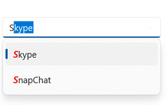
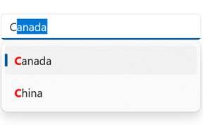
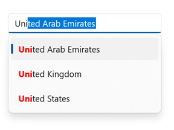
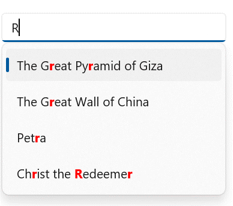
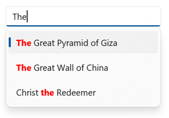
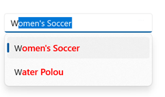
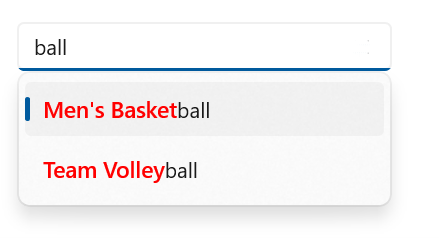

# Highlighting in WinUI ComboBox(SfComboBox)

Highlight matching characters in a suggestion list to pick an item with more clarity. There are two ways to highlight the matching text:

* **Highlight beginning text**
* **Highlight all occurance of search text**

The text highlight can be indicated with various customizing styles by enabling the below properties. They are

* **HighlightedTextColor** - sets the color of the highlighted text for differentiating the highlighted characters.

* **HighlightedTextFontStyle** - sets the font style of the highlighted text.
        
* **HighlightedTextFontWeight** - sets the font weight of the highlighted text.

* **HightlightedTextFontSize** - sets the font size of the highlighted text.



    <editors:SfComboBox 
                            x:Name="comboBox"
                            DisplayMemberPath="Name"
                            IsEditable="true"
                            IsFilteringEnabled="True"                       
                            TextHighlightMode="Matched"                                
                            TextSearchMode="StartsWith"                               
                            HighlightedTextFontSize="15"                               
                            HighlightedTextFontStyle="Italic"                               
                            HighlightedTextFontWeight="Medium"                                
                            HighlightedTextForeground="Red"                                
                            ItemsSource="{Binding SocialMedias}">       
    </editors:SfComboBox>



        comboBox.DisplayMemberPath = "Name";
        comboBox.IsEnabled=true;
        comboBox.IsFilteringEnabled = true;          
        comboBox.TextHighlightMode = ComboBoxTextHighlightMode.Unmatched;
        comboBox.TextSearchMode = ComboBoxTextSearchMode.Contains;
        comboBox.HighlightedTextFontSize = 10;
        comboBox.HighlightedTextFontStyle = FontStyle.Normal;
        comboBox.HighlightedTextFontWeight = FontWeights.ExtraLight;
        comboBox.HighlightedTextForeground = Color.Red;



### **Highlight beginning text**
It highlights the matches that starts with the typed characters in suggestion list.




<editors:SfComboBox     x:Name="comboBox"                        
                        DisplayMemberPath="Name" 
                        IsEditable="true"
                        IsFilteringEnabled="True"                            
                        TextHighlightMode="Matched"
                        TextSearchMode="StartsWith"                           
                        HighlightedTextForeground="Red"                               
                        ItemsSource="{Binding Countries}">
</editors:SfComboBox>



comboBox.DisplayMemberPath = "Name";
comboBox.IsEnabled=true;
comboBox.IsFilteringEnabled = true;
comboBox.TextHighlightMode = ComboBoxTextHighlightMode.Matched;
comboBox.TextSearchMode = ComboBoxTextSearchMode.StartsWith;
comboBox.HighlightedTextForeground = Color.Red;




### Searching with one character

### Searching with more than one character

### **Highlight all occurance of search text**
It highlights all the matches that contains the typed characters in suggestion list. 




<editors:SfComboBox  x:Name="comboBox"                         
                DisplayMemberPath="Name” 
                IsEditable="true"
                IsFilteringEnabled="True"                             
                TextHighlightMode="Matched"
                TextSearchMode="Contains"                           
                HighlightedTextForeground="Red"                               
                ItemsSource="{Binding Wonders}">
</editors:SfComboBox>




        comboBox.DisplayMemberPath = "Name";
        comboBox.IsEnabled=true;
        comboBox.IsFilteringEnabled = true;
        comboBox.TextHighlightMode = ComboBoxTextHighlightMode.Matched;
        comboBox.TextSearchMode = ComboBoxTextSearchMode.Contains;
        comboBox.HighlightedTextForeground = Color.Red;




### Searching with one character

### Searching with more than one character

## **Highlighting search text mode** 
 The SfComboBox provides the following modes.
* **None** - This mode doesnot highlight any text.
* **Matched** - This mode highlights the text that matches the user input.
* **Unmatched** - This mode highlights the text that doesnot matches the user input.

###  TextSearchMode="StartsWith"          


               <editors:SfComboBox  x:Name="comboBox"                          
                                DisplayMemberPath="Name"  
                                IsEditable="true"
                                IsFilteringEnabled="True"                             
                                TextHighlightMode="Unmatched"
                                TextSearchMode="StartsWith"                              
                                HighlightedTextForeground="Red"                                
                                ItemsSource="{Binding OlympicGames}">
              </editors:SfComboBox>



        comboBox.DisplayMemberPath = "Name";
        comboBox.IsEnabled=true;
        comboBox.IsFilteringEnabled = true;
        comboBox.TextHighlightMode = ComboBoxTextHighlightMode.Unmatched;
        comboBox.TextSearchMode = AComboBoxTextSearchMode.StartsWith;
        comboBox.HighlightedTextForeground = Color.Red;




###  TextSearchMode="Contains"           


               <editors:SfComboBox   x:Name="comboBox"                         
                                DisplayMemberPath="Name" 
                                IsEditable="true"
                                IsFilteringEnabled="True"                              
                                TextHighlightMode="Unmatched"
                                TextSearchMode="Contains"                              
                                HighlightedTextForeground="Red"                                
                                ItemsSource="{Binding OlympicGames}">
              </editors:SfComboBox>



        comboBox.DisplayMemberPath = "Name";
        comboBox.IsEnabled=true;
        comboBox.IsFilteringEnabled = true;
        comboBox.TextHighlightMode = ComboBoxTextHighlightMode.Unmatched;
        comboBox.TextSearchMode = ComboBoxTextSearchMode.Contains;
        comboBox.HighlightedTextForeground = Color.Red;




