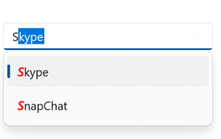
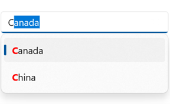
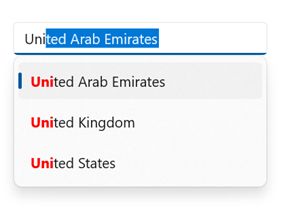
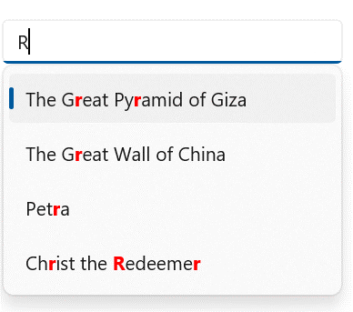
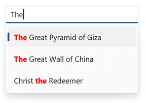
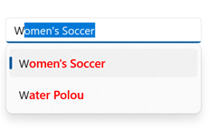
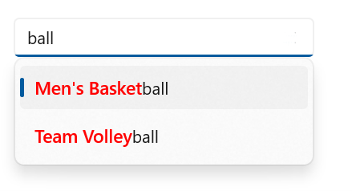

# Highlighting in WinUI ComboBox (SfComboBox)

Highlight matching characters in the suggestion list to pick an item with more clarity. There are two ways to highlight the matching text:

* **Highlight beginning text**
* **Highlight all occurrences of the search text**

N> The [Syncfusion.Editors.WinUI](https://www.nuget.org/packages/Syncfusion.Editors.WinUI) NuGet package is required to use the `SfComboBox` control. Refer to [Getting Started](https://help.syncfusion.com/winui/combobox/getting-started) for setup details.

N> Text highlighting requires `IsEditable="true"` and `IsFilteringEnabled="True"`. Add `using Syncfusion.UI.Xaml.Editors;` in C# to access the `ComboBoxTextHighlightMode` and `ComboBoxTextSearchMode` enums.

The text highlight can be customized using the following properties:

* **HighlightedTextForeground** - Sets the color of the highlighted text for differentiating the highlighted characters.
* **HighlightedTextFontStyle** - Sets the font style of the highlighted text.
* **HighlightedTextFontWeight** - Sets the font weight of the highlighted text.
* **HighlightedTextFontSize** - Sets the font size of the highlighted text.



    <editors:SfComboBox 
                            x:Name="comboBox"
                            DisplayMemberPath="Name"
                            IsEditable="true"
                            IsFilteringEnabled="True"                       
                            TextHighlightMode="Matched"                                
                            TextSearchMode="StartsWith"                               
                            HighlightedTextFontSize="15"                               
                            HighlightedTextFontStyle="Italic"                               
                            HighlightedTextFontWeight="Medium"                                
                            HighlightedTextForeground="Red"                                
                            ItemsSource="{Binding SocialMedias}">       
    </editors:SfComboBox>



        comboBox.DisplayMemberPath = "Name";
        comboBox.IsEnabled = true;
        comboBox.IsFilteringEnabled = true;          
        comboBox.TextHighlightMode = ComboBoxTextHighlightMode.Unmatched;
        comboBox.TextSearchMode = ComboBoxTextSearchMode.Contains;
        comboBox.HighlightedTextFontSize = 10;
        comboBox.HighlightedTextFontStyle = FontStyle.Normal;
        comboBox.HighlightedTextFontWeight = FontWeights.ExtraLight;
        comboBox.HighlightedTextForeground = Color.Red;



### **Highlight beginning text**
It highlights the matches that start with the typed characters in the suggestion list.




<editors:SfComboBox     x:Name="comboBox"                        
                        DisplayMemberPath="Name" 
                        IsEditable="true"
                        IsFilteringEnabled="True"                            
                        TextHighlightMode="Matched"
                        TextSearchMode="StartsWith"                           
                        HighlightedTextForeground="Red"                               
                        ItemsSource="{Binding Countries}">
</editors:SfComboBox>



comboBox.DisplayMemberPath = "Name";
comboBox.IsEnabled=true;
comboBox.IsFilteringEnabled = true;
comboBox.TextHighlightMode = ComboBoxTextHighlightMode.Matched;
comboBox.TextSearchMode = ComboBoxTextSearchMode.StartsWith;
comboBox.HighlightedTextForeground = Color.Red;




### Searching with one character

### Searching with more than one character

### **Highlight all occurrences of the search text**
It highlights all the matches that contain the typed characters in the suggestion list. 




<editors:SfComboBox  x:Name="comboBox"                         
                DisplayMemberPath="Name" 
                IsEditable="true"
                IsFilteringEnabled="True"                             
                TextHighlightMode="Matched"
                TextSearchMode="Contains"                           
                HighlightedTextForeground="Red"                               
                ItemsSource="{Binding Wonders}">
</editors:SfComboBox>




        comboBox.DisplayMemberPath = "Name";
        comboBox.IsEnabled=true;
        comboBox.IsFilteringEnabled = true;
        comboBox.TextHighlightMode = ComboBoxTextHighlightMode.Matched;
        comboBox.TextSearchMode = ComboBoxTextSearchMode.Contains;
        comboBox.HighlightedTextForeground = Color.Red;




### Searching with one character

### Searching with more than one character

## Highlighting search text mode
The [TextHighlightMode](https://help.syncfusion.com/cr/winui/Syncfusion.UI.Xaml.Editors.SfComboBox.html#Syncfusion_UI_Xaml_Editors_SfComboBox_TextHighlightMode) property controls which portion of the text is highlighted. The default value is `None`. The available modes are:
* **None** - This mode does not highlight any text.
* **Matched** - This mode highlights the text that matches the user input.
* **Unmatched** - This mode highlights the text that does not match the user input.

###  TextSearchMode="StartsWith"


               <editors:SfComboBox  x:Name="comboBox"                          
                                DisplayMemberPath="Name"  
                                IsEditable="true"
                                IsFilteringEnabled="True"                             
                                TextHighlightMode="Unmatched"
                                TextSearchMode="StartsWith"                              
                                HighlightedTextForeground="Red"                                
                                ItemsSource="{Binding OlympicGames}">
              </editors:SfComboBox>



        comboBox.DisplayMemberPath = "Name";
        comboBox.IsEnabled=true;
        comboBox.IsFilteringEnabled = true;
        comboBox.TextHighlightMode = ComboBoxTextHighlightMode.Unmatched;
        comboBox.TextSearchMode = ComboBoxTextSearchMode.StartsWith;
        comboBox.HighlightedTextForeground = Color.Red;




###  TextSearchMode="Contains"


               <editors:SfComboBox   x:Name="comboBox"                         
                                DisplayMemberPath="Name" 
                                IsEditable="true"
                                IsFilteringEnabled="True"                              
                                TextHighlightMode="Unmatched"
                                TextSearchMode="Contains"                              
                                HighlightedTextForeground="Red"                                
                                ItemsSource="{Binding OlympicGames}">
              </editors:SfComboBox>



        comboBox.DisplayMemberPath = "Name";
        comboBox.IsEnabled=true;
        comboBox.IsFilteringEnabled = true;
        comboBox.TextHighlightMode = ComboBoxTextHighlightMode.Unmatched;
        comboBox.TextSearchMode = ComboBoxTextSearchMode.Contains;
        comboBox.HighlightedTextForeground = Color.Red;




