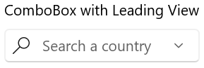
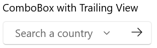
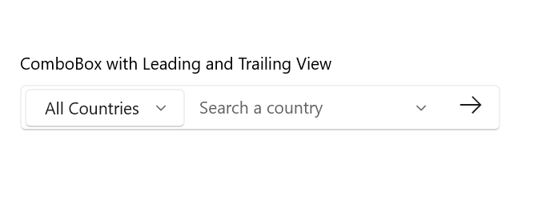

# Leading  and Trailing View in WinUI ComboBox (SfComboBox)

This section explains about the Leading and Trailing view support available in [ComboBox](https://help.syncfusion.com/cr/winui/Syncfusion.UI.Xaml.Editors.SfComboBox.html).The `Leadingview` appears before the `ComboBox` selection area and `Trailingview` appears after the `ComboBox`  selection area. Any content, such as an icon, image, button, or other control, can be displayed in the `Leadingview` and `Trailingview`.

## Leading View 

The below code shows how to include the `Leadingview` in `ComboBox`.




<editors:SfComboBox Header="ComboBox with Leading View"                
                    PlaceholderText="Search a country">
        <editors:SfComboBox.LeadingView>
                <Viewbox Height="16"
                         Width="16"
                         Margin="4,0,0,0">
                    <SymbolIcon Symbol="Find" />
                </Viewbox>
        </editors:SfComboBox.LeadingView>
</editors:SfComboBox>




## Trailing View 

The below code shows how to include the `Trailingview` in `ComboBox`.




<editors:SfComboBox Header="ComboBox with Trailing View"
                    PlaceholderText="Search a country">
        <editors:SfComboBox.TrailingView>
                <Button>
                    <Viewbox Height="16"
                             Width="16">
                        <FontIcon Glyph="&#xEBE7;" />
                    </Viewbox>
                </Button>
        </editors:SfComboBox.TrailingView>
</editors:SfComboBox>




## Both Leading and Trailing View 

The below code shows how to include both the `Leadingview` and `Trailingview` in `ComboBox`.




 <editors:SfComboBox Header="ComboBox with Leading and Trailing View"
                     PlaceholderText="Search a country">
        <editors:SfComboBox.LeadingView>
                <editors:SfComboBox Margin="0,4,0,4">
                        <editors:SfComboBoxItem Content="Asia" />
                        <editors:SfComboBoxItem Content="Africa" />
                        <editors:SfComboBoxItem Content="North America"/>
                        <editors:SfComboBoxItem Content="South America" />
                        <editors:SfComboBoxItem Content="Europe" />
                        <editors:SfComboBoxItem Content="All Countries"
                                                IsSelected="True"/>
                </editors:SfComboBox>
        </editors:SfComboBox.LeadingView>
        <editors:SfComboBox.TrailingView>
                <Viewbox Height="16"
                         Width="16"
                         Margin="0,0,8,0">
                    <SymbolIcon Symbol="Find" />
                </Viewbox>
        </editors:SfComboBox.TrailingView>
</editors:SfComboBox>
  



