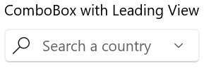
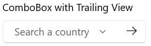
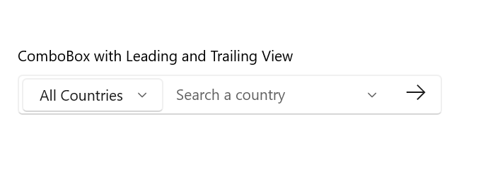

# Leading and Trailing View in WinUI ComboBox (SfComboBox)

This section describes the leading and trailing view support available in [ComboBox](https://help.syncfusion.com/cr/winui/Syncfusion.UI.Xaml.Editors.SfComboBox.html). The [LeadingView](https://help.syncfusion.com/cr/winui/Syncfusion.UI.Xaml.Editors.DropDownListBase.html?tabs=tabid-1#Syncfusion_UI_Xaml_Editors_DropDownListBase_LeadingView) appears before the `ComboBox` selection area, and [TrailingView](https://help.syncfusion.com/cr/winui/Syncfusion.UI.Xaml.Editors.DropDownListBase.html#Syncfusion_UI_Xaml_Editors_DropDownListBase_TrailingView) appears after the `ComboBox` selection area. Any content, such as an icon, image, button, or control, can be displayed in the `LeadingView` and `TrailingView`.

N> The [Syncfusion.Editors.WinUI](https://www.nuget.org/packages/Syncfusion.Editors.WinUI) NuGet package is required to use the `SfComboBox` control. Import the `xmlns:editors="using:Syncfusion.UI.Xaml.Editors"` namespace in XAML.

## Leading View 

The following code shows how to include the `LeadingView` in ComboBox.




<editors:SfComboBox Header="ComboBox with Leading View"                
                    PlaceholderText="Search a country">
        <editors:SfComboBox.LeadingView>
                <Viewbox Height="16"
                         Width="16"
                         Margin="4,0,0,0">
                    <SymbolIcon Symbol="Find" />
                </Viewbox>
        </editors:SfComboBox.LeadingView>
</editors:SfComboBox>




## Trailing View 

The following code shows how to include the `TrailingView` in ComboBox.




<editors:SfComboBox Header="ComboBox with Trailing View"
                    PlaceholderText="Search a country">
        <editors:SfComboBox.TrailingView>
                <Button BorderThickness="0"
                        Height="25">
                    <Viewbox Height="16"
                             Width="16">
                        <FontIcon Glyph="&#xEBE7;" />
                    </Viewbox>
                </Button>
        </editors:SfComboBox.TrailingView>
</editors:SfComboBox>




## Leading and Trailing View 

The following code shows how to include both the `LeadingView` and `TrailingView` in ComboBox. The example nests a `SfComboBox` in the `LeadingView` to demonstrate that any control can be hosted in these slots.




 <editors:SfComboBox Header="ComboBox with Leading and Trailing View"
                     PlaceholderText="Search a country">
        <editors:SfComboBox.LeadingView>
                <editors:SfComboBox Margin="0,4,0,4">
                        <editors:SfComboBoxItem Content="Asia" />
                        <editors:SfComboBoxItem Content="Africa" />
                        <editors:SfComboBoxItem Content="North America"/>
                        <editors:SfComboBoxItem Content="South America" />
                        <editors:SfComboBoxItem Content="Europe" />
                        <editors:SfComboBoxItem Content="All Countries"
                                                IsSelected="True"/>
                </editors:SfComboBox>
        </editors:SfComboBox.LeadingView>
        <editors:SfComboBox.TrailingView>
                <Viewbox Height="16"
                         Width="16"
                         Margin="0,0,8,0">
                    <SymbolIcon Symbol="Find" />
                </Viewbox>
        </editors:SfComboBox.TrailingView>
</editors:SfComboBox>
  



