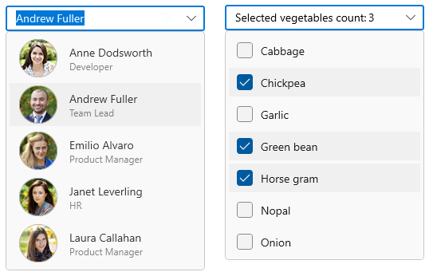

# WinUI ComboBox Overview

The `WinUI ComboBox control` (dropdown) is a selection component that allows users to type a value or choose an option from a list of predefined options. It has many features, such as data binding, multiple selection with checkboxes, editing, searching, filtering, UI customization, and custom templates.

## Control Structure

## Key Features

* Data binding – Support to bind various type data sources.
* Editable mode – Editable and non-editable text boxes to select items from the given data source.
* Selection mode – Support to select single or multiple values from drop-down list.
* Filtering – The ComboBox filters items based on the entered text and auto fills with the first suggestion.
* Searching – Highlights the matching item in the drop down list based on the provided input. 
* Watermark – Display placeholder text inside the control until the user inputs text.
* Styling and Template support – SelectionBox and Dropdown list items can be customized with an image or custom control using templates in `ComboBox` control.
 