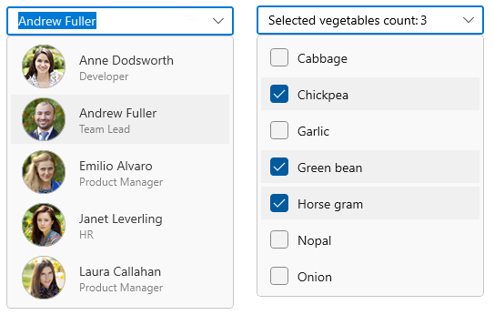

# WinUI ComboBox Overview

The [WinUI ComboBox control](https://www.syncfusion.com/winui-controls/combobox) (multi-select ComboBox) is a selection component that allows users to type a value or choose an option from a list of predefined options. It has many features, such as data binding, multiple selection with checkboxes, editing, searching, filtering, UI customization, and custom templates.

N> The [Syncfusion.Editors.WinUI](https://www.nuget.org/packages/Syncfusion.Editors.WinUI) NuGet package is required to use the `SfComboBox` control. Refer to [Getting Started](https://help.syncfusion.com/winui/combobox/getting-started) for setup details.

## Control structure

The following diagram illustrates the structure of the `ComboBox` control.

## Key features

* **Data binding** – Support to bind various types of data sources.
* **Editable mode** – Supports editable and non-editable modes to select items from the given data source.
* **Selection mode** – Support to select single or multiple values from the drop-down list.
* **Filtering** – The ComboBox filters items based on the entered text and auto-fills with the first suggestion in `StartsWith` mode.
* **Searching** – Highlights the matching item in the drop-down list based on the provided input. 
* **Watermark** – Displays placeholder text (via the `PlaceholderText` property) inside the control until the user enters text.
* **Styling and template support** – SelectionBox and drop-down list items can be customized with an image or custom control using templates in the `ComboBox` control.

## See also

* [Editing](https://help.syncfusion.com/winui/combobox/editing)
* [Selection](https://help.syncfusion.com/winui/combobox/selection)
* [Searching](https://help.syncfusion.com/winui/combobox/searching)
* [Filtering](https://help.syncfusion.com/winui/combobox/filtering)
* [Grouping](https://help.syncfusion.com/winui/combobox/grouping)
* [Keyboard Support](https://help.syncfusion.com/winui/combobox/keyboard-support)
* [Leading and Trailing View](https://help.syncfusion.com/winui/combobox/leading-and-trailing-view)
* [UI Customization](https://help.syncfusion.com/winui/combobox/ui-customization)
