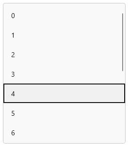

# Searching in WinUI ComboBox (SfComboBox)

The [ComboBox](https://help.syncfusion.com/cr/winui/Syncfusion.UI.Xaml.Editors.SfComboBox.html) control provides rich text searching functionality. The [TextSearchMode](https://help.syncfusion.com/cr/winui/Syncfusion.UI.Xaml.Editors.SfComboBox.html#Syncfusion_UI_Xaml_Editors_SfComboBox_TextSearchMode) and [IsTextSearchEnabled](https://help.syncfusion.com/cr/winui/Syncfusion.UI.Xaml.Editors.SfComboBox.html#Syncfusion_UI_Xaml_Editors_SfComboBox_IsTextSearchEnabled) properties of the `ComboBox` can be used to regulate how the control behaves when it receives user input.

## Search based on member path

The [TextMemberPath](https://help.syncfusion.com/cr/winui/Syncfusion.UI.Xaml.Editors.SfDropDownListBase.html#Syncfusion_UI_Xaml_Editors_SfDropDownListBase_TextMemberPath) and [DisplayMemberPath](https://help.syncfusion.com/cr/winui/Syncfusion.UI.Xaml.Editors.SfDropDownListBase.html#Syncfusion_UI_Xaml_Editors_SfDropDownListBase_DisplayMemberPath) properties of `ComboBox` control specify the property path, by which the searching must be done when a custom data is bound to the `ItemsSource` property.

`TextMemberPath` - Specifies the property path, by which the searching must be done when user input is received in the selection box portion of the `ComboBox` control. The default value is `String.Empty`. When `TextMemberPath` is `null` or `string.Empty`, searching will be performed based on `DisplayMemberPath`. When both the properties have a `null` or `string.Empty` value, searching will be performed based on the class name with namespace of the item.

`DisplayMemberPath` - Specifies the property path, by which the searching must be done when user input is received in the drop-down portion of the `ComboBox` control. The default value is `String.Empty`.

N> `TextMemberPath` and `DisplayMemberPath` will be effective for the collection item that holds two or more properties in it.

## Edit mode Searching based on TextMemberPath

In edit mode, searching will be performed based on the `TextMemberPath` property while entering the text into the selection box. When `TextMemberPath` is `null` or `string.Empty`, searching will be performed based on `DisplayMemberPath`. When both the properties have a `null` or `string.Empty` value, searching will be performed based on the class name with namespace of the item.




<editors:SfComboBox x:Name="comboBox"
                    Width="250"
                    IsTextSearchEnabled="true"
                    IsEditable="true"
                    ItemsSource="{Binding SocialMedias}"
                    TextMemberPath="ID"
                    DisplayMemberPath="Name" />





comboBox.TextMemberPath = "ID";




For e.g. After typing `4` in selection box.

## Non-Editable mode Searching based on DisplayMemberPath

In non-editable mode, searching will be performed based on the `DisplayMemberPath` property when user input is received in drop-down. If `DisplayMemberPath` is `null` or `string.Empty`,  searching will be performed based on the class name with namespace of the item.




<editors:SfComboBox x:Name="comboBox"
                    Width="250"
                    IsTextSearchEnabled="true"
                    ItemsSource="{Binding SocialMedias}"
                    TextMemberPath="Name"
                    DisplayMemberPath="ID" />





comboBox.DisplayMemberPath = "ID";




For e.g. After typing `4` in drop-down.

## Auto appending of text

The `ComboBox` control provides support to auto append the text based on data source when end-user edits. If the `IsTextSearchEnabled` property is set as `false`, the matched suitable text will not append with the entered text.




<editors:SfComboBox x:Name="comboBox"
                    Width="250"
                    IsEditable="true"
                    ItemsSource="{Binding SocialMedias}"
                    TextMemberPath="Name"
                    DisplayMemberPath="Name" />




N> Auto appending of text is supported only in `Editable` mode and `TextSearchMode` property should be `StartsWith`.

## Search Mode

The `TextSearchMode` property of the `ComboBox` can be used to regulate how the control behaves when it receives user input. The default text searching type is `StartsWith`, ignoring accent and it is case insensitive. The available text search modes are,

* StartsWith
* Contains

### Search with beginning text

Search the matching items based on the starting text, and the first item which fits the user input in the drop-down list, will be highlighted.

The following examples show how to perform text searching functionality in single selection mode.




<editors:SfComboBox x:Name="comboBox"
                    Width="250"
                    TextSearchMode="StartsWith"
                    ItemsSource="{Binding SocialMedias}"
                    DisplayMemberPath="Name"
                    TextMemberPath="Name" />





comboBox.TextSearchMode = ComboBoxTextSearchMode.StartsWith;




The following examples show how to perform text searching functionality in multiple selection mode.




<editors:SfComboBox x:Name="comboBox"
                    Width="250"
                    SelectionMode="Multiple"
                    TextSearchMode="StartsWith"
                    ItemsSource="{Binding SocialMedias}"
                    DisplayMemberPath="Name"
                    TextMemberPath="Name" />





comboBox.TextSearchMode = ComboBoxTextSearchMode.StartsWith;




### Search with contains text

Search the matching items containing specific text, and the first item which fits the user input in the drop-down list, will be highlighted.




<editors:SfComboBox x:Name="comboBox"
                    Width="250"
                    IsEditable="True"
                    TextSearchMode="Contains"
                    ItemsSource="{Binding SocialMedias}"
                    TextMemberPath="Name"
                    DisplayMemberPath="Name" />





comboBox.TextSearchMode = ComboBoxTextSearchMode.Contains;




### Custom searching

The ComboBox control provides support to apply your own custom search logic to highlight the item in the drop-down based on your search criteria by using the [SearchBehavior](https://help.syncfusion.com/cr/winui/Syncfusion.UI.Xaml.Editors.SfComboBox.html#Syncfusion_UI_Xaml_Editors_SfComboBox_SearchBehavior) property. The default value of `SearchBehavior` is `null`.

Now, let us create a custom searching class to apply our own search logic to ComboBox control by the following steps:

**Step 1:** Create a class that derives from the [IComboBoxSearchBehavior](https://help.syncfusion.com/cr/winui/Syncfusion.UI.Xaml.Editors.IComboBoxSearchBehavior.html) interface. 




/// 

/// Represents a custom searching behavior for `ComboBox` control. 
/// 

public class StringLengthSearchingBehavior : IComboBoxSearchBehavior
{
   
}




**Step 2:** Then, implement the [GetHighlightIndex](https://help.syncfusion.com/cr/winui/Syncfusion.UI.Xaml.Editors.IComboBoxSearchBehavior.html#Syncfusion_UI_Xaml_Editors_IComboBoxSearchBehavior_GetHighlightIndex_Syncfusion_UI_Xaml_Editors_SfComboBox_Syncfusion_UI_Xaml_Editors_ComboBoxSearchInfo_) method of IComboBoxSearchBehavior interface to calculate the highlight index depending on the filtered items list and text entered in the ComboBox control that needs to be highlighted in drop-down. The `GetHighlightIndex` method contains the following arguments:

* [source](https://help.syncfusion.com/cr/winui/Syncfusion.UI.Xaml.Editors.SfComboBox.html) - The owner of the search behavior, which holds information about ItemsSource, Items properties, and so on.
* [searchInfo](https://help.syncfusion.com/cr/winui/Syncfusion.UI.Xaml.Editors.ComboBoxSearchInfo.html) - Contains details about the filtered items list and the text entered in ComboBox control. You may compute the index that has to be highlighted in the drop-down list using these details.

The following example demonstrates how to highlight the first item that fully matches the typed length entered in the ComboBox control.




/// 

/// Represents a custom searching behavior for `ComboBox` control. 
/// 

public class StringLengthSearchingBehavior : IComboBoxSearchBehavior
{
    private int charLength;

    /// 

    /// Return the highlight index that fully matches the typed length entered in the ComboBox control.
    /// 

    public int GetHighlightIndex(SfComboBox source, ComboBoxSearchInfo searchInfo)
    {
        if (int.TryParse(searchInfo.Text, out this.charLength)) 
        {
           var fullMatch = searchInfo.FilteredItems.OfType<SocialMedia>().FirstOrDefault(i => i.Name.Length == charLength); 
           if (fullMatch != null)
           {
              return searchInfo.FilteredItems.IndexOf(fullMatch); 
           }
        }
       
        return -1;
    }
}




**Step3:** Apply custom searching to the ComboBox control by using the `SearchBehavior` property. 




<editors:SfComboBox IsEditable="True"
                    ItemsSource="{Binding SocialMedias}"
                    TextMemberPath="Name"
                    DisplayMemberPath="Name">
        <editors:SfComboBox.SearchBehavior>
            <local:StringLengthSearchingBehavior/>
        </editors:SfComboBox.SearchBehavior>
</editors:SfComboBox>




For e.g. After typing `9` in selection box, the first item that fully matches the typed length will be highlighted.

## How to disable searching

To disable searching and auto appending text functionalities, set the `IsTextSearchEnabled` property as `false`. The default value is `true`.




<editors:SfComboBox x:Name="comboBox"
                    Width="250"
                    IsTextSearchEnabled="false"
                    IsEditable="true"
                    ItemsSource="{Binding SocialMedias}"
                    TextMemberPath="Name"
                    DisplayMemberPath="Name" />





comboBox.IsTextSearchEnabled = false;




