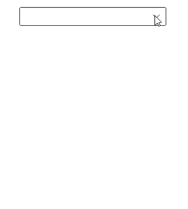

# Searching in WinUI ComboBox

The ComboBox control provides rich text searching functionality. The `TextSearchMode` and `IsTextSearchEnabled` properties of the SfComboBox can be used to regulate how the control behaves when it receives user input.

## Search based on member path

The `TextMemberPath` and `DisplayMemberPath` properties of ComboBox control specify the property path, by which the searching must be done when a custom data is bound to the `ItemsSource` property.

`TextMemberPath` - Specifies the property path, by which the searching must be done when user input is received in the selection box portion of the ComboBox control. The default value is `String.Empty`.
`DisplayMemberPath` - Specifies the property path, by which the searching must be done when user input is received in the drop-down portion of the ComboBox control. The default value is `String.Empty`.

## Auto appending of text

The ComboBox control provides support to auto append the text based on data source when end-user edits. If the `IsTextSearchEnabled` property is set as `false`, the matched suitable text will not append with the entered text.




<editors:SfComboBox x:Name="sfComboBox"
    Width="250"
    IsEditable="true"
    ItemsSource="{Binding SocialMedias}"
    TextMemberPath="Name"
    DisplayMemberPath="Name" />




N> Auto appending of text is supported only in `Editable` mode and `TextSearchMode` property should be `StartsWith`.

## Search Mode

The `TextSearchMode` property of the SfComboBox can be used to regulate how the control behaves when it receives user input. The default text searching type is `StartsWith`, ignoring accent and it is case insensitive. The available text search modes are,

* StartsWith
* Contains

### Search with beginning text

Search the matching items based on the starting text, and the first item which fits the user input in the drop-down list, will be highlighted.

The following examples show how to text searching functionality in single selection mode.




<editors:SfComboBox x:Name="sfComboBox"
                    Width="250"
                    TextSearchMode="StartsWith"
                    ItemsSource="{Binding SocialMedias}"
                    DisplayMemberPath="Name"
                    TextMemberPath="Name">
</editors:SfComboBox>





sfComboBox.TextSearchMode = ComboBoxTextSearchMode.StartsWith;




The following examples show how to text searching functionality in multiple selection mode.




<editors:SfComboBox x:Name="sfComboBox"
                    Width="250"
                    SelectionMode="Multiple"
                    TextSearchMode="StartsWith"
                    ItemsSource="{Binding SocialMedias}"
                    DisplayMemberPath="Name"
                    TextMemberPath="Name">
</editors:SfComboBox>





sfComboBox.TextSearchMode = ComboBoxTextSearchMode.StartsWith;




### Search with contains text

Search the matching items containing specific text, and the first item which fits the user input in the drop-down list, will be highlighted.




<editors:SfComboBox x:Name="sfComboBox"
    Width="250"
    IsEditable="True"
    TextSearchMode="Contains"
    ItemsSource="{Binding SocialMedias}"
    TextMemberPath="Name"
    DisplayMemberPath="Name" />





sfComboBox.TextSearchMode = ComboBoxTextSearchMode.Contains;




## How to disable searching

To disable searching and auto appending text functionalities, set the `IsTextSearchEnabled` property as `false`. The default value is true.




<editors:SfComboBox x:Name="sfComboBox"
    Width="250"
    IsTextSearchEnabled="false"
    IsEditable="true"
    ItemsSource="{Binding SocialMedias}"
    TextMemberPath="Name"
    DisplayMemberPath="ID" />





sfComboBox.IsTextSearchEnabled = false;




