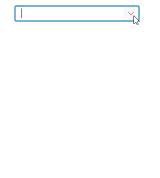
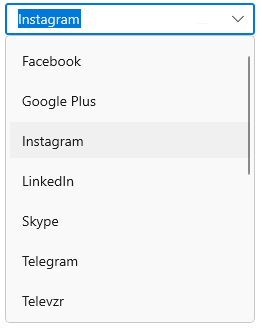
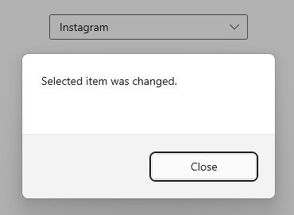
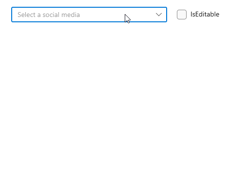
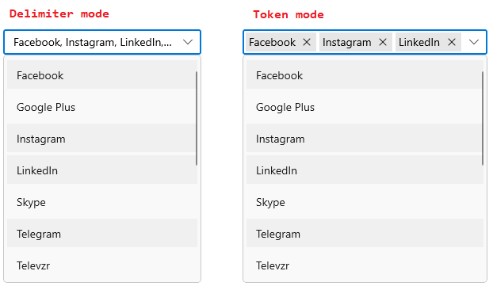
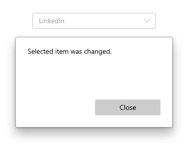

# Selection in WinUI ComboBox (SfComboBox)

The [ComboBox](https://help.syncfusion.com/cr/winui/Syncfusion.UI.Xaml.Editors.SfComboBox.html) allows user to select single or multiple items from the drop-down list. The selection mode can be set by using the [SelectionMode](https://help.syncfusion.com/cr/winui/Syncfusion.UI.Xaml.Editors.SfDropDownListBase.html#Syncfusion_UI_Xaml_Editors_SfDropDownListBase_SelectionMode) property. There are two different selection modes: `Single`, and `Multiple`.

## Single selection

The `ComboBox` allows user to select a single item from the drop-down list.

### UI Selection 

The selected item can be changed interactively by selecting from the drop-down list or entering the value using keyboard and clicking the `Enter` key or losing the control focus. The selected item can be retrieved from the [SelectedItem](https://help.syncfusion.com/cr/winui/Syncfusion.UI.Xaml.Editors.SfDropDownListBase.html#Syncfusion_UI_Xaml_Editors_SfDropDownListBase_SelectedItem) or [SelectedIndex](https://help.syncfusion.com/cr/winui/Syncfusion.UI.Xaml.Editors.SfComboBox.html#Syncfusion_UI_Xaml_Editors_SfComboBox_SelectedIndex) property of `ComboBox` control.




<editors:SfComboBox
    IsEditable="True"
    Width="250"
    ItemsSource="{Binding SocialMedias}"
    DisplayMemberPath="Name"
    TextMemberPath="Name"
    x:Name="comboBox" />




### Programmatic selection 

The selected item can be changed programmatically by using the `SelectedItem` or `SelectedIndex` property of `ComboBox` control. 




<editors:SfComboBox
    Width="250"
    IsEditable="True"
    ItemsSource="{Binding SocialMedias}"
    DisplayMemberPath="Name"
    TextMemberPath="Name"
    SelectedIndex="2"
    x:Name="comboBox" />





comboBox.SelectedIndex = 2;




### Decide when to update selected item

The [SelectionChangeTrigger](https://help.syncfusion.com/cr/winui/Syncfusion.UI.Xaml.Editors.SfComboBox.html#Syncfusion_UI_Xaml_Editors_SfComboBox_SelectionChangeTrigger) property of the `ComboBox` can be used to update the selected item when the user commits a selection or each time the user navigates to a new selection in the `ComboBox`. The default value is `Committed`. The available SelectionChangeTrigger modes are:

* **Committed** - Selected item is updated when the user commits a selection in the `ComboBox`.
* **Always** - Selected item is updated each time the user navigates to a new selection in the `ComboBox`.




<editors:SfComboBox
    IsEditable="True"
    Width="250"
    Margin="0,0,0,250"
    ItemsSource="{Binding SocialMedias}"
    SelectionChangeTrigger="Always"
    DisplayMemberPath="Name"
    TextMemberPath="Name"
    SelectionChanged="OnComboBoxSelectionChanged"
    x:Name="comboBox" />





private async  void OnComboBoxSelectionChanged(object sender, ComboBoxSelectionChangedEventArgs e)
{
    var cd = new ContentDialog
    {
        Content = "Selected item was changed.",
        CloseButtonText = "Close"
    };

    cd.XamlRoot = this.Content.XamlRoot;
    var result = await cd.ShowAsync();

}




Below screenshots demonstrates, while typing `i` in ComboBox control `Instagram` will be updated as selected item.

N> You can refer more information about `SelectionChanged` event from [this](https://help.syncfusion.com/winui/combobox/selection#selection-changed-event) link.

## Multiple selection

The `ComboBox` allows user to select multiple values from the drop-down list. The multi-select `ComboBox` mode can be enabled by setting the `SelectionMode` property as `Multiple`. 

There are two different display modes to perform multi selection in ComboBox: `Delimiter`, and `Token`. The multi selection display mode can be set by using the `MultiSelectionDisplayMode` property. The default value of `MultiSelectionDisplayMode` property is `Delimiter`.

### Delimiter

When selecting the multiple items, the selected items can be separated from each other with a desired character given for a delimiter. 

N> The `IsEditable` property has no effect when `MultiSelectionDisplayMode` is `Delimiter`.

#### UI selection 

The selected items can be changed interactively by using keyboard or by selecting from a drop-down list. The selected items can be retrieved from the [SelectedItems](https://help.syncfusion.com/cr/winui/Syncfusion.UI.Xaml.Editors.SfDropDownListBase.html#Syncfusion_UI_Xaml_Editors_SfDropDownListBase_SelectedItems) property of `ComboBox` control.




<editors:SfComboBox
    Width="250"
    ItemsSource="{Binding SocialMedias}"
    SelectionMode="Multiple"
    DisplayMemberPath="Name"
    TextMemberPath="Name"
    x:Name="comboBox" />




#### Separate items using delimiter

The `ComboBox` supports various delimiter characters to separate the selected items displayed in a multi-select `ComboBox`. The delimiter character can be set by using the [DelimiterText](https://help.syncfusion.com/cr/winui/Syncfusion.UI.Xaml.Editors.SfDropDownListBase.html#Syncfusion_UI_Xaml_Editors_SfDropDownListBase_DelimiterText) property. The default delimiter character is `,`.




<editors:SfComboBox
    Width="250"
    DelimiterText="-"
    ItemsSource="{Binding SocialMedias}"
    SelectionMode="Multiple"
    DisplayMemberPath="Name"
    TextMemberPath="Name"
    x:Name="comboBox"/>





comboBox.DelimiterText = "-";




### Token

Selected items will be displayed with a customizable token representation and the users can remove each tokenized item with the close button. Token mode supports both editable and non-editable text boxes for selecting items from a data source.

#### UI selection 

The selected items can be changed interactively by using keyboard or by selecting from a drop-down list. The selected items can be retrieved from the [SelectedItems](https://help.syncfusion.com/cr/winui/Syncfusion.UI.Xaml.Editors.SfDropDownListBase.html#Syncfusion_UI_Xaml_Editors_SfDropDownListBase_SelectedItems) property of `ComboBox` control.




<StackPanel Orientation="Horizontal" HorizontalAlignment="Center" VerticalAlignment="Top" Margin="50">
    <StackPanel.DataContext>
        <local:SocialMediaViewModel/>
    </StackPanel.DataContext>
    <editors:SfComboBox x:Name="comboBox"
                        Width="320"
                        ItemsSource="{Binding SocialMedias}"
                        SelectionMode="Multiple"
                        MultiSelectionDisplayMode="Token"
                        DisplayMemberPath="Name"
                        PlaceholderText="Select a social media"
                        TextMemberPath="Name" />

    <CheckBox Margin="20,0,0,0"
              IsChecked="{Binding ElementName=comboBox, Path=IsEditable, Mode=TwoWay}"
              Content="IsEditable" />

</StackPanel>




N> You can refer more information about customization of `ComboBoxTokenItem` from [this](https://help.syncfusion.com/winui/combobox/ui-customization#styling-comboboxtokenitem) link.

### Programmatic selection 

The selected items can be changed programmatically by using the `SelectedItems` property of `ComboBox` control.  




comboBox.DataContext = new SocialMediaViewModel();
SocialMediaViewModel socialMediaViewModel = (this.comboBox.DataContext as SocialMediaViewModel);
ObservableCollection<SocialMedia> socialMediasList = socialMediaViewModel.SocialMedias;
this.comboBox.SelectedItems.Add(socialMediasList[0]);
this.comboBox.SelectedItems.Add(socialMediasList[2]);
this.comboBox.SelectedItems.Add(socialMediasList[3]);
this.comboBox.SelectedItems.Add(socialMediasList[5]);




### How to hide the check box

The checkbox that is displayed in a drop-down list can be hidden by using the [IsMultiSelectCheckBoxEnabled](https://help.syncfusion.com/cr/winui/Syncfusion.UI.Xaml.Editors.SfDropDownListBase.html#Syncfusion_UI_Xaml_Editors_SfDropDownListBase_IsMultiSelectCheckBoxEnabled) property of `ComboBox` control. The default value of `IsMultiSelectCheckBoxEnabled` property is `true`.




<editors:SfComboBox
    Width="250"
    IsMultiSelectCheckBoxEnabled="False"
    ItemsSource="{Binding SocialMedias}"
    SelectionMode="Multiple"
    DisplayMemberPath="Name"
    TextMemberPath="Name"
    x:Name="comboBox"/>





comboBox.IsMultiSelectCheckBoxEnabled = false;




## Selection changed event

When selecting an item from the drop-down list, the [SelectionChanged](https://help.syncfusion.com/cr/winui/Syncfusion.UI.Xaml.Editors.SfDropDownListBase.html#Syncfusion_UI_Xaml_Editors_SfDropDownListBase_SelectionChanged) event is triggered. The `SelectionChanged` event contains the newly selected and removed items in the AddedItems and RemovedItems properties. The `SelectionChanged` contains the following properties:

 * `AddedItems` - Contains the items that were selected.
 * `RemovedItems` - Contains the items that were unselected.




<editors:SfComboBox x:Name="comboBox"
                    Width="250"
                    TextMemberPath="Name"
                    DisplayMemberPath="Name"
                    ItemsSource="{Binding SocialMedias}"
                    SelectionChanged="OnComboBoxSelectionChanged" />





comboBox.SelectionChanged += OnComboBoxSelectionChanged;




The SelectionChanged event can be handled as follows.




private async  void OnComboBoxSelectionChanged(object sender, ComboBoxSelectionChangedEventArgs e)
{
    var cd = new ContentDialog
    {
        Content = "Selected item was changed.",
        CloseButtonText = "Close"
    };

    cd.XamlRoot = this.Content.XamlRoot;
    var result = await cd.ShowAsync();

}




