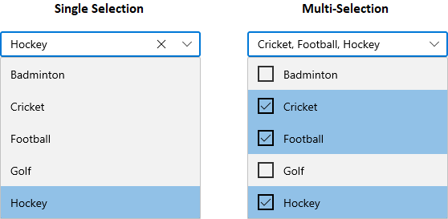
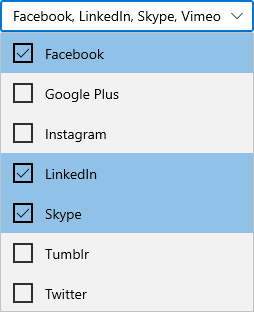
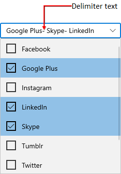
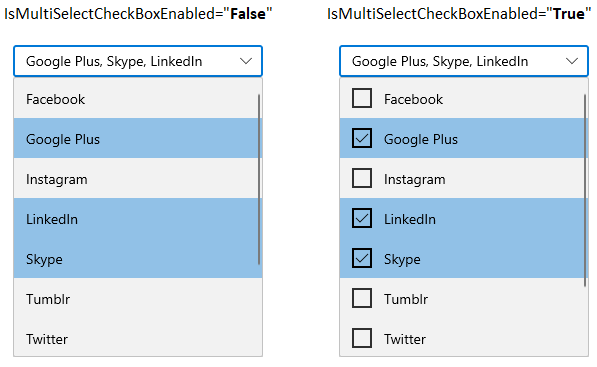

# Selection WinUI ComboBox

This section describes the selection modes available in the WinUI `ComboBox` control.

## Change selection mode

You can select the single or multiple items. By default the selection of items in `ComboBox` is single selection. In order to select multiple items in `ComboBox`, set the `SelectionMode` property value as`Multiple` and select those multiple items from the drop down list. The default value of `SelectionMode` property is **Single**.

* For single selection mode, get the selected item by using `SelectedItem` property.
* For multi-selection mode, get the selected items by using `SelectedItems` property.




//Model.cs
public class SocialMedia
{
    public string Name { get; set; }
    public int ID { get; set; }
}

//ViewModel.cs
public class SocialMediaViewModel
{
    public ObservableCollection<SocialMedia> SocialMedias { get; set; }
    public SocialMediaViewModel()
    {
        this.SocialMedias = new ObservableCollection<SocialMedia>();
        this.SocialMedias.Add(new SocialMedia() { Name = "Facebook", ID = 0 });
        this.SocialMedias.Add(new SocialMedia() { Name = "Google Plus", ID = 1 });
        this.SocialMedias.Add(new SocialMedia() { Name = "Instagram", ID = 2 });
        this.SocialMedias.Add(new SocialMedia() { Name = "LinkedIn", ID = 3 });
        this.SocialMedias.Add(new SocialMedia() { Name = "Skype", ID = 4 });
        this.SocialMedias.Add(new SocialMedia() { Name = "Tumblr", ID = 5 });
        this.SocialMedias.Add(new SocialMedia() { Name = "Twitter", ID = 6 });
        this.SocialMedias.Add(new SocialMedia() { Name = "Vimeo", ID = 7 });
        this.SocialMedias.Add(new SocialMedia() { Name = "WhatsApp", ID = 8 });
        this.SocialMedias.Add(new SocialMedia() { Name = "YouTube", ID = 9 });
    }
}







<editors:SfComboBox
    ItemsSource="{Binding SocialMedias}"
    SelectionMode="Multiple"
    DisplayMemberPath="Name"
    TextMemberPath="Name"
    x:Name="sfComboBox">
    <editors:SfComboBox.DataContext>
        <local:SocialMediaViewModel />
    </editors:SfComboBox.DataContext>
</editors:SfComboBox>




SfComboBox sfComboBox = new SfComboBox();
sfComboBox.DataContext = new SocialMediaViewModel();
sfComboBox.ItemsSource = (sfComboBox.DataContext as SocialMediaViewModel).SocialMedias;
sfComboBox.SelectionMode = ComboBoxSelectionMode.Multiple;
sfComboBox.DisplayMemberPath = "Name";
sfComboBox.TextMemberPath = "Name";




## Select item programmatically using property

You can select the `ComboBoxItem` programmatically by using the `SfComboBoxItem.IsSelected` property. The default value of `SfComboBoxItem.IsSelected` property is **false**.

N> If multiple items are selected using the `IsSelected` property in the single selection mode, only the last selected item will be selected.




<editors:SfComboBox
    IsEditable="True" 
    SelectionMode="Multiple"
    x:Name="sfComboBox">
    <editors:SfComboBoxItem Content="Badminton" />
    <editors:SfComboBoxItem Content="Cricket" IsSelected="True"/>
    <editors:SfComboBoxItem Content="Football" IsSelected="True"/>
    <editors:SfComboBoxItem Content="Golf"/>
    <editors:SfComboBoxItem Content="Hockey" IsSelected="True"/>
</editors:SfComboBox>




SfComboBox sfComboBox = new SfComboBox();

SfComboBoxItem item1 = new SfComboBoxItem() { Content = "Badminton" };
SfComboBoxItem item2 = new SfComboBoxItem() { Content = "Cricket", IsSelected = true};
SfComboBoxItem item3 = new SfComboBoxItem() { Content = "Football", IsSelected = true};
SfComboBoxItem item4 = new SfComboBoxItem() { Content = "Golf" };
SfComboBoxItem item5 = new SfComboBoxItem() { Content = "Hockey", IsSelected = true};

sfComboBox.Items.Add(item1);
sfComboBox.Items.Add(item2);
sfComboBox.Items.Add(item3);
sfComboBox.Items.Add(item4);
sfComboBox.Items.Add(item5);

sfComboBox.SelectionMode = ComboBoxSelectionMode.Multiple;
this.Content = sfComboBox;




## Select items programmatically using collection

 You can programmatically select or unselect the particular item by add or remove that items into the `SelectedItems` collection. The default value of `SelectedItems` property is **null**.  

N> This will be effective only for multi-selection mode.




//Model.cs
public class SocialMedia
{
    public string Name { get; set; }
    public int ID { get; set; }
}

//ViewModel.cs
public class SocialMediaViewModel
{
    public ObservableCollection<SocialMedia> SocialMedias { get; set; }
    public ObservableCollection<SocialMedia> SelectedSocialMedias { get; set; }
    public SocialMediaViewModel()
    {
        this.SocialMedias = new ObservableCollection<SocialMedia>();
        this.SocialMedias.Add(new SocialMedia() { Name = "Facebook", ID = 0 });
        this.SocialMedias.Add(new SocialMedia() { Name = "Google Plus", ID = 1 });
        this.SocialMedias.Add(new SocialMedia() { Name = "Instagram", ID = 2 });
        this.SocialMedias.Add(new SocialMedia() { Name = "LinkedIn", ID = 3 });
        this.SocialMedias.Add(new SocialMedia() { Name = "Skype", ID = 4 });
        this.SocialMedias.Add(new SocialMedia() { Name = "Tumblr", ID = 5 });
        this.SocialMedias.Add(new SocialMedia() { Name = "Twitter", ID = 6 });
        this.SocialMedias.Add(new SocialMedia() { Name = "Vimeo", ID = 7 });
        this.SocialMedias.Add(new SocialMedia() { Name = "WhatsApp", ID = 8 });
        this.SocialMedias.Add(new SocialMedia() { Name = "YouTube", ID = 9 });

        //Adding Selected items
        this.SelectedSocialMedias = new ObservableCollection<SocialMedia>();
        this.SelectedSocialMedias.Add(this.SocialMedias[0]);
        this.SelectedSocialMedias.Add(this.SocialMedias[3]);
        this.SelectedSocialMedias.Add(this.SocialMedias[4]);
        this.SelectedSocialMedias.Add(this.SocialMedias[7]);
    }
}







<editors:SfComboBox
    ItemsSource="{Binding SocialMedias}"
    SelectionMode="Multiple"
    DisplayMemberPath="Name"
    TextMemberPath="Name"
    x:Name="sfComboBox">
    <editors:SfComboBox.DataContext>
        <local:SocialMediaViewModel />
    </editors:SfComboBox.DataContext>
</editors:SfComboBox>




SfComboBox sfComboBox = new SfComboBox();
sfComboBox.DataContext = new SocialMediaViewModel();
sfComboBox.ItemsSource = (sfComboBox.DataContext as SocialMediaViewModel).SocialMedias;
sfComboBox.SelectionMode = ComboBoxSelectionMode.Multiple;
sfComboBox.DisplayMemberPath = "Name";
sfComboBox.TextMemberPath = "Name";




Adding items in SelectedItems collection.



public sealed partial class MainWindow : Window
{
    public MainWindow()
    {
        this.InitializeComponent();

        foreach( var selectedItem in (this.sfComboBox.DataContext as SocialMediaViewModel).SelectedSocialMedias)
        {
            sfComboBox.SelectedItems.Add(selectedItem);
        }
    }
}




## Change delimiter text

You can change the delimiter string that helps to separate the selected items displayed in a multi-select `ComboBox`. The default value of `DelimiterText` property is **,**.

N> The delimiter text will be effective only for multi-selection mode.

For e.g.: `-` as a delimiter text.




<editors:SfComboBox
    DelimiterText="-"
    SelectionMode="Multiple"
    x:Name="sfComboBox"/>




SfComboBox sfComboBox = new SfComboBox();
sfComboBox.SelectionMode = ComboBoxSelectionMode.Multiple;
sfComboBox.DelimiterText = "-";




## Hide the CheckBox

You can hide the checkbox that is displayed in a dropdown list by using the `IsMultiSelectCheckBoxEnabled` property. The default value of `IsMultiSelectCheckBoxEnabled` property is **true**.

N> The `IsMultiSelectCheckBoxEnabled` property will be effective only for multi-selection mode.

For e.g.: `-` as a delimiter text.




<editors:SfComboBox
    IsMultiSelectCheckBoxEnabled="False"
    SelectionMode="Multiple"
    x:Name="sfComboBox"/>




SfComboBox sfComboBox = new SfComboBox();
sfComboBox.SelectionMode = ComboBoxSelectionMode.Multiple;
sfComboBox.IsMultiSelectCheckBoxEnabled = false;




## Selection changed notification

You will be notified when selected item changed in `ComboBox` by using `SelectionChanged` event. The `SelectionChanged` event contains the newly selected and removed items in the `AddedItems` and `RemovedItems` properties.




<editors:SfComboBox
    SelectionChanged="OnSfComboBoxSelectionChanged"
    x:Name="sfComboBox"/>




SfComboBox sfComboBox = new SfComboBox();
sfComboBox.SelectionChanged += OnSfComboBoxSelectionChanged;




You can handle the event as follows.




private void OnSfComboBoxSelectionChanged(object sender, ComboBoxSelectionChangedEventArgs e)
{
    var addedItems = e.AddedItems;
    var removedItems = e.RemovedItems;
}



