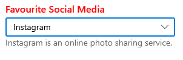
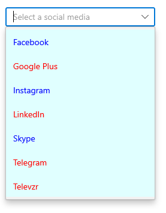

# Styling in WinUI ComboBox (SfComboBox)

This section explains different UI customization available in SfComboBox.

## Header for ComboBox

The ComboBox control header can be changed by using the `Header` or `HeaderTemplate` properties. The default value of `HeaderTemplate` is `null` and `Header` is `null`.




<editors:SfComboBox
    Width="250"
    Header="Favourite Social Media"
    ItemsSource="{Binding SocialMedias}"
    DisplayMemberPath="Name"
    TextMemberPath="Name"
    SelectedIndex="2"
    x:Name="sfComboBox">
    <editors:SfComboBox.DataContext>
        <local:SocialMediaViewModel/>
    </editors:SfComboBox.DataContext>
    <editors:SfComboBox.HeaderTemplate>
        <DataTemplate>
            <TextBlock
                Foreground="Red"
                FontWeight="SemiBold"
                FontSize="16"
                Text="{Binding}" />
        </DataTemplate>
    </editors:SfComboBox.HeaderTemplate>
</editors:SfComboBox>




## Description for ComboBox

The ComboBox control description can be changed by using the `Description` property. The default value of `Description` is `null`.




<editors:SfComboBox
    Width="280"
    Header="Favourite Social Media"
    ItemsSource="{Binding SocialMedias}"
    DisplayMemberPath="Name"
    TextMemberPath="Name"
    SelectedIndex="2"
    Description="Instagram is an online photo sharing service."
    x:Name="sfComboBox">
    <editors:SfComboBox.DataContext>
        <local:SocialMediaViewModel/>
    </editors:SfComboBox.DataContext>
    <editors:SfComboBox.HeaderTemplate>
        <DataTemplate>
            <TextBlock
                Foreground="Red"
                FontWeight="SemiBold"
                FontSize="16"
                Text="{Binding}" />
        </DataTemplate>
    </editors:SfComboBox.HeaderTemplate>
</editors:SfComboBox>




## Placeholder text

You can prompt the user with any information by using the `PlaceholderText` property. This text will be displayed only when no item is selected or edit text is empty. The default value of `PlaceholderText` property is **string.Empty** (No string will be displayed).




<editors:SfComboBox
    Width="250"
    ItemsSource="{Binding SocialMedias}"
    DisplayMemberPath="Name"
    TextMemberPath="Name"
    PlaceholderText="Select a social media"
    x:Name="sfComboBox"/>




sfComboBox.PlaceholderText = "Select a social media";




### Change foreground of Placeholder Text

The placeholder text's foreground can be changed by using the `PlaceholderForeground` property. The default value of `PlaceholderForeground` property is **null**.




<editors:SfComboBox
    Width="250"
    ItemsSource="{Binding SocialMedias}"
    DisplayMemberPath="Name"
    TextMemberPath="Name"
    PlaceholderForeground="Red"
    PlaceholderText="Select a social media"
    x:Name="sfComboBox"/>




sfComboBox.PlaceholderForeground = new SolidColorBrush(Colors.Red);




## Customize edit mode TextBox

The appearance of the editing textbox in `ComboBox` control can be customized by using the `TextBoxStyle` property. The default value of `TextBoxStyle` is `null`.

N> `TextBoxStyle` will have effect only in single selection editable mode.




<editors:SfComboBox
    Width="250"
    IsEditable="True"
    SelectionMode="Single"
    ItemsSource="{Binding SocialMedias}"
    DisplayMemberPath="Name"
    TextMemberPath="Name"
    ShowClearButton="False"
    x:Name="sfComboBox">
    <editors:SfComboBox.TextBoxStyle>
        
    </editors:SfComboBox.TextBoxStyle>
</editors:SfComboBox>




## Styling ComboBoxItem

The ComboBox control allows to customize the style of `ComboBoxItem` generated in drop down by using the `ItemContainerStyle` property. The default value of `ItemContainerStyle` is `null`. 




<editors:SfComboBox
    Width="250"
    IsEditable="True"
    ItemsSource="{Binding SocialMedias}"
    DisplayMemberPath="Name"
    TextMemberPath="Name"
    PlaceholderText="Select a social media"
    x:Name="sfComboBox">
    <editors:SfComboBox.ItemContainerStyle>
        
    </editors:SfComboBox.ItemContainerStyle>
</editors:SfComboBox>




### Style ComboBoxItem based on condition   

The ComboBox control allows to customize the style of `ComboBoxItem` conditionally based on its content by using the `ItemContainerStyleSelector` property. The default value of `ItemContainerStyleSelector` is `null`. 




//Model.cs
public class SocialMedia
{
    public string Name { get; set; }
    public int ID { get; set; }
}

//ViewModel.cs
public class SocialMediaViewModel
{
    public ObservableCollection<SocialMedia> SocialMedias { get; set; }
    public SocialMediaViewModel()
    {
        this.SocialMedias = new ObservableCollection<SocialMedia>();
        this.SocialMedias.Add(new SocialMedia() { Name = "Facebook", ID = 0 });
        this.SocialMedias.Add(new SocialMedia() { Name = "Google Plus", ID = 1 });
        this.SocialMedias.Add(new SocialMedia() { Name = "Instagram", ID = 2 });
        this.SocialMedias.Add(new SocialMedia() { Name = "LinkedIn", ID = 3 });
        this.SocialMedias.Add(new SocialMedia() { Name = "Skype", ID = 4 });
        this.SocialMedias.Add(new SocialMedia() { Name = "Tumblr", ID = 5 });
        this.SocialMedias.Add(new SocialMedia() { Name = "Twitter", ID = 6 });
        this.SocialMedias.Add(new SocialMedia() { Name = "Vimeo", ID = 7 });
        this.SocialMedias.Add(new SocialMedia() { Name = "WhatsApp", ID = 8 });
        this.SocialMedias.Add(new SocialMedia() { Name = "YouTube", ID = 9 });
    }
}







public class SocialMediaStyleSelector : StyleSelector
{
    public Style MediaStyle1 { get; set; }
    public Style MediaStyle2 { get; set; }
    protected override Style SelectStyleCore(object item, DependencyObject container)
    {
        var mediaItem = (item as SocialMedia).Name;
        if (mediaItem.ToString() == "Facebook" || mediaItem.ToString() == "Instagram" ||
            mediaItem.ToString() == "Twitter" || mediaItem.ToString() == "WhatsApp" ||
            mediaItem.ToString() == "Skype")
        {
            return MediaStyle1;
        }           
        else
        {
            return MediaStyle2;
        }
    }
}







<Grid>
    <Grid.Resources>
        
        
        <local:SocialMediaStyleSelector x:Key="socialMediaStyleSelector" 
                                        MediaStyle1="{StaticResource MediaStyle1}"
                                        MediaStyle2="{StaticResource MediaStyle2}"/>
    </Grid.Resources>
    <editors:SfComboBox x:Name="sfComboBox"
        Width="250"
        PlaceholderText="Select a social media"
        IsEditable="True" 
        ItemsSource="{Binding SocialMedias}"
        ItemContainerStyleSelector="{StaticResource socialMediaStyleSelector}"
        DisplayMemberPath="Name"
        TextMemberPath="Name">
    </editors:SfComboBox>
</Grid>




## Customize ComboBoxItem 

The `ItemTemplate` property helps to decorate drop down items with custom templates. The default value of `ItemTemplate` is `null`. Below example shows, how to add image or custom control in drop down items using templates.




//Model.cs
public class Employee
{
    public string Name { get; set; }
    public BitmapImage ProfilePicture { get; set; }
    public string Designation { get; set; }
}

//ViewModel.cs
public class EmployeeViewModel
{
    public ObservableCollection<Employee> Employees { get; set; }
    public EmployeeViewModel()
    {
        this.Employees = new ObservableCollection<Employee>();
        this.Employees.Add(new Employee {
            Name = "Anne Dodsworth",
            ProfilePicture = new BitmapImage(new Uri(@"ms-appx:///Assets/Employees/AnneDodsworth.png",
                                                 UriKind.RelativeOrAbsolute)),
            Designation = "Developer"
        });
        this.Employees.Add(new Employee {
            Name = "Andrew Fuller",
            ProfilePicture = new BitmapImage(new Uri(@"ms-appx:///Assets/Employees/AndrewFuller.png",
                                                 UriKind.RelativeOrAbsolute)),
            Designation = "Team Lead"
        });
        this.Employees.Add(new Employee {
            Name = "Emilia Alvaro",
            ProfilePicture = new BitmapImage(new Uri(@"ms-appx:///Assets/Employees/EmiliaAlvaro.png",
                                                 UriKind.RelativeOrAbsolute)),
            Designation = "Product Manager"
        });
        
        this.Employees.Add(new Employee {
            Name = "Janet Leverling",
            ProfilePicture = new BitmapImage(new Uri(@"ms-appx:///Assets/Employees/JanetLeverling.png",
                                                 UriKind.RelativeOrAbsolute)),
            Designation = "HR"
        });
        this.Employees.Add(new Employee {
            Name = "Laura Callahan",
            ProfilePicture = new BitmapImage(new Uri(@"ms-appx:///Assets/ComboBox/Employees/LauraCallahan.png",
                                                 UriKind.RelativeOrAbsolute)),
            Designation = "Product Manager"
        });
    }
}







<editors:SfComboBox
    x:Name="sfComboBox"
    Width="250"
    TextMemberPath="Name"
    IsEditable="True"
    ItemsSource="{Binding Employees}">
    <editors:SfComboBox.DataContext>
        <local:EmployeeViewModel/>
    </editors:SfComboBox.DataContext>
    <editors:SfComboBox.ItemTemplate>
        <DataTemplate>
            <Grid
                Margin="0,5"
                HorizontalAlignment="Stretch"
                VerticalAlignment="Stretch">
                <Grid.ColumnDefinitions>
                    <ColumnDefinition Width="48"/>
                    <ColumnDefinition Width="*"/>
                </Grid.ColumnDefinitions>
                <Image 
                    Grid.Column="0"
                    HorizontalAlignment="Center"
                    VerticalAlignment="Center" 
                    Source="{Binding ProfilePicture}" 
                    Stretch="Uniform"/>
                <StackPanel
                    Grid.Column="1"
                    Margin="15,0,0,0"
                    HorizontalAlignment="Left"
                    VerticalAlignment="Center">
                    <TextBlock 
                        Opacity="0.87"
                        FontSize="14"
                        Text="{Binding Name}"/>
                    <TextBlock 
                        Opacity="0.54"
                        FontSize="12"
                        Text="{Binding Designation}"/>
                </StackPanel>
            </Grid>
        </DataTemplate>
    </editors:SfComboBox.ItemTemplate>
</editors:SfComboBox>




### Customize ComboBoxItem based on condition

The `ItemTemplateSelector` property helps to decorate drop down items conditionally based on its content with custom templates. The default value of `ItemTemplateSelector` is `null`.




//Model.cs
public class Employee
{
    public string Name { get; set; }
    public BitmapImage ProfilePicture { get; set; }
    public string Designation { get; set; }
}

//ViewModel.cs
public class EmployeeViewModel
{
    public ObservableCollection<Employee> Employees { get; set; }
    public EmployeeViewModel()
    {
        this.Employees = new ObservableCollection<Employee>();
        this.Employees.Add(new Employee {
            Name = "Anne Dodsworth",
            ProfilePicture = new BitmapImage(new Uri(@"ms-appx:///Assets/Employees/AnneDodsworth.png",
                                                 UriKind.RelativeOrAbsolute)),
            Designation = "Developer"
        });
        this.Employees.Add(new Employee {
            Name = "Andrew Fuller",
            ProfilePicture = new BitmapImage(new Uri(@"ms-appx:///Assets/Employees/AndrewFuller.png",
                                                 UriKind.RelativeOrAbsolute)),
            Designation = "Team Lead"
        });
        this.Employees.Add(new Employee {
            Name = "Emilia Alvaro",
            ProfilePicture = new BitmapImage(new Uri(@"ms-appx:///Assets/Employees/EmiliaAlvaro.png",
                                                 UriKind.RelativeOrAbsolute)),
            Designation = "Product Manager"
        });
        
        this.Employees.Add(new Employee {
            Name = "Janet Leverling",
            ProfilePicture = new BitmapImage(new Uri(@"ms-appx:///Assets/Employees/JanetLeverling.png",
                                                 UriKind.RelativeOrAbsolute)),
            Designation = "HR"
        });
        this.Employees.Add(new Employee {
            Name = "Laura Callahan",
            ProfilePicture = new BitmapImage(new Uri(@"ms-appx:///Assets/ComboBox/Employees/LauraCallahan.png",
                                                 UriKind.RelativeOrAbsolute)),
            Designation = "Product Manager"
        });
    }
}







<Grid>
    <Grid.Resources>
        <DataTemplate x:Key="employeeTemplate1">
            <Grid Margin="0,5">
                <Grid.ColumnDefinitions>
                    <ColumnDefinition Width="48"/>
                    <ColumnDefinition Width="*"/>
                </Grid.ColumnDefinitions>
                <Image 
                    Grid.Column="0"
                    Source="{Binding ProfilePicture}" 
                    Stretch="Uniform"/>
                <StackPanel
                    Grid.Column="1"
                    Margin="15,0,0,0">
                    <TextBlock 
                        Foreground="Blue"
                        Opacity="0.87"
                        FontSize="14"
                        Text="{Binding Name}"/>
                    <TextBlock 
                        Foreground="Coral"
                        Opacity="0.54"
                        FontSize="12"
                        Text="{Binding Designation}"/>
                </StackPanel>
            </Grid>
        </DataTemplate>
        
        <DataTemplate x:Key="employeeTemplate2">
            <Grid Margin="0,5">
                <Grid.ColumnDefinitions>
                    <ColumnDefinition Width="48"/>
                    <ColumnDefinition Width="*"/>
                </Grid.ColumnDefinitions>
                <Image 
                    Grid.Column="0" 
                    Source="{Binding ProfilePicture}" 
                    Stretch="Uniform"/>
                <StackPanel
                    Grid.Column="1"
                    Margin="15,0,0,0">
                    <TextBlock
                        Foreground="Red"
                        Opacity="0.87"
                        FontSize="14"
                        Text="{Binding Name}"/>
                    <TextBlock 
                        Foreground="Green"
                        Opacity="0.54"
                        FontSize="12"
                        Text="{Binding Designation}"/>
                </StackPanel>
            </Grid>
        </DataTemplate>

        <local:EmployeeTemplateSelector
            x:Key="employeeTemplateSelector"
            EmployeeTemplate1="{StaticResource employeeTemplate1}"
            EmployeeTemplate2="{StaticResource employeeTemplate2}"/>
    </Grid.Resources>
    <editors:SfComboBox 
        Width="250" 
        TextMemberPath="Name"
        ItemsSource="{Binding Employees}"
        PlaceholderText="Select an employee"
        IsEditable="True"            
        ItemTemplateSelector="{StaticResource employeeTemplateSelector}"
        x:Name="sfComboBox">
        <editors:SfComboBox.DataContext>
            <local:EmployeeViewModel/>
        </editors:SfComboBox.DataContext>
    </editors:SfComboBox>
</Grid>




## How to change DropDown MaxHeight?

The maximum height of the drop down can be changed by using the `MaxDropDownHeight` property of ComboBox control. The default value of `MaxDropDownHeight` property is **Auto**. 

 N> If the `MaxDropDownHeight` is too small compared the populated items, scroll viewer will be automatically shown to navigate the hidden items.




<editors:SfComboBox x:Name="sfComboBox"
                    Width="250"
                    IsEditable="true"
                    MaxDropDownHeight="208"
                    ItemsSource="{Binding SocialMedias}"
                    DisplayMemberPath="Name"
                    TextMemberPath="Name">
</editors:SfComboBox>




sfComboBox.MaxDropDownHeight = 208;




