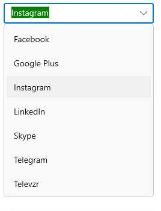
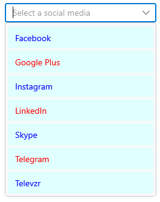
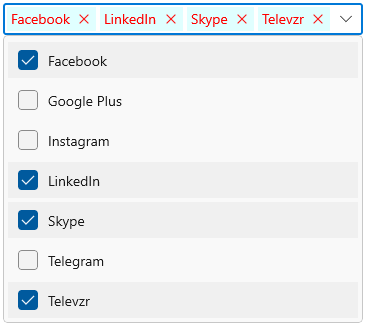
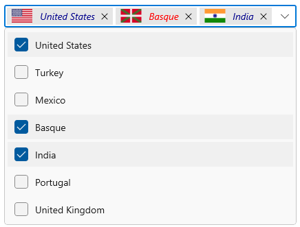

# UI Customization in WinUI ComboBox (SfComboBox)

This section explains different UI customization available in [ComboBox](https://help.syncfusion.com/cr/winui/Syncfusion.UI.Xaml.Editors.SfComboBox.html).

## Header for ComboBox

The `ComboBox` control header can be changed by using the [Header](https://help.syncfusion.com/cr/winui/Syncfusion.UI.Xaml.Editors.SfDropDownListBase.html#Syncfusion_UI_Xaml_Editors_SfDropDownListBase_Header) or [HeaderTemplate](https://help.syncfusion.com/cr/winui/Syncfusion.UI.Xaml.Editors.SfDropDownListBase.html#Syncfusion_UI_Xaml_Editors_SfDropDownListBase_HeaderTemplate) properties. The default value of `HeaderTemplate` is `null` and `Header` is `null`.




<editors:SfComboBox x:Name="comboBox"
                    Width="250"
                    Header="Favourite Social Media"
                    ItemsSource="{Binding SocialMedias}"
                    DisplayMemberPath="Name"
                    TextMemberPath="Name"
                    SelectedIndex="2">
    <editors:SfComboBox.HeaderTemplate>
        <DataTemplate>
            <TextBlock Foreground="Red"
                       FontWeight="SemiBold"
                       FontSize="16"
                       Text="{Binding}" />
        </DataTemplate>
    </editors:SfComboBox.HeaderTemplate>
</editors:SfComboBox>




## Description for ComboBox

The `ComboBox` control description can be changed by using the [Description](https://help.syncfusion.com/cr/winui/Syncfusion.UI.Xaml.Editors.SfDropDownListBase.html#Syncfusion_UI_Xaml_Editors_SfDropDownListBase_Description) property. The default value of `Description` is `null`.




<editors:SfComboBox x:Name="comboBox"
                    Width="280"
                    Header="Favourite Social Media"
                    ItemsSource="{Binding SocialMedias}"
                    DisplayMemberPath="Name"
                    TextMemberPath="Name"
                    SelectedIndex="2"
                    Description="Instagram is an online photo sharing service.">
    <editors:SfComboBox.HeaderTemplate>
        <DataTemplate>
            <TextBlock Foreground="Red"
                       FontWeight="SemiBold"
                       FontSize="16"
                       Text="{Binding}" />
        </DataTemplate>
    </editors:SfComboBox.HeaderTemplate>
</editors:SfComboBox>




## Placeholder text

You can prompt the user with any information by using the [PlaceholderText](https://help.syncfusion.com/cr/winui/Syncfusion.UI.Xaml.Editors.SfDropDownListBase.html#Syncfusion_UI_Xaml_Editors_SfDropDownListBase_PlaceholderText) property. This text will be displayed only when no item is selected or edit text is empty. The default value of `PlaceholderText` property is `string.Empty` (No string will be displayed).




<editors:SfComboBox x:Name="comboBox"
                    Width="250"
                    ItemsSource="{Binding SocialMedias}"
                    DisplayMemberPath="Name"
                    TextMemberPath="Name"
                    PlaceholderText="Select a social media" />




comboBox.PlaceholderText = "Select a social media";




### Change foreground of placeholder text

The placeholder texts’ foreground can be changed by using the [PlaceholderForeground](https://help.syncfusion.com/cr/winui/Syncfusion.UI.Xaml.Editors.SfDropDownListBase.html#Syncfusion_UI_Xaml_Editors_SfDropDownListBase_PlaceholderForeground) property. The default value of `PlaceholderForeground` property is `null`.




<editors:SfComboBox x:Name="comboBox"
                    Width="250"
                    ItemsSource="{Binding SocialMedias}"
                    DisplayMemberPath="Name"
                    TextMemberPath="Name"
                    PlaceholderForeground="Red"
                    PlaceholderText="Select a social media" />




comboBox.PlaceholderForeground = new SolidColorBrush(Colors.Red);




## Customize the edit mode TextBox

The appearance of the edit mode textbox in `ComboBox` control can be customized by using the [TextBoxStyle](https://help.syncfusion.com/cr/winui/Syncfusion.UI.Xaml.Editors.SfDropDownListBase.html#Syncfusion_UI_Xaml_Editors_SfDropDownListBase_TextBoxStyle) property. The default value of `TextBoxStyle` is `null`.

N> `TextBoxStyle` will only have an effect in single selection editable mode.




<editors:SfComboBox x:Name="comboBox"
                    Width="250"
                    IsEditable="True"
                    SelectionMode="Single"
                    ItemsSource="{Binding SocialMedias}"
                    DisplayMemberPath="Name"
                    TextMemberPath="Name"
                    ShowClearButton="False">
    <editors:SfComboBox.TextBoxStyle>
        
    </editors:SfComboBox.TextBoxStyle>
</editors:SfComboBox>




## Styling ComboBoxItem

The `ComboBox` control allows you to customize the style of [ComboBoxItem](https://help.syncfusion.com/cr/winui/Syncfusion.UI.Xaml.Editors.SfComboBoxItem.html), generated in drop-down by using the [ItemContainerStyle](https://help.syncfusion.com/cr/winui/Syncfusion.UI.Xaml.Editors.SfDropDownListBase.html#Syncfusion_UI_Xaml_Editors_SfDropDownListBase_ItemContainerStyle) property. The default value of `ItemContainerStyle` is `null`. 




<editors:SfComboBox x:Name="comboBox"
                    Width="250"
                    IsEditable="True"
                    ItemsSource="{Binding SocialMedias}"
                    DisplayMemberPath="Name"
                    TextMemberPath="Name"
                    PlaceholderText="Select a social media">
    <editors:SfComboBox.ItemContainerStyle>
        
    </editors:SfComboBox.ItemContainerStyle>
</editors:SfComboBox>




### Style ComboBoxItem based on condition   

The `ComboBox` control allows you to customize the style of `ComboBoxItem` conditionally based on its content by using the [ItemContainerStyleSelector](https://help.syncfusion.com/cr/winui/Syncfusion.UI.Xaml.Editors.SfDropDownListBase.html#Syncfusion_UI_Xaml_Editors_SfDropDownListBase_ItemContainerStyleSelector) property. The default value of `ItemContainerStyleSelector` is `null`. 




public class SocialMediaStyleSelector : StyleSelector
{
    public Style MediaStyle1 { get; set; }
    public Style MediaStyle2 { get; set; }
    protected override Style SelectStyleCore(object item, DependencyObject container)
    {
        var mediaItem = (item as SocialMedia).Name;
        if (mediaItem.ToString() == "Facebook" || mediaItem.ToString() == "Instagram" ||
            mediaItem.ToString() == "Twitter" || mediaItem.ToString() == "WhatsApp" ||
            mediaItem.ToString() == "Skype")
        {
            return MediaStyle1;
        }           
        else
        {
            return MediaStyle2;
        }
    }
}







<Grid>
    <Grid.Resources>
        
        
        <local:SocialMediaStyleSelector x:Key="socialMediaStyleSelector" 
                                        MediaStyle1="{StaticResource MediaStyle1}"
                                        MediaStyle2="{StaticResource MediaStyle2}"/>
    </Grid.Resources>
    <editors:SfComboBox x:Name="comboBox"
                        Width="250"
                        PlaceholderText="Select a social media"
                        IsEditable="True" 
                        ItemsSource="{Binding SocialMedias}"
                        ItemContainerStyleSelector="{StaticResource socialMediaStyleSelector}"
                        DisplayMemberPath="Name"
                        TextMemberPath="Name" />
</Grid>




## Customize ComboBoxItem 

The [ItemTemplate](https://help.syncfusion.com/cr/winui/Syncfusion.UI.Xaml.Editors.SfDropDownListBase.html#Syncfusion_UI_Xaml_Editors_SfDropDownListBase_ItemTemplate) property helps you to decorate drop-down items using the custom templates. The default value of `ItemTemplate` is `null`. The following example shows how to add image or custom control in drop-down items using templates.




//Model.cs
public class Employee
{
    public string Name { get; set; }
    public BitmapImage ProfilePicture { get; set; }
    public string Designation { get; set; }
}

//ViewModel.cs
public class EmployeeViewModel
{
    public ObservableCollection<Employee> Employees { get; set; }
    public EmployeeViewModel()
    {
        this.Employees = new ObservableCollection<Employee>();
        this.Employees.Add(new Employee {
            Name = "Anne Dodsworth",
            ProfilePicture = new BitmapImage(new Uri(@"ms-appx:///Assets/Employees/AnneDodsworth.png",
                                                 UriKind.RelativeOrAbsolute)),
            Designation = "Developer"
        });
        this.Employees.Add(new Employee {
            Name = "Andrew Fuller",
            ProfilePicture = new BitmapImage(new Uri(@"ms-appx:///Assets/Employees/AndrewFuller.png",
                                                 UriKind.RelativeOrAbsolute)),
            Designation = "Team Lead"
        });
        this.Employees.Add(new Employee {
            Name = "Emilia Alvaro",
            ProfilePicture = new BitmapImage(new Uri(@"ms-appx:///Assets/Employees/EmiliaAlvaro.png",
                                                 UriKind.RelativeOrAbsolute)),
            Designation = "Product Manager"
        });
        
        this.Employees.Add(new Employee {
            Name = "Janet Leverling",
            ProfilePicture = new BitmapImage(new Uri(@"ms-appx:///Assets/Employees/JanetLeverling.png",
                                                 UriKind.RelativeOrAbsolute)),
            Designation = "HR"
        });
        this.Employees.Add(new Employee {
            Name = "Laura Callahan",
            ProfilePicture = new BitmapImage(new Uri(@"ms-appx:///Assets/ComboBox/Employees/LauraCallahan.png",
                                                 UriKind.RelativeOrAbsolute)),
            Designation = "Product Manager"
        });
    }
}







<editors:SfComboBox x:Name="comboBox"
                    Width="250"
                    TextMemberPath="Name"
                    IsEditable="True"
                    ItemsSource="{Binding Employees}">
    <editors:SfComboBox.DataContext>
        <local:EmployeeViewModel/>
    </editors:SfComboBox.DataContext>
    <editors:SfComboBox.ItemTemplate>
        <DataTemplate>
            <Grid Margin="0,5"
                  HorizontalAlignment="Stretch"
                  VerticalAlignment="Stretch">
                <Grid.ColumnDefinitions>
                    <ColumnDefinition Width="48"/>
                    <ColumnDefinition Width="*"/>
                </Grid.ColumnDefinitions>
                <Image Grid.Column="0"
                       HorizontalAlignment="Center"
                       VerticalAlignment="Center" 
                       Source="{Binding ProfilePicture}" 
                       Stretch="Uniform"/>
                <StackPanel Grid.Column="1"
                            Margin="15,0,0,0"
                            HorizontalAlignment="Left"
                            VerticalAlignment="Center">
                    <TextBlock Opacity="0.87"
                               FontSize="14"
                               Text="{Binding Name}"/>
                    <TextBlock Opacity="0.54"
                               FontSize="12"
                               Text="{Binding Designation}"/>
                </StackPanel>
            </Grid>
        </DataTemplate>
    </editors:SfComboBox.ItemTemplate>
</editors:SfComboBox>




### Customize ComboBoxItem based on condition

The [ItemTemplateSelector](https://help.syncfusion.com/cr/winui/Syncfusion.UI.Xaml.Editors.SfDropDownListBase.html#Syncfusion_UI_Xaml_Editors_SfDropDownListBase_ItemTemplateSelector) property helps you to decorate drop-down items conditionally based on its content using the custom templates. The default value of `ItemTemplateSelector` is `null`.




//Model.cs
public class Employee
{
    public string Name { get; set; }
    public BitmapImage ProfilePicture { get; set; }
    public string Designation { get; set; }
}

//ViewModel.cs
public class EmployeeViewModel
{
    public ObservableCollection<Employee> Employees { get; set; }
    public EmployeeViewModel()
    {
        this.Employees = new ObservableCollection<Employee>();
        this.Employees.Add(new Employee {
            Name = "Anne Dodsworth",
            ProfilePicture = new BitmapImage(new Uri(@"ms-appx:///Assets/Employees/AnneDodsworth.png",
                                                 UriKind.RelativeOrAbsolute)),
            Designation = "Developer"
        });
        this.Employees.Add(new Employee {
            Name = "Andrew Fuller",
            ProfilePicture = new BitmapImage(new Uri(@"ms-appx:///Assets/Employees/AndrewFuller.png",
                                                 UriKind.RelativeOrAbsolute)),
            Designation = "Team Lead"
        });
        this.Employees.Add(new Employee {
            Name = "Emilia Alvaro",
            ProfilePicture = new BitmapImage(new Uri(@"ms-appx:///Assets/Employees/EmiliaAlvaro.png",
                                                 UriKind.RelativeOrAbsolute)),
            Designation = "Product Manager"
        });
        
        this.Employees.Add(new Employee {
            Name = "Janet Leverling",
            ProfilePicture = new BitmapImage(new Uri(@"ms-appx:///Assets/Employees/JanetLeverling.png",
                                                 UriKind.RelativeOrAbsolute)),
            Designation = "HR"
        });
        this.Employees.Add(new Employee {
            Name = "Laura Callahan",
            ProfilePicture = new BitmapImage(new Uri(@"ms-appx:///Assets/ComboBox/Employees/LauraCallahan.png",
                                                 UriKind.RelativeOrAbsolute)),
            Designation = "Product Manager"
        });
    }
}

public class EmployeeTemplateSelector : DataTemplateSelector
{
    public DataTemplate EmployeeTemplate1 { get; set; }
    public DataTemplate EmployeeTemplate2 { get; set; }
    
    protected override DataTemplate SelectTemplateCore(object item, DependencyObject container)
    {
        var employeeName = (item as Employee).Name;
        if (employeeName.ToString() == "Anne Dodsworth" || employeeName.ToString() == "Emilia Alvaro" ||
            employeeName.ToString() == "Laura Callahan")
        {
            return EmployeeTemplate1;
        }
        else
        {
            return EmployeeTemplate2;
        }
    }
}







<Grid>
    <Grid.Resources>
        <DataTemplate x:Key="employeeTemplate1">
            <Grid Margin="0,5">
                <Grid.ColumnDefinitions>
                    <ColumnDefinition Width="48"/>
                    <ColumnDefinition Width="*"/>
                </Grid.ColumnDefinitions>
                <Image 
                    Grid.Column="0"
                    Source="{Binding ProfilePicture}" 
                    Stretch="Uniform"/>
                <StackPanel
                    Grid.Column="1"
                    Margin="15,0,0,0">
                    <TextBlock 
                        Foreground="Blue"
                        Opacity="0.87"
                        FontSize="14"
                        Text="{Binding Name}"/>
                    <TextBlock 
                        Foreground="Coral"
                        Opacity="0.54"
                        FontSize="12"
                        Text="{Binding Designation}"/>
                </StackPanel>
            </Grid>
        </DataTemplate>
        
        <DataTemplate x:Key="employeeTemplate2">
            <Grid Margin="0,5">
                <Grid.ColumnDefinitions>
                    <ColumnDefinition Width="48"/>
                    <ColumnDefinition Width="*"/>
                </Grid.ColumnDefinitions>
                <Image 
                    Grid.Column="0" 
                    Source="{Binding ProfilePicture}" 
                    Stretch="Uniform"/>
                <StackPanel
                    Grid.Column="1"
                    Margin="15,0,0,0">
                    <TextBlock
                        Foreground="Red"
                        Opacity="0.87"
                        FontSize="14"
                        Text="{Binding Name}"/>
                    <TextBlock 
                        Foreground="Green"
                        Opacity="0.54"
                        FontSize="12"
                        Text="{Binding Designation}"/>
                </StackPanel>
            </Grid>
        </DataTemplate>

        <local:EmployeeTemplateSelector x:Key="employeeTemplateSelector"
                                        EmployeeTemplate1="{StaticResource employeeTemplate1}"
                                        EmployeeTemplate2="{StaticResource employeeTemplate2}"/>
    </Grid.Resources>
    
    <editors:SfComboBox x:Name="comboBox"
                        Width="250" 
                        TextMemberPath="Name"
                        ItemsSource="{Binding Employees}"
                        PlaceholderText="Select an employee"
                        IsEditable="True"            
                        ItemTemplateSelector="{StaticResource employeeTemplateSelector}">
        <editors:SfComboBox.DataContext>
            <local:EmployeeViewModel/>
        </editors:SfComboBox.DataContext>
    </editors:SfComboBox>
</Grid>




## Styling ComboBoxTokenItem

The ComboBox control allows you to customize the style of [ComboBoxTokenItem](https://help.syncfusion.com/cr/winui/Syncfusion.UI.Xaml.Editors.ComboBoxTokenItem.html) generated in the selection area by using the [TokenItemStyle](https://help.syncfusion.com/cr/winui/Syncfusion.UI.Xaml.Editors.DropDownListBase.html#Syncfusion_UI_Xaml_Editors_DropDownListBase_TokenItemStyle) property. The default value of `TokenItemStyle` is `null`. 




<editors:SfComboBox SelectionMode="Multiple"
                    MultiSelectionDisplayMode="Token"
                    ItemsSource="{Binding SocialMedias}"
                    DisplayMemberPath="Name"
                    TextMemberPath="Name">
            <editors:SfComboBox.TokenItemStyle>
                
            </editors:SfComboBox.TokenItemStyle>
</editors:SfComboBox>




### Style ComboBoxTokenItem based on condition   

The ComboBox control allows you to customize the style of `ComboBoxTokenItem` conditionally based on its content by using the [TokenItemStyleSelector](https://help.syncfusion.com/cr/winui/Syncfusion.UI.Xaml.Editors.DropDownListBase.html?tabs=tabid-1#Syncfusion_UI_Xaml_Editors_DropDownListBase_TokenItemStyleSelector) property. The default value of `TokenItemStyleSelector` is `null`. 




public class SocialMediaStyleSelector : StyleSelector
{
    public Style MediaStyle1 { get; set; }
    public Style MediaStyle2 { get; set; }
    protected override Style SelectStyleCore(object item, DependencyObject container)
    {
        var mediaItem = (item as SocialMedia).Name;
        if (mediaItem.ToString() == "Facebook" || mediaItem.ToString() == "Instagram" ||
            mediaItem.ToString() == "Twitter" || mediaItem.ToString() == "WhatsApp" ||
            mediaItem.ToString() == "Skype")
        {
            return MediaStyle1;
        }           
        else
        {
            return MediaStyle2;
        }
    }
}







<Grid>
    <Grid.Resources>
        
        
        <local:SocialMediaStyleSelector x:Key="socialMediaStyleSelector" 
                                        MediaStyle1="{StaticResource MediaStyle1}"
                                        MediaStyle2="{StaticResource MediaStyle2}"/>
    </Grid.Resources>
    <editors:SfComboBox SelectionMode="Multiple"                    
                        MultiSelectionDisplayMode="Token"
                        ItemsSource="{Binding SocialMedias}"
                        TokenItemStyleSelector="{StaticResource socialMediaStyleSelector}"
                        DisplayMemberPath="Name"
                        TextMemberPath="Name" />
</Grid>




## Customize ComboBoxTokenItem 

The [TokenItemTemplate](https://help.syncfusion.com/cr/winui/Syncfusion.UI.Xaml.Editors.DropDownListBase.html?tabs=tabid-1#Syncfusion_UI_Xaml_Editors_DropDownListBase_TokenItemTemplate) property helps you to decorate token items using the custom templates. The default value of `TokenItemTemplate` is `null`. The following example shows how to add image or custom control in token items using templates.




//Model.cs
public class CountryInfo
{
    public string CountryName { get; set; }
    public BitmapImage FlagImage { get; set; }
}

//ViewModel.cs
public class CountryViewModel
{
    public ObservableCollection<CountryInfo> Countries { get; set; }
    public EmployeeViewModel()
    {
        this.Countries = new ObservableCollection<CountryInfo>();
        this.Countries.Add(new CountryInfo
        {
            FlagImage = new BitmapImage(new Uri(@"ms-appx:///Flags/UnitedStates.png", UriKind.RelativeOrAbsolute)),
            CountryName = "United States"
        });       

        this.Countries.Add(new CountryInfo
        {
            FlagImage = new BitmapImage(new Uri(@"ms-appx:///Flags/turkey.png", UriKind.RelativeOrAbsolute)),
            CountryName = "Turkey"
        });

        this.Countries.Add(new CountryInfo
        {
            FlagImage = new BitmapImage(new Uri(@"ms-appx:///Flags/Mexico.png", UriKind.RelativeOrAbsolute)),
            CountryName = "Mexico"
        });

        this.Countries.Add(new CountryInfo
        {
            FlagImage = new BitmapImage(new Uri(@"ms-appx:///Flags/Basque.png", UriKind.RelativeOrAbsolute)),
            CountryName = "Basque"
        });

        this.Countries.Add(new CountryInfo
        {
            FlagImage = new BitmapImage(new Uri(@"ms-appx:///Flags/India.png", UriKind.RelativeOrAbsolute)),
            CountryName = "India"
        });

        this.Countries.Add(new CountryInfo
        {
            FlagImage = new BitmapImage(new Uri(@"ms-appx:///Flags/Portugal.png", UriKind.RelativeOrAbsolute)),
            CountryName = "Portugal"
        });

        this.Countries.Add(new CountryInfo
        {
            FlagImage = new BitmapImage(new Uri(@"ms-appx:///Flags/UnitedKingdom.png", UriKind.RelativeOrAbsolute)),
            CountryName = "United Kingdom"
        });

        this.Countries.Add(new CountryInfo
        {
            FlagImage = new BitmapImage(new Uri(@"ms-appx:///Flags/france.png", UriKind.RelativeOrAbsolute)),
            CountryName = "France"
        });
    }
}







<editors:SfComboBox SelectionMode="Multiple"
                    MultiSelectionDisplayMode="Token"
                    PlaceholderText="Select countries"
                    DisplayMemberPath="CountryName"
                    ItemsSource="{Binding Countries}">
        <editors:SfComboBox.DataContext>
            <local:CountryViewModel/>
        </editors:SfComboBox.DataContext>
        <editors:SfComboBox.TokenItemTemplate>
            <DataTemplate>
                <Grid HorizontalAlignment="Center"
                      VerticalAlignment="Center">
                        <Grid.ColumnDefinitions>
                            <ColumnDefinition Width="auto"/>
                            <ColumnDefinition Width="*"/>
                        </Grid.ColumnDefinitions>
                        <Image Grid.Column="0"    
                               HorizontalAlignment="Center"
                               VerticalAlignment="Center" 
                               Source="{Binding FlagImage}" 
                               Width="36" Height="20"
                               Stretch="Uniform"/>

                        <TextBlock  Margin="8,0,0,0"
                                    Grid.Column="1" 
                                    TextAlignment="Center"
                                    HorizontalAlignment="Left"
                                    VerticalAlignment="Center" 
                                    Text="{Binding CountryName}"/>
                </Grid>
            </DataTemplate>
        </editors:SfComboBox.TokenItemTemplate>
</editors:SfComboBox>




### Customize ComboBoxTokenItem based on condition

The [TokenItemTemplateSelector](https://help.syncfusion.com/cr/winui/Syncfusion.UI.Xaml.Editors.DropDownListBase.html#Syncfusion_UI_Xaml_Editors_DropDownListBase_TokenItemTemplateSelector) property helps you to decorate token items conditionally based on its content using the custom templates. The default value of `TokenItemTemplateSelector` is `null`.




public class CountryTemplateSelector : DataTemplateSelector
{
    public DataTemplate CountryTemplate1 { get; set; }
    public DataTemplate CountryTemplate2 { get; set; }
    
    protected override DataTemplate SelectTemplateCore(object item, DependencyObject container)
    {
        var countryName = (item as CountryInfo).CountryName;
        if (countryName.ToString() == "United States" || countryName.ToString() == "Mexico" ||
            countryName.ToString() == "India" || countryName.ToString() == "United Kingdom")
        {
            return CountryTemplate1;
        }
        else
        {
            return CountryTemplate2;
        }
    }
}







<Grid>
    <Grid.DataContext>
        <local:CountryViewModel/>
    </Grid.DataContext> 
    <Grid.Resources>
        <DataTemplate x:Key="countryTemplate1">
            <Grid HorizontalAlignment="Center"
                  VerticalAlignment="Center">
                  <Grid.ColumnDefinitions>
                      <ColumnDefinition Width="auto"/>
                      <ColumnDefinition Width="*"/>
                  </Grid.ColumnDefinitions>
                  <Image Grid.Column="0"    
                         HorizontalAlignment="Center"
                         VerticalAlignment="Center" 
                         Source="{Binding FlagImage}" 
                         Width="36" Height="20"
                         Stretch="Uniform"/>

                  <TextBlock  Margin="8,0,0,0"
                              Grid.Column="1" 
                              Foreground="DarkBlue"
                              FontStyle="Italic"
                              TextAlignment="Center"
                              HorizontalAlignment="Left"
                              VerticalAlignment="Center" 
                              Text="{Binding CountryName}"/>
            </Grid>
        </DataTemplate>
        
        <DataTemplate x:Key="countryTemplate2">
            <Grid HorizontalAlignment="Center"
                  VerticalAlignment="Center">
                  <Grid.ColumnDefinitions>
                      <ColumnDefinition Width="auto"/>
                      <ColumnDefinition Width="*"/>
                  </Grid.ColumnDefinitions>
                  <Image Grid.Column="0"    
                         HorizontalAlignment="Center"
                         VerticalAlignment="Center" 
                         Source="{Binding FlagImage}" 
                         Width="36" Height="20"
                         Stretch="Uniform"/>

                  <TextBlock  Margin="8,0,0,0"
                              Grid.Column="1" 
                              Foreground="Red"
                              FontStyle="Italic"
                              TextAlignment="Center"
                              HorizontalAlignment="Left"
                              VerticalAlignment="Center" 
                              Text="{Binding CountryName}"/>
            </Grid>
        </DataTemplate>

        <local:CountryTemplateSelector x:Key="countryTemplateSelector"
                                       CountryTemplate1="{StaticResource countryTemplate1}"
                                       CountryTemplate2="{StaticResource countryTemplate2}"/>
    </Grid.Resources>
    
    <editors:SfComboBox SelectionMode="Multiple"
                        MultiSelectionDisplayMode="Token"
                        DisplayMemberPath="CountryName"
                        TokenItemTemplateSelector="{StaticResource countryTemplateSelector}"
                        ItemsSource="{Binding Countries}" />
</Grid>




## How to change DropDown MaxHeight

The maximum height of the drop-down can be changed by using the [MaxDropDownHeight](https://help.syncfusion.com/cr/winui/Syncfusion.UI.Xaml.Editors.SfDropDownListBase.html#Syncfusion_UI_Xaml_Editors_SfDropDownListBase_MaxDropDownHeight) property of `ComboBox` control. The default value of `MaxDropDownHeight` property is `288`. 

 N> If the `MaxDropDownHeight` is too small compared to the populated items, scroll viewer will be automatically shown to navigate the hidden items.




<editors:SfComboBox x:Name="comboBox"
                    Width="250"
                    IsEditable="true"
                    MaxDropDownHeight="208"
                    ItemsSource="{Binding SocialMedias}"
                    DisplayMemberPath="Name"
                    TextMemberPath="Name" />




comboBox.MaxDropDownHeight = 208;




