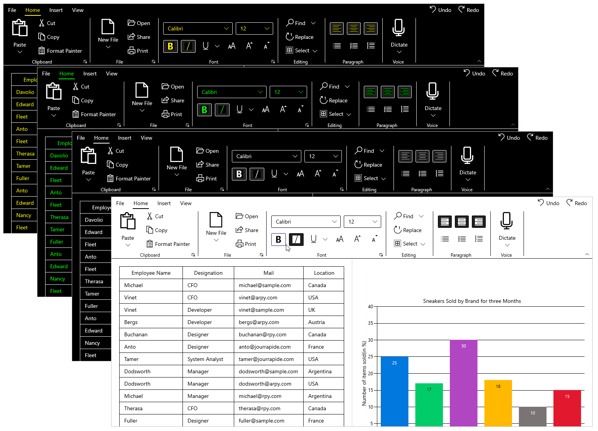

# Accessibility for Syncfusion&reg; WinUI Controls

Accessibility is about making a Windows application usable in a wide range of environments for people who use technology and approach a UI with a wide range of experiences. There are many different types of disabilities in the world including mobility, vision, color perception, hearing, speech, cognition, and literacy. However, these requirements can be met by using the accessibility features of Syncfusion&reg; WinUI controls. The controls support assistive technologies like screen readers, which take advantage of accessibility frameworks.

The following sections explain the accessibility features.

## Prerequisites

To use Syncfusion&reg; WinUI controls and their accessibility features, ensure the following prerequisites are met:

* Install [Visual Studio 2022](https://visualstudio.microsoft.com/vs/) version 17.8 or later with the **Universal Windows Platform (UWP)** or **WinUI 3** workload.
* Install the [Syncfusion WinUI NuGet package](https://www.nuget.org/packages?q=syncfusion.winui) for the controls you are using.
* Target **Windows 10 version 1809 (build 17763)** or later for UWP projects, or **Windows 10 version 1903 (build 18362)** or later for WinUI 3 projects.

## UI Automation

The Syncfusion&reg; WinUI controls provide accessibility for the UI Automation framework, building on the support provided by base classes derived from `FrameworkElementAutomationPeer`. Each control class uses UI Automation concepts such as automation peers and automation patterns to report the control's role and content to UI Automation clients.

### Screen reader support

A user can use a tool such as a screen reader to obtain the necessary information about the controls from UI Automation. When a control receives focus, the screen reader reads the text associated with that control.

## Keyboard support

Syncfusion&reg; WinUI controls provide keyboard support including tab navigation, text input, and control-specific support. For example, the [SfTreeView](https://help.syncfusion.com/cr/winui/Syncfusion.UI.Xaml.TreeView.SfTreeView.html) control supports arrow-key navigation for item selection.

### Common keyboard shortcuts

The following table lists keyboard shortcuts supported across most Syncfusion WinUI controls:

| Key | Action |
|---|---|
| `Tab` | Move focus to the next control. |
| `Shift+Tab` | Move focus to the previous control. |
| `Enter` | Activate the focused control or item. |
| `Space` | Toggle check state for the focused control. |
| `Arrow Up` / `Arrow Down` | Navigate through items in list-based controls. |
| `Arrow Left` / `Arrow Right` | Expand or collapse nodes in tree-based controls. |
| `Home` / `End` | Move to the first or last item. |
| `Ctrl+Home` / `Ctrl+End` | Move to the first or last item without changing selection. |

## High contrast themes

The Windows operating system and applications support all of the high contrast themes that users can enable. These themes make the controls easier to see and are especially useful for people with limited vision.

### Enable high contrast on Windows

1. Open **Settings** > **Accessibility** > **Contrast themes**.
2. Select a high contrast theme from the drop-down menu.
3. Click **Apply** to enable the selected theme.

Syncfusion WinUI controls automatically respond to high contrast theme changes. When a high contrast theme is enabled, the controls adjust their foreground and background colors accordingly.

## Limitations and troubleshooting

If accessibility features are not working as expected, check the following:

* **Screen reader does not read the control** — Ensure the control has a valid `AutomationProperties.Name` attached property set in XAML. If the name is not set, the screen reader may not announce the control.
* **Keyboard navigation does not work** — Verify that the control's `IsTabStop` property is set to `True` (the default) and that no parent container is blocking tab navigation (e.g., `TabNavigation` set to `Once` or `None`).
* **High contrast colors are not applied** — Ensure the application is not overriding the default control styles with custom styles that hard-code colors. Use theme resources such as `SystemControlBackgroundBaseHighBrush` instead.
## See also

* [Localization for Syncfusion WinUI Controls](./localization.md)
* [Themes for Syncfusion WinUI Controls](./themes.md)
* [Right-to-left support for Syncfusion WinUI Controls](./right-to-left.md)
* [Compact sizing for Syncfusion WinUI Controls](./compact-sizing.md)
* [Microsoft accessibility documentation](https://learn.microsoft.com/en-us/windows/apps/design/accessibility/accessibility)

