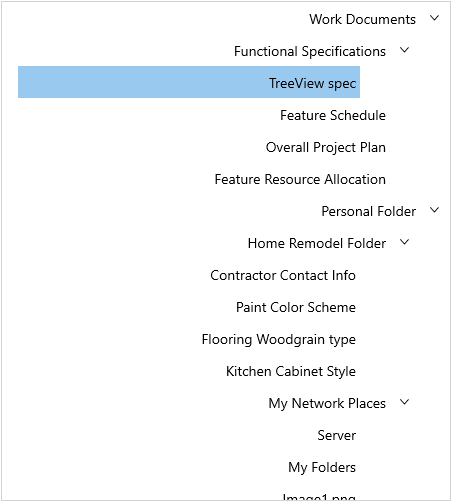

# Right-to-Left (RTL) in WinUI Controls

Right-to-Left (RTL) support allows you to change the flow direction of text and other UI elements within a control's layout.

Syncfusion&reg; WinUI controls allow you to change the flow direction and are suitable for all applications that are localized in right-to-left languages. The control's layout direction can be changed by setting the [FlowDirection](https://learn.microsoft.com/en-us/windows/windows-app-sdk/api/winrt/microsoft.ui.xaml.frameworkelement.flowdirection) property to `RightToLeft`.

## Prerequisites

To use Syncfusion&reg; WinUI controls and their RTL features, ensure the following prerequisites are met:

* Install [Visual Studio 2022](https://visualstudio.microsoft.com/vs/) version 17.8 or later with the **WinUI 3** workload.
* Install the [Syncfusion WinUI NuGet package](https://www.nuget.org/packages?q=syncfusion.winui) for the control you are using.
* Target **Windows 10 version 1903 (build 18362)** or later for WinUI 3 projects.

## Enable RTL for a single control

The following example shows a [SfTreeView](https://help.syncfusion.com/cr/winui/Syncfusion.UI.Xaml.TreeView.SfTreeView.html) control with RTL direction.




<treeView:SfTreeView x:Name="treeView" FlowDirection="RightToLeft"/>




using Microsoft.UI.Xaml;
using Syncfusion.UI.Xaml.TreeView;

treeView.FlowDirection = FlowDirection.RightToLeft;




## Enable RTL at the application level

To apply RTL direction to an entire page or application, set the `FlowDirection` property on the root element (such as `Page`, `Window`, or `Application`). All child controls inherit the flow direction automatically.




<Page
	x:Class="MyApp.MainPage"
	xmlns="http://schemas.microsoft.com/winfx/2006/xaml/presentation"
	xmlns:x="http://schemas.microsoft.com/winfx/2006/xaml"
	FlowDirection="RightToLeft">

	<!-- Child controls inherit the RightToLeft flow direction -->
	<Grid>
		<TextBlock Text="Hello, World!" />
	</Grid>
</Page>




using Microsoft.UI.Xaml;

public MainPage()
{
		this.InitializeComponent();
		this.FlowDirection = FlowDirection.RightToLeft;
}




## Supported controls

Most Syncfusion&reg; WinUI controls support RTL flow direction.

## Limitations and troubleshooting

If RTL is not working as expected, check the following:

* **Control does not reflect RTL direction** — Ensure the control's `FlowDirection` property is set to `RightToLeft`, or that a parent element has the property set so that it is inherited.
* **Text alignment is not reversed** — Some controls may require explicit `TextAlignment` or `HorizontalContentAlignment` adjustments for full RTL support.
* **Images or icons do not mirror** — Use `FlowDirection` on the image container; images themselves are not automatically mirrored unless hosted in a container with `FlowDirection="RightToLeft"`.
* **Custom templates ignore RTL** — Ensure custom control templates use `FlowDirection`-aware layout panels (e.g., `StackPanel`, `Grid`) rather than hard-coded `Margin` values.

## See also

* [Localization for Syncfusion WinUI Controls](./localization.md)
* [Themes for Syncfusion WinUI Controls](./themes.md)
* [Accessibility for Syncfusion WinUI Controls](./accessibility.md)
* [Compact sizing for Syncfusion WinUI Controls](./compact-sizing.md)
* [FlowDirection API reference](https://learn.microsoft.com/en-us/windows/windows-app-sdk/api/winrt/microsoft.ui.xaml.frameworkelement.flowdirection)