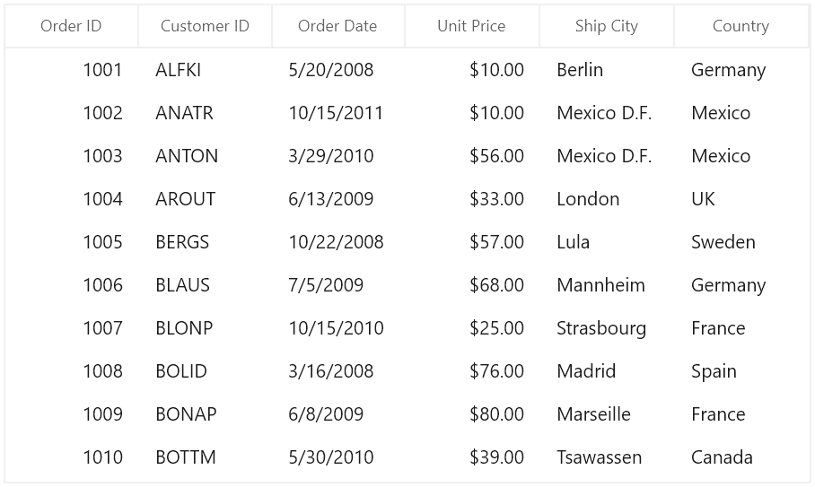

# AutoSize Columns in WinUI DataGrid

DataGrid allows you to set the column widths based on certain logic using [SfDataGrid.ColumnWidthMode](https://help.syncfusion.com/cr/winui/Syncfusion.UI.Xaml.DataGrid.SfDataGrid.html#Syncfusion_UI_Xaml_DataGrid_SfDataGrid_ColumnWidthMode) or [GridColumn.ColumnWidthMode](https://help.syncfusion.com/cr/winui/Syncfusion.UI.Xaml.DataGrid.GridColumn.html#Syncfusion_UI_Xaml_DataGrid_GridColumn_ColumnWidthMode) property. Below is the list of predefined column sizing options available.

<table>
<tr>
<th>
Type
</th>
<th>
Column width
</th>
</tr>
<tr>
<td>
<code>Star</code>
</td>
<td>
Divides the total width equally for columns. 
</td>
</tr>
<tr>
<td>
<code>Auto</code>
</td>
<td>
Calculates the width of column based on header and cell contents. So that header and cell content’s are not truncated.  
</td>
</tr>
<tr>
<td>
<code>AutoWithLastColumnFill</code>
</td>
<td>
Applies <code>ColumnWidthMode.Auto</code> width to all the columns except last column which is visible and the remaining width from total width of SfDataGird is set to last column.
</td>
</tr>
<tr>
<td>
<code>AutoLastColumnFill</code>
</td>
<td>
Applies <code>ColumnWidthMode.Auto</code> width to all the columns except last column which is visible and sets the maximum between last column auto spacing width and remaining width to last column.
</td>
</tr>
<tr>
<td>
<code>SizeToCells</code>
</td>
<td>
Calculates the width of column based on cell contents. So that cell content’s are not truncated.  
</td>
</tr>
<tr>
<td>
<code>SizeToHeader</code>
</td>
<td>
Calculates the width of column based on header content. So that header content is not truncated.  
</td>
</tr>
<tr>
<td>
<code>None</code>
</td>
<td>
Default column width or defined width set to column.
</td>
</tr>
</table>

N> ColumnWidthMode will not work when the column width defined explicitly. ColumnWidthMode calculates column width based on `MinWidth` and `MaxWidth` properties.

Below code, applies `ColumnWidthMode.Star` to equally set width for `SfDataGrid.Columns`.



 <syncfusion:SfDataGrid x:Name="sfDataGrid"
                        AutoGenerateColumns="True"
                        ColumnWidthMode="Star"
                        ItemsSource="{Binding OrdersDetails}"/>



N> The `GridColumn.ColumnWidthMode` takes higher priority than the `SfDataGrid.ColumnWidthMode`.

## Fill remaining width for any column instead of last column when ColumnWidthMode is AutoLastColumnFill or AutoWithLastColumnFill 

In SfDataGrid while setting `SfDataGrid.ColumnWidthMode` as `AutoLastColumnFill` or `AutoWithLastColumnFill` remaining width is applied to last column. You can apply the remaining width to specific column by setting [GridColumn.ColumnWidthMode](https://help.syncfusion.com/cr/winui/Syncfusion.UI.Xaml.DataGrid.GridColumn.html#Syncfusion_UI_Xaml_DataGrid_GridColumn_ColumnWidthMode) property as like below.



<dataGrid:SfDataGrid x:Name="sfDataGrid"
                        AutoGenerateColumns="False"
                        ColumnWidthMode="AutoLastColumnFill"
                        ItemsSource="{Binding OrdersDetails}">            
            <dataGrid:SfDataGrid.Columns>
                <dataGrid:GridTextColumn HeaderText="Order ID" MappingName="OrderID" ColumnWidthMode="AutoLastColumnFill" />
                <dataGrid:GridTextColumn HeaderText="Customer ID" MappingName="Customer ID" />               
                <dataGrid:GridTextColumn HeaderText="Order Date" MappingName="OrderDate" />
                <dataGrid:GridTextColumn HeaderText="Unit Price" MappingName="UnitPrice" />
                <dataGrid:GridTextColumn HeaderText="Ship City" MappingName="ShipCity" />
                <dataGrid:GridTextColumn MappingName="Country" />
            </dataGrid:SfDataGrid.Columns>
</dataGrid:SfDataGrid>


this.sfDataGrid.ColumnWidthMode = ColumnWidthMode.AutoLastColumnFill;
this.sfDataGrid.Columns["OrderID"].ColumnWidthMode = ColumnWidthMode.AutoLastColumnFill;



## Refreshing autosize calculation at runtime

You can refresh the autosize calculation at runtime by calling [SfDataGrid.ColumnSizer.Refresh](https://help.syncfusion.com/cr/winui/Syncfusion.UI.Xaml.DataGrid.DataGridColumnSizer.html#Syncfusion_UI_Xaml_DataGrid_DataGridColumnSizer_Refresh) method.
DataGrid support to recalculates the column auto width by calling reset methods of `ColumnSizer`. [ColumnSizer.ResetAutoCalculationforAllColumns](https://help.syncfusion.com/cr/winui/Syncfusion.UI.Xaml.Grids.DataGridRowColumnSizer-1.html#Syncfusion_UI_Xaml_Grids_DataGridRowColumnSizer_1_ResetAutoCalculationforAllColumns) method reset widths to all columns. [ColumnSizer.ResetAutoCalculation](https://help.syncfusion.com/cr/winui/Syncfusion.UI.Xaml.Grids.DataGridRowColumnSizer-1.html#Syncfusion_UI_Xaml_Grids_DataGridRowColumnSizer_1_ResetAutoCalculation_Syncfusion_UI_Xaml_Grids_GridColumnBase_) method reset the width to particular column.

N> The `ColumnSizer.ResetAutoCalculationforAllColumns` or `ColumnSizer.ResetAutoCalculation` methods applicable for Auto, AutoWithLastColumnFill, AutoLastColumnFill, SizeToCells types.

For example, you can refresh all the column’s width based on the cell contents of newly added records at runtime. 



var viewModel = this.sfDataGrid.DataContext as OrderInfoViewModel;
viewModel.OrdersDetails.Add(new OrderInfo() { 
    OrderID = 10011,
    UnitPrice = 34,
    Quantity = 20,
    OrderDate = DateTime.Now,
    ShipAddress = "I.de Margarita,Venezuela",
    ShipCity = "Venezuela"
    });
this.sfDataGrid.ColumnSizer.ResetAutoCalculationforAllColumns();
this.sfDataGrid.ColumnSizer.Refresh();            



## Resetting column width to apply autosize calculation

When the width of the column is explicitly defined or column is resized, then column width is not changed based on `ColumnSizer`. You can reset [GridColumn.Width](https://help.syncfusion.com/cr/winui/Syncfusion.UI.Xaml.Grids.GridColumnBase.html#Syncfusion_UI_Xaml_Grids_GridColumnBase_Width) by setting `double.NaN` to apply column width based on column sizer.



foreach (var column in sfDataGrid.Columns)
{
    if (!double.IsNaN(column.Width))
        column.Width = double.NaN;
}
this.sfDataGrid.ColumnSizer.Refresh();            



## Customizing built-in column auto-sizing logic

SfDataGrid process column sizing operations in [DataGridColumnSizer](https://help.syncfusion.com/cr/winui/Syncfusion.UI.Xaml.DataGrid.DataGridColumnSizer.html) class. You can customize the column sizing operations by overriding `DataGridColumnSizer` and set it to `SfDataGrid.ColumnSizer`.



this.sfDataGrid.ColumnSizer = new ColumnSizerExt(sfDataGrid);

public class ColumnSizerExt : DataGridColumnSizer
{
    public ColumnSizerExt(SfDataGrid dataGrid)
        : base(dataGrid)
    {

    }

    // Calculate Width for column when ColumnSizer is SizeToCells.
    protected override double CalculateCellWidth(GridColumn column, bool setWidth = true)
    {
        return base.CalculateCellWidth(column, setWidth);
    }

    //Calculate Width for the column when ColumnSizer is SizeToHeader
    protected override double CalculateHeaderWidth(GridColumn column, bool setWidth = true)
    {
        return base.CalculateHeaderWidth(column, setWidth);
    }
}




## Auto width calculation based on font settings

By default, the ColumnSizer calculates column’s width based on fixed `FontSize`, `FontFamily`, `Margin`,`SortIconWidth`, `FilterIconWidth`. You can change the calculation by customized settings.

### Changing sort and filter icon width

You can change the filter icon and sort icon widths for column width calculation by setting [ColumnSizer.SortIconWidth](https://help.syncfusion.com/cr/winui/Syncfusion.UI.Xaml.Grids.DataGridRowColumnSizer-1.html#Syncfusion_UI_Xaml_Grids_DataGridRowColumnSizer_1_SortIconWidth) and [ColumnSizer.FilterIconWidth](https://help.syncfusion.com/cr/winui/Syncfusion.UI.Xaml.DataGrid.DataGridColumnSizer.html#Syncfusion_UI_Xaml_DataGrid_DataGridColumnSizer_FilterIconWidth) properties.



sfDataGrid.ColumnSizer.SortIconWidth = 20;
sfDataGrid.ColumnSizer.FilterIconWidth = 20;



### Changing font settings for DataGrid

You can change the `font settings` for column width calculation by setting [ColumnSizer.FontSize](https://help.syncfusion.com/cr/winui/Syncfusion.UI.Xaml.Grids.DataGridRowColumnSizer-1.html#Syncfusion_UI_Xaml_Grids_DataGridRowColumnSizer_1_FontSize), [ColumnSizer.FontFamily](https://help.syncfusion.com/cr/winui/Syncfusion.UI.Xaml.Grids.DataGridRowColumnSizer-1.html#Syncfusion_UI_Xaml_Grids_DataGridRowColumnSizer_1_FontFamily) and [ColumnSizer.Margin](https://help.syncfusion.com/cr/winui/Syncfusion.UI.Xaml.Grids.DataGridRowColumnSizer-1.html#Syncfusion_UI_Xaml_Grids_DataGridRowColumnSizer_1_Margin) properties.  This settings will be considered for all columns.



this.sfDataGrid.ColumnSizer.FontSize = 10.0;
this.sfDataGrid.ColumnSizer.FontFamily = new FontFamily("TimesNewRoman");
this.sfDataGrid.ColumnSizer.Margin = ThicknessHelper.FromLengths(9, 3, 1, 3);



### Changing font settings for one column

You can change the `font setting` for one column width calculation using [DataGridColumnSizer.SetFontFamily](https://help.syncfusion.com/cr/winui/Syncfusion.UI.Xaml.Grids.DataGridRowColumnSizer-1.html#Syncfusion_UI_Xaml_Grids_DataGridRowColumnSizer_1_SetFontFamily_Syncfusion_UI_Xaml_Grids_GridColumnBase_Microsoft_UI_Xaml_Media_FontFamily_), [DataGridColumnSizer.SetFontSize](https://help.syncfusion.com/cr/winui/Syncfusion.UI.Xaml.Grids.DataGridRowColumnSizer-1.html#Syncfusion_UI_Xaml_Grids_DataGridRowColumnSizer_1_SetFontSize_Syncfusion_UI_Xaml_Grids_GridColumnBase_System_Double_) and [DataGridColumnSizer.SetMargin](https://help.syncfusion.com/cr/winui/Syncfusion.UI.Xaml.Grids.DataGridRowColumnSizer-1.html#Syncfusion_UI_Xaml_Grids_DataGridRowColumnSizer_1_SetMargin_Syncfusion_UI_Xaml_Grids_GridColumnBase_Microsoft_UI_Xaml_Thickness_) static methods of `DataGridColumnSizer` to `GridColumn`. 



var gridColumn = this.sfDataGrid.Columns[0];
DataGridColumnSizer.SetFontFamily(gridColumn, new FontFamily("TimesNewRoman"));
DataGridColumnSizer.SetFontSize(gridColumn, 10.0);
DataGridColumnSizer.SetMargin(gridColumn, ThicknessHelper.FromLengths(9, 3, 1, 3));



## Star column sizer ratio support

You can customize the `ColumnWidthMode.Star` width calculation logic by overriding [SetStarWidth](https://help.syncfusion.com/cr/winui/Syncfusion.UI.Xaml.DataGrid.DataGridColumnSizer.html#Syncfusion_UI_Xaml_DataGrid_DataGridColumnSizer_SetStarWidth_System_Double_System_Collections_Generic_IEnumerable_Syncfusion_UI_Xaml_DataGrid_GridColumn__) method of [DataGridColumnSizer](https://help.syncfusion.com/cr/winui/Syncfusion.UI.Xaml.DataGrid.DataGridColumnSizer.html).

For example, you can calculate the column width, with specified ratios instead of dividing equal width for all columns in Star calculation using `ColumnRatio` attached property.



public static class StarRatio
{

    public static int GetColumnRatio(DependencyObject obj)
    {
        return (int)obj.GetValue(ColumnRatioProperty);
    }

    public static void SetColumnRatio(DependencyObject obj, int value)
    {
        obj.SetValue(ColumnRatioProperty, value);
    }

    public static readonly DependencyProperty ColumnRatioProperty = DependencyProperty.RegisterAttached("ColumnRatio", typeof(int), typeof(StarRatio), new PropertyMetadata(1, null));
}



Below code to define the star width calculation based on the `ColumnRatio`.



//Assign the customized GridColumnSizerExt to SfDataGrid.ColumnSizer
this.sfDataGrid.ColumnSizer = new GridColumnSizerExt(sfDataGrid);
public class GridColumnSizerExt : DataGridColumnSizer
{
    public GridColumnSizerExt(SfDataGrid dataGrid)
        : base(dataGrid)
    {

    }
    
    protected override void SetStarWidth(double remainingColumnWidth, IEnumerable<GridColumn> remainingColumns)
    {
        var removedColumn = new List<GridColumn>();
        var columns = remainingColumns.ToList();
        var totalRemainingStarValue = remainingColumnWidth;
        double removedWidth = 0;
        bool isRemoved;
    
        while (columns.Count > 0)
        {
            isRemoved = false;
            removedWidth = 0;
            var columnsCount = 0;

            columns.ForEach((col) =>
            {
                columnsCount += StarRatio.GetColumnRatio(col);
            });

            double starWidth = Math.Floor((totalRemainingStarValue / columnsCount));
            var column = columns.First();
            starWidth *= StarRatio.GetColumnRatio(column);
            double computedWidth = SetColumnWidth(column, starWidth);

            if (starWidth != computedWidth && starWidth > 0)
            {
                isRemoved = true;
                columns.Remove(column);

                foreach (var remColumn in removedColumn)
                {

                    if (!columns.Contains(remColumn))
                    {
                            removedWidth += remColumn.ActualWidth;
                            columns.Add(remColumn);
                    }
                }
                removedColumn.Clear();
                totalRemainingStarValue += removedWidth;
            }

            totalRemainingStarValue = totalRemainingStarValue - computedWidth;

            if (!isRemoved)
            {
                columns.Remove(column);

                if (!removedColumn.Contains(column))
                    removedColumn.Add(column);
            }
        }
    }
}



Below code uses the `ColumnRatio` to apply the defined star width for each column.



<dataGrid:SfDataGrid  x:Name="sfDataGrid"
                        AllowSorting="True"
                        AllowEditing="True"
                        AutoGenerateColumns="False"
                        ColumnWidthMode="Star"
                        ItemsSource="{Binding OrdersDetails}">
    <dataGrid:SfDataGrid.Columns>
        <dataGrid:GridTextColumn HeaderText="Order ID" MappingName="OrderID" local:StarRatio.ColumnRatio="1"/>
        <dataGrid:GridTextColumn HeaderText="Customer ID" MappingName="Customer ID" local:StarRatio.ColumnRatio="1"/>
        <dataGrid:GridTextColumn HeaderText="Order Date" MappingName="OrderDate" local:StarRatio.ColumnRatio="1"/>
        <dataGrid:GridTextColumn   HeaderText="Unit Price" MappingName="Unit Price" local:StarRatio.ColumnRatio="1"/>
        <dataGrid:GridTextColumn   HeaderText="Ship City" MappingName="ShipCity" local:StarRatio.ColumnRatio="2" />
        <dataGrid:GridTextColumn MappingName="Country" local:StarRatio.ColumnRatio="2"/>
    </dataGrid:SfDataGrid.Columns>
</dataGrid:SfDataGrid>



## Change the width of DataGrid ComboBoxColumn based on it’s ItemsSource

By default, the `ColumnWidthMode` calculates auto width based on the column content. You can change the auto width calculation for [GridComboBoxColumn](https://help.syncfusion.com/cr/winui/Syncfusion.UI.Xaml.DataGrid.GridComboBoxColumn.html) based on its items source by overriding the [CalculateCellWidth](https://help.syncfusion.com/cr/winui/Syncfusion.UI.Xaml.DataGrid.DataGridColumnSizer.html#Syncfusion_UI_Xaml_DataGrid_DataGridColumnSizer_CalculateCellWidth_Syncfusion_UI_Xaml_DataGrid_GridColumn_System_Boolean_) virtual method.

Below code creates `CustomColumnSizer` to change the width of `GridComboboxColumn` and set to `SfDataGrid.ColumnSizer`.



this.sfDataGrid.ColumnSizer = new GridColumnSizerExt(sfDataGrid);

public class GridColumnSizerExt : DataGridColumnSizer
{
    public GridColumnSizerExt(SfDataGrid dataGrid)
    : base(dataGrid)
    {

    }

    protected override double CalculateCellWidth(GridColumn column, bool setWidth = true)
    {
        //Customizing width calculation for GridComboBoxColumn
        if (column is GridComboBoxColumn)
        {
            //Get the width of the corresponding GridColumn
            double colWidth = column.Width;

            //Get the Source collection from the corresponding GridComboBoxColumn items source
            var source = (column as GridComboBoxColumn).ItemsSource;

            //Initialize the below field for storing length                
            string maximumComboItemsText = string.Empty;

            //Get the column width and row height
            var clientSize = new Size(colWidth, DataGrid.RowHeight);

            //Calculate the maximum length for each combo box items and store maximum length
            foreach (var comboItems in source)
            {
                string comboItemText = (string)comboItems;
                if (maximumComboItemsText.Length < comboItemText.Length)
                    maximumComboItemsText = comboItemText;
            }

            //Get the size for maximum ComboBoxItems's text and returned the measured width as a column width of that column
            var measureSize = MeasureText(clientSize, maximumComboItemsText, column, null, GridQueryBounds.Width);

            return measureSize.Width;
        }
        //Default column width calculation performed other than GridComboBoxColumn
        return base.CalculateCellWidth(column, setWidth);
        }
    } 


