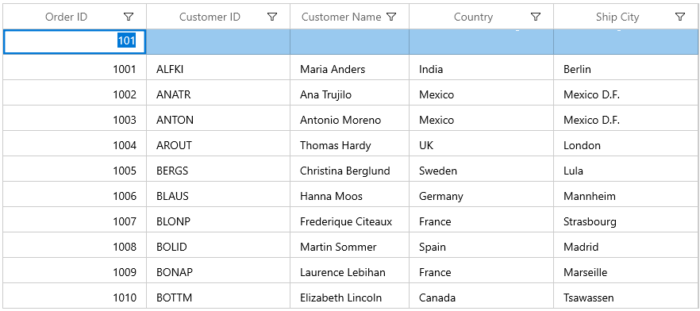
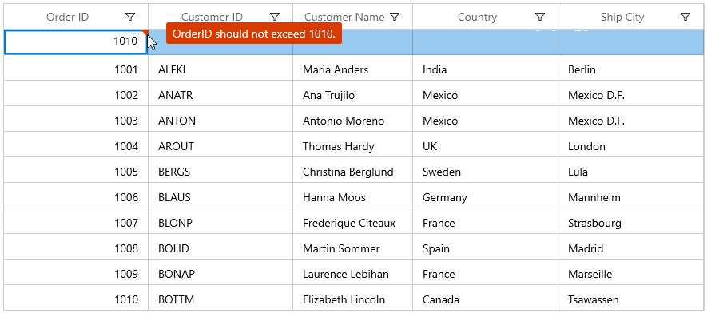
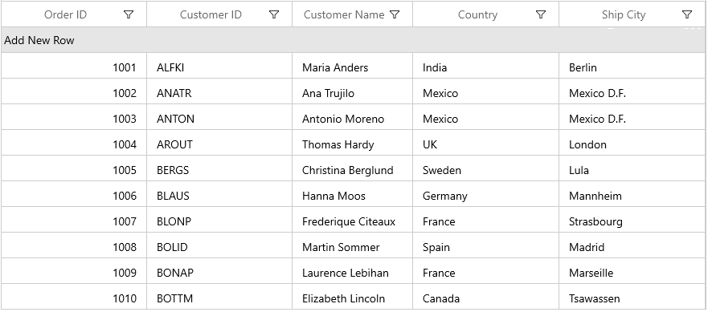
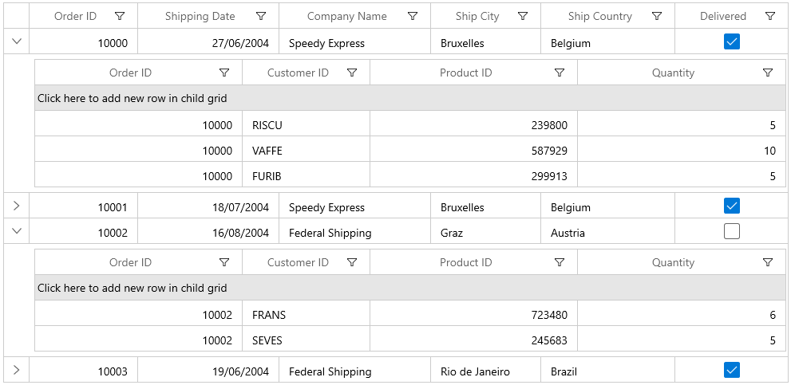

# CRUD Operations in WinUI DataGrid

DataGrid listens and responds to the CRUD operations such as add, delete and data update (property change) at runtime. Also, it supports [editing](https://help.syncfusion.com/winui/datagrid/editing), [add new row](https://help.syncfusion.com/winui/datagrid/data-manipulation#add-new-rows), [delete row](https://help.syncfusion.com/winui/datagrid/data-manipulation#delete-row) by pressing <kbd>Delete</kbd> key.

## Managing data updates

DataGrid manages the sorting, filtering, grouping and summaries during data updates based on [SfDataGrid.LiveDataUpdateMode](https://help.syncfusion.com/cr/winui/Syncfusion.UI.Xaml.DataGrid.SfDataGrid.html#Syncfusion_UI_Xaml_DataGrid_SfDataGrid_LiveDataUpdateMode) property.



<dataGrid:SfDataGrid x:Name="sfDataGrid"
                       AutoGenerateColumns="True"
                       ItemsSource="{Binding Orders}"
                       LiveDataUpdateMode="AllowDataShaping" />


this.sfDataGrid.LiveDataUpdateMode = LiveDataUpdateMode.AllowDataShaping;



### LiveDataUpdateMode – Default 

<table>
<tr>
<td>
{{'**Grid operations / Data Manipulation operations**'| markdownify }}
</td>
<td>
{{'**Add**'| markdownify }}
</td>
<td>
{{'**Remove / delete**'| markdownify }}
</td>
<td>
{{'**Property change**'| markdownify }}
</td>
</tr>
<tr>
<td>
Sorting
</td>
<td>
Record added at last
</td>
<td>
Updated
</td>
<td>
Sort order not updated
</td>
</tr>
<tr>
<td>
Grouping
</td>
<td>
Updated
</td>
<td>
Updated
</td>
<td>
Groups not refreshed based on change
</td>
</tr>
<tr>
<td>
Filtering
</td>
<td>
Updated
</td>
<td>
Updated
</td>
<td>
Filter not refreshed based on change
</td>
</tr>
<tr>
<td>
Summaries
</td>
<td>
Not updated
</td>
<td>
Not updated
</td>
<td>
Not updated
</td>
</tr>
</table>

### LiveDataUpdateMode – AllowSummaryUpdate

<table>
<tr>
<td>
{{'**Grid operations/ Data Manipulation operations**'| markdownify }}
</td>
<td>
{{'**Add**'| markdownify }}
</td>
<td>
{{'**Remove / delete**'| markdownify }}
</td>
<td>
{{'**Property change**'| markdownify }}
</td>
</tr>
<tr>
<td>
Sorting
</td>
<td>
Record added at last
</td>
<td>
Updated
</td>
<td>
Sort order not updated
</td>
</tr>
<tr>
<td>
Grouping
</td>
<td>
Updated
</td>
<td>
Updated
</td>
<td>
Groups not refreshed based on change
</td>
</tr>
<tr>
<td>
Filtering
</td>
<td>
Updated
</td>
<td>
Updated
</td>
<td>
Filter not refreshed based on change
</td>
</tr>
<tr>
<td>
Summaries
</td>
<td>
Updated
</td>
<td>
Updated
</td>
<td>
Updated
</td>
</tr>
</table>

### LiveDataUpdateMode – AllowDataShaping

<table>
<tr>
<td>
{{'**Grid operations/ Data Manipulation operations**'| markdownify }}
</td>
<td>
{{'**Add**'| markdownify }}
</td>
<td>
{{'**Remove / delete**'| markdownify }}
</td>
<td>
{{'**Property change**'| markdownify }}
</td>
</tr>
<tr>
<td>
Sorting
</td>
<td>
Updated
</td>
<td>
Updated
</td>
<td>
Updated 
</td>
</tr>
<tr>
<td>
Grouping
</td>
<td>
Updated 
</td>
<td>
Updated
</td>
<td>
Updated
</td>
</tr>
<tr>
<td>
Filtering
</td>
<td>
Updated
</td>
<td>
Updated
</td>
<td>
Updated
</td>
</tr>
<tr>
<td>
Summaries
</td>
<td>
Updated
</td>
<td>
Updated
</td>
<td>
Updated
</td>
</tr>
</table>

### Limitations

* `AllowDataShaping` and `AllowSummaryUpdate` is not supported when you are binding with dynamic data objects.
* Complex and indexer properties doesn’t support `LiveDataUpdateMode` - `AllowDataShaping` and `AllowSummaryUpdate`.

## Add new rows

DataGrid provides built-in row (called AddNewRow) that allows user to add new records to underlying collection. Built-in add new row can be enabled or disabled by setting [SfDataGrid.AddNewRowPosition](https://help.syncfusion.com/cr/winui/Syncfusion.UI.Xaml.DataGrid.SfDataGrid.html#Syncfusion_UI_Xaml_DataGrid_SfDataGrid_AddNewRowPosition) property. `AddNewRowPosition` also denotes the position of add new row in DataGrid.

When you start editing in AddNewRow, the SfDataGrid control creates an instance for the underlying data object and adds it to underlying collection when editing completed.

N> The underlying data object must be defined with default constructor.



<dataGrid:SfDataGrid x:Name="sfDataGrid"
                       AddNewRowPosition="Top"
                       AutoGenerateColumns="True"
                       ItemsSource="{Binding Orders}" />


this.sfDataGrid.AddNewRowPosition = AddNewRowPosition.Top;



You can get the row row index of AddNewRow using [SfDataGrid.GetAddNewRowIndex](https://help.syncfusion.com/cr/winui/Syncfusion.UI.Xaml.DataGrid.GridIndexResolver.html#Syncfusion_UI_Xaml_DataGrid_GridIndexResolver_GetAddNewRowIndex_Syncfusion_UI_Xaml_DataGrid_SfDataGrid_) method.



int addNewRowIndex = this.sfDataGrid.GetAddNewRowIndex();



You can check whether the specified row index is AddNewRow index,  by using [SfDataGrid.IsAddNewIndex](https://help.syncfusion.com/cr/winui/Syncfusion.UI.Xaml.DataGrid.GridIndexResolver.html#Syncfusion_UI_Xaml_DataGrid_GridIndexResolver_IsAddNewIndex_Syncfusion_UI_Xaml_DataGrid_SfDataGrid_System_Int32_) helper method.



bool isAddNewRowIndex = this.sfDataGrid.IsAddNewIndex(1);



### Changing the AddNewRow default text in DataGrid

You can change the default static string of AddNewRow in datagrid by using the [SfDataGrid.AddNewRowText](https://help.syncfusion.com/cr/winui/Syncfusion.UI.Xaml.DataGrid.SfDataGrid.html#Syncfusion_UI_Xaml_DataGrid_SfDataGrid_AddNewRowText) property. The `AddNewRowText` property has higher priority than the text that is localized in resx file.



<dataGrid:SfDataGrid x:Name="sfDataGrid"
                       AddNewRowPosition="Top"
                       AddNewRowText="Click here to add new row in datagrid"
                       ItemsSource="{Binding Orders}" />


this.sfDataGrid.AddNewRowPosition = AddNewRowPosition.Top;
this.sfDataGrid.AddNewRowText = "Click here to add new row in datagrid";



### Customize the newly added row position

SfDataGrid adds new data item from AddNewRow at the end of collection. When data operations (sorting, grouping) performed, the new item added based on data operations. You can customize the newly added data item position by setting [SfDataGrid.NewItemPlaceHolderPosition](https://help.syncfusion.com/cr/winui/Syncfusion.UI.Xaml.DataGrid.SfDataGrid.html#Syncfusion_UI_Xaml_DataGrid_SfDataGrid_NewItemPlaceholderPosition).



<dataGrid:SfDataGrid x:Name="sfDataGrid"                               
                       AddNewRowPosition="Top"
                       NewItemPlaceholderPosition="AtBeginning"                            
                       ItemsSource="{Binding Orders}">


this.sfDataGrid.AddNewRowPosition = AddNewRowPosition.Top;
this.sfDataGrid.NewItemPlaceholderPosition = NewItemPlaceholderPosition.AtBeginning;



### Initializing default values for AddNewRow

SfDataGrid allows you to set the default values for AddNewRow while initiating, through [AddNewRowInitiatingEventArgs.NewObject](https://help.syncfusion.com/cr/winui/Syncfusion.UI.Xaml.DataGrid.AddNewRowInitiatingEventArgs.html#Syncfusion_UI_Xaml_DataGrid_AddNewRowInitiatingEventArgs_NewObject) property in  [SfDataGrid.AddNewRowInitiating](https://help.syncfusion.com/cr/winui/Syncfusion.UI.Xaml.DataGrid.SfDataGrid.html#Syncfusion_UI_Xaml_DataGrid_SfDataGrid_AddNewRowInitiating) event.



this.sfDataGrid.AddNewRowInitiating += SfDataGrid_AddNewRowInitiating;

void SfDataGrid_AddNewRowInitiating(object sender, AddNewRowInitiatingEventArgs e)
{
    var orderInfo = e.NewObject as OrderInfo;
    orderInfo.OrderID = 101;
}



### Working with complex properties in AddNewRow

SfDataGrid control does not initiate values for complex properties defined in the data object. Hence, you need to initiate the default values for the complex properties externally by using the `SfDataGrid.AddNewRowInitiating` event.



<dataGrid:SfDataGrid x:Name="sfDataGrid"
                       AddNewRowInitiating="SfDataGrid_AddNewRowInitiating"
                       AutoGenerateColumns="False"
                       ItemsSource="{Binding Orders}">
    <dataGrid:SfDataGrid.Columns>
        <dataGrid:GridTextColumn MappingName="OrderID" />
        <dataGrid:GridTextColumn MappingName="Customer.CustomerID" />
        <dataGrid:GridTextColumn MappingName="ShipCity" />
    </dataGrid:SfDataGrid.Columns>
</dataGrid:SfDataGrid>


this.sfDataGrid.AddNewRowInitiating += SfDataGrid_AddNewRowInitiating;

private void SfDataGrid_AddNewRowInitiating(object sender, AddNewRowInitiatingEventArgs e)
{
    var orderInfo = e.NewObject as OrderInfo;
    orderInfo.Customer = new Customer();
}



### Validating AddNewRow

You can validate the data in AddNewRow like other data rows through [built-in validation](https://help.syncfusion.com/winui/datagrid/data-validation#built-in-validations) or [custom validation](https://help.syncfusion.com/winui/datagrid/data-validation#custom-validation-through-events). Here, AddNewRow is validated using [RowValidating](https://help.syncfusion.com/cr/winui/Syncfusion.UI.Xaml.DataGrid.SfDataGrid.html#Syncfusion_UI_Xaml_DataGrid_SfDataGrid_RowValidating) event by setting [RowValidatingEventArgs.IsValid](https://help.syncfusion.com/cr/winui/Syncfusion.UI.Xaml.DataGrid.RowValidatingEventArgs.html#Syncfusion_UI_Xaml_DataGrid_RowValidatingEventArgs_IsValid) to `false` which doesn’t allow users to commit the AddNewRow until the validation gets succeeded.  



this.sfDataGrid.RowValidating += SfDataGrid_RowValidating;

private void SfDataGrid_RowValidating(object sender, RowValidatingEventArgs e)
{
    if (this.sfDataGrid.IsAddNewIndex(e.RowIndex))
    {
        var orderInfo = e.RowData as OrderInfo;

        if (orderInfo.OrderID >= 1010)
        {
            e.IsValid = false;
            e.ErrorMessages.Add("OrderID", "OrderID should not exceed 1010.");
        }
    }
}



Similarly, you can validate the cells in AddNewRow by using the [CurrentCellValidating](https://help.syncfusion.com/cr/winui/Syncfusion.UI.Xaml.DataGrid.SfDataGrid.html#Syncfusion_UI_Xaml_DataGrid_SfDataGrid_CurrentCellActivating) event.

### Customizing AddNewRow text using default resource file

SfDataGrid enables you to customize the watermark text of AddNewRow by changing value of AddNewRowText in Resource Designer. For more information, you can refer [Editing default culture resource](https://help.syncfusion.com/winui/localization#editing-default-culture-strings) section.

To customize the AddNewRowText, add the default [Syncfusion.Grid.WinUI.resw](https://github.com/syncfusion/winui-controls-localization-resource-files) file in **Resources** folder and then customize the value of AddNewRowText. Refer [here](https://help.syncfusion.com/winui/localization) to learn more about localization. 

### Customizing AddNewRow text using style

You can customize the watermark text of AddNewRow by editing the style of `AddNewRowControl` and change the content of `PART_AddNewRowTextBorder’s ContentPresenter`.



xmlns:dataGrid="using:Syncfusion.UI.Xaml.DataGrid"

<Application.Resources>
    
</Application.Resources>



### AddNewRow support in Master-Details View

You can enable the AddNewRow in `DetailsViewDataGrid` by specifying the position to [SfDataGrid.AddNewRowPosition](https://help.syncfusion.com/cr/winui/Syncfusion.UI.Xaml.DataGrid.SfDataGrid.html#Syncfusion_UI_Xaml_DataGrid_SfDataGrid_AddNewRowPosition) property in [ViewDefinition.DataGrid](https://help.syncfusion.com/cr/winui/Syncfusion.UI.Xaml.DataGrid.GridViewDefinition.html#Syncfusion_UI_Xaml_DataGrid_GridViewDefinition_DataGrid). 



<dataGrid:SfDataGrid x:Name="sfDataGrid"
                       AutoGenerateColumns="True"
                       AutoGenerateRelations="False"
                       ItemsSource="{Binding Orders}">

    <dataGrid:SfDataGrid.DetailsViewDefinition>
        <dataGrid:GridViewDefinition RelationalColumn="OrderDetails">
            <dataGrid:GridViewDefinition.DataGrid>
                <dataGrid:SfDataGrid x:Name="firstLevelNestedGrid"
                                       AddNewRowPosition="Top"                                       
                                       AutoGenerateColumns="True" />
            </dataGrid:GridViewDefinition.DataGrid>
        </dataGrid:GridViewDefinition>
    </dataGrid:SfDataGrid.DetailsViewDefinition>

</dataGrid:SfDataGrid>


this.firstLevelNestedGrid.AddNewRowPosition = AddNewRowPosition.Top;


Similarly, you can wire [AddNewRowInitiating](https://help.syncfusion.com/cr/wpf/Syncfusion.UI.Xaml.Grid.SfDataGrid.html) event for `ViewDefinition.DataGrid`.


this.firstLevelNestedGrid.AddNewRowInitiating += FirstLevelNestedGrid_AddNewRowInitiating;

void FirstLevelNestedGrid_AddNewRowInitiating(object sender, AddNewRowInitiatingEventArgs args)
{
            
}



For auto-generated relation (when the [AutoGenerateRelations](https://help.syncfusion.com/cr/winui/Syncfusion.UI.Xaml.DataGrid.SfDataGrid.html#Syncfusion_UI_Xaml_DataGrid_SfDataGrid_AutoGeneratingRelations) is set to `true`), the AddNewRow can be enabled by specifying the position to `AddNewRowPosition` property in `AutoGeneratingRelations` event.



this.sfDataGrid.AutoGeneratingRelations += SfDataGrid_AutoGeneratingRelations;

void SfDataGrid_AutoGeneratingRelations(object sender, AutoGeneratingRelationsArgs e)
{
    e.GridViewDefinition.DataGrid.AddNewRowPosition = AddNewRowPosition.Top;
}



In the same way, you can wire [AddNewRowInitiating](https://help.syncfusion.com/cr/winui/Syncfusion.UI.Xaml.DataGrid.SfDataGrid.html#Syncfusion_UI_Xaml_DataGrid_SfDataGrid_AddNewRowInitiating) event in the `AutoGeneratingRelations` event.



this.sfDataGrid.AutoGeneratingRelations += SfDataGrid_AutoGeneratingRelations;

void SfDataGrid_AutoGeneratingRelations(object sender, AutoGeneratingRelationsArgs e)
{
    e.GridViewDefinition.DataGrid.AddNewRowInitiating += DataGrid_AddNewRowInitiating;
}

void DataGrid_AddNewRowInitiating(object sender, AddNewRowInitiatingEventArgs e)
{

}



### Changing the AddNewRow default text in details view grid

You can change the default static string of AddNewRow in details view grid by using the [SfDataGrid.AddNewRowText](https://help.syncfusion.com/cr/winui/Syncfusion.UI.Xaml.DataGrid.SfDataGrid.html#Syncfusion_UI_Xaml_DataGrid_SfDataGrid_AddNewRowText) property in `ViewDefinition.DataGrid`. The `AddNewRowText` property has higher priority than the text that is localized in resx file.



<dataGrid:SfDataGrid x:Name="sfDataGrid"
                       AutoGenerateColumns="True"
                       AutoGenerateRelations="False"
                       ItemsSource="{Binding Orders}">

    <dataGrid:SfDataGrid.DetailsViewDefinition>
        <dataGrid:GridViewDefinition RelationalColumn="OrderDetails">
            <dataGrid:GridViewDefinition.DataGrid>
                <dataGrid:SfDataGrid x:Name="firstLevelNestedGrid"
                                       AddNewRowPosition="Top"
                                       AddNewRowText="Click here to add new row in child grid"									   
                                       AutoGenerateColumns="True" />
            </dataGrid:GridViewDefinition.DataGrid>
        </dataGrid:GridViewDefinition>
    </dataGrid:SfDataGrid.DetailsViewDefinition>

</dataGrid:SfDataGrid>


this.firstLevelNestedGrid.AddNewRowPosition = AddNewRowPosition.Top;
this.firstLevelNestedGrid.AddNewRowText = "Click here to add new row in child grid";



## Delete row

DataGrid provides built-in support to delete the selected records in user interface (UI) by pressing <kbd>Delete</kbd> key. You can enable the deleting support by setting the [SfDataGrid.AllowDeleting](https://help.syncfusion.com/cr/winui/Syncfusion.UI.Xaml.DataGrid.SfDataGrid.html#Syncfusion_UI_Xaml_DataGrid_SfDataGrid_AllowDeleting) property to `true`. `AllowDeleting` is only supported when [SelectionUnit](https://help.syncfusion.com/cr/winui/Syncfusion.UI.Xaml.DataGrid.SfDataGrid.html#Syncfusion_UI_Xaml_DataGrid_SfDataGrid_SelectionUnit) is [Row](https://help.syncfusion.com/cr/winui/Syncfusion.UI.Xaml.Grids.GridSelectionUnit.html#Syncfusion_UI_Xaml_Grids_GridSelectionUnit_Row).



<dataGrid:SfDataGrid  x:Name="sfDataGrid"
                        AllowDeleting="True"
                        AutoGenerateColumns="True"
                        ItemsSource="{Binding Orders}" />


this.sfDataGrid.AllowDeleting = true;



You can delete record directly in underlying collection also using Remove () or RemoveAt (int index). 



(sfDataGrid.DataContext as ViewModel).Orders.Remove(sfDataGrid.CurrentItem as OrderInfo);

// OR
(sfDataGrid.DataContext as ViewModel).Orders.RemoveAt(2);



### Events

#### RecordDeleting 

[RecordDeleting](https://help.syncfusion.com/cr/winui/Syncfusion.UI.Xaml.DataGrid.SfDataGrid.html#Syncfusion_UI_Xaml_DataGrid_SfDataGrid_RecordDeleting) event occurs when the record is being deleted from SfDataGrid. The [RecordDeletingEventArgs](https://help.syncfusion.com/cr/winui/Syncfusion.UI.Xaml.DataGrid.RecordDeletingEventArgs.html) provides information to `RecordDeleting` event for deleting the record and it contains the following members.

* [Cancel](https://docs.microsoft.com/en-us/dotnet/api/system.componentmodel.canceleventargs.cancel) - Gets or sets a value indicating whether the event should be canceled.

* [OriginalSender](https://help.syncfusion.com/cr/winui/Syncfusion.UI.Xaml.Grids.GridCancelEventArgs.html#Syncfusion_UI_Xaml_Grids_GridCancelEventArgs_OriginalSender) - Gets the original sender from where the event is raised.

* [Items](https://help.syncfusion.com/cr/winui/Syncfusion.UI.Xaml.DataGrid.RecordDeletingEventArgs.html#Syncfusion_UI_Xaml_DataGrid_RecordDeletingEventArgs_Items) - Gets or sets the items to be removed from the source collection.

You can cancel the delete operation through `Cancel` property in `RecordDeleting` event.



this.sfDataGrid.RecordDeleting += SfDataGrid_RecordDeleting;

private void SfDataGrid_RecordDeleting(object sender, RecordDeletingEventArgs e)
{
    var item = e.Items[0] as OrderInfo;

    if (item.OrderID == 1005)
    {
        e.Cancel = true;
    }
}



#### RecordDeleted	

[RecordDeleted](https://help.syncfusion.com/cr/winui/Syncfusion.UI.Xaml.DataGrid.SfDataGrid.html#Syncfusion_UI_Xaml_DataGrid_SfDataGrid_RecordDeleted) event occurs after the record is deleted. The [RecordDeletedEventArgs](https://help.syncfusion.com/cr/winui/Syncfusion.UI.Xaml.DataGrid.RecordDeletedEventArgs.html)  of   `RecordDeleted` event contains the following members.

* [Items](https://help.syncfusion.com/cr/winui/Syncfusion.UI.Xaml.DataGrid.RecordDeletedEventArgs.html#Syncfusion_UI_Xaml_DataGrid_RecordDeletedEventArgs_Items) - Gets the records that were removed from the source collection.

* [SelectedIndex](https://help.syncfusion.com/cr/winui/Syncfusion.UI.Xaml.DataGrid.RecordDeletedEventArgs.html#Syncfusion_UI_Xaml_DataGrid_RecordDeletedEventArgs_SelectedIndex) - Gets or sets the selected index for the SfDataGrid control.

### Handling selection after deleting the record from SfDataGrid

You can handle the selection after remove the records through `SelectedIndex` property of `RecordDeleted` event.



this.sfDataGrid.RecordDeleted += SfDataGrid_RecordDeleted

private void SfDataGrid_RecordDeleted(object sender, RecordDeletedEventArgs e)
{
    e.SelectedIndex = -1;
}



### Deleting cell value in display mode

By default, the cell content can be cleared in edit mode by pressing <kbd>Delete</kbd> or <kbd>Backspace</kbd> key. It is also possible to delete the cell when it’s not in edit mode by handling the <kbd>Delete</kbd> key operation in the [ProcessKeyDown](https://help.syncfusion.com/cr/winui/Syncfusion.UI.Xaml.DataGrid.GridSelectionController.html#Syncfusion_UI_Xaml_DataGrid_GridSelectionController_ProcessKeyDown_Microsoft_UI_Xaml_Input_KeyRoutedEventArgs_) method of [GridSelectionController](https://help.syncfusion.com/cr/winui/Syncfusion.UI.Xaml.DataGrid.GridSelectionController.html) or [GridCellSelectionController](https://help.syncfusion.com/cr/winui/Syncfusion.UI.Xaml.DataGrid.GridCellSelectionController.html). Based on type of `SelectionUnit`, override right selection controller.



this.sfDataGrid.SelectionController = new GridSelectionControllerExt(sfDataGrid);

public class GridSelectionControllerExt : GridSelectionController
{

    public GridSelectionControllerExt(SfDataGrid dataGrid) : base(dataGrid)
    {
    }

    protected override void ProcessKeyDown(KeyRoutedEventArgs args)
    {
        //Customizes the Delete key operation.
        if (args.Key == VirtualKey.Delete)
        {
            //Gets the cell value of current column.
            var record = this.DataGrid.CurrentItem;
            var currentColumnIndex = this.CurrentCellManager.CurrentCell.ColumnIndex;
            var columnIndex = this.DataGrid.ResolveToGridVisibleColumnIndex(currentColumnIndex);
            var mappingName = this.DataGrid.Columns[columnIndex].MappingName;
            var cellVal = this.DataGrid.View.GetPropertyAccessProvider().GetValue(record, mappingName);

            //Returns the cell value when the current column's cell is not set to null.
            if (cellVal != null)
            {
                PropertyInfoExtensions.SetValue(this.DataGrid.View.GetItemProperties(), record, null, mappingName);
            }
        }
        else
            base.ProcessKeyDown(args);
    }
}



### Conditionally deleting records when pressing Delete key

You can cancel the record deletion by using the `RecordDeletingEventArgs.Cancel` of `RecordDeleting` event.  You can skip certain records when deleting more than one record by removing items from `RecordDeletingEventArgs.Items`. 



this.sfDataGrid.RecordDeleting += SfDataGrid_RecordDeleting;

private void SfDataGrid_RecordDeleting(object sender, RecordDeletingEventArgs e)
{
    foreach (var item in e.Items)
    {
        if ((item as OrderInfo).OrderID == 1001)
        {
            e.Cancel = true;
        }
    }
}   


