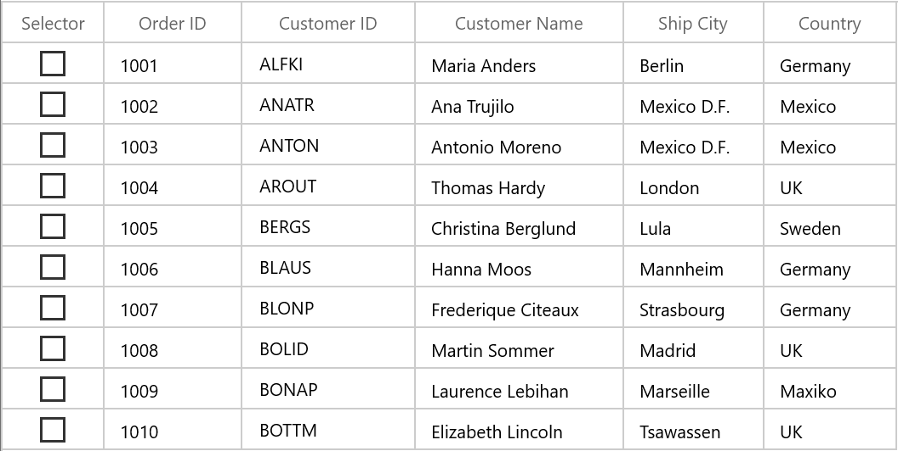
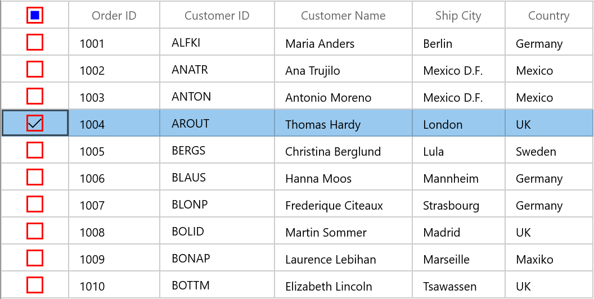

# Column Types in WinUI DataGrid

SfDataGrid provides support for various built-in column types. Each column has its own properties and renderer to handle different types of data.
 
You can also add or override existing columns and renderers as you need.

<table>
<tr>
<th>
Column Type
</th>
<th>
Renderer 
</th>
<th>
Description
</th>
</tr>
<tr>
<td>
{{'[GridTextColumn](https://help.syncfusion.com/cr/winui/Syncfusion.UI.Xaml.DataGrid.GridTextColumn.html)'| markdownify }}
</td>
<td>
{{'[GridCellTextBoxRenderer](https://help.syncfusion.com/cr/winui/Syncfusion.UI.Xaml.DataGrid.Renderers.GridCellTextBoxRenderer.html)'| markdownify }}
</td>
<td>
Use to display the string data. 
</td>
</tr>
<tr>
<td>
{{'[GridNumericColumn]'| markdownify }}
</td>
<td>
{{'[GridCellNumericRenderer]'| markdownify }}
</td>
<td>
Use to display the numeric data.
</td>
</tr>
<tr>
<td>
{{'[GridComboBoxColumn](https://help.syncfusion.com/cr/winui/Syncfusion.UI.Xaml.DataGrid.GridComboBoxColumn.html)'| markdownify }}
</td>
<td>
{{'[GridCellComboBoxRenderer](https://help.syncfusion.com/cr/winui/Syncfusion.UI.Xaml.DataGrid.Renderers.GridCellComboBoxRenderer.html)'| markdownify }}
</td>
<td>
Use to display the IEnumerable data using <code>ComboBox</code>.
</td>
</tr>
<tr>
<td>
{{'[GridCheckBoxColumn](https://help.syncfusion.com/cr/winui/Syncfusion.UI.Xaml.DataGrid.GridCheckBoxColumn.html)'| markdownify }}
</td>
<td>
{{'[GridCellCheckBoxRenderer](https://help.syncfusion.com/cr/winui/Syncfusion.UI.Xaml.DataGrid.Renderers.GridCellCheckBoxRenderer.html)'| markdownify }}
</td>
<td>
Use to display the boolean type data.
</td>
</tr>
<tr>
<td>
{{'[GridDateColumn](https://help.syncfusion.com/cr/winui/Syncfusion.UI.Xaml.DataGrid.GridDateColumn.html)'| markdownify }}
</td>
<td>
{{'[GridCellDateRenderer](https://help.syncfusion.com/cr/winui/Syncfusion.UI.Xaml.DataGrid.Renderers.GridCellDateRenderer.html)'| markdownify }}
</td>
<td>
Use to display the date value.
</td>
</tr>
<tr>
<td>
{{'[GridImageColumn](https://help.syncfusion.com/cr/winui/Syncfusion.UI.Xaml.DataGrid.GridImageColumn.html)'| markdownify }}
</td>
<td>
{{'[GridCellImageRenderer](https://help.syncfusion.com/cr/winui/Syncfusion.UI.Xaml.DataGrid.Renderers.GridCellImageRenderer.html)'| markdownify }}
</td>
<td>
Use to display the image in each row.
</td>
</tr>
<tr>
<td>
{{'[GridHyperlinkColumn](https://help.syncfusion.com/cr/winui/Syncfusion.UI.Xaml.DataGrid.GridHyperlinkColumn.html)'| markdownify }}
</td>
<td>
{{'[GridCellHyperLinkRenderer](https://help.syncfusion.com/cr/winui/Syncfusion.UI.Xaml.DataGrid.Renderers.GridCellHyperlinkRenderer.html)'| markdownify }}
</td>
<td>
Use to display the URI data.
</td>
</tr>
<tr>
<td>
{{'[GridTemplateColumn](https://help.syncfusion.com/cr/winui/Syncfusion.UI.Xaml.DataGrid.GridTemplateColumn.html)'| markdownify }}
</td>
<td>
{{'[GridCellTemplateRenderer](https://help.syncfusion.com/cr/winui/Syncfusion.UI.Xaml.DataGrid.Renderers.GridCellTemplateRenderer.html)'| markdownify }}
</td>
<td>
Use to display the custom template-specified content.
</td>
</tr>
<tr>
<td>
{{'[GridUnboundColumn](https://help.syncfusion.com/cr/winui/Syncfusion.UI.Xaml.DataGrid.GridUnboundColumn.html)'| markdownify }}
</td>
<td>
{{'[GridUnBoundCellTextBoxRenderer](https://help.syncfusion.com/cr/winui/Syncfusion.UI.Xaml.DataGrid.Renderers.GridUnboundCellTextBoxRenderer.html)'| markdownify }}
{{'[GridUnBoundCellTemplateRenderer](https://help.syncfusion.com/cr/winui/Syncfusion.UI.Xaml.DataGrid.Renderers.GridUnboundCellTemplateRenderer.html)'| markdownify }}
</td>
<td>
Use to display custom information of each record.
</td>
</tr>
<tr>
<td>
{{'[GridToggleSwitchColumn](https://help.syncfusion.com/cr/winui/Syncfusion.UI.Xaml.DataGrid.GridToggleSwitchColumn.html)'| markdownify }}
</td>
<td>
{{'[GridCellToggleSwitchRenderer](https://help.syncfusion.com/cr/winui/Syncfusion.UI.Xaml.DataGrid.Renderers.GridCellToggleSwitchRenderer.html)'| markdownify }}
</td>
<td>
Use to display the boolean data using <code>ToggleSwitch</code>.
</td>
</tr>
<tr>
<td>
{{'[GridCheckBoxSelectorColumn](https://help.syncfusion.com/cr/winui/Syncfusion.UI.Xaml.DataGrid.Renderers.GridCellCheckBoxSelectorRenderer.html)'| markdownify }}
</td>
<td>
{{'[GridCellCheckBoxSelectorRenderer](https://help.syncfusion.com/cr/winui/Syncfusion.UI.Xaml.DataGrid.Renderers.GridCellCheckBoxSelectorRenderer.html)'| markdownify }}
</td>
<td>
Selects or deselects rows based on the check box value, which is not bound with data object.
</td>
</tr>
</table>

## GridColumn

[GridColumn](https://help.syncfusion.com/cr/winui/Syncfusion.UI.Xaml.DataGrid.GridColumn.html) is an abstract class provides base functionalities for all the column types in SfDataGrid.

### Mapping column to particular property

Column can be bound to a property in data object using [GridColumn.MappingName](https://help.syncfusion.com/cr/winui/Syncfusion.UI.Xaml.Grids.GridColumnBase.html#Syncfusion_UI_Xaml_Grids_GridColumnBase_MappingName) property. In addition, it supports to format or bind different property for display and edit mode separately via [GridColumn.DisplayBinding](https://help.syncfusion.com/cr/winui/Syncfusion.UI.Xaml.Grids.GridColumnBase.html#Syncfusion_UI_Xaml_Grids_GridColumnBase_DisplayBinding) and [GridColumn.ValueBinding](https://help.syncfusion.com/cr/winui/Syncfusion.UI.Xaml.Grids.GridColumnBase.html#Syncfusion_UI_Xaml_Grids_GridColumnBase_ValueBinding).

When you set `MappingName`, `DisplayBinding` and `ValueBinding` are created based on `MappingName`, if these properties are not defined explicitly. You can use `DisplayBinding` property to format the column in display, by setting `Converter` property of `Binding`.



public class DisplayBindingConverter : IValueConverter
{
    public object Convert(object value, Type targetType, object parameter, string language)
    {
        return string.Format("{0:C2}", value);
    }

    public object ConvertBack(object value, Type targetType, object parameter, string language)
    {
        return value;
    }
}





<syncfusion:SfDataGrid x:Name="dataGrid"
                       AllowEditing="True"
                       AutoGenerateColumns="False"
                       ItemsSource="{Binding Orders}"
                       ColumnWidthMode="SizeToHeader">
    <syncfusion:SfDataGrid.Columns>
        <syncfusion:GridTextColumn  MappingName="OrderID" HeaderText="Order ID" />
        <syncfusion:GridTextColumn  MappingName="CustomerID" HeaderText="Customer ID"/>
        <syncfusion:GridTextColumn  MappingName="ShipCity" HeaderText="Ship City"/>
        <syncfusion:GridTextColumn  MappingName="Country"/>
        <syncfusion:GridTextColumn DisplayBinding="{Binding Path=UnitPrice,
                                            Converter={StaticResource converter}}"
                   HeaderText="Unit Price"
                   MappingName="UnitPrice"
                   ValueBinding="{Binding Path=UnitPrice}" />
        <syncfusion:GridTextColumn MappingName="Quantity" />
    </syncfusion:SfDataGrid.Columns>
</syncfusion:SfDataGrid>



In the below screenshot, Unit Price column display value is formatted to currency by setting `DisplayBinding` property.

By default, Columns handling the data operations (sorting and grouping) based on `MappingName` property. You can perform data operations based on `ValueBinding` by setting [GridColumn.UseBindingValue](https://help.syncfusion.com/cr/winui/Syncfusion.UI.Xaml.DataGrid.GridColumn.html#Syncfusion_UI_Xaml_DataGrid_GridColumn_UseBindingValue) to `true`, when the standard reflection not works or binding column with complex or indexer properties.

## CellTemplate in GridColumn

You can load any WinUI control in the display mode for all columns by setting [GridColumn.CellTemplate](https://help.syncfusion.com/cr/winui/Syncfusion.UI.Xaml.Grids.GridColumnBase.html#Syncfusion_UI_Xaml_Grids_GridColumnBase_CellTemplate) property. In edit mode, corresponding editor will be loaded based on column type.
 
In the below code snippet, `GridTextColumn` is loaded with `ProgressBar` and `TextBlock`. When you start editing `DoubleTextBox` will be loaded as Editor.



<syncfusion:SfDataGrid x:Name="dataGrid"
                       AllowEditing="True"
                       AutoGenerateColumns="False"
                       ItemsSource="{Binding Orders}"
                       ColumnWidthMode="SizeToHeader">
    <syncfusion:SfDataGrid.Columns>
        <syncfusion:GridTextColumn  MappingName="OrderID" HeaderText="Order ID" />
        <syncfusion:GridTextColumn  MappingName="CustomerID" HeaderText="Customer ID"/>
        <syncfusion:GridTextColumn  MappingName="ShipCity" HeaderText="Ship City"/>
        <syncfusion:GridTextColumn  MappingName="Country"/>
        <syncfusion:GridTextColumn HeaderText="Unit Price" MappingName="UnitPrice" >
            <syncfusion:GridTextColumn.CellTemplate>
            <DataTemplate>
                <Grid>
                    <ProgressBar x:Name="progressBar"
                             Height="50"
                             Background="Transparent"
                             BorderThickness="0"
                             Maximum="50"
                             Minimum="0"
                             Visibility="Visible"
                             Value="{Binding Path=UnitPrice}" />
                    <TextBlock HorizontalAlignment="Right"
                           VerticalAlignment="Center"
                           Text="{Binding Path=UnitPrice}"
                           TextAlignment="Center" />
                </Grid>
            </DataTemplate>
            </syncfusion:GridTextColumn.CellTemplate>
        </syncfusion:GridTextColumn>
        <syncfusion:GridTextColumn MappingName="Quantity" />
    </syncfusion:SfDataGrid.Columns>
</syncfusion:SfDataGrid>



`CellTemplate` is not support by `GridHyperlinkColumn`, `GridCheckboxColumn` and `GridImageColumn` columns.

### Reusing same DataTemplate for multiple columns

By default, underlying record is `DataContext` for CellTemplate. So you have to define, template for each column to display values based on `MappingName`.
 
You can use the same [DataTemplate](https://docs.microsoft.com/en-us/windows/winui/api/microsoft.ui.xaml.datatemplate?view=winui-3.0) for all columns to display value based on MappingName by setting [GridColumn.SetCellBoundValue](https://help.syncfusion.com/cr/winui/Syncfusion.UI.Xaml.Grids.GridColumnBase.html#Syncfusion_UI_Xaml_Grids_GridColumnBase_SetCellBoundValue) property to `true`.



<Page.Resources>
    <DataTemplate x:Key="cellTemplate">
        <TextBlock Margin="3,0,0,0"
                   Foreground="Red"
                   Text="{Binding Path=Value}" />
    </DataTemplate>
</Page.Resources>

<syncfusion:SfDataGrid x:Name="dataGrid"
                       AllowEditing="True"
                       AutoGenerateColumns="False"
                       ItemsSource="{Binding Orders}"
                       ColumnWidthMode="SizeToHeader">
    <syncfusion:SfDataGrid.Columns>
        <syncfusion:GridTextColumn  MappingName="OrderID" HeaderText="Order ID" CellTemplate="{StaticResource cellTemplate}" SetCellBoundValue="True" />
        <syncfusion:GridTextColumn  MappingName="CustomerID" HeaderText="Customer ID"/>
        <syncfusion:GridTextColumn  MappingName="ShipCity" HeaderText="Ship City"/>
        <syncfusion:GridTextColumn  MappingName="Country" CellTemplate="{StaticResource cellTemplate}" SetCellBoundValue="True" />
        <syncfusion:GridTextColumn HeaderText="Unit Price" MappingName="UnitPrice" />
        <syncfusion:GridTextColumn MappingName="Quantity" />
    </syncfusion:SfDataGrid.Columns>
</syncfusion:SfDataGrid>




### Setting CellTemplate based on custom logic using TemplateSelector

`GridColumn` provides support to choose different [DataTemplate](https://docs.microsoft.com/en-us/windows/winui/api/microsoft.ui.xaml.datatemplate?view=winui-3.0) based on underlying data object using [GridColumn.CellTemplateSelector](https://help.syncfusion.com/cr/winui/Syncfusion.UI.Xaml.Grids.GridColumnBase.html#Syncfusion_UI_Xaml_Grids_GridColumnBase_CellTemplateSelector) property.
  
For example, two different templates loaded alternatively in OrderID column.
 


<Application.Resources>
    <local:CustomCellTemplateSelector x:Key="cellTemplateSelector"/>
    <DataTemplate x:Key="DefaultTemplate">
        <TextBlock Foreground="Red"
                Text="{Binding Path=OrderID}"
                TextAlignment="Center" />
    </DataTemplate>
    <DataTemplate x:Key="AlternateTemplate">
        <TextBlock Foreground="Green"
                Text="{Binding Path=OrderID}"
                TextAlignment="Center" />
    </DataTemplate>
</Application.Resources>




Below code returns the `DefaultTemplate` and `AlternateTemplate` based on OrderID’s value.



public class CustomCellTemplateSelector : DataTemplateSelector
{

    protected override DataTemplate SelectTemplateCore(object item, DependencyObject container)
    {

        if (item == null)
            return null;
        var data = item as OrderInfo;

        if (data.OrderID % 2 == 0)
            return Application.Current.Resources["AlternateTemplate"] as DataTemplate;

        else
            return Application.Current.Resources["DefaultTemplate"] as DataTemplate;
    }
}



In the below code, the custom template selector set to `GridColumn.CellTemplateSelector` and set `SetCellBoundValue` to `true`.



<syncfusion:SfDataGrid  x:Name="dataGrid"
                        AutoGenerateColumns="False"
                        ItemsSource="{Binding Orders}">
    <syncfusion:SfDataGrid.Columns>
        <syncfusion:GridTextColumn CellTemplateSelector="{StaticResource cellTemplateSelector}"
                                   HeaderText="Order ID"
                                   MappingName="OrderID" />
    </syncfusion:SfDataGrid.Columns>
</syncfusion:SfDataGrid>



N> Non-Editable columns does not support `CellTemplate`.

## Data Formatting

`GridColumn` supports to format the data using [Converter](https://docs.microsoft.com/en-us/windows/winui/api/microsoft.ui.xaml.data.binding?view=winui-3.0) properties, by defining `GridColumn.DisplayBinding` and `GridColumn.ValueBinding`. `GridColumn.DisplayBinding` formats the data in display mode. `GridColumn.ValueBinding` formats the data in edit mode.

### Format column using Converter

You can format the column using `Converter` property by defining `DisplayBinding`.
 


public class CurrencyFormatConverter : IValueConverter
{
    public object Convert(object value, Type targetType, object parameter, string language)
    {
        return string.Format("{0:C2}", value);
    }

    public object ConvertBack(object value, Type targetType, object parameter, string language)
    {
        return value;
    }
}



 


<Page.Resources>
    <local:CurrencyFormatConverter x:Key="currencyFormatConverter" />
</Page.Resources>

<dataGrid:SfDataGrid x:Name="sfDataGrid"
                     AllowEditing="True"
                     ItemsSource="{Binding Orders}"
                     AutoGenerateColumns="False">
    <dataGrid:SfDataGrid.Columns>
        <dataGrid:GridTextColumn  MappingName="OrderID" HeaderText="Order ID" />
        <dataGrid:GridTextColumn  MappingName="CustomerID" HeaderText="Customer ID" />
        <dataGrid:GridTextColumn  MappingName="CustomerName" HeaderText="Customer Name" />
        <dataGrid:GridTextColumn  MappingName="ShipCity" HeaderText="Ship City" />
        <dataGrid:GridTextColumn  MappingName="Country"/>
        <dataGrid:GridTextColumn DisplayBinding="{Binding UnitPrice,
                                                           Converter={StaticResource currencyFormatConverter}}"
                                  HeaderText="Unit Price"
                                  MappingName="UnitPrice" />
    </dataGrid:SfDataGrid.Columns>
</dataGrid:SfDataGrid>




When column is auto-generated, you can set the `Converter` by handling `AutoGeneratingColumn` event.



this.sfDataGrid.AutoGeneratingColumn += SfDataGrid_AutoGeneratingColumn;

private void sfDataGrid_AutoGeneratingColumn(object sender, AutoGeneratingColumnArgs e)
{
    if (e.Column.MappingName == "UnitPrice")
    {

        if (e.Column is GridTextColumn)
        {
            e.Column = new GridTextColumn() { MappingName = "UnitPrice", HeaderText = "Unit Price" };
        }
        e.Column.DisplayBinding = new Binding() { Path = new PropertyPath(e.Column.MappingName), Converter = new CurrencyFormatConverter() };
    }
}



## Styling GridColumn

`GridColumn` support to customize the style of particular column using [GridColumn.CellStyle](https://help.syncfusion.com/cr/winui/Syncfusion.UI.Xaml.Grids.GridColumnBase.html#Syncfusion_UI_Xaml_Grids_GridColumnBase_CellStyle) property.

### Change the font setting

You can change the font settings such as `FontSize`, `FontFamily`, `FontWeight` etc. by writing style of TargetType `GridCell` or `GridColumn.CellStyle` property.



<syncfusion:SfDataGrid x:Name="dataGrid"                                                                       
                       AutoGenerateColumns="False" 
                       ItemsSource="{Binding Orders}">
    <syncfusion:SfDataGrid.Columns>
        <syncfusion:GridTextColumn MappingName="CustomerName">
            <syncfusion:GridTextColumn.CellStyle>
                
            </syncfusion:GridTextColumn.CellStyle>
        </syncfusion:GridTextColumn>
    </syncfusion:SfDataGrid.Columns>
</syncfusion:SfDataGrid>



When column is auto-generated, you can style the column by handling `AutoGeneratingColumn` event.



<Page.Resources>
    
        
</Page.Resources>





this.dataGrid.AutoGeneratingColumn += DataGrid_AutoGeneratingColumn;

private void DataGrid_AutoGeneratingColumn(object sender, Syncfusion.UI.Xaml.Grid.AutoGeneratingColumnArgs e)
{  

    if (e.Column.MappingName == "CustomerName")
        e.Column.CellStyle = this.Resources["cellStyle"] as Style;               
}



### Styles based on custom logic

You can apply the styles to columns based on certain condition using [GridColumn.CellStyleSelector](https://help.syncfusion.com/cr/winui/Syncfusion.UI.Xaml.Grids.GridColumnBase.html#Syncfusion_UI_Xaml_Grids_GridColumnBase_CellStyleSelector) property.

Below code creates two different styles by TargetType `GridCell`.



<Application.Resources>
    
    
    
    
</Application.Resources>



In the below code, returns the style based on OrderID value. Using `Container` you can format the columns data based on `GridCell`.



public class CustomCellStyleSelector: StyleSelector
{

    protected override Style SelectStyleCore(object item, DependencyObject container)
    {
        var gridCell = container as GridCell;
        var mappingName = gridCell.ColumnBase.GridColumn.MappingName;
        var record = gridCell.DataContext;
        var cellValue = record.GetType().GetProperty(mappingName).GetValue(record);

        if (mappingName.Equals("OrderID"))
        {

            if (Convert.ToInt16(cellValue) <= 1005)
                return App.Current.Resources["cellStyle1"] as Style;

            else
                return App.Current.Resources["cellStyle2"] as Style;
        }
        return base.SelectStyleCore(item, container);
    }
}



Below code, sets the customized style selector to `GridColumn.CellStyleSelector` property.



<Page.Resources>
    <local:CustomCellStyleSelector x:Key="cellStyleSelector"/>
</Page.Resources>

<syncfusion:SfDataGrid x:Name="dataGrid"
                       ItemsSource="{Binding Orders}"  
                       AutoGenerateColumns="False" >
    <syncfusion:SfDataGrid.Columns>
        <syncfusion:GridTextColumn MappingName="OrderID" CellStyleSelector="{StaticResource cellStyleSelector}">
    </syncfusion:SfDataGrid.Columns>
</syncfusion:SfDataGrid>



When column is auto-generated, you can style the column by handling `AutoGeneratingColumn` event.



this.dataGrid.AutoGeneratingColumn += DataGrid_AutoGeneratingColumn;

private void DataGrid_AutoGeneratingColumn(object sender, Syncfusion.UI.Xaml.Grid.AutoGeneratingColumnArgs e)
{

    if (e.Column.MappingName == "OrderID")
    {
        e.Column.CellStyleSelector = new CustomCellStyleSelector();
    }
}



## End-user Interaction

### Hide Column

You can hide or unhide the particular column programmatically by setting [GridColumn.IsHidden](https://help.syncfusion.com/cr/winui/Syncfusion.UI.Xaml.Grids.GridColumnBase.html#Syncfusion_UI_Xaml_Grids_GridColumnBase_IsHidden) property. For allowing end-user to hide or unhide column in UI refer [Resizing Columns](https://help.syncfusion.com/winui/datagrid/columns#resizing-columns) section.

### Disable column

You can disable column by setting [GridColumn.AllowFocus](https://help.syncfusion.com/cr/winui/Syncfusion.UI.Xaml.Grids.GridColumnBase.html#Syncfusion_UI_Xaml_Grids_GridColumnBase_AllowFocus) property. Therefore, that column can’t be selected or edited.
 
### Width, alignment and padding settings

#### Width

The width of `GridColumn` can be changed by setting [Width](https://help.syncfusion.com/cr/winui/Syncfusion.UI.Xaml.Grids.GridColumnBase.html#Syncfusion_UI_Xaml_Grids_GridColumnBase_Width) property. Column width set based on [GridColumn.MinimumWidth](https://help.syncfusion.com/cr/winui/Syncfusion.UI.Xaml.Grids.GridColumnBase.html#Syncfusion_UI_Xaml_Grids_GridColumnBase_MinimumWidth) and [GridColumn.MaximumWidth](https://help.syncfusion.com/cr/winui/Syncfusion.UI.Xaml.Grids.GridColumnBase.html#Syncfusion_UI_Xaml_Grids_GridColumnBase_MaximumWidth) properties.
 
N> If the `GridColumn.Width` is defined explicitly takes priority than `GridColumn.ColumnSizer`.

#### Padding

GridColumn allows you to the change the padding of cell content by setting [Padding](https://help.syncfusion.com/cr/winui/Syncfusion.UI.Xaml.Grids.GridColumnBase.html#Syncfusion_UI_Xaml_Grids_GridColumnBase_Padding) property.
 
#### Alignment

GridColumn allows you to change the alignment of `GridCell` and `GridHeaderCellControl` content using [TextAlignment](https://help.syncfusion.com/cr/winui/Syncfusion.UI.Xaml.Grids.GridColumnBase.html#Syncfusion_UI_Xaml_Grids_GridColumnBase_TextAlignment), [VerticalAlignment](https://help.syncfusion.com/cr/winui/Syncfusion.UI.Xaml.Grids.GridColumnBase.html#Syncfusion_UI_Xaml_Grids_GridColumnBase_VerticalAlignment) and [HorizontalHeaderContentAlignment](https://help.syncfusion.com/cr/winui/Syncfusion.UI.Xaml.Grids.GridColumnBase.html#Syncfusion_UI_Xaml_Grids_GridColumnBase_HorizontalHeaderContentAlignment) properties.

## GridTextColumnBase

[GridTextColumnBase](https://help.syncfusion.com/cr/winui/Syncfusion.UI.Xaml.DataGrid.GridTextColumnBase.html) is the abstract class derived from `GridColumn`. The following columns are derived from the `GridTextColumnBase`.

1. GridTextColumn

2. GridNumericColumn

3. GridDateColumn

4. GridTimeColumn

5. GridTemplateColumn

### GridTextColumnBase properties

* Text trimming - You can [trim](https://docs.microsoft.com/en-us/windows/winui/api/microsoft.ui.xaml.texttrimming?view=winui-3.0) the column’s data using `TextTrimming` property.
* Text wrapping - You can [wrap](https://docs.microsoft.com/en-us/windows/winui/api/microsoft.ui.xaml.textwrapping?view=winui-3.0) the column’s data using `TextWrapping` property.



<syncfusion:SfDataGrid x:Name="dataGrid"
                       AutoGenerateColumns="False"
                       ItemsSource="{Binding Orders}">
    <syncfusion:SfDataGrid.Columns>
        <syncfusion:GridTextColumn Width="60"
                                   HeaderText="Customer Name"
                                   MappingName="CustomerName"
                                   TextTrimming="CharacterEllipsis"
                                   TextWrapping="Wrap" />
    </syncfusion:SfDataGrid.Columns>
</syncfusion:SfDataGrid>



## GridTextColumn

`GridTextColumn` derived from `GridTextColumnBase` which hosts `TextBox` in edit mode.



<syncfusion:SfDataGrid x:Name="dataGrid"
                       AutoGenerateColumns="False"
                       ItemsSource="{Binding Orders}">
    <syncfusion:SfDataGrid.Columns>
        <syncfusion:GridTextColumn HeaderText="Customer Name" MappingName="CustomerName" />
    </syncfusion:SfDataGrid.Columns>
</syncfusion:SfDataGrid>



this.dataGrid.Columns.Add(new GridTextColumn()
{
    HeaderText = "Customer Name",
    MappingName = "CustomerName",                               
});



### Spell check while editing

You can enable spell check in GridTextColumn using [IsSpellCheckEnabled](https://help.syncfusion.com/cr/winui/Syncfusion.UI.Xaml.DataGrid.GridTextColumn.html#Syncfusion_UI_Xaml_DataGrid_GridTextColumn_IsSpellCheckEnabled) property.


<syncfusion:GridTextColumn HeaderText="Ship City"
                           IsSpellCheckEnabled="True"
                           MappingName="ShipCity" />


this.dataGrid.Columns.Add(new GridTextColumn() { HeaderText = "Ship City", MappingName = "ShipCity", IsSpellCheckEnabled = true });



## GridNumericColumn

`GridNumericColumn` is derived from `GridTextColumnBase` and hosts the [NumberBox](https://help.syncfusion.com/cr/winui/Syncfusion.UI.Xaml.Editors.SfNumberBox.html) in edit mode.



<syncfusion:SfDataGrid x:Name="dataGrid" 
                       ItemsSource="{Binding Orders}"
                       AutoGenerateColumns="False" 
                       AllowEditing="True" >
    <syncfusion:SfDataGrid.Columns>
        <syncfusion:GridTextColumn MappingName="CustomerID" HeaderText="Customer ID" />
        <syncfusion:GridTextColumn MappingName="CustomerName" HeaderText="Customer Name" />
        <syncfusion:GridNumericColumn MappingName="Quantity" HeaderText="Quantity" />
        <syncfusion:GridTextColumn MappingName="Country" />
        <syncfusion:GridTextColumn MappingName="ShipCity" HeaderText="Ship City" />
    </syncfusion:SfDataGrid.Columns>
</syncfusion:SfDataGrid>


this.dataGrid.Columns.Add(new GridNumericColumn()
{
    HeaderText = "Quantity",
    MappingName = "Quantity",                               
});



## Change the format of numeric value

You can format the value of a `GridNumericColumn` using the `DisplayNumberFormat` or `NumberFormatter` property. The default value of `DisplayNumberFormat` and `NumberFormatter` properties are **null**.

The following example shows how to set `PercentFormatter` for `NumberFormatter` property. 

N> To learn more about the formatting classes that can be assigned to the `NumberFormatter` property.
[Refer here](https://docs.microsoft.com/en-us/uwp/api/windows.globalization.numberformatting?view=winrt-19041#classes)



// Format numericColumn in percent
numericColumn.NumberFormatter = new PercentFormatter();



You can also set `CurrencyFormatter` and `DecimalFormatter` for `NumberFormatter` property to format the values in currency and numeric custom formats.   

Using the **N**, **C**, and **P** format values, you can apply numeric, currency, and percent custom formats in `DisplayNumberFormat` property.

N> When using both the `DisplayNumberFormat` and the `NumberFormatter` properties, the `DisplayNumberFormat` property takes high precedence. 



<syncfusion:SfDataGrid x:Name="dataGrid"                                                                       
                       AutoGenerateColumns="False" 
                       ItemsSource="{Binding Orders}"
                       AllowEditing="True" >
    <syncfusion:SfDataGrid.Columns>
        <syncfusion:GridTextColumn MappingName="CustomerID" HeaderText="Customer ID" />
        <syncfusion:GridTextColumn MappingName="CustomerName" HeaderText="Customer Name" />
        <syncfusion:GridNumericColumn x:Name="numericColumn" HeaderText="Quantity"
                                      MappingName="Quantity" DisplayNumberFormat="P2" />
        <syncfusion:GridTextColumn MappingName="Country" />
        <syncfusion:GridTextColumn MappingName="ShipCity" HeaderText="Ship City" />
    </syncfusion:SfDataGrid.Columns>
</syncfusion:SfDataGrid>


// Format numericColumn in percent
numericColumn.DisplayNumberFormat = "P2";



## Null value support

`GridNumericColumn` provides support to restrict or allow null value in columns based on `AllowNull` property. Instead of displaying null values, you can display hint text using the `PlaceholderText` property.

The `PlaceholderText` is not displayed, when the `AllowNull` is set to `false`.



<syncfusion:SfDataGrid x:Name="dataGrid" 
                       ItemsSource="{Binding Orders}"
                       AutoGenerateColumns="False"
                       AllowEditing="True" >
    <syncfusion:SfDataGrid.Columns>
        <syncfusion:GridTextColumn MappingName="CustomerID" HeaderText="Customer ID" />
        <syncfusion:GridTextColumn MappingName="CustomerName" HeaderText="Customer Name" />
        <syncfusion:GridNumericColumn MappingName="Quantity" HeaderText="Quantity" AllowNull="True" 
                                     PlaceholderText="Enter a value" />
        <syncfusion:GridTextColumn MappingName="Country" />
        <syncfusion:GridTextColumn MappingName="ShipCity" HeaderText="Ship City" />
    </syncfusion:SfDataGrid.Columns>
</syncfusion:SfDataGrid>



## Restrict value within range

You can restrict the users to enter input within a minimum and maximum range in `GridNumericColumn` using the `MinValue` and `MaxValue` properties. The default value of the `MinValue` property is **double.MinValue** and `MaxValue` property is **double.MaxValue**.



<syncfusion:SfDataGrid x:Name="dataGrid" 
                       ItemsSource="{Binding Orders}"
                       AutoGenerateColumns="False" 
                       AllowEditing="True" >
    <syncfusion:SfDataGrid.Columns>
        <syncfusion:GridNumericColumn MappingName="Quantity" HeaderText="Quantity" MinValue="30" MaxValue="200" />
    </syncfusion:SfDataGrid.Columns>
</syncfusion:SfDataGrid>



## UpDown button placement

You can increase or decrease the value of the `GridNumericColumn` using the up-down button. By default, the value of `UpDownPlacementMode` property is **Hidden**. You can change the up-down button position by assigning the value `UpDownPlacementMode` property as **Inline** or **Compact**.



<syncfusion:SfDataGrid x:Name="dataGrid" 
                       ItemsSource="{Binding Orders}"
                       AutoGenerateColumns="False" 
                       AllowEditing="True" >
    <syncfusion:SfDataGrid.Columns>
        <syncfusion:GridNumericColumn MappingName="Quantity" HeaderText="Quantity" UpDownPlacementMode="InLine" />
    </syncfusion:SfDataGrid.Columns>
</syncfusion:SfDataGrid>



## GridDateColumn

[GridDateColumn](https://help.syncfusion.com/cr/winui/Syncfusion.UI.Xaml.DataGrid.GridDateColumn.html) derived from `GridTextColumnBase` and it displays columns data as date. It hosts [SfCalendarDatePicker](https://help.syncfusion.com/cr/winui/Syncfusion.UI.Xaml.Calendar.SfCalendarDatePicker.html) element in editing mode.



<syncfuion:SfDataGrid x:Name="dataGrid" 
                       ItemsSource="{Binding Orders}"
                       AutoGenerateColumns="False" 
                      ColumnWidthMode="Star"
                       AllowEditing="True" >
    <syncfuion:SfDataGrid.Columns>
        <syncfuion:GridTextColumn MappingName="OrderID" HeaderText="Order ID" />
        <syncfuion:GridTextColumn MappingName="CustomerID" HeaderText="Customer ID" />
        <syncfuion:GridTextColumn MappingName="CustomerName" HeaderText="Customer Name" />
        <syncfuion:GridTextColumn MappingName="Country" />
        <syncfuion:GridTextColumn MappingName="ShipCity" HeaderText="Ship City" />
        <syncfuion:GridDateColumn MappingName="Date" />
    </syncfuion:SfDataGrid.Columns>
</syncfuion:SfDataGrid>


this.dataGrid.Columns.Add(new GridDateColumn() { HeaderText = "Date", MappingName = "Date" });



### Change the Format of date value

You can edit and display the selected date with various formatting like date, month and year formats by using the [DisplayDateFormat](https://help.syncfusion.com/cr/winui/Syncfusion.UI.Xaml.DataGrid.GridDateColumn.html#Syncfusion_UI_Xaml_DataGrid_GridDateColumn_DisplayDateFormat) property. The default value of `DisplayDateFormat` property is **d**. For example below image shown the DateColumn with `DisplayDateFormat` as **M**.



<syncfuion:SfDataGrid x:Name="dataGrid" 
                       ItemsSource="{Binding Orders}"
                       AutoGenerateColumns="False" 
                       ColumnWidthMode="Star"
                       AllowEditing="True" >
    <syncfuion:SfDataGrid.Columns>
        <syncfuion:GridTextColumn MappingName="OrderID" HeaderText="Order ID" />
        <syncfuion:GridTextColumn MappingName="CustomerID" HeaderText="Customer ID" />
        <syncfuion:GridTextColumn MappingName="CustomerName" HeaderText="Customer Name" />
        <syncfuion:GridTextColumn MappingName="Country" />
        <syncfuion:GridTextColumn MappingName="ShipCity" HeaderText="Ship City" />
        <syncfuion:GridDateColumn MappingName="Date" DisplayDateFormat="M" />
    </syncfuion:SfDataGrid.Columns>
</syncfuion:SfDataGrid>


this.dataGrid.Columns.Add(new GridDateColumn() { HeaderText = "Date", MappingName = "Date" , DisplayDateFormat="M" });



### Null value support

`GridDateColumn` provides support to restrict or allow null value in columns based on [AllowNull](https://help.syncfusion.com/cr/winui/Syncfusion.UI.Xaml.DataGrid.GridDateColumn.html#Syncfusion_UI_Xaml_DataGrid_GridDateColumn_AllowNull) property. Instead of displaying null values, you can display hint text using [PlaceholderText](https://help.syncfusion.com/cr/winui/Syncfusion.UI.Xaml.DataGrid.GridDateColumn.html#Syncfusion_UI_Xaml_DataGrid_GridDateColumn_PlaceholderText) property.

The `PlaceholderText` does not shown, when the `AllowNull` is `false`.



<syncfuion:SfDataGrid x:Name="dataGrid" 
                       ItemsSource="{Binding Orders}"
                       AutoGenerateColumns="False" 
                       ColumnWidthMode="Star"
                       AllowEditing="True" >
    <syncfuion:SfDataGrid.Columns>
        <syncfuion:GridTextColumn MappingName="OrderID" HeaderText="Order ID" />
        <syncfuion:GridTextColumn MappingName="CustomerID" HeaderText="Customer ID" />
        <syncfuion:GridTextColumn MappingName="CustomerName" HeaderText="Customer Name" />
        <syncfuion:GridTextColumn MappingName="Country" />
        <syncfuion:GridTextColumn MappingName="ShipCity" HeaderText="Ship City" />
        <syncfuion:GridDateColumn MappingName="Date" AllowNull="True" PlaceholderText="Change the date" />
    </syncfuion:SfDataGrid.Columns>
</syncfuion:SfDataGrid>




### Setting date value range

You can restrict and display the input value within the range using [MinDate](https://help.syncfusion.com/cr/winui/Syncfusion.UI.Xaml.DataGrid.GridDateColumn.html#Syncfusion_UI_Xaml_DataGrid_GridDateColumn_MinDate) and [MaxDate](https://help.syncfusion.com/cr/winui/Syncfusion.UI.Xaml.DataGrid.GridDateColumn.html#Syncfusion_UI_Xaml_DataGrid_GridDateColumn_MaxDate) properties.

## GridCheckBoxColumn

`GridCheckBoxColumn` derived from `GridColumn` and it used display and edit `Boolean` type data. It hosts `CheckBox` element as `GridCell` content.



<syncfusion:SfDataGrid x:Name="dataGrid"                                                                       
                       AutoGenerateColumns="False" 
                       ItemsSource="{Binding Orders}">
    <syncfusion:SfDataGrid.Columns>
        <syncfusion:GridCheckBoxColumn HeaderText="Is Delivered" MappingName="IsDelivered" />
    </syncfusion:SfDataGrid.Columns>
</syncfusion:SfDataGrid>


this.dataGrid.Columns.Add(new GridCheckBoxColumn() { HeaderText = "Is Delivered", MappingName = "IsDelivered" });



`GridCheckBoxColumn` allows you to customize check box state and its alignment.

* [IsThreeState](https://help.syncfusion.com/cr/winui/Syncfusion.UI.Xaml.DataGrid.GridCheckBoxColumn.html#Syncfusion_UI_Xaml_DataGrid_GridCheckBoxColumn_IsThreeState) - By default, the `GridCheckBoxColumn` has `Checked` and `Unchecked` state. You can enable another `Intermediate` state setting `IsThreeState` property to `true`.

* [HorizontalAlignment](https://help.syncfusion.com/cr/winui/Syncfusion.UI.Xaml.DataGrid.GridCheckBoxColumn.html#Syncfusion_UI_Xaml_DataGrid_GridCheckBoxColumn_HorizontalAlignment) - You can change the horizontal alignment of CheckBox using `HorizontalAlignment` property.

## GridTemplateColumn

`GridTemplateColumn` derived from `GridTextColumnBase` and it displays the template-specified cell content. You can load any WinUI control in the display mode for all columns by setting [CellTemplate](https://help.syncfusion.com/cr/winui/Syncfusion.UI.Xaml.Grids.GridColumnBase.html#Syncfusion_UI_Xaml_Grids_GridColumnBase_CellTemplate) and [EditTemplate](https://help.syncfusion.com/cr/winui/Syncfusion.UI.Xaml.DataGrid.GridTemplateColumn.html#Syncfusion_UI_Xaml_DataGrid_GridTemplateColumn_EditTemplate) properties.



<syncfusion:SfDataGrid x:Name="dataGrid"                                                                       
                       AutoGenerateColumns="False" 
                       ItemsSource="{Binding Orders}">
    <syncfusion:SfDataGrid.Columns>
        <syncfusion:GridTemplateColumn MappingName="CustomerID">           
            <syncfusion:GridTemplateColumn.CellTemplate>
                <DataTemplate>
                    <TextBlock Text="{Binding CustomerID}" />
                </DataTemplate>
            </syncfusion:GridTemplateColumn.CellTemplate>
            <syncfusion:GridTemplateColumn.EditTemplate>
                <DataTemplate>
                    <TextBox Text="{Binding CustomerID, Mode=TwoWay}" />
                </DataTemplate>
            </syncfusion:GridTemplateColumn.EditTemplate>        
            </syncfusion:GridTemplateColumn>       
    </syncfusion:SfDataGrid.Columns>
</syncfusion:SfDataGrid>


StringBuilder sb1 = new StringBuilder();
sb1.Append("<DataTemplate xmlns=\"http://schemas.microsoft.com/winfx/2006/xaml/presentation\">");          
sb1.Append("<TextBlock Text=\"{Binding CustomerID}\" />");                       
sb1.Append("</DataTemplate>");
DataTemplate cellTemplate = (DataTemplate)XamlReader.Load(sb1.ToString());

StringBuilder sb2 = new StringBuilder();
sb2.Append("<DataTemplate xmlns=\"http://schemas.microsoft.com/winfx/2006/xaml/presentation\">");
sb2.Append("<TextBox Text=\"{Binding CustomerID, Mode=TwoWay}\" />");
sb2.Append("</DataTemplate>");
DataTemplate editTemplate = (DataTemplate)XamlReader.Load(sb2.ToString());

this.dataGrid.Columns.Add(new GridTemplateColumn() { MappingName = "IsClosed", CellTemplate = cellTemplate, EditTemplate = editTemplate });



### Binding CellTemplate and EditTemplate based on MappingName

By default, underlying record is `DataContext` for CellTemplate. So you have to define, template for each column to display values based on `MappingName`.
 
You can use the same [DataTemplate](https://docs.microsoft.com/en-us/windows/winui/api/microsoft.ui.xaml.datatemplate?view=winui-3.0) for all columns to display value based on MappingName by setting [SetCellBoundValue](https://help.syncfusion.com/cr/winui/Syncfusion.UI.Xaml.Grids.GridColumnBase.html#Syncfusion_UI_Xaml_Grids_GridColumnBase_SetCellBoundValue) property to `true`.

N> EditTemplate support available only for GridTemplateColumn.



<syncfusion:SfDataGrid x:Name="dataGrid"                                                                       
                       AutoGenerateColumns="False" 
                       ItemsSource="{Binding Orders}">
    <syncfusion:SfDataGrid.Columns>
        <syncfusion:GridTemplateColumn MappingName="OrderID" SetCellBoundValue="True">
            <syncfusion:GridTemplateColumn.CellTemplate>
                <DataTemplate>
                    <Grid>
                        <TextBlock Text="{Binding Value}" />
                    </Grid>
                </DataTemplate>
            </syncfusion:GridTemplateColumn.CellTemplate>
            <syncfusion:GridTemplateColumn.EditTemplate>
                <DataTemplate>
                    <Grid>
                        <TextBox Text="{Binding Value}" />
                    </Grid>
                </DataTemplate>
            </syncfusion:GridTemplateColumn.EditTemplate>
        </syncfusion:GridTemplateColumn>
    </syncfusion:SfDataGrid.Columns>
</syncfusion:SfDataGrid>



### Sets EditTemplate based on custom logic

`GridTemplateColumn` provides support to load different edit elements based on underlying data object using [GridTemplateColumn.EditTemplateSelector](https://help.syncfusion.com/cr/winui/Syncfusion.UI.Xaml.DataGrid.GridTemplateColumn.html#Syncfusion_UI_Xaml_DataGrid_GridTemplateColumn_EditTemplateSelector) property.

Below code returns the `DefaultTemplate` and `AlternateTemplate` based on OrderID’s value.



<DataTemplate x:Key="DefaultCellTemplate">
    <TextBlock VerticalAlignment="Center"
               Foreground="Red"
               Text="{Binding Path=OrderID}"
               TextAlignment="Center" />
</DataTemplate>

<DataTemplate x:Key="AlternateCellTemplate">
    <TextBlock VerticalAlignment="Center"
               Foreground="Green"
               Text="{Binding Path=OrderID}"
               TextAlignment="Center" />
</DataTemplate>

<DataTemplate x:Key="DefaultEditTemplate">
    <TextBox Height="45"
             VerticalAlignment="Center"
             Foreground="Red"
             Text="{Binding Path=OrderID}"
             TextAlignment="Center" />
</DataTemplate>

<DataTemplate x:Key="AlternateEditTemplate">
    <TextBox Height="45"
             VerticalAlignment="Center"
             Foreground="Green"
             Text="{Binding Path=OrderID}"
             TextAlignment="Center" />
</DataTemplate>





public class CustomEditTemplateSelector: DataTemplateSelector
{
 
    protected override DataTemplate SelectTemplateCore(object item, DependencyObject container)
    {
 
        if (item == null)
            return null;

        var data = item as OrderInfo;
 
        if (data.OrderID % 2 == 0)
            return Appliaction.Current.Resources["AlternateEditTemplate"] as DataTemplate;
 
        else
            return Application.Current.Resources["DefaultEditTemplate"] as DataTemplate;
    }
}



In the below code, custom template selector set to `GridTemplateColumn.EditTemplateSelector`.



<Page.Resources>    
    <local:CustomEditTemplateSelector x:Key="cellTemplateSelector" />
    <local:CustomEditTemplateSelector x:Key="editTemplateSelector" />
</Page.Resources>

<syncfusion:SfDataGrid x:Name="dataGrid"                                                                       
                       AutoGenerateColumns="False" 
                       ItemsSource="{Binding Orders}">
    <syncfusion:SfDataGrid.Columns>
        <syncfusion:GridTemplateColumn MappingName="OrderID"
                                       CellTemplateSelector="{StaticResource cellTemplateSelector}"
                                       EditTemplateSelector="{StaticResource editTemplateSelector}"/>
    </syncfusion:SfDataGrid.Columns>
</syncfusion:SfDataGrid>



## GridComboBoxColumn

`GridComboBoxColumn` derived from `GridColumn` which hosts `ComboBox` as edit element. The data source to ComboBox can be set by using [GridComboBoxColumn.ItemsSource](https://help.syncfusion.com/cr/winui/Syncfusion.UI.Xaml.DataGrid.GridComboBoxColumn.html#Syncfusion_UI_Xaml_DataGrid_GridComboBoxColumn_ItemsSource) property.

By default, `GridComboBoxColumn` displays the value using `MappingName` property. You can set [DisplayMemberPath](https://help.syncfusion.com/cr/winui/Syncfusion.UI.Xaml.DataGrid.GridComboBoxColumn.html#Syncfusion_UI_Xaml_DataGrid_GridComboBoxColumn_DisplayMemberPath) which denotes the path to a value on the source object (GridComboBoxColumn.ItemsSource) to serve as the visual representation of object. You can set the [SelectedValuePath](https://help.syncfusion.com/cr/winui/Syncfusion.UI.Xaml.DataGrid.GridComboBoxColumn.html#Syncfusion_UI_Xaml_DataGrid_GridComboBoxColumn_SelectedValuePath) which denotes the path to get the SelectedValue from the SelectedItem. 



<syncfusion:SfDataGrid x:Name="dataGrid"                                                                       
                       AutoGenerateColumns="False" 
                       ItemsSource="{Binding Orders}">
                       
    <syncfusion:SfDataGrid.Columns> 
        <syncfusion:GridComboBoxColumn  HeaderText="Customer ID"
                                        ItemsSource="{Binding ComboItems, Source={StaticResource viewModel}}"
                                        MappingName=" Customer ID " />
    </syncfusion:SfDataGrid.Columns> 
</syncfusion:SfDataGrid>


this.dataGrid.Columns.Add(new GridComboBoxColumn() { HeaderText = " Customer ID ", MappingName = " Customer ID ", ItemsSource = viewModel.ComboItems });



SfDataGrid triggers, [CurrentCellDropDownSelectionChanged](https://help.syncfusion.com/cr/winui/Syncfusion.UI.Xaml.DataGrid.SfDataGrid.html#Syncfusion_UI_Xaml_DataGrid_SfDataGrid_CurrentCellDropDownSelectionChanged) event, when the SelectedValue is changed. [CurrentCellDropDownSelectionChangedEventArgs](https://help.syncfusion.com/cr/winui/Syncfusion.UI.Xaml.Grids.CurrentCellDropDownSelectionChangedEventArgs.html#Syncfusion_UI_Xaml_Grids_CurrentCellDropDownSelectionChangedEventArgs__ctor_System_Object_) of `CurrentCellDropDownSelectionChanged` event provides the information about the changed cell value.

`SelectedIndex` property returns the index of selected item.
`SelectedItem` property returns the selected item from drop down list.

### Improving dropdown opening time

You can improve the drop-down opening time on loading by setting [VirtualizingStackPanel](https://docs.microsoft.com/en-us/windows/winui/api/microsoft.ui.xaml.controls.virtualizingstackpanel?view=winui-3.0) as [ItemsPanelTemplate](https://docs.microsoft.com/en-us/windows/winui/api/microsoft.ui.xaml.controls.itemspaneltemplate?view=winui-3.0) of `ComboBox`, when the large number of items loaded in it.



<Page.Resources>
    
</Page.Resources>



### Opening dropdown popup in single-click

You can open the drop down within single click by setting [ComboBox.IsDropDownOpen](https://docs.microsoft.com/en-us/windows/winui/api/microsoft.ui.xaml.controls.combobox?view=winui-3.0) property to `true` in `OnEditElementLoaded` method by overriding existing renderer.

Below code, creates `GridCellComboBoxRendererExt` to set `IsDropDownOpen` property. Replace the default renderer with created renderer in `SfDataGrid.CellRenderers` collection.



this.dataGrid.CellRenderers.Remove("ComboBox");
this.dataGrid.CellRenderers.Add("ComboBox", new GridCellComboBoxRendererExt());

public class GridCellComboBoxRendererExt: GridCellComboBoxRenderer
{

    protected override void OnEditElementLoaded(object sender, Windows.UI.Xaml.RoutedEventArgs e)
    {
        (sender as ComboBox).IsDropDownOpen = true;
        base.OnEditElementLoaded(sender, e);
    }
}



N> This is applicable when the `SfDataGrid.EditTrigger` is set as `OnTap`.

## GridHyperlinkColumn

`GridHyperlinkColumn` derived from `GridTextColumn` and it displays columns data as hyperlink. It hosts `HyperlinkButton` element as `GridCell` content.



<syncfusion:SfDataGrid x:Name="dataGrid"                                                                       
                       AutoGenerateColumns="False" 
                       ItemsSource="{Binding Orders}">
    <syncfusion:SfDataGrid.Columns>
        <syncfusion:GridHyperlinkColumn HeaderText="Country" MappingName="Country" />
    </syncfusion:SfDataGrid.Columns>
</syncfusion:SfDataGrid>


this.dataGrid.Columns.Add(new GridHyperlinkColumn() { HeaderText = "Country", MappingName = "Country" });



You can allow end-user to navigate the `Uri` when the cell value contains valid `Uri` address or using [CurrentCellRequestNavigate](https://help.syncfusion.com/cr/winui/Syncfusion.UI.Xaml.DataGrid.SfDataGrid.html#Syncfusion_UI_Xaml_DataGrid_SfDataGrid_CurrentCellRequestNavigate) event. The `CurrentCellRequestNavigate` occurs when the current cell in `GridHyperlinkColumn` is clicked for navigation.
  
[CurrentCellRequestNavigateEventArgs](https://help.syncfusion.com/cr/winui/Syncfusion.UI.Xaml.Grids.CurrentCellRequestNavigateEventArgs.html) of `CurrentCellRequestNavigate` event provide information about the hyperlink triggered this event. `CurrentCellRequestNavigateEventArgs.NavigateText` returns the value using `ValueBinding` or `MappingName` to navigate.



this.dataGrid.CurrentCellRequestNavigate += DataGrid_CurrentCellRequestNavigate;   
                             
private void DataGrid_CurrentCellRequestNavigate(object sender, CurrentCellRequestNavigateEventArgs args)
{
    var URI = string.Format("https://en.wikipedia.org/wiki/" + args.NavigateText);
    Windows.System.Launcher.LaunchUriAsync(new Uri(URI));          
}



### Cancel the navigation

You can cancel the navigation when clicking hyperlink by setting [CurrentCellRequestNavigateEventArgs.Handled](https://help.syncfusion.com/cr/winui/Syncfusion.UI.Xaml.Grids.CurrentCellRequestNavigateEventArgs.html#Syncfusion_UI_Xaml_Grids_CurrentCellRequestNavigateEventArgs_Handled) to `false`.
 


this.dataGrid.CurrentCellRequestNavigate += dataGrid_CurrentCellRequestNavigate;

void dataGrid_CurrentCellRequestNavigate(object sender, CurrentCellRequestNavigateEventArgs args)
{
    args.Handled = true;
}



### Customize Hyperlink

#### Change the alignment

You can change the horizontal alignment of `GridHyperlinkColumn` using [HorizontalAlignment](https://help.syncfusion.com/cr/winui/Syncfusion.UI.Xaml.DataGrid.GridHyperlinkColumn.html#Syncfusion_UI_Xaml_DataGrid_GridHyperlinkColumn_HorizontalAlignment) property.

#### Change the foreground color

You can change the foreground color of `GridHyperlinkColumn` by writing the style with target type `HyperlinkButton`.







## GridImageColumn

`GridImageColumn` derived from `GridColumn` and it displays columns data as Image. It hosts `Image` element as `GridCell` content.



<syncfusion:SfDataGrid x:Name="dataGrid"
                       AutoGenerateColumns="False" 
                       ItemsSource="{Binding Orders}">
    <syncfusion:SfDataGrid.Columns>
        <syncfusion:GridImageColumn MappingName="ImageLink"
                                    HeaderText="Flag"
                                    Stretch="Uniform"
                                    TextAlignment="Center" />
    </syncfusion:SfDataGrid.Columns>
</syncfusion:SfDataGrid>


this.dataGrid.Columns.Add(new GridImageColumn() { HeaderText = "Flag", MappingName = "ImageLink", Stretch = Stretch.Uniform });



### Read image from path using ValueBinding

You can use converter to read image from resource by setting `Converter` in `ValueBinding` definition.

Below code, returns the `Image URI` using `ValueBinding` property.



class StringToImageConverter : IValueConverter
{
    public object Convert(object value, Type targetType, object parameter, string language)
    {
        if (value != null)
        {
            string imagename = value as string;
            return new Uri("ms-appx:///Image/" + imagename, UriKind.Absolute);
        }
        return null;
    }

    public object ConvertBack(object value, Type targetType, object parameter, string language)
    {
        return null;
    }
}





<Page.Resources>
    <local:StringToImageConverter x:Key="stringToImageConverter" />
</Page.Resources>

<Grid>
    <syncfusion:SfDataGrid x:Name="dataGrid"
                           AllowEditing="True"
                           AutoGenerateColumns="False"
                           ItemsSource="{Binding Orders}"
                           ColumnWidthMode="SizeToHeader">
        <syncfusion:SfDataGrid.Columns>
            <syncfusion:GridTextColumn  MappingName="OrderID" HeaderText="Order ID" />
            <syncfusion:GridComboBoxColumn  HeaderText="Customer ID" MappingName="CustomerID" />
            <syncfusion:GridTextColumn  MappingName="CustomerName" HeaderText="Customer Name"/>
            <syncfusion:GridTextColumn  MappingName="ShipCity" HeaderText="Ship City" />
            <syncfusion:GridImageColumn MappingName="ImageLink" HeaderText="Flag" TextAlignment="Center" ImageHeight="50" ImageWidth="50"
                                        ValueBinding="{Binding Path=ImageLink, Converter={StaticResource stringToImageConverter}}" />
            <syncfusion:GridHyperlinkColumn  MappingName="Country" />
        </syncfusion:SfDataGrid.Columns>
    </syncfusion:SfDataGrid>
</Grid>


this.dataGrid.Columns.Add(new GridImageColumn() { HeaderText = "Flag", MappingName = "Country", ValueBinding = new Binding() { Path = new PropertyPath("Country"), Converter = new StringToImageConverter() }, TextAlignment = TextAlignment.Center, Stretch = Stretch.Uniform });



### Customize Image

`GridImageColumn` allows you to customize the image with below properties.

* `Width and Height` - You can change the height and width of the image using [GridImageColumn.ImageHeight](https://help.syncfusion.com/cr/winui/Syncfusion.UI.Xaml.DataGrid.GridImageColumn.html#Syncfusion_UI_Xaml_DataGrid_GridImageColumn_ImageHeight) and [GridImageColumn.ImageWidth](https://help.syncfusion.com/cr/winui/Syncfusion.UI.Xaml.DataGrid.GridImageColumn.html#Syncfusion_UI_Xaml_DataGrid_GridImageColumn_ImageWidth) properties.

* [Stretch](https://help.syncfusion.com/cr/winui/Syncfusion.UI.Xaml.DataGrid.GridImageColumn.html#Syncfusion_UI_Xaml_DataGrid_GridImageColumn_Stretch) - The image can be stretch by setting `Stretch` property.

* [Scale](https://docs.microsoft.com/en-us/windows/winui/api/microsoft.ui.xaml.controls.stretchdirection?view=winui-3.0) - You can scale the image using [StretchDirection](https://help.syncfusion.com/cr/winui/Syncfusion.UI.Xaml.DataGrid.GridImageColumn.html#Syncfusion_UI_Xaml_DataGrid_GridImageColumn_StretchDirection) property.

## GridToggleSwitchColumn

[GridToggleSwitchColumn](https://help.syncfusion.com/cr/winui/Syncfusion.UI.Xaml.DataGrid.GridToggleSwitchColumn.html) derived from [GridColumn](https://help.syncfusion.com/cr/winui/Syncfusion.UI.Xaml.DataGrid.GridColumn.html) and it is used to display `Boolean` type data. It hosts [ToggleSwitch](https://docs.microsoft.com/en-us/windows/winui/api/microsoft.ui.xaml.controls.toggleswitch?view=winui-3.0) element as [GridCell](https://help.syncfusion.com/cr/winui/Syncfusion.UI.Xaml.DataGrid.GridCell.html) content.



<syncfusion:SfDataGrid x:Name="sfDataGrid"
                       AutoGenerateColumns="False"
                       AllowEditing="True"
                       ItemsSource="{Binding OrderInfoCollection}">
    <syncfusion:SfDataGrid.Columns>
        <syncfusion:GridToggleSwitchColumn HeaderText="IsDelivered" MappingName="IsDelivered"/>
    </syncfusion:SfDataGrid.Columns>
</syncfusion:SfDataGrid>


this.sfDataGrid.Columns.Add(new GridToggleSwitchColumn() { MappingName = "IsDelivered", HeaderText = "IsDelivered" });



### ToggleSwitch Content Settings

GridToggleSwitchColumn provides support to display the text, while ToggleSwitch is in `ON`/`OFF` state based on [OnContent](https://help.syncfusion.com/cr/winui/Syncfusion.UI.Xaml.DataGrid.GridToggleSwitchColumn.html#Syncfusion_UI_Xaml_DataGrid_GridToggleSwitchColumn_OnContent) and [OffContent](https://help.syncfusion.com/cr/winui/Syncfusion.UI.Xaml.DataGrid.GridToggleSwitchColumn.html#Syncfusion_UI_Xaml_DataGrid_GridToggleSwitchColumn_OffContent) properties.

## GridCheckBoxSelectorColumn

`SfDataGrid` allows you to select or deselect individual rows through `CheckBox` using the [GridCheckBoxSelectorColumn](https://help.syncfusion.com/cr/winui/Syncfusion.UI.Xaml.DataGrid.GridCheckBoxSelectorColumn.html), which is not bound with data object from underlying data source, and it can be added like normal columns. The selector column supports row selection alone, and selection in selector column works based on [SelectionMode](https://help.syncfusion.com/cr/winui/Syncfusion.UI.Xaml.Grids.SfGridBase.html#Syncfusion_UI_Xaml_Grids_SfGridBase_SelectionMode).



<syncfusion:SfDataGrid x:Name="dataGrid"                                                                       
                       AutoGenerateColumns="False" 
                       ItemsSource="{Binding Orders}">
      <syncfusion:SfDataGrid.Columns>
            <syncfusion:GridCheckBoxSelectorColumn MappingName="SelectorColumn" 
                                                   Width="50"/>
      </syncfusion:SfDataGrid.Columns>
</syncfusion:SfDataGrid>


this.dataGrid.Columns.Add(new GridCheckBoxSelectorColumn() 
{ 
       MappingName = "SelectorColumn", 
       Width = 50 
});



By default, check box is displayed in header of selector column, which is used to select or deselect all the rows in the datagrid.

### Text on column header

You can display text instead of check box in header of selector column by setting the [AllowCheckBoxOnHeader](https://help.syncfusion.com/cr/winui/Syncfusion.UI.Xaml.DataGrid.GridCheckBoxSelectorColumn.html#Syncfusion_UI_Xaml_DataGrid_GridCheckBoxSelectorColumn_AllowCheckBoxOnHeader) property to `False`.



<syncfusion:SfDataGrid x:Name="dataGrid"                                                                       
                       AutoGenerateColumns="False" 
                       ItemsSource="{Binding Orders}">
      <syncfusion:SfDataGrid.Columns>
            <syncfusion:GridCheckBoxSelectorColumn MappingName="SelectorColumn"
                                                   AllowCheckBoxOnHeader="False"
                                                   HeaderText="Selector" 
                                                   Width="70"/>         
      </syncfusion:SfDataGrid.Columns>
</syncfusion:SfDataGrid>


this.dataGrid.Columns.Add(new GridCheckBoxSelectorColumn() 
{ 
       HeaderText = "Selector", 
       MappingName = "SelectorColumn", 
       AllowCheckBoxOnHeader = false , 
       Width = 70 
});



### Styling selector column

The style of check box in record cells and header can be customized by changing the default template of check box.



<syncfusion:SfDataGrid x:Name="dataGrid"                                                                       
                       AutoGenerateColumns="False" 
                       ItemsSource="{Binding Orders}">
    <syncfusion:SfDataGrid.Columns>
        <syncfusion:GridCheckBoxSelectorColumn MappingName="SelectorColumn"
                                               Width="80"/>
        </syncfusion:SfDataGrid.Columns>
     
    <Syncfusion:SfDataGrid.Resources>
        
            </Syncfusion:SfDataGrid.Resources>
</syncfusion:SfDataGrid>




### Limitations

The following are the limitations of GridCheckBoxSelectorColumn:

* Selector column does not support cell selection.
* Selector column does not support data operations like sorting, filtering, and grouping.
* Selector column will be excluded in operations like printing and exporting.
* Selector column does not have filter row support.

## Custom column support

SfDataGrid allows you to create your own column by overriding predefined column type or creating a new custom column.

### Customize column renderer

SfDataGrid allows you to customize the column related operations like key navigation and UI related interactions by overriding the corresponding renderer associated with the column. Each column has its own renderer with set of virtual methods for handling the column level operations.
 
Below table lists the available cell types for columns and its renderers.

<table>
<tr>
<th>
Column Name
</th>
<th>
Renderer 
</th>
<th>
Cell Type
</th>
</tr>
<tr>
<td>
GridTextColumn
</td>
<td>
{{'[GridCellTextBoxRenderer](https://help.syncfusion.com/cr/winui/Syncfusion.UI.Xaml.DataGrid.Renderers.GridCellTextBoxRenderer.html)'| markdownify }}
</td>
<td>
TextBox
</td>
</tr>
<tr>
<td>
GridCheckBoxColumn
</td>
<td>
{{'[GridCellCheckBoxRenderer](https://help.syncfusion.com/cr/winui/Syncfusion.UI.Xaml.DataGrid.Renderers.GridCellCheckBoxRenderer.html)'| markdownify }}
</td>
<td>
CheckBox
</td>
</tr>
<tr>
<td>
GridTemplateColumn
</td>
<td>
{{'[GridCellTemplateRenderer](https://help.syncfusion.com/cr/winui/Syncfusion.UI.Xaml.DataGrid.Renderers.GridCellTemplateRenderer.html)'| markdownify }}
</td>
<td>
Template
</td>
</tr>
<tr>
<td>
GridImageColumn
</td>
<td>
{{'[GridCellImageRenderer](https://help.syncfusion.com/cr/winui/Syncfusion.UI.Xaml.DataGrid.Renderers.GridCellImageRenderer.html)'| markdownify }}
</td>
<td>
Image
</td>
</tr>
<tr>
<td>
GridUnBoundColumn
</td>
<td>
{{'[GridUnBoundCellTextBoxRenderer](https://help.syncfusion.com/cr/winui/Syncfusion.UI.Xaml.DataGrid.Renderers.GridUnboundCellTextBoxRenderer.html)'| markdownify }}
{{'[GridUnBoundCellTemplateRenderer](https://help.syncfusion.com/cr/winui/Syncfusion.UI.Xaml.DataGrid.Renderers.GridUnboundCellTemplateRenderer.html)'| markdownify }}
</td>
<td>
UnBoundTextColumn
UnBoundTemplateColumn
</td>
</tr>
<tr>
<td>
GridComboBoxColumn
</td>
<td>
{{'[GridCellComboBoxRenderer](https://help.syncfusion.com/cr/winui/Syncfusion.UI.Xaml.DataGrid.Renderers.GridCellComboBoxRenderer.html)'| markdownify }}
</td>
<td>
ComboBox
</td>
</tr>
<tr>
<td>
GridHyperlinkColumn
</td>
<td>
{{'[GridCellHyperLinkRenderer](https://help.syncfusion.com/cr/winui/Syncfusion.UI.Xaml.DataGrid.Renderers.GridCellHyperlinkRenderer.html)'| markdownify }}
</td>
<td>
HyperlinkButton
</td>
</tr>
<tr>
<td>
GridCheckBoxSelectorColumn
</td>
<td>
{{'[GridCellCheckBoxSelectorRenderer](https://help.syncfusion.com/cr/winui/Syncfusion.UI.Xaml.DataGrid.Renderers.GridCellCheckBoxSelectorRenderer.html)'| markdownify }}
</td>
<td>
Selector
</td>
</tr>
</table>

Below code, creates the `GridCellTextBoxRendererExt` to change the fore ground of CustomerID column and replacing created renderer to `CellRenderers`.



this.dataGrid.CellRenderers.Remove("TextBox");
this.dataGrid.CellRenderers.Add("TextBox", new GridCellTextBoxRendererExt());

public class GridCellTextBoxRendererExt: GridCellTextBoxRenderer
{

    public override void OnInitializeDisplayElement(DataColumnBase dataColumn, TextBlock uiElement, object dataContext)
    {
        base.OnInitializeDisplayElement(dataColumn, uiElement, dataContext);

        if (dataColumn.GridColumn.MappingName.Equals("CustomerID"))
            uiElement.Foreground = new SolidColorBrush(Colors.Blue);
    }

    public override void OnUpdateDisplayBinding(DataColumnBase dataColumn, TextBlock uiElement, object dataContext)
    {
        base.OnUpdateDisplayBinding(dataColumn, uiElement, dataContext);

        if (dataColumn.GridColumn.MappingName.Equals("CustomerID"))
            uiElement.Foreground = new SolidColorBrush(Colors.Blue);
    }
}



### Creating new column and renderer

You can create a new column by deriving `GridColumn`, rendered in UI using customized `CellType` using `GridVirtualizingCellRenderer`.

Below steps to create custom column in SfDataGrid.

* [Creating custom column](#creating-custom-column)
* [Creating renderer](#creating-renderer)
* [Adding the custom renderer to SfDataGrid.CellRenderers collection](#adding-the-custom-renderer-to-sfdatagridcellrenderers-collection)
* [Loading custom column](#loading-custom-column)

## How To

### Restrict the input content length

You can restrict the range of input using `MaxLength` property on `GridColumn` in below ways.

* Using Converter property in DisplayBinding and ValueBinding 
* Using control style 
* Overriding existing cell types

#### Using Converter

You can restrict the length of user input in both display and edit element using `Converter` using `DisplayBinding` and `ValueBinding`.



public class MaxLengthConverter : IValueConverter
{

    public object Convert(object value, Type targetType, object parameter, string language)
    {

        // Define maxLength for column
        int maxLength = 5;

        // Get the ColumnValue
        var columnValue = System.Convert.ToString(value);

        if (columnValue.Length < maxLength)
            return columnValue;

        else
            return columnValue.Substring(0, maxLength);
    }

    public object ConvertBack(object value, Type targetType, object parameter, string language)
    {
        return value;
    }
}





<Page.Resources>
    <local:MaxLengthConverter x:Key="converter" />
</Page.Resources>

<syncfusion:SfDataGrid x:Name="dataGrid"                                                                       
                       AutoGenerateColumns="False" 
                       ItemsSource="{Binding Orders}">
    <syncfusion:SfDataGrid.Columns>
        <syncfusion:GridTextColumn  DisplayBinding="{Binding CustomerName,
                                                             Converter={StaticResource converter}}"
                                    HeaderText="Customer Name"
                                    MappingName="CustomerName"
                                    ValueBinding="{Binding CustomerName,
                                                           Converter={StaticResource converter}}" />
    </syncfusion:SfDataGrid.Columns>
</syncfusion:SfDataGrid>



#### Using control style
 
You can set the `MaxLength` property in edit mode by writing style of TargetType edit element of the corresponding column.

N> TextBlock does not have the MaxLength property. Therefore, you can use the converter to format in display.



<Page.Resources>
    
</Page.Resources>

<syncfusion:SfDataGrid x:Name="dataGrid"                                                                       
                       AutoGenerateColumns="False" 
                       ItemsSource="{Binding Orders}">
    <syncfusion:SfDataGrid.Columns>
        <syncfusion:GridTextColumn  MappingName="CustomerName"/>
    </syncfusion:SfDataGrid.Columns>
</syncfusion:SfDataGrid>



#### Overriding existing cell types

You can set the `MaxLength` property to the edit element of the particular column by overriding existing cell types.
 
Below code, overrides the [OnInitializeEditElement](https://help.syncfusion.com/cr/winui/Syncfusion.UI.Xaml.DataGrid.Renderers.GridCellTextBoxRenderer.html#Syncfusion_UI_Xaml_DataGrid_Renderers_GridCellTextBoxRenderer_OnInitializeEditElement_Syncfusion_UI_Xaml_DataGrid_DataColumnBase_Microsoft_UI_Xaml_Controls_TextBox_System_Object_) method of the corresponding renderer and set the `MaxLength` to the UIElement and add the renderer to `SfDataGrid.CellRenderers` collection.



this.dataGrid.CellRenderers.Remove("TextBox");
this.dataGrid.CellRenderers.Add("TextBox", new GridCellTextBoxRendererExt());

public class GridCellTextBoxRendererExt : GridCellTextBoxRenderer
{
 
    public override void OnInitializeEditElement(DataColumnBase dataColumn, TextBox uiElement, object dataContext)
    {
 
        if (dataColumn.GridColumn != null && dataColumn.GridColumn.MappingName == "EmployeeName")
        {
            uiElement.MaxLength = 7;
        }
 
        else
        {
            uiElement.MaxLength = 0;
        }
        base.OnInitializeEditElement(dataColumn, uiElement, dataContext);
    }
}


