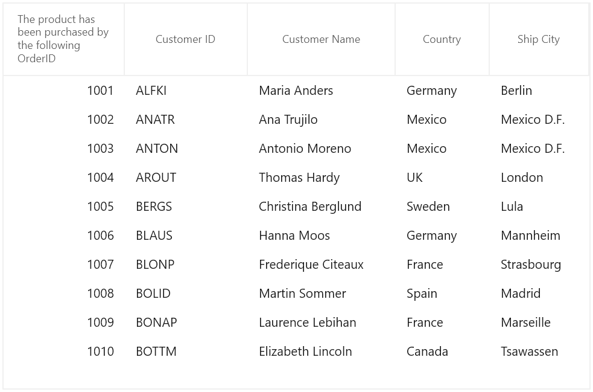
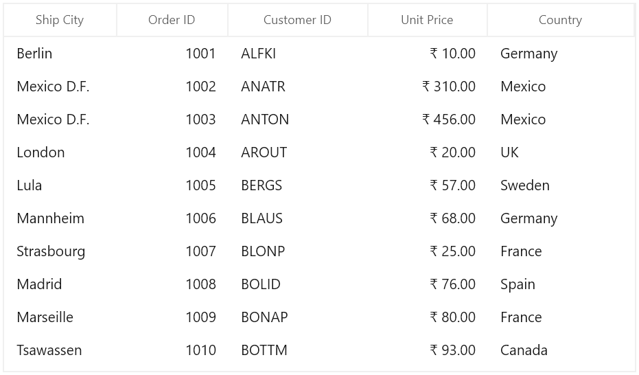
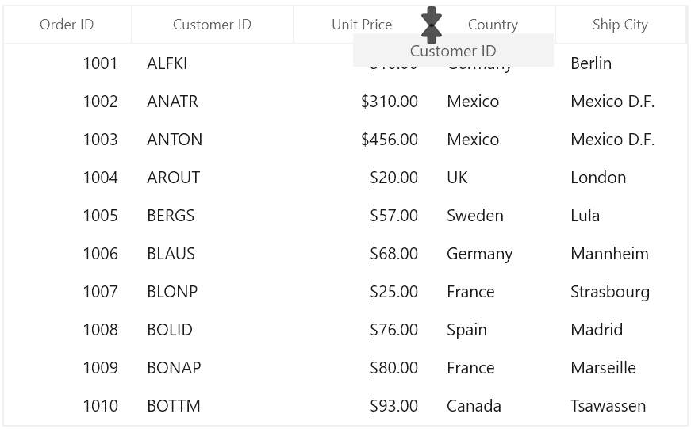
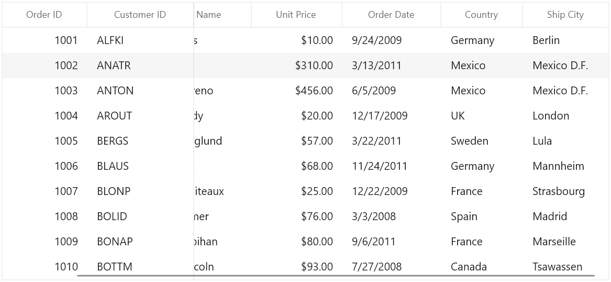
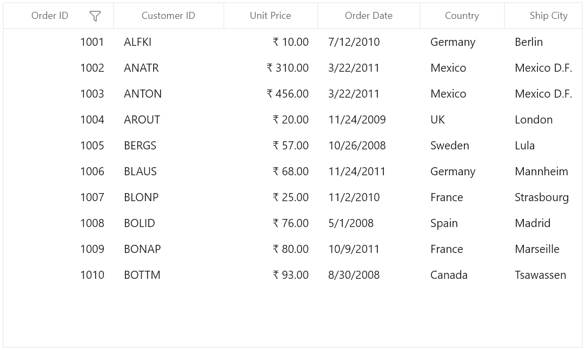

# Columns in WinUI DataGrid

SfDataGrid allows you to add or remove columns using [SfDataGrid.Columns](https://help.syncfusion.com/cr/winui/Syncfusion.UI.Xaml.DataGrid.Columns.html) property. You can choose the columns to be added from built-in column types or you can create your own column and add to the `SfDataGrid.Columns`. 

Below are the built-in column types supported in SfDataGrid. Each column has its own properties to handle different types of data.

<table>
<tr>
<th>
Column Type
</th>
<th>
Description
</th>
</tr>
<tr>
<td>
{{'[GridTextColumn](https://help.syncfusion.com/cr/winui/Syncfusion.UI.Xaml.DataGrid.GridTextColumn.html)'| markdownify }}
</td>
<td>
Use to display the string data. 
</td>
</tr>
<tr>
<td>
{{'[GridComboBoxColumn](https://help.syncfusion.com/cr/winui/Syncfusion.UI.Xaml.DataGrid.GridComboBoxColumn.html)'| markdownify }}
</td>
<td>
Use to display the IEnumerable data using ComboBox.
</td>
</tr>
<tr>
<td>
{{'[GridCheckBoxColumn](https://help.syncfusion.com/cr/winui/Syncfusion.UI.Xaml.DataGrid.GridCheckBoxColumn.html)'| markdownify }}
</td>
<td>
Use to display the boolean type data
</td>
</tr>
<tr>
<td>
{{'[GridImageColumn](https://help.syncfusion.com/cr/winui/Syncfusion.UI.Xaml.DataGrid.GridImageColumn.html)'| markdownify }}
</td>
<td>
Use to display the image in each row.
</td>
</tr>
<tr>
<td>
{{'[GridHyperlinkColumn](https://help.syncfusion.com/cr/winui/Syncfusion.UI.Xaml.DataGrid.GridHyperlinkColumn.html)'| markdownify }}
</td>
<td>
Use to display the <code>Uri</code> data
</td>
</tr>
<tr>
<td>
{{'[GridTemplateColumn](https://help.syncfusion.com/cr/winui/Syncfusion.UI.Xaml.DataGrid.GridTemplateColumn.html)'| markdownify }}
</td>
<td>
Use to display the custom template-specified content.
</td>
</tr>
<tr>
<td>
{{'[GridUnboundColumn](https://help.syncfusion.com/cr/winui/Syncfusion.UI.Xaml.DataGrid.GridUnboundColumn.html)'| markdownify }}
</td>
<td>
Use to display custom information of each record.
</td>
</tr>
</table>

## Defining columns

You can let the SfDataGrid to create columns or you can manually define columns to be displayed. Below sections explains both ways,
 
1. Automatically generating columns
2. Manually define columns

### Automatically generating columns

The automatic column generation based on properties of data object can be enabled or disabled by setting [SfDataGrid.AutoGenerateColumns](https://help.syncfusion.com/cr/winui/Syncfusion.UI.Xaml.Grids.SfGridBase.html#Syncfusion_UI_Xaml_Grids_SfGridBase_AutoGenerateColumns). Default value is `true`.

Columns are generated based on type of property. For example, `GridCheckBoxColumn` is added for `bool` type property. 

Below are table shows data type and its column type. For remaining types, `GridTextColumn` will be added.
  
<table>
<tr>
<th>
Data Type
</th>
<th>
Column
</th>
</tr>
<tr>
<td>
string, object, dynamic
</td>
<td>
GridTextColumn
</td>
</tr>
<tr>
<td>
Uri, Uri?
</td>
<td>
GridHyperLinkColumn
</td>
</tr>
<tr>
<td>
bool, bool?
</td>
<td>
GridCheckBoxColumn
</td>
</tr>
</table>

N> The order of columns in the collection will determine the order of that they will appear in SfDataGrid.

#### AutoGenerateColumns with different modes

Column auto generation is controlled using [SfDataGrid.AutoGenerateColumnsMode](https://help.syncfusion.com/cr/winui/Syncfusion.UI.Xaml.Grids.SfGridBase.html#Syncfusion_UI_Xaml_Grids_SfGridBase_AutoGenerateColumnsMode) property.
 
The `SfDataGrid.AutoGenerateColumnsMode` includes the following modes.

<table>
<tr>
<th>
Mode
</th>
<th>
Behavior
</th>
<th>
When ItemsSource changed
</th>
</tr>
<tr>
<td>
Reset
</td>
<td>
Generates the columns based on the properties defined in the underlying data object.
</td>
<td>
Keeps the columns added manually. 
Clears the columns which are auto generated before and creates new columns based on new ItemsSource.
</td>
</tr>
<tr>
<td>
RetainOld
</td>
<td>
Generates the columns based on the properties defined in the underlying data object if the columns are not defined explicitly.
</td>
<td>
The same columns will be maintained when changing ItemsSource also. So filtering, sorting and grouping settings will be maintained.
</td>
</tr>
<tr>
<td>
ResetAll
</td>
<td>
Generates the columns based on the properties defined in the underlying data object.
</td>
<td>
Clear all the columns including the columns defined manually and creates new columns based on new ItemsSource.
</td>
</tr>
<tr>
<td>
SmartReset
</td>
<td>
Generates the columns and retains data operation based on the properties defined in underlying data object.
</td>
<td>
Retains the valid columns and it’s the data operations settings and creates new columns based on new ItemsSource.
</td>
</tr>
<tr>
<td>
None
</td>
<td>
Columns will not be generated.
</td>
<td>
Keeps old columns in DataGrid.Columns collection.
</td>
</tr>
</table>

#### Auto generating custom type property
Custom type properties in data object can be auto-generated by setting [AutoGenerateColumnsForCustomType](https://help.syncfusion.com/cr/winui/Syncfusion.UI.Xaml.Grids.SfGridBase.html#Syncfusion_UI_Xaml_Grids_SfGridBase_AutoGenerateColumnsForCustomType) property as true. Default value is false.
Custom type properties will be auto-generated through [AutoGenerateColumnsModeForCustomType](https://help.syncfusion.com/cr/winui/Syncfusion.UI.Xaml.Grids.SfGridBase.html#Syncfusion_UI_Xaml_Grids_SfGridBase_AutoGenerateColumnsModeForCustomType) property.



 <dataGrid:SfDataGrid x:Name="sfDataGrid"                                
                        AutoGenerateColumnsForCustomType="True"
                        AutoGenerateColumnsModeForCustomType="Both"   
                        AllowEditing="True"
                        AllowFiltering="True" 
                        AllowSorting="True" 
                        ShowGroupDropArea="True"
                        ColumnWidthMode="AutoLastColumnFill"
                        ItemsSource="{Binding Source}"/>


this.sfDataGrid.AutoGenerateColumnsForCustomType = true;
this.sfDataGrid.AutoGenerateColumnsModeForCustomType = AutoGenerateColumnsModeForCustomType.Both;           



The `AutoGenerateColumnsModeForCustomType` includes the following modes.

<table>
<tr>
<th>
Mode
</th>
<th>
Behavior
</th>
</tr>
<tr>
<td>
<code>Both</code>
</td>
<td>
Specifies that the columns for both the custom type and its inner properties will be auto generated.
</td>
</tr>
<tr>
<td>
<code>Child</code>
</td>
<td>
Specifies that the columns for all inner properties of custom type column will be auto generated. 
</td>
</tr>
<tr>
<td>
<code>Parent</code>
</td>
<td>
Specifies that the column for only the custom type will be auto generated.
</td>
</tr>
</table>

N> View sample in [GitHub](https://github.com/SyncfusionExamples/how-to-auto-generate-columns-for-custom-type-properties-in-winui-datagrid).

#### Customize auto-generated columns

You can customize or cancel the generated column by handling [AutoGeneratingColumn](https://help.syncfusion.com/cr/winui/Syncfusion.UI.Xaml.DataGrid.SfDataGrid.html#Syncfusion_UI_Xaml_DataGrid_SfDataGrid_AutoGeneratingColumn) event.
 
`AutoGeneratingColumn` event occurs when the individual column is auto-generated for public and non-static property of underlying data object.



this.sfDataGrid.AutoGeneratingColumn += SfDataGrid_AutoGeneratingColumn;

private void SfDataGrid_AutoGeneratingColumn(object sender, AutoGeneratingColumnArgs e)
{
    
}



[AutoGeneratingColumnArgs](https://help.syncfusion.com/cr/winui/Syncfusion.UI.Xaml.DataGrid.AutoGeneratingColumnArgs.html) provides the information about the auto-generated column to the `AutoGeneratingColumn` event. [AutoGeneratingColumnArgs.Column](https://help.syncfusion.com/cr/winui/Syncfusion.UI.Xaml.DataGrid.AutoGeneratingColumnArgs.html#Syncfusion_UI_Xaml_DataGrid_AutoGeneratingColumnArgs_Column) property returns the newly created column.

##### Cancel column generation for particular property

You can cancel the specific column adding to the DataGrid by handling `AutoGeneratingColumn` event.

In the below code, column generation for `OrderID` property is canceled by setting `Cancel` property to `true`.
 


this.sfDataGrid.AutoGeneratingColumn += SfDataGrid_AutoGeneratingColumn;

private void SfDataGrid_AutoGeneratingColumn(object sender, AutoGeneratingColumnArgs e)
{
    if (e.Column.MappingName == "OrderID")
        e.Cancel = true;
}



##### Changing column type

You can change the type of column adding to SfDataGrid by setting the instance of column you want to add in ` AutoGeneratingColumn` event.
 
In the below code, column type for `IsShipped` property is changed to `GridTextColumn` by setting instance of GridTextColumn to `Column` property.
 


this.sfDataGrid.AutoGeneratingColumn += SfDataGrid_AutoGeneratingColumn;

private void SfDataGrid_AutoGeneratingColumn(object sender, AutoGeneratingColumnArgs e)
{
    if (e.Column.MappingName == "IsShipped")
    {
        if (e.Column is GridCheckBoxColumn)
        {
            e.Column = new GridTextColumn() { MappingName = "IsShipped", HeaderText = "Is Shipped" };
        }
    }
}




##### Changing property settings

You can change the column properties in `AutoGeneratingColumn` event handler. 



this.sfDataGrid.AutoGeneratingColumn += SfDataGrid_AutoGeneratingColumn;

private void SfDataGrid_AutoGeneratingColumn(object sender, AutoGeneratingColumnArgs e)
{
    if (e.Column.MappingName == "OrderID")
    {
        e.Column.AllowEditing = false;
        e.Column.AllowSorting = true;
        e.Column.AllowFiltering = true;
        e.Column.AllowGrouping = false;
        e.Column.AllowFocus = true;
        e.Column.AllowResizing = false;
        e.Column.ColumnWidthMode = ColumnWidthMode.Auto;
        e.Column.AllowDragging = true;
    }
}       



#### Setting template to auto-generated column

You can set [GridColumn.HeaderTemplate](https://help.syncfusion.com/cr/winui/Syncfusion.UI.Xaml.Grids.GridColumnBase.html#Syncfusion_UI_Xaml_Grids_GridColumnBase_HeaderTemplate) and [GridColumn.CellTemplate](https://help.syncfusion.com/cr/winui/Syncfusion.UI.Xaml.Grids.GridColumnBase.html#Syncfusion_UI_Xaml_Grids_GridColumnBase_CellTemplate) properties for auto-generated column in `AutoGeneratingColumn` event handler.
 


<Page.Resources>
    <DataTemplate x:Key="headerTemplate">
        <TextBlock Text="The product has been purchased by the following OrderID" TextWrapping="Wrap" />
    </DataTemplate>        
</Page.Resources>





this.sfDataGrid.AutoGeneratingColumn += SfDataGrid_AutoGeneratingColumn;

private void SfDataGrid_AutoGeneratingColumn(object sender, AutoGeneratingColumnArgs e)
{
    if (e.Column.MappingName == "OrderID")
    {
        e.Column.HeaderTemplate = Resources["headerTemplate"] as DataTemplate;
    }
}



Below screenshot shows the customized header template loaded on the header of OrderID column.

#### Data Annotations with AutoGenerateColumns

SfDataGrid support to generate the columns based on built-in [Data Annotation Attributes](https://msdn.microsoft.com/en-us/library/mt185499.aspx). 

Data Annotations ignored, when the `AutoGenerateColumns` is set to `False`.

##### Exclude column

You can skip the column generation using `AutoGenerateField` property to `false`.



[Display(AutoGenerateField = false, Description = "OrderID field is not generated in UI")]
public int OrderID
{
    get
    {
        return orderID;
    }
    set
    {
        orderID = value;
    }
}



##### Editing
 
You can change the value of the property using `Editable` attribute.



[Editable(true)]
public double UnitPrice
{
    get
    {
        return _unitPrice;
    }
    set
    {
        _unitPrice = value;
    }
}



##### Change the HeaderText of column

You can customize header text of column using `Display.Name` property.



[Display(Name = "Ship Name")]
public string ShipName
{
    get { return _shipName; }
    set {_shipName = value; }
}



##### Change the order of the columns

You can change the columns order using `DisplayAttribute.Order` property.



[Display(Name = "Order ID",Order = 1)]
public int OrderID
{
    get { return orderID; }
    set { orderID = value;}
}

[Display(Name = "Ship City",Order = 0)]
public string ShipCity
{
    get { return _shipcity; }
    set { _shipcity = value;}
}



The OrderID and CustomerID column rearranged based on specified order.

### Manually defining columns

SfDataGrid control allows you to define the columns manually by adding desired column to the [SfDataGrid.Columns](https://help.syncfusion.com/cr/winui/Syncfusion.UI.Xaml.DataGrid.SfDataGrid.html#Syncfusion_UI_Xaml_DataGrid_SfDataGrid_Columns) collection.
 


<dataGrid:SfDataGrid x:Name="sfDataGrid"
                        AutoGenerateColumns="False"
                        ItemsSource="{Binding OrdersDetails}">
    <dataGrid:SfDataGrid.Columns>
        <dataGrid:GridTextColumn HeaderText="Order ID" MappingName="OrderID"/>
        <dataGrid:GridTextColumn HeaderText="Quantity" MappingName="Quantity" />
        <dataGrid:GridTextColumn HeaderText="Ship City" MappingName="ShipCity" />
        <dataGrid:GridTextColumn HeaderText="Ship Address" MappingName="ShipAddress" />        
    </dataGrid:SfDataGrid.Columns>
</dataGrid:SfDataGrid>


this.sfDataGrid.Columns.Add(new GridTextColumn() { HeaderText = "Order ID", MappingName = "OrderID" });
this.sfDataGrid.Columns.Add(new GridTextColumn() { HeaderText = "Quantity", MappingName = "Quantity" });
this.sfDataGrid.Columns.Add(new GridTextColumn() { HeaderText = "Ship City", MappingName = "ShipCity" });
this.sfDataGrid.Columns.Add(new GridTextColumn() { HeaderText = "Ship Address", MappingName = "ShipAddress" });          



## Column manipulation

You can get the columns (added or auto-generated) from [SfDataGrid.Columns](https://help.syncfusion.com/cr/winui/Syncfusion.UI.Xaml.DataGrid.SfDataGrid.html#Syncfusion_UI_Xaml_DataGrid_SfDataGrid_Columns) property.
 
### Adding column

You can add column at runtime by adding instance of column to `SfDataGrid.Columns` property.



 this.sfDataGrid.Columns.Add(new GridTextColumn() { HeaderText = "Order ID", MappingName = "OrderID" });



### Accessing column

You can access the column through its column index or `GridColumn.MappingName` from the SfDataGrid.Columns collection.



GridColumn column = this.sfDataGrid.Columns[1];
//OR
GridColumn column = this.sfDataGrid.Columns["OrderID"];



### Clearing or removing column

You can remove all the columns by clearing the `SfDataGrid.Columns` property.



this.sfDataGrid.Columns.Clear();



You can remove a column using `Remove` and `RemoveAt` methods.



sfDataGrid.Columns.Remove(column);
//OR
sfDataGrid.Columns.RemoveAt(0);



You can also remove the column under one stacked column from StackedHeaderRow.



var childColumns = this.sfDataGrid.StackedHeaderRows[0].StackedColumns[0].ChildColumns.Split(',');

foreach (var name in childColumns)
{
    var column = sfDataGrid.Columns[name];
    if (column == null)
        continue;
    sfDataGrid.Columns.Remove(column);
}



## Resizing columns

SfDataGrid allows to resize the columns like in excel by resizing column header. This can be enabled or disabled by setting [SfDataGrid.AllowResizingColumns](https://help.syncfusion.com/cr/winui/Syncfusion.UI.Xaml.Grids.SfGridBase.html#Syncfusion_UI_Xaml_Grids_SfGridBase_AllowResizingColumns) or [GridColumn.AllowResizing](https://help.syncfusion.com/cr/winui/Syncfusion.UI.Xaml.DataGrid.GridColumn.html#Syncfusion_UI_Xaml_DataGrid_GridColumn_AllowResizing) property.
 
N> Resizing considers MinWidth and MaxWidth of column.



<dataGrid:SfDataGrid  x:Name="sfDataGrid"
                        AutoGenerateColumns="True"                               
                        AllowResizingColumns="True" 
                        ItemsSource="{Binding OrdersDetails}"/>



You can change the column width by clicking and dragging the resizing cursor at the edge of column header. The resizing cursor appears when you hover the grid line exists between two columns.
 

### Hidden column resizing

SfDataGrid shows indication for hidden columns in column header and also allows end-users to resize the hidden columns when setting [SfDataGrid.AllowResizingHiddenColumns](https://help.syncfusion.com/cr/winui/Syncfusion.UI.Xaml.Grids.SfGridBase.html#Syncfusion_UI_Xaml_Grids_SfGridBase_AllowResizingHiddenColumns) property to `true`.

### Disable resizing

You can cancel resizing of particular column by setting [GridColumn.AllowResizing](https://help.syncfusion.com/cr/winui/Syncfusion.UI.Xaml.DataGrid.GridColumn.html#Syncfusion_UI_Xaml_DataGrid_GridColumn_AllowResizing) property to `false`. In another way, you can cancel the resizing by handling [SfDataGrid.ResizingColumns](https://help.syncfusion.com/cr/winui/Syncfusion.UI.Xaml.DataGrid.SfDataGrid.html#Syncfusion_UI_Xaml_DataGrid_SfDataGrid_ResizingColumns) event. The `ResizingColumns` event occurs when you start dragging by resizing cursor on headers.
 
[ResizingColumnsEventArgs](https://help.syncfusion.com/cr/winui/Syncfusion.UI.Xaml.Grids.ResizingColumnsEventArgs.html) of `ResizingColumns` provides information about the columns’s index and width.



this.sfDataGrid.ResizingColumns += sfDataGrid_ResizingColumns;

void sfDataGrid_ResizingColumns(object sender, ResizingColumnsEventArgs e)
{
    if (e.ColumnIndex == 1)
        e.Cancel = true;
}



### Identify resizing of the column gets completed

SfDataGrid allows you to identify the progress of the resizing of columns through [ResizingColumnsEventArgs.Reason](https://help.syncfusion.com/cr/winui/Syncfusion.UI.Xaml.Grids.ResizingColumnsEventArgs.html#Syncfusion_UI_Xaml_Grids_ResizingColumnsEventArgs_Reason) property. You can get the width of the column after resizing completed by getting [ResizingColumnsEventArgs.Width](https://help.syncfusion.com/cr/winui/Syncfusion.UI.Xaml.Grids.ResizingColumnsEventArgs.html#Syncfusion_UI_Xaml_Grids_ResizingColumnsEventArgs_Width) when `ResizingColumnsEventArgs.Reason` is [ColumnResizingReason.Resized](https://help.syncfusion.com/cr/winui/Syncfusion.UI.Xaml.Grids.ColumnResizingReason.html) in [ResizingColumns](https://help.syncfusion.com/cr/winui/Syncfusion.UI.Xaml.DataGrid.SfDataGrid.html#Syncfusion_UI_Xaml_DataGrid_SfDataGrid_ResizingColumns) event.



this.sfDataGrid.ResizingColumns += sfDataGrid_ResizingColumns;

void sfDataGrid_ResizingColumns(object sender, ResizingColumnsEventArgs e)
{
    if (e.Reason == ColumnResizingReason.Resized)
    {
        var resizedWidth = e.Width;
    }
}




## Column drag and drop

You can allow end-users to rearrange the columns by drag and drop the column headers by setting [SfDataGrid.AllowDraggingColumns](https://help.syncfusion.com/cr/winui/Syncfusion.UI.Xaml.Grids.SfGridBase.html#Syncfusion_UI_Xaml_Grids_SfGridBase_AllowDraggingColumns) to `true`.



 <dataGrid:SfDataGrid x:Name="sfDataGrid"
                        AutoGenerateColumns="True" 
                        AllowDraggingColumns="True"
                        ItemsSource="{Binding OrdersDetails}"/>



You can enable or disable dragging on particular column using [GridColumn.AllowDragging](https://help.syncfusion.com/cr/winui/Syncfusion.UI.Xaml.DataGrid.GridColumn.html#Syncfusion_UI_Xaml_DataGrid_GridColumn_AllowDragging) property.



 <syncfusion:GridTextColumn HeaderText="Order ID" MappingName="OrderID" AllowDragging="False" />



### Disable column reordering

You can cancel the particular column dragging by handling [SfDataGrid.ColumnDragging](https://help.syncfusion.com/cr/winui/Syncfusion.UI.Xaml.DataGrid.SfDataGrid.html#Syncfusion_UI_Xaml_DataGrid_SfDataGrid_ColumnDragging). `ColumnDragging` event occurs when you start dragging the column header. [QueryColumnDraggingEventArgs](https://help.syncfusion.com/cr/winui/Syncfusion.UI.Xaml.DataGrid.QueryColumnDraggingEventArgs.html) of `ColumnDragging` event provides information about the column triggered this event.
 
`QueryColumnDraggingEventArgs.From` property returns the index of column triggered this event. `QueryColumnDraggingEventArgs.To` property returns the index where you try to drop the column. `QueryColumnDraggingEventArgs.Reason` returns column dragging details by `QueryColumnDraggingReason`.



 this.sfDataGrid.ColumnDragging += SfDataGrid_ColumnDragging;

private void SfDataGrid_ColumnDragging(object sender, QueryColumnDraggingEventArgs e)
{
    var column = sfDataGrid.Columns[e.From];

    if (column.MappingName == "Quantity" && e.Reason == QueryColumnDraggingReason.Dropping)
    {
        e.Cancel = true;
    }
}



### Drag and drop customization 

The drag-and-drop operations can be changed by overriding the virtual methods of [GridColumnDragDropController](https://help.syncfusion.com/cr/winui/Syncfusion.UI.Xaml.DataGrid.GridColumnDragDropController.html) class and assigning it to `SfDataGrid.GridColumnDragDropController`.
 


this.sfDataGrid.GridColumnDragDropController = new CustomDragDropController(sfDataGrid);

public class CustomDragDropController : GridColumnDragDropController
{
    public CustomDragDropController(SfDataGrid dataGrid) : base(dataGrid)
    {
    }

    //Returns whether the popup showed its header or not.
    public override bool CanShowPopup(GridColumn column)
    {
        return base.CanShowPopup(column);
    }

    //Get the corresponding GridRegion at a given point.
    public override GridRegion PointToGridRegion(Point point)
    {
        return base.PointToGridRegion(point);
    }

    //Occurs when the GridColumn.Hidden property value changed.
    protected override void OnColumnHiddenChanged(GridColumn column)
    {
        base.OnColumnHiddenChanged(column);
    }

    //Occurs when the popup content is created.
    protected override UIElement CreatePopupContent(GridColumn column)
    {
        return base.CreatePopupContent(column);
    }

    //Occurs when the popup content is dropped on DataGrid.
    protected override void PopupContentDroppedOnGrid(Point point)
    {
        base.PopupContentDroppedOnGrid(point);
    }

    //Occurs when the popup content is dropped on header row.
    protected override void PopupContentDroppedOnHeaderRow(int oldIndex, int newColumnIndex)
    {
        base.PopupContentDroppedOnHeaderRow(oldIndex, newColumnIndex);
    }        

    //Occurs when the popup content is dropped.
    protected override void OnPopupContentDropped(Point pointOverGrid)
    {
        base.OnPopupContentDropped(pointOverGrid);
    }
            
    //Occurs when the popup content is dropped on GroupDropArea
    protected override void PopupContentDroppedOnGroupDropArea(GridColumn column)
    {
        base.PopupContentDroppedOnGroupDropArea(column);
    }

    //Occurs when the popup content position changed.
    protected override void OnPopupContentPositionChanged(double HorizontalDelta, double VerticalDelta, Point mousePointOverGrid)
    {
        base.OnPopupContentPositionChanged(HorizontalDelta, VerticalDelta, mousePointOverGrid);
    }           
  }

  

### Disabling drag & drop between frozen and non-frozen columns

By default, the columns re-ordering performed between any column regions of columns. You can cancel the dropping action between the frozen and non-frozen columns by handling [SfDataGrid.ColumnDragging](https://help.syncfusion.com/cr/winui/Syncfusion.UI.Xaml.DataGrid.SfDataGrid.html#Syncfusion_UI_Xaml_DataGrid_SfDataGrid_ColumnDragging) event.



this.sfDataGrid.ColumnDragging += SfDataGrid_ColumnDragging;

private void SfDataGrid_ColumnDragging(object sender, QueryColumnDraggingEventArgs e)
{
    if (e.Reason == QueryColumnDraggingReason.Dropping)
    {
        var frozenColIndex = this.sfDataGrid.FrozenColumnCount + this.sfDataGrid.ResolveToStartColumnIndex();

        if (e.From < frozenColIndex && e.To > frozenColIndex - 1)
            e.Cancel = true;

        if (e.From > frozenColIndex && e.To < frozenColIndex || (e.From == frozenColIndex && e.To < frozenColIndex))
            e.Cancel = true;
    }
}



N> FrozenColumnCount and FooterColumnCount should be lesser than the number of Columns that can be displayed in View.

## Freezing columns 

You can freeze the columns in view at the left and right side like in excel by setting [SfDataGrid.FrozenColumnCount](https://help.syncfusion.com/cr/winui/Syncfusion.UI.Xaml.Grids.SfGridBase.html#Syncfusion_UI_Xaml_Grids_SfGridBase_FrozenColumnCount) and [SfDataGrid.FrozenFooterColumnCount](https://help.syncfusion.com/cr/winui/Syncfusion.UI.Xaml.Grids.SfGridBase.html#Syncfusion_UI_Xaml_Grids_SfGridBase_FrozenFooterColumnCount) properties.
 


<dataGrid:SfDataGrid  x:Name="dataGrid"
                        AutoGenerateColumns="True"
                        FrozenColumnCount="2"
                        ItemsSource="{Binding Orders}"/>



### Limitations

SfDataGrid has support to freeze the number of columns from the left or right. There is no support to freeze a specific column.

## Binding column properties with ViewModel

SfDataGrid provides MVVM support for binding `GridColumn` properties with ViewModel properties.
 


public class ViewModel
{
    private bool _allowFiltering =true;
    public bool AllowFiltering
    {
        get { return _allowFiltering; }
        set { _allowFiltering = value; }
    }
}



Below code, binds the `ViewModel.AllowFiltering` property to `GridColumn.AllowFiltering` property.



<Page.Resources>
    <local:ViewModel x:Key="viewModel" />
</Page.Resources>

<dataGrid:GridTextColumn  AllowFiltering="{Binding AllowFiltering,
                                                    Source={StaticResource viewModel}}"
                            HeaderText="Order ID"
                            MappingName="OrderID" /> 



