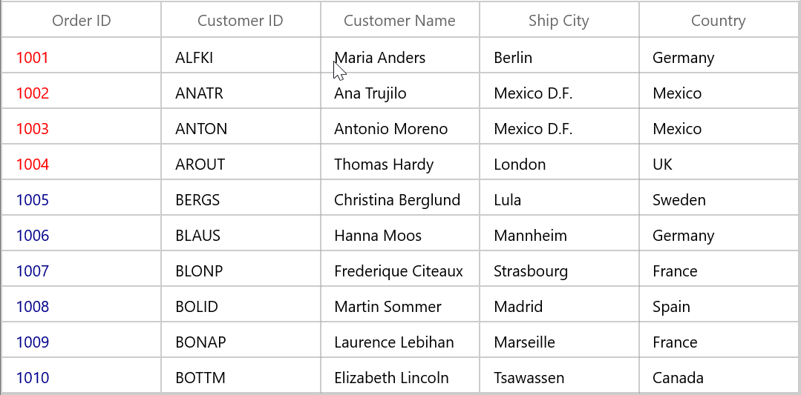
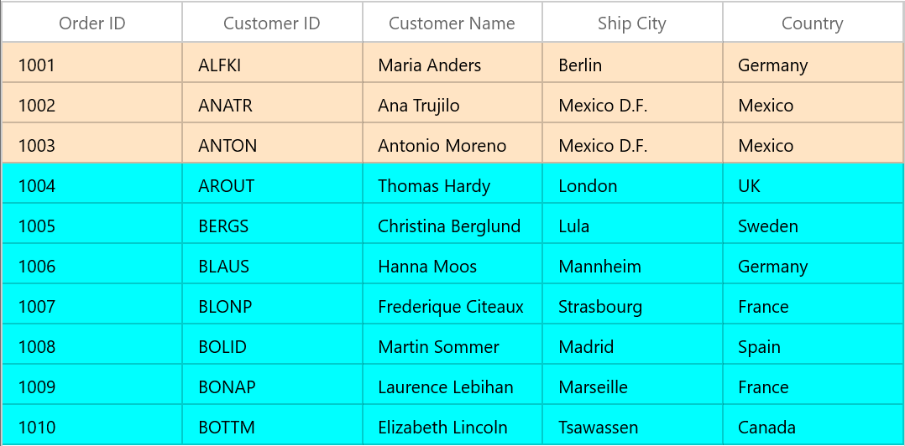

# Conditional styling in WinUI DataGrid (SfDataGrid)

You can style the DataGrid and its inner elements (cells, rows and columns) conditionally based on data Using StyleSelector.

## Cell style

### Conditional styling of cells using style selector

The record cells ([GridCell](https://help.syncfusion.com/cr/winui/Syncfusion.UI.Xaml.DataGrid.GridCell.html)) can be customized conditionally based on data by setting [SfDataGrid.CellStyleSelector](https://help.syncfusion.com/cr/winui/Syncfusion.UI.Xaml.DataGrid.SfDataGrid.html#Syncfusion_UI_Xaml_DataGrid_SfDataGrid_CellStyleSelector) property and the particular column record cells can be customized by setting [GridColumn.CellStyleSelector](https://help.syncfusion.com/cr/winui/Syncfusion.UI.Xaml.Grids.GridColumnBase.html#Syncfusion_UI_Xaml_Grids_GridColumnBase_CellStyleSelector) property and you can get the container as `GridCell` in the StyleSelector.

N> `GridColumn.CellStyleSelector` takes higher priority than `SfDataGrid.CellStyleSelector` property.



<Application.Resources>
    <local:SelectorClass x:Key="styleSelector"/>
    
    
</Application.Resources>

<dataGrid:SfDataGrid x:Name="dataGrid"
                       AutoGenerateColumns="False"
                       CellStyleSelector="{StaticResource styleSelector}"
                       ItemsSource="{Binding Orders}"
                       ColumnWidthMode="Star">
    <dataGrid:SfDataGrid.Columns>
        <dataGrid:GridTextColumn MappingName="OrderID" HeaderText="Order ID" />
        <dataGrid:GridTextColumn MappingName="CustomerID" HeaderText="Customer ID" />
        <dataGrid:GridTextColumn MappingName="CustomerName" HeaderText="Customer Name" />
        <dataGrid:GridTextColumn MappingName="ShipCity" HeaderText="Ship City" />
        <dataGrid:GridTextColumn MappingName="Country" />
    </dataGrid:SfDataGrid.Columns>
</dataGrid:SfDataGrid>



public class SelectorClass : StyleSelector
{

    protected override Style SelectStyleCore(object item, DependencyObject container)
    {
        var data = item as OrderInfo;

        if (data != null && ((container as GridCell).ColumnBase.GridColumn.MappingName == "OrderID"))
        {

            //custom condition is checked based on data.

            if (data.OrderID < 1005)
                return Application.Current.Resources["redCellStyle"] as Style;
            return Application.Current.Resources["blueCellStyle"] as Style;
        }
        return base.SelectStyleCore(item, container);
    }
}



Here, GridCell’s are customized based on `OrderID` property of underlying record.

## Row style

### Conditional styling of rows using style selector

The record rows ([DataGridRowControl](https://help.syncfusion.com/cr/winui/Syncfusion.UI.Xaml.DataGrid.DataGridRowControl.html) ) can be customized conditionally based on data by setting [SfDataGrid.RowStyleSelector](https://help.syncfusion.com/cr/winui/Syncfusion.UI.Xaml.DataGrid.SfDataGrid.html#Syncfusion_UI_Xaml_DataGrid_SfDataGrid_RowStyleSelector) property and you can get the container as `DataGridRowControl` in StyleSelector.



<Application.Resources>
    <local:CustomRowStyleSelector x:Key="rowStyleSelector" />
    
    
</Application.Resources>

<dataGrid:SfDataGrid x:Name="dataGrid"
                       AutoGenerateColumns="False"
                       RowStyleSelector="{StaticResource rowStyleSelector}"
                       ItemsSource="{Binding Orders}"
                       ColumnWidthMode="Star">
    <dataGrid:SfDataGrid.Columns>
        <dataGrid:GridTextColumn MappingName="OrderID" HeaderText="Order ID" />
        <dataGrid:GridTextColumn MappingName="CustomerID" HeaderText="Customer ID" />
        <dataGrid:GridTextColumn MappingName="CustomerName" HeaderText="Customer Name" />
        <dataGrid:GridTextColumn MappingName="ShipCity" HeaderText="Ship City" />
        <dataGrid:GridTextColumn MappingName="Country" />
    </dataGrid:SfDataGrid.Columns>
</dataGrid:SfDataGrid>



public class CustomRowStyleSelector : StyleSelector
{
    protected override Style SelectStyleCore(object item, DependencyObject container)
    {
        var row = (item as DataRowBase).RowData;
        var data = row as OrderInfo;

        if (data.OrderID < 1004)
            return Application.Current.Resources["bisqueRowStyle"] as Style;
        return Application.Current.Resources["aquaRowStyle"] as Style;
    }
}




Here, rows are customized based on `OrderID` property of underlying record.

## Alternate row style

The appearance of alternating rows can be customized conditionally based on data by setting [SfDataGrid.AlternatingRowStyleSelector](https://help.syncfusion.com/cr/winui/Syncfusion.UI.Xaml.DataGrid.SfDataGrid.html#Syncfusion_UI_Xaml_DataGrid_SfDataGrid_AlternatingRowStyleSelector) property.



<Application.Resources>
    <local:StyleSelector x:Key="alternatingRowStyleSelector" />
    
    
</Application.Resources>

<dataGrid:SfDataGrid x:Name="dataGrid"
                       AutoGenerateColumns="False"
                       ItemsSource="{Binding Orders}"
                       AlternatingRowStyleSelector="{StaticResource alternatingRowStyleSelector}"
                       ColumnWidthMode="Star">
    <dataGrid:SfDataGrid.Columns>
        <dataGrid:GridTextColumn MappingName="OrderID" HeaderText="Order ID" />
        <dataGrid:GridTextColumn MappingName="CustomerID" HeaderText="Customer ID" />
        <dataGrid:GridTextColumn MappingName="CustomerName" HeaderText="Customer Name" />
        <dataGrid:GridTextColumn MappingName="ShipCity" HeaderText="Ship City" />
        <dataGrid:GridTextColumn MappingName="Country" />
    </dataGrid:SfDataGrid.Columns>
</dataGrid:SfDataGrid>



public class SelectorClass : StyleSelector
{

    protected override Style SelectStyleCore(object item, DependencyObject container)
    {
        var row = (item as DataRowBase).RowData;
        var data = row as OrderInfo;

        if (data.OrderID < 1006)
            return Application.Current.Resources["bisqueRowStyle"] as Style;
        return Application.Current.Resources["aquaRowStyle"] as Style;
    }
}




Here, alternating rows are customized based on `OrderID` property of underlying record.

## Caption summary cell style

### Conditional styling of caption summary cells using style selector

The appearance of caption summary cell can be customized conditionally based on summary value by setting [SfDataGrid.CaptionSummaryCellStyleSelector](https://help.syncfusion.com/cr/winui/Syncfusion.UI.Xaml.DataGrid.SfDataGrid.html#Syncfusion_UI_Xaml_DataGrid_SfDataGrid_CaptionSummaryCellStyleSelector) and you can get the container as `GridCaptionSummaryCell` using StyleSelector.



<Application.Resources>
    <local:SelectorClass x:Key="selector"/>
    
</Application.Resources>

<dataGrid:SfDataGrid x:Name="dataGrid"
                       AutoGenerateColumns="True"
                       AllowGrouping="True"
                       ShowGroupDropArea="True"
                       CaptionSummaryCellStyleSelector="{StaticResource selector}"
                       ItemsSource="{Binding Orders}"
                       ColumnWidthMode="Star">
    <dataGrid:SfDataGrid.CaptionSummaryRow>
        <dataGrid:GridSummaryRow ShowSummaryInRow="False">
            <dataGrid:GridSummaryRow.SummaryColumns>
                <dataGrid:GridSummaryColumn Name="PriceAmount"
                                        Format="'{Sum:c}'"
                                        MappingName="UnitPrice"
                                        SummaryType="DoubleAggregate" />
                <dataGrid:GridSummaryColumn Name="ProductCount"
                                        Format="'{Count}'"
                                        MappingName="ProductName"
                                        SummaryType="CountAggregate" />
            </dataGrid:GridSummaryRow.SummaryColumns>
        </dataGrid:GridSummaryRow>
    </dataGrid:SfDataGrid.CaptionSummaryRow>
</dataGrid:SfDataGrid>


public class SelectorClass : StyleSelector
{

    protected override Style SelectStyleCore(object item, DependencyObject container)
    {
        var summaryValue = (item as Group).SummaryDetails.SummaryValues[0];
        var aggregateValue = summaryValue.AggregateValues.ElementAt(0);
        var calculatedValue = aggregateValue.Value;

        //custom condition is checked.
        if ((double)calculatedValue > 50)
            return Application.Current.Resources["captionSummaryCellStyle"] as Style;
        return base.SelectStyleCore(item, container);
    }
}



Here, caption summary cells are customized based on `OrderID` summary value.

### Conditional styling of caption summary cell based on column

The caption summary cells can be conditionally customized based on summary column. 

Here, caption summary cells are customized based on `OrderID` summary column.



<Application.Resources>
    <local:SelectorClass x:Key="selector"/>
    
</Application.Resources>

<dataGrid:SfDataGrid x:Name="dataGrid"
                       AutoGenerateColumns="True"
                       AllowGrouping="True"
                       ShowGroupDropArea="True"
                       CaptionSummaryCellStyleSelector="{StaticResource selector}"
                       ItemsSource="{Binding Orders}"
                       ColumnWidthMode="Star">
    <dataGrid:SfDataGrid.CaptionSummaryRow>
        <dataGrid:GridSummaryRow ShowSummaryInRow="False">
            <dataGrid:GridSummaryRow.SummaryColumns>
                <dataGrid:GridSummaryColumn Name="PriceAmount"
                                        Format="'{Sum:c}'"
                                        MappingName="UnitPrice"
                                        SummaryType="DoubleAggregate" />
                <dataGrid:GridSummaryColumn Name="ProductCount"
                                        Format="'{Count}'"
                                        MappingName="ProductName"
                                        SummaryType="CountAggregate" />
            </dataGrid:GridSummaryRow.SummaryColumns>
        </dataGrid:GridSummaryRow>
    </dataGrid:SfDataGrid.CaptionSummaryRow>
</dataGrid:SfDataGrid>



public class SelectorClass : StyleSelector
{

    protected override Style SelectStyleCore(object item, DependencyObject container)
    {
        var cell = container as GridCaptionSummaryCell;

        if (cell.ColumnBase.GridColumn.MappingName == "UnitPrice")
        {
            var groupKey = (double)(item as Group).Key;

            //custom condition is checked.
            if (groupKey < 50)
                return Application.Current.Resources["captionSummaryCellStyle"] as Style;
        }
        return null;
    }
}



## Group summary cell style

Group summary cells can be customized conditionally by getting particular summary value from [SummaryValues](https://help.syncfusion.com/cr/winui/Syncfusion.UI.Xaml.Data.SummaryRecordEntry.html#Syncfusion_UI_Xaml_Data_SummaryRecordEntry_SummaryValues) through converter or style selector. Likewise, you can also customize the group summary cell based on various properties exposed in [GridSummaryRow](https://help.syncfusion.com/cr/winui/Syncfusion.UI.Xaml.DataGrid.GridSummaryRow.html) (example: [ShowSummaryInRow](https://help.syncfusion.com/cr/winui/Syncfusion.UI.Xaml.DataGrid.GridSummaryRow.html#Syncfusion_UI_Xaml_DataGrid_GridSummaryRow_ShowSummaryInRow) property).

### Conditional styling of group summary cell using style selector

The appearance of group summary cell can be customized conditionally based on summary value by setting [SfDataGrid.GroupSummaryCellStyleSelector](https://help.syncfusion.com/cr/winui/Syncfusion.UI.Xaml.DataGrid.SfDataGrid.html#Syncfusion_UI_Xaml_DataGrid_SfDataGrid_CaptionSummaryRowStyleSelector) and you can get the container as `GridGroupSummaryCell` in StyleSelector.

Here, group summary cells are customized based on summary values whether it’s positive or negative.



<Application.Resources>
    <local:SelectorClass x:Key="styleSelector"/>
    
    
</Application.Resources>

<dataGrid:SfDataGrid x:Name="dataGrid"
                       AutoGenerateColumns="True"
                       AllowGrouping="True"
                       ShowGroupDropArea="True"
                       GroupSummaryCellStyleSelector="{StaticResource styleSelector}"
                       ItemsSource="{Binding Orders}"
                       ColumnWidthMode="Star">
    <dataGrid:SfDataGrid.GroupSummaryRows>
            <dataGrid:GridSummaryRow ShowSummaryInRow="False">
                <dataGrid:GridSummaryRow.SummaryColumns>
                    <dataGrid:GridSummaryColumn Name="PriceAmount"
                                    Format="'Amount - {Sum:c}'"
                                    MappingName="UnitPrice"
                                    SummaryType="DoubleAggregate" />
                    <dataGrid:GridSummaryColumn Name="ProductCount"
                                    Format="'Count - {Count:d}'"
                                    MappingName="ProductName"
                                    SummaryType="CountAggregate" />
                </dataGrid:GridSummaryRow.SummaryColumns>
            </dataGrid:GridSummaryRow>
            <dataGrid:GridSummaryRow Title="TotalPrice:  {totalPrice}" ShowSummaryInRow="True">
                <dataGrid:GridSummaryRow.SummaryColumns>
                    <dataGrid:GridSummaryColumn Name="totalPrice"
                                    Format="'{Sum:c}'"
                                    MappingName="UnitPrice"
                                    SummaryType="DoubleAggregate" />
                </dataGrid:GridSummaryRow.SummaryColumns>
            </dataGrid:GridSummaryRow>
    </dataGrid:SfDataGrid.GroupSummaryRows>
</dataGrid:SfDataGrid>



public class SelectorClass : StyleSelector
{

    protected override Style SelectStyleCore(object item, DependencyObject container)
    {
        var summaryValue = (item as SummaryRecordEntry).SummaryValues[0];
        var aggregateValue = summaryValue.AggregateValues.ElementAt(0);
        var calculatedValue = aggregateValue.Value;

        //custom condition is checked.
        if ((double)calculatedValue < 50)
            return Application.Current.Resources["bisqueGroupSummaryCellStyle"] as Style;
        return Application.Current.Resources["darkBlueGroupSummaryCellStyle"] as Style;
    }
}




Here, group summary cells are customized based on `TotalPrice` summary value.

### Conditional styling of group summary cell based on column

The group summary cells can be conditionally customized based on summary column. 

Here, group summary cells are customized based on `TotalPrice` summary column.



<Application.Resources>
    <local:SelectorClass x:Key="styleSelector"/>
     
    
    
</Application.Resources>

<dataGrid:SfDataGrid x:Name="dataGrid"
                       AutoGenerateColumns="True"
                       AllowGrouping="True"
                       ShowGroupDropArea="True"
                       GroupSummaryCellStyleSelector="{StaticResource styleSelector}"
                       ItemsSource="{Binding Orders}"
                       ColumnWidthMode="Star">
    <dataGrid:SfDataGrid.GroupSummaryRows>
            <dataGrid:GridSummaryRow ShowSummaryInRow="False">
                <dataGrid:GridSummaryRow.SummaryColumns>
                    <dataGrid:GridSummaryColumn Name="PriceAmount"
                                    Format="'Amount - {Sum:c}'"
                                    MappingName="UnitPrice"
                                    SummaryType="DoubleAggregate" />
                    <dataGrid:GridSummaryColumn Name="ProductCount"
                                    Format="'Count - {Count:d}'"
                                    MappingName="ProductName"
                                    SummaryType="CountAggregate" />
                </dataGrid:GridSummaryRow.SummaryColumns>
            </dataGrid:GridSummaryRow>
            <dataGrid:GridSummaryRow Title="TotalPrice:  {totalPrice}" ShowSummaryInRow="True">
                <dataGrid:GridSummaryRow.SummaryColumns>
                    <dataGrid:GridSummaryColumn Name="totalPrice"
                                    Format="'{Sum:c}'"
                                    MappingName="UnitPrice"
                                    SummaryType="DoubleAggregate" />
                </dataGrid:GridSummaryRow.SummaryColumns>
            </dataGrid:GridSummaryRow>
    </dataGrid:SfDataGrid.GroupSummaryRows>
</dataGrid:SfDataGrid>



public class SelectorClass : StyleSelector
{
    protected override Style SelectStyleCore(object item, DependencyObject container)
    {
        var cell = container as GridGroupSummaryCell;

        var dataContext = item as SummaryRecordEntry;
        if (!dataContext.SummaryRow.ShowSummaryInRow)
        {
            if (cell.ColumnBase.GridColumn.MappingName == "UnitPrice")
            {
                var summaryValue = dataContext.SummaryValues[0];
                var aggregateValue = summaryValue.AggregateValues.ElementAt(0);
                var calculatedValue = aggregateValue.Value;

                //custom condition is checked.
                if (aggregateValue.Key != "Count" && (double)calculatedValue < 50)
                    return App.Current.Resources["deepPinkGroupSummaryCellStyle"] as Style;
            }
            else
                return App.Current.Resources["darkBlueGroupSummaryCellStyle"] as Style;
        }
        return App.Current.Resources["bisqueGroupSummaryCellStyle"] as Style;
    }
}



## Group summary row style

Group summary row can be customized conditionally by getting particular summary value from [SummaryValue](https://help.syncfusion.com/cr/winui/Syncfusion.UI.Xaml.Data.SummaryValue.html#Syncfusion_UI_Xaml_Data_SummaryValue__ctor) through `converter` or `style selector`. Likewise, you can also customize the group summary row based on various properties exposed in [GridSummaryRow](https://help.syncfusion.com/cr/winui/Syncfusion.UI.Xaml.DataGrid.GridSummaryRow.html) (example: [ShowSummaryInRow](https://help.syncfusion.com/cr/winui/Syncfusion.UI.Xaml.DataGrid.GridSummaryRow.html#Syncfusion_UI_Xaml_DataGrid_GridSummaryRow_ShowSummaryInRow) property).

### Conditional styling of group summary row using style selector

The appearance of group summary row can be customized conditionally based on summary value by setting [SfDataGrid.GroupSummaryRowStyleSelector](https://help.syncfusion.com/cr/winui/Syncfusion.UI.Xaml.DataGrid.SfDataGrid.html#Syncfusion_UI_Xaml_DataGrid_SfDataGrid_GroupSummaryRowStyleSelector) and you can get the container as `GridGroupSummaryRowControl` in StyleSelector.



<Application.Resources>
    <local:SelectorClass x:Key="styleSelector"/>
    
    
</Application.Resources>

<dataGrid:SfDataGrid x:Name="dataGrid"
                       AutoGenerateColumns="True"
                       AllowEditing="True"
                       AllowGrouping="True"
                       ShowGroupDropArea="True"
                       GroupSummaryRowStyleSelector="{StaticResource styleSelector}"
                       ItemsSource="{Binding Orders}"
                       ColumnWidthMode="Star">
    <dataGrid:SfDataGrid.GroupSummaryRows>
            <dataGrid:GridSummaryRow ShowSummaryInRow="False">
                <dataGrid:GridSummaryRow.SummaryColumns>
                    <dataGrid:GridSummaryColumn Name="PriceAmount"
                                    Format="'Amount - {Sum:c}'"
                                    MappingName="UnitPrice"
                                    SummaryType="DoubleAggregate" />
                    <dataGrid:GridSummaryColumn Name="ProductCount"
                                    Format="'Count - {Count:d}'"
                                    MappingName="ProductName"
                                    SummaryType="CountAggregate" />
                </dataGrid:GridSummaryRow.SummaryColumns>
            </dataGrid:GridSummaryRow>
            <dataGrid:GridSummaryRow Title="TotalPrice:  {totalPrice}" ShowSummaryInRow="True">
                <dataGrid:GridSummaryRow.SummaryColumns>
                    <dataGrid:GridSummaryColumn Name="totalPrice"
                                    Format="'{Sum:c}'"
                                    MappingName="UnitPrice"
                                    SummaryType="DoubleAggregate" />
                </dataGrid:GridSummaryRow.SummaryColumns>
            </dataGrid:GridSummaryRow>
    </dataGrid:SfDataGrid.GroupSummaryRows>
</dataGrid:SfDataGrid>



public class SelectorClass : StyleSelector
{
    protected override Style SelectStyleCore(object item, DependencyObject container)
    {
        var summaryRecordEntry = (item as SpannedDataRow).RowData;
        var summaryValue = (summaryRecordEntry as SummaryRecordEntry).SummaryValues[0];
        var aggregateValue = summaryValue.AggregateValues.ElementAt(0);
        var calculatedValue = aggregateValue.Value;

        //custom condition is checked.
        if ((double)calculatedValue % 2 == 0)
            return Application.Current.Resources["bisqueGroupSummaryRowStyle"] as Style;
        return Application.Current.Resources["aquamarineGroupSummaryRowStyle"] as Style;
    }
}




Here, group summary rows are customized based on `TotalPrice` summary value whether it’s positive or negative.

## Table summary cell

Table summary cells can be customized conditionally by getting particular summary value from [SummaryValues](https://help.syncfusion.com/cr/winui/Syncfusion.UI.Xaml.Data.SummaryRecordEntry.html#Syncfusion_UI_Xaml_Data_SummaryRecordEntry_SummaryValues) through `converter` or `style selector`. Likewise, you can also customize the table summary cell based on various properties exposed in [GridSummaryRow](https://help.syncfusion.com/cr/winui/Syncfusion.UI.Xaml.DataGrid.GridSummaryRow.html) (example: [ShowSummaryInRow](https://help.syncfusion.com/cr/winui/Syncfusion.UI.Xaml.DataGrid.GridSummaryRow.html#Syncfusion_UI_Xaml_DataGrid_GridSummaryRow_ShowSummaryInRow) property).

### Conditional styling of table summary cell using style selector

The appearance of table summary cell can be customized conditionally based on summary value by setting [SfDataGrid.TableSummaryCellStyleSelector](https://help.syncfusion.com/cr/winui/Syncfusion.UI.Xaml.DataGrid.SfDataGrid.html#Syncfusion_UI_Xaml_DataGrid_SfDataGrid_TableSummaryCellStyleSelector) and you can get the container as `GridTableSummaryCell` in StyleSelector.



<Application.Resources>
    <local:SelectorClass x:Key="styleSelector"/>
    
    
</Application.Resources>

<dataGrid:SfDataGrid x:Name="dataGrid"
                       AutoGenerateColumns="True"
                       AllowEditing="True"
                       AllowGrouping="True"
                       ShowGroupDropArea="True"
                       TableSummaryCellStyleSelector="{StaticResource styleSelector}"
                       ItemsSource="{Binding Orders}"
                       ColumnWidthMode="Star">
    <dataGrid:SfDataGrid.TableSummaryRows>
        <dataGrid:GridTableSummaryRow ShowSummaryInRow="False">
            <dataGrid:GridSummaryRow.SummaryColumns>
                <dataGrid:GridSummaryColumn Name="PriceAmount"
                                Format="'Total UnitPrice : {Sum:c}'"
                                MappingName="UnitPrice"
                                SummaryType="DoubleAggregate" />
                <dataGrid:GridSummaryColumn Name="ProductCount"
                                Format="'Total Product Count : {Count:d}'"
                                MappingName="ProductName"
                                SummaryType="CountAggregate" />
            </dataGrid:GridSummaryRow.SummaryColumns>
        </dataGrid:GridTableSummaryRow>
        <dataGrid:GridSummaryRow Title="Total Price :  {totalPrice}" ShowSummaryInRow="True">
            <dataGrid:GridSummaryRow.SummaryColumns>
                <dataGrid:GridSummaryColumn Name="totalPrice"
                                        Format="'{Sum:c}'"
                                        MappingName="UnitPrice"
                                        SummaryType="DoubleAggregate" />
            </dataGrid:GridSummaryRow.SummaryColumns>
        </dataGrid:GridSummaryRow>
    </dataGrid:SfDataGrid.TableSummaryRows>
</dataGrid:SfDataGrid>



public class SelectorClass : StyleSelector
{
    protected override Style SelectStyleCore(object item, DependencyObject container)
    {
        var summaryValue = (item as SummaryRecordEntry).SummaryValues[0];
        var aggregateValue = summaryValue.AggregateValues.ElementAt(0);
        var calculatedValue = aggregateValue.Value;
        var cell = container as GridTableSummaryCell;

        //custom condition is checked.
        if ((double)calculatedValue > 10 && cell.ColumnBase.GridColumn.MappingName == "UnitPrice")
            return Application.Current.Resources["redTableSummaryCellStyle"] as Style;
        return Application.Current.Resources["darkBlueTableSummaryCellStyle"] as Style;
    }
}




Here, table summary cells are customized based on `TotalPrice` summary value.

### Conditional styling of table summary cell based on column

The table summary cells can be conditionally customized based on summary column.

Here, table summary cells are customized based on `TotalPrice` summary column.



<Application.Resources>
    <local:SelectorClass x:Key="styleSelector"/>
    
    
</Application.Resources>

<dataGrid:SfDataGrid x:Name="dataGrid"
                       AutoGenerateColumns="True"
                       AllowEditing="True"
                       AllowGrouping="True"
                       ShowGroupDropArea="True"
                       TableSummaryCellStyleSelector="{StaticResource styleSelector}"
                       ItemsSource="{Binding Orders}"
                       ColumnWidthMode="Star">
    <dataGrid:SfDataGrid.TableSummaryRows>
        <dataGrid:GridTableSummaryRow ShowSummaryInRow="False">
            <dataGrid:GridSummaryRow.SummaryColumns>
                <dataGrid:GridSummaryColumn Name="PriceAmount"
                                Format="'Total UnitPrice : {Sum:c}'"
                                MappingName="UnitPrice"
                                SummaryType="DoubleAggregate" />
                <dataGrid:GridSummaryColumn Name="ProductCount"
                                Format="'Total Product Count : {Count:d}'"
                                MappingName="ProductName"
                                SummaryType="CountAggregate" />
            </dataGrid:GridSummaryRow.SummaryColumns>
        </dataGrid:GridTableSummaryRow>
        <dataGrid:GridSummaryRow Title="Total Price :  {totalPrice}" ShowSummaryInRow="True">
            <dataGrid:GridSummaryRow.SummaryColumns>
                <dataGrid:GridSummaryColumn Name="totalPrice"
                                        Format="'{Sum:c}'"
                                        MappingName="UnitPrice"
                                        SummaryType="DoubleAggregate" />
            </dataGrid:GridSummaryRow.SummaryColumns>
        </dataGrid:GridSummaryRow>
    </dataGrid:SfDataGrid.TableSummaryRows>
</dataGrid:SfDataGrid>

public class SelectorClass : StyleSelector
{
    protected override Style SelectStyleCore(object item, DependencyObject container)
    {
        var cell = container as GridTableSummaryCell;

        // column name is checked.
        if (cell.ColumnBase.GridColumn.MappingName == "UnitPrice")
            return Application.Current.Resources["redTableSummaryCellStyle"] as Style;
        return Application.Current.Resources["darkBlueTableSummaryCellStyle"] as Style;
    }
}




## Table summary row style

Table summary rows can be customized conditionally by getting particular summary value from [SummaryValues](https://help.syncfusion.com/cr/winui/Syncfusion.UI.Xaml.Data.SummaryRecordEntry.html#Syncfusion_UI_Xaml_Data_SummaryRecordEntry_SummaryValues) through converter or style selector. Likewise, you can also customize the table summary row based on various properties exposed in [GridSummaryRow](https://help.syncfusion.com/cr/winui/Syncfusion.UI.Xaml.DataGrid.GridSummaryRow.html) (example: [ShowSummaryInRow](https://help.syncfusion.com/cr/winui/Syncfusion.UI.Xaml.DataGrid.GridSummaryRow.html#Syncfusion_UI_Xaml_DataGrid_GridSummaryRow_ShowSummaryInRow) property).

### Conditional styling of table summary row using style selector

The appearance of table summary row can be customized conditionally based on summary value by setting [SfDataGrid.TableSummaryRowStyleSelector](https://help.syncfusion.com/cr/winui/Syncfusion.UI.Xaml.DataGrid.SfDataGrid.html#Syncfusion_UI_Xaml_DataGrid_SfDataGrid_TableSummaryRowStyleSelector) and you can get the container as `GridTableSummaryRowControl` in StyleSelector.



<Application.Resources>
    <local:SelectorClass x:Key="styleSelector"/>
    
    
</Application.Resources>

<dataGrid:SfDataGrid x:Name="dataGrid"
                        AutoGenerateColumns="True"
                        AllowEditing="True"
                        AllowGrouping="True"
                        ShowGroupDropArea="True"
                        TableSummaryRowStyleSelector="{StaticResource styleSelector}"
                        ItemsSource="{Binding Orders}"
                        ColumnWidthMode="Star">
    <dataGrid:SfDataGrid.TableSummaryRows>
            <dataGrid:GridTableSummaryRow Position="Top" ShowSummaryInRow="False">
                <dataGrid:GridTableSummaryRow.SummaryColumns>
                    <dataGrid:GridSummaryColumn Name="price"
                                    Format="'{Sum:c}'"
                                    MappingName="UnitPrice"
                                    SummaryType="DoubleAggregate" />
                    <dataGrid:GridSummaryColumn Name="ProductCount"
                                    Format="'{Count:n0}'"
                                    MappingName="ProductName"
                                    SummaryType="CountAggregate" />
                </dataGrid:GridTableSummaryRow.SummaryColumns>
            </dataGrid:GridTableSummaryRow>
            <dataGrid:GridSummaryRow Title="Total Price :  {totalPrice} , Product Count : {count}" ShowSummaryInRow="True">
                <dataGrid:GridSummaryRow.SummaryColumns>
                    <dataGrid:GridSummaryColumn Name="count"
                                            Format="'{Count:n0}'"
                                            MappingName="ProductName"
                                            SummaryType="DoubleAggregate" />
                    <dataGrid:GridSummaryColumn Name="totalPrice"
                                    Format="'{Sum:c}'"
                                    MappingName="UnitPrice"
                                    SummaryType="DoubleAggregate" />
                </dataGrid:GridSummaryRow.SummaryColumns>
            </dataGrid:GridSummaryRow>
    </dataGrid:SfDataGrid.TableSummaryRows>
</dataGrid:SfDataGrid>



public class SelectorClass : StyleSelector
{
    protected override Style SelectStyleCore(object item, DependencyObject container)
    {
        var summaryRecordEntry = (item as SpannedDataRow).RowData;
        var summaryValue = (summaryRecordEntry as SummaryRecordEntry).SummaryValues[0];
        var aggregateValue = summaryValue.AggregateValues.ElementAt(0);
        var calculatedValue = aggregateValue.Value;

        //custom condition is checked.
        if (aggregateValue.Key != "Count")
            return Application.Current.Resources["bisquetableSummaryRowStyle"] as Style;
        return Application.Current.Resources["lightBluetableSummaryRowStyle"] as Style;
    }
}




Here, table summary rows are customized based on `TotalPrice` summary value.

## Table summary cell alignment based on column

The alignment of summary cells can be customized conditionally based on summary column. 

Here, horizontal alignment of table summary cells are changed based on column name. Likewise, you can change the horizontal alignment of group, caption summary cells.



<Application.Resources>
    <local:SelectorClass x:Key="styleSelector"/>
    
    
</Application.Resources>

<dataGrid:SfDataGrid x:Name="dataGrid"
                               AutoGenerateColumns="True"
                               AllowEditing="True"
                               AllowGrouping="True"
                               ShowGroupDropArea="True"
                               TableSummaryCellStyleSelector="{StaticResource styleSelector}"
                               ItemsSource="{Binding Orders}"
                               ColumnWidthMode="Star">
            <dataGrid:SfDataGrid.TableSummaryRows>
                <dataGrid:GridTableSummaryRow Position="Top" ShowSummaryInRow="False">
                    <dataGrid:GridTableSummaryRow.SummaryColumns>
                        <dataGrid:GridSummaryColumn Name="price"
                                        Format="'{Sum:c}'"
                                        MappingName="UnitPrice"
                                        SummaryType="DoubleAggregate" />
                        <dataGrid:GridSummaryColumn Name="ProductCount"
                                        Format="'{Count:n0}'"
                                        MappingName="ProductName"
                                        SummaryType="CountAggregate" />
                    </dataGrid:GridTableSummaryRow.SummaryColumns>
                </dataGrid:GridTableSummaryRow>
                <dataGrid:GridSummaryRow Title="Total Price :  {totalPrice} , Product Count : {count}" ShowSummaryInRow="True">
                    <dataGrid:GridSummaryRow.SummaryColumns>
                        <dataGrid:GridSummaryColumn Name="count"
                                                Format="'{Count:n0}'"
                                                MappingName="ProductName"
                                                SummaryType="DoubleAggregate" />
                        <dataGrid:GridSummaryColumn Name="totalPrice"
                                        Format="'{Sum:c}'"
                                        MappingName="UnitPrice"
                                        SummaryType="DoubleAggregate" />
                    </dataGrid:GridSummaryRow.SummaryColumns>
                </dataGrid:GridSummaryRow>
            </dataGrid:SfDataGrid.TableSummaryRows>
        </dataGrid:SfDataGrid>



public class SelectorClass : StyleSelector
{
    protected override Style SelectStyleCore(object item, DependencyObject container)
    {
        var cell = container as GridTableSummaryCell;

        // column name is checked.
        if (cell.ColumnBase.GridColumn.MappingName == "UnitPrice")
            return Application.Current.Resources["centerAlignmentTableSummaryCellStyle"] as Style;
        return Application.Current.Resources["rightAlignmentTableSummaryCellStyle"] as Style;
    }
}




Here, horizontal alignment of `UnitPrice` column alone center, other column horizontal alignment are changed into right.

