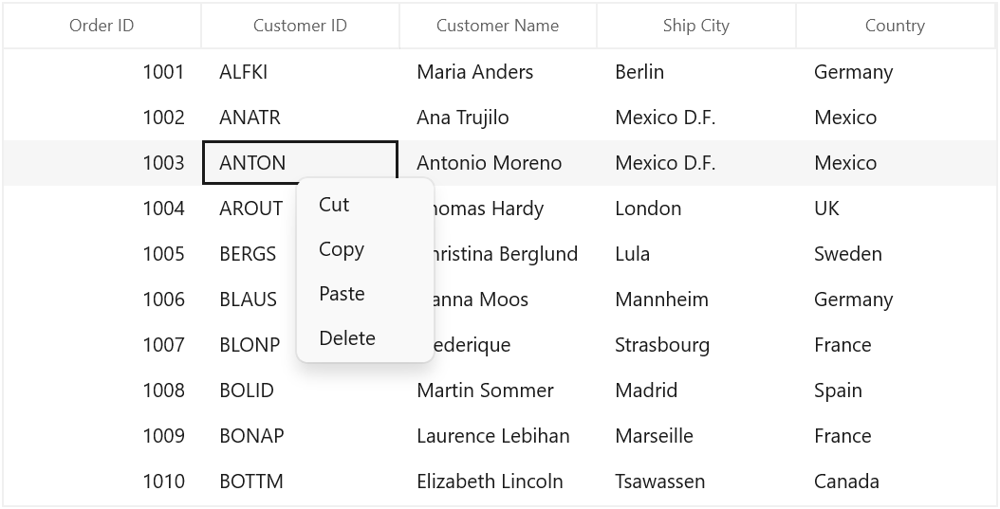
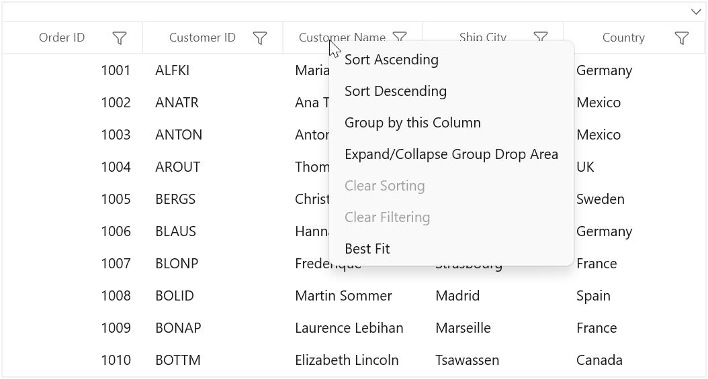
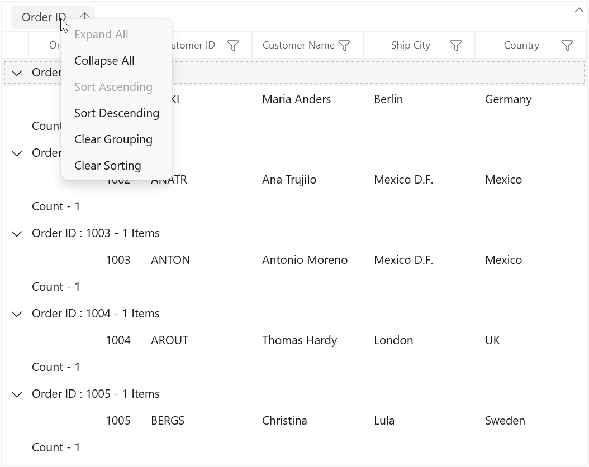
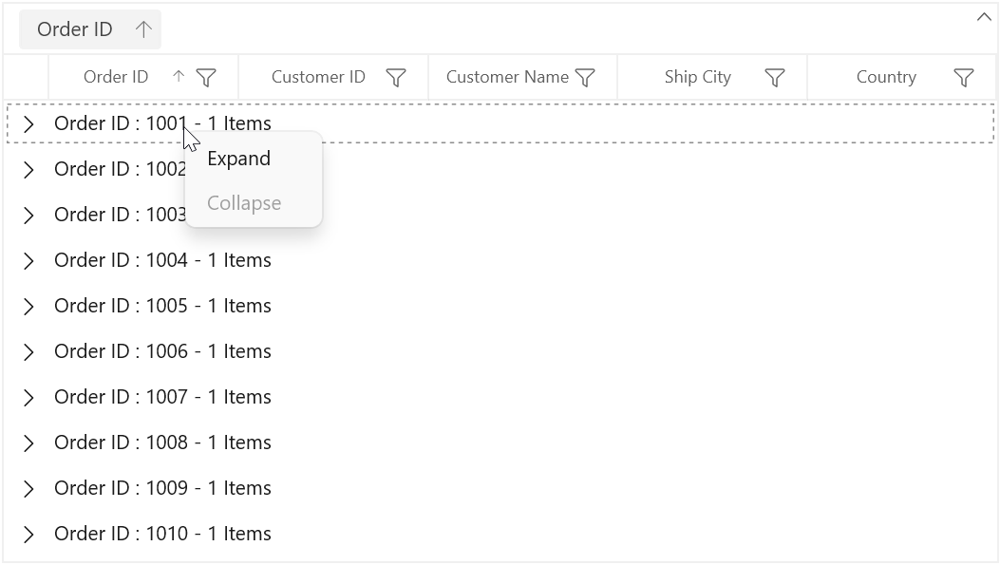
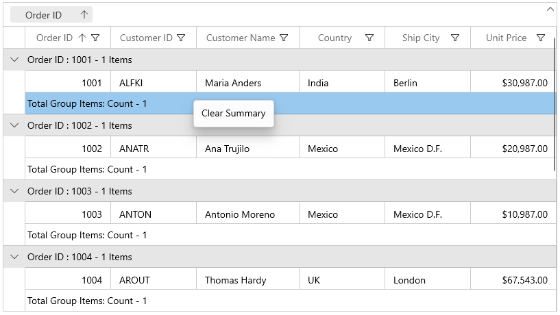
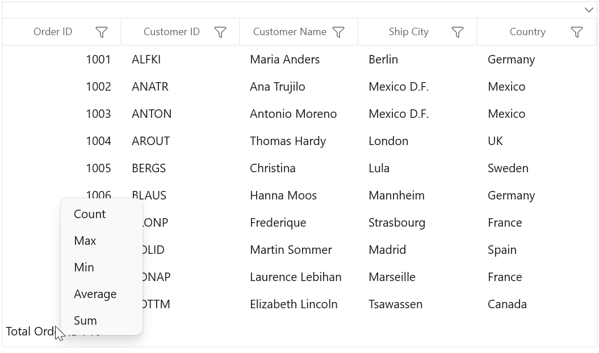
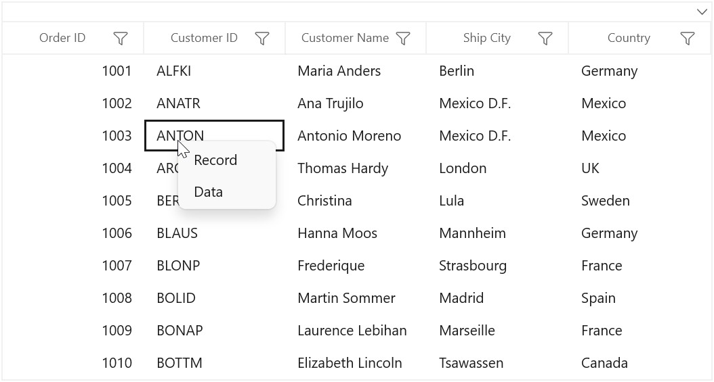
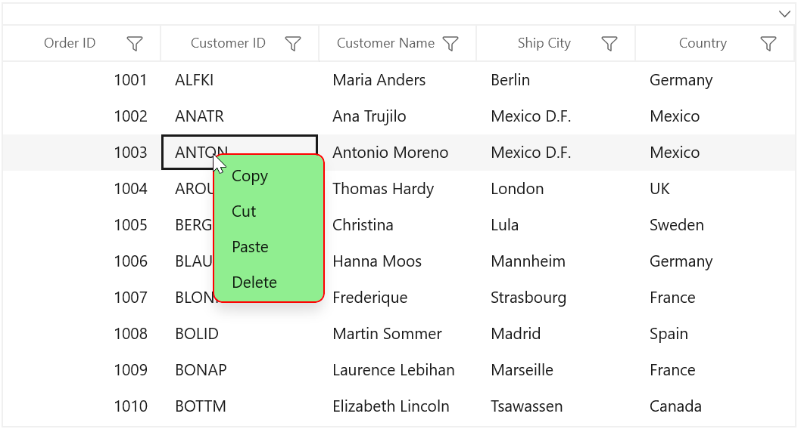

# Context Flyout in WinUI DataGrid

DataGrid provides an entirely customizable context flyout to expose the functionality on user interface. You can create context flyout for different rows in an efficient manner. 

The below code example shows the context flyout with command bindings.




<MenuFlyout>    
    <MenuFlyoutItem Command="{Binding Path=DataGrid.DataContext.GridCopyCommand}" 
                    CommandParameter="{Binding}" Text="Copy" />    
</MenuFlyout>






using Syncfusion.UI.Xaml.Core;
using Syncfusion.UI.Xaml.DataGrid;

public class OrderInfoViewModel
{
    public OrderInfoViewModel()
    {
        _gridCopyCommand = new DelegateCommand(Copy);
    }
        
    private DelegateCommand _gridCopyCommand;

    /// 

    /// Gets and sets the copy command
    /// 

    public DelegateCommand GridCopyCommand
    {
        get { return _gridCopyCommand; }
        set { _gridCopyCommand = value; }
    }
    
    /// 

    /// Copy the specified record.
    /// 

    /// <param name="param">
    /// Specifies the <see cref="Syncfusion.UI.Xaml.DataGrid.GridRecordContextFlyoutInfo"/>
    /// </param>
    public void Copy(object param)
    {
        if (param is GridRecordContextFlyoutInfo)
        {	
            var dataGrid = (param as GridRecordContextFlyoutInfo).DataGrid;
            dataGrid.ClipboardController.Copy();
        }
    }
}




## Context flyout for record rows

You can set the context flyout for the data rows by using [SfDataGrid.RecordContextFlyout](https://help.syncfusion.com/cr/winui/Syncfusion.UI.Xaml.Grids.SfGridBase.html#Syncfusion_UI_Xaml_Grids_SfGridBase_RecordContextFlyout) property. 



xmlns:dataGrid="using:Syncfusion.UI.Xaml.DataGrid"

<dataGrid:SfDataGrid.RecordContextFlyout>
    <MenuFlyout>
        <MenuFlyoutItem Text="Cut" />
        <MenuFlyoutItem Text="Copy" />
        <MenuFlyoutItem Text="Paste" />
        <MenuFlyoutItem Text="Delete" />
    </MenuFlyout>
</dataGrid:SfDataGrid.RecordContextFlyout>





this.sfDataGrid.RecordContextFlyout = new MenuFlyout();
this.sfDataGrid.RecordContextFlyout.Items.Add(new MenuFlyoutItem() { Text = "Cut" });
this.sfDataGrid.RecordContextFlyout.Items.Add(new MenuFlyoutItem() { Text = "Copy" });
this.sfDataGrid.RecordContextFlyout.Items.Add(new MenuFlyoutItem() { Text = "Paste" });
this.sfDataGrid.RecordContextFlyout.Items.Add(new MenuFlyoutItem() { Text = "Delete" });




While binding the flyout item using CommandBinding you can get the command parameter as `GridRecordContextFlyoutInfo` which contains the record of the corresponding row.




<dataGrid:SfDataGrid.RecordContextFlyout>
    <MenuFlyout>        
        <MenuFlyoutItem Command="{Binding Path=DataGrid.DataContext.GridCopyCommand}" 
                        CommandParameter="{Binding}" Text="Copy" />        
    </MenuFlyout>
</dataGrid:SfDataGrid.RecordContextFlyout>





private void OnCopyClicked(object param)
{
    if (param is GridRecordContextFlyoutInfo)
    {
        var dataGrid = (param as GridRecordContextFlyoutInfo).DataGrid;        
        dataGrid.ClipboardController.Copy();
    }
}




## Context flyout for column header

You can set the context flyout for the header by using [SfDataGrid.HeaderContextFlyout](https://help.syncfusion.com/cr/winui/Syncfusion.UI.Xaml.Grids.SfGridBase.html#Syncfusion_UI_Xaml_Grids_SfGridBase_HeaderContextFlyout) property. 




<dataGrid:SfDataGrid.HeaderContextFlyout>
    <MenuFlyout>
        <MenuFlyoutItem Text="Sort Ascending" />
        <MenuFlyoutItem Text="Sort Descending" />
        <MenuFlyoutItem Text="Group by this Column" />
        <MenuFlyoutItem Text="Expand/Collapse Group Drop Area" />
        <MenuFlyoutItem Text="Clear Sorting" />
        <MenuFlyoutItem Text="Clear Filtering" />
        <MenuFlyoutItem Text="Best Fit" />
    </MenuFlyout>
</dataGrid:SfDataGrid.HeaderContextFlyout>





this.sfDataGrid.HeaderContextFlyout = new MenuFlyout();
this.sfDataGrid.HeaderContextFlyout.Items.Add(new MenuFlyoutItem() { Text = "Sort Ascending" });
this.sfDataGrid.HeaderContextFlyout.Items.Add(new MenuFlyoutItem() { Text = "Sort Descending" });
this.sfDataGrid.HeaderContextFlyout.Items.Add(new MenuFlyoutItem() { Text = "Clear Sorting" });
this.sfDataGrid.HeaderContextFlyout.Items.Add(new MenuFlyoutItem() { Text = "Clear Filtering" });
this.sfDataGrid.HeaderContextFlyout.Items.Add(new MenuFlyoutItem() { Text = "Group by this Column" });
this.sfDataGrid.HeaderContextFlyout.Items.Add(new MenuFlyoutItem() { Text = "Expand/Collapse Group Drop Area" });
this.sfDataGrid.HeaderContextFlyout.Items.Add(new MenuFlyoutItem() { Text = "Best Fit" });




While binding the flyout item using CommandBinding you can get the parameter as `GridColumnContextFlyoutInfo` which contains the particular GridColumn.




<dataGrid:SfDataGrid.HeaderContextFlyout>
    <MenuFlyout>
        <MenuFlyoutItem Text="Sort Ascending" Command="{Binding Path=DataGrid.DataContext.SortAscendingCommand}"                CommandParameter="{Binding}" />       
    </MenuFlyout>
</dataGrid:SfDataGrid.HeaderContextFlyout>





private void OnSortAscendingClicked(object param)
{
    if (param is GridColumnContextFlyoutInfo)
    {
        var dataGrid = (param as GridContextFlyoutInfo).DataGrid;
        var column = (param as GridColumnContextFlyoutInfo).Column;
        dataGrid.SortColumnDescriptions.Clear();
        dataGrid.SortColumnDescriptions.Add(new SortColumnDescription() { ColumnName = column.MappingName, SortDirection = ListSortDirection.Ascending });
    }
}




## Context flyout for group item

You can set the context flyout for the group drop item by using [SfDataGrid.GroupDropItemContextFlyout](https://help.syncfusion.com/cr/winui/Syncfusion.UI.Xaml.DataGrid.SfDataGrid.html#Syncfusion_UI_Xaml_DataGrid_SfDataGrid_GroupDropItemContextFlyout) property. 




<dataGrid:SfDataGrid.GroupDropItemContextFlyout>
    <MenuFlyout>
        <MenuFlyoutItem Text="Expand All" />
        <MenuFlyoutItem Text="Collapse All" />
        <MenuFlyoutItem Text="Sort Ascending" />
        <MenuFlyoutItem Text="Sort Descending" />
        <MenuFlyoutItem Text="Clear Grouping" />
        <MenuFlyoutItem Text="Clear Sorting" />
    </MenuFlyout>
</dataGrid:SfDataGrid.GroupDropItemContextFlyout>





this.sfDataGrid.GroupDropItemContextFlyout = new MenuFlyout();
this.sfDataGrid.GroupDropItemContextFlyout.Items.Add(new MenuFlyoutItem() { Text = "Expand All" });
this.sfDataGrid.GroupDropItemContextFlyout.Items.Add(new MenuFlyoutItem() { Text = "Collapse All" });
this.sfDataGrid.GroupDropItemContextFlyout.Items.Add(new MenuFlyoutItem() { Text = "Sort Ascending" });
this.sfDataGrid.GroupDropItemContextFlyout.Items.Add(new MenuFlyoutItem() { Text = "Sort Descending" });
this.sfDataGrid.GroupDropItemContextFlyout.Items.Add(new MenuFlyoutItem() { Text = "Clear Grouping" });
this.sfDataGrid.GroupDropItemContextFlyout.Items.Add(new MenuFlyoutItem() { Text = "Clear Sorting" });            




While binding the flyout item using CommandBinding you can get the parameter as `GridColumnContextFlyoutInfo` which contains the particular GridColumn.




<dataGrid:SfDataGrid.GroupDropItemContextFlyout>
    <MenuFlyout>        
        <MenuFlyoutItem Text="Collapse All" Command="{Binding Path=DataGrid.DataContext.CollapseAllCommand}"
                        CommandParameter="{Binding}" />
    </MenuFlyout>
</dataGrid:SfDataGrid.GroupDropItemContextFlyout>





private void OnCollapseAllClicked(object param)
{
    if (param is GridContextFlyoutInfo)
    {
        var dataGrid = (param as GridContextFlyoutInfo).DataGrid;
        dataGrid.CollapseAllGroup();
    }    
}




## Context flyout for caption summary wow

You can set the context flyout for the group caption by using [SfDataGrid.GroupCaptionContextFlyout](https://help.syncfusion.com/cr/winui/Syncfusion.UI.Xaml.DataGrid.SfDataGrid.html#Syncfusion_UI_Xaml_DataGrid_SfDataGrid_GroupCaptionContextFlyout) property. 




<dataGrid:SfDataGrid.GroupCaptionContextFlyout>
    <MenuFlyout>
        <MenuFlyoutItem Text="Expand" />
        <MenuFlyoutItem Text="Collapse" />
    </MenuFlyout>
</dataGrid:SfDataGrid.GroupCaptionContextFlyout>





this.sfDataGrid.GroupCaptionContextFlyout = new MenuFlyout();
this.sfDataGrid.GroupCaptionContextFlyout.Items.Add(new MenuFlyoutItem() { Text = "Expand" });
this.sfDataGrid.GroupCaptionContextFlyout.Items.Add(new MenuFlyoutItem() { Text = "Collapse" });




While binding the flyout item using CommandBinding you can get the command parameter as `GridRecordContextFlyoutInfo` which contains the record of the corresponding row.




<dataGrid:SfDataGrid.GroupCaptionContextFlyout>
    <MenuFlyout>
        <MenuFlyoutItem Text="Expand" Command="{Binding Path=DataGrid.DataContext.ExpandCommand}"
                        CommandParameter="{Binding}" />        
    </MenuFlyout>
</dataGrid:SfDataGrid.GroupCaptionContextFlyout>





private void OnExpandClicked(object param)
{
    if (param is GridRecordContextFlyoutInfo)
    {
        var dataGrid = (param as GridRecordContextFlyoutInfo).DataGrid;
        var group = (param as GridRecordContextFlyoutInfo).Record as Group;
        dataGrid.ExpandGroup(group);
    } 
}




## Context flyout for group summary row

You can set the context flyout for the group summary by using [SfDataGrid.GroupSummaryContextFlyout](https://help.syncfusion.com/cr/winui/Syncfusion.UI.Xaml.DataGrid.SfDataGrid.html#Syncfusion_UI_Xaml_DataGrid_SfDataGrid_GroupSummaryContextFlyout) property. 




<dataGrid:SfDataGrid.GroupSummaryContextFlyout>
    <MenuFlyout>
        <MenuFlyoutItem Text="Clear Summary" />
    </MenuFlyout>
</dataGrid:SfDataGrid.GroupSummaryContextFlyout>





this.sfDataGrid.GroupSummaryContextFlyout = new MenuFlyout();
this.sfDataGrid.GroupSummaryContextFlyout.Items.Add(new MenuFlyoutItem() { Text = "Clear Summary" });




While binding the flyout item using CommandBinding you can get the command parameter as `GridRecordContextFlyoutInfo` which contains the record of the corresponding row.




<dataGrid:SfDataGrid.GroupSummaryContextFlyout>
    <MenuFlyout>
        <MenuFlyoutItem Text="Clear Summary" Command="{Binding Path=DataGrid.DataContext.ClearSummaryCommand}"
                        CommandParameter="{Binding}" />
    </MenuFlyout>
</dataGrid:SfDataGrid.GroupSummaryContextFlyout>





private void OnClearSummaryClicked(object param)
{ 
    if (param is GridRecordContextFlyoutInfo)
    {
        var dataGrid = (param as GridRecordContextFlyoutInfo).DataGrid;
        if (dataGrid.GroupSummaryRows.Any())
            dataGrid.GroupSummaryRows.Clear();
    }
}




## Context flyout for table summary row

You can set the context flyout for the table summary by using [SfDataGrid.TableSummaryContextFlyout](https://help.syncfusion.com/cr/winui/Syncfusion.UI.Xaml.DataGrid.SfDataGrid.html#Syncfusion_UI_Xaml_DataGrid_SfDataGrid_TableSummaryContextFlyout) property. 




<dataGrid:SfDataGrid.TableSummaryContextFlyout>
    <MenuFlyout>
        <MenuFlyoutItem Text="Count" />
        <MenuFlyoutItem Text="Max" />
        <MenuFlyoutItem Text="Min" />
        <MenuFlyoutItem Text="Average" />
        <MenuFlyoutItem Text="Sum" />
    </MenuFlyout>
</dataGrid:SfDataGrid.TableSummaryContextFlyout>





this.sfDataGrid.TableSummaryContextFlyout = new MenuFlyout();
this.sfDataGrid.TableSummaryContextFlyout.Items.Add(new MenuFlyoutItem() { Text = "Count" });
this.sfDataGrid.TableSummaryContextFlyout.Items.Add(new MenuFlyoutItem() { Text = "Max" });
this.sfDataGrid.TableSummaryContextFlyout.Items.Add(new MenuFlyoutItem() { Text = "Min" });
this.sfDataGrid.TableSummaryContextFlyout.Items.Add(new MenuFlyoutItem() { Text = "Average" });
this.sfDataGrid.TableSummaryContextFlyout.Items.Add(new MenuFlyoutItem() { Text = "Sum" });




While binding the flyout item using CommandBinding you can get the command parameter as `GridRecordContextFlyoutInfo` which contains the record of the corresponding row.




<dataGrid:SfDataGrid.TableSummaryContextFlyout>
    <MenuFlyout>
        <MenuFlyoutItem Text="Count" Command="{Binding Path=DataGrid.DataContext.TotalSummaryCountCommand}"
                        CommandParameter="{Binding}" />
    </MenuFlyout>
</dataGrid:SfDataGrid.TableSummaryContextFlyout>





private void OnTotalSummaryCountClicked(object param)
{
    if (param is GridRecordContextFlyoutInfo)
    {
        var dataGrid = (param as GridRecordContextFlyoutInfo).DataGrid;
        var summaryRecord = (param as GridRecordContextFlyoutInfo).Record as SummaryRecordEntry;
        if (summaryRecord != null)
        {
            var summaryRow = new GridSummaryRow() { Name = "totalGroupSummaryRow", Title = "{totalSummary}", ShowSummaryInRow = true };
            summaryRow.SummaryColumns.Add(new GridSummaryColumn() { Name = "totalSummary", MappingName = "OrderID", SummaryType = SummaryType.CountAggregate, Format = "Total OrderID Count : {Count}" });
            dataGrid.TableSummaryRows.Clear();
            dataGrid.TableSummaryRows.Add(summaryRow);
        }
    }    
}




## Events

### GridContextFlyoutOpening

[GridContextFlyoutOpening](https://help.syncfusion.com/cr/winui/Syncfusion.UI.Xaml.DataGrid.SfDataGrid.html#Syncfusion_UI_Xaml_DataGrid_SfDataGrid_GridContextFlyoutOpening) event occurs while opening the context flyout in SfDataGrid. 

[GridContextFlyoutEventArgs](https://help.syncfusion.com/cr/winui/Syncfusion.UI.Xaml.DataGrid.GridContextFlyoutEventArgs.html) has the following members which provides the information about `GridContextFlyoutOpening` event.

* [ContextFlyout](https://help.syncfusion.com/cr/winui/Syncfusion.UI.Xaml.DataGrid.GridContextFlyoutEventArgs.html#Syncfusion_UI_Xaml_DataGrid_GridContextFlyoutEventArgs_ContextFlyout) – Gets the corresponding context flyout.

* [ContextFlyoutInfo](https://help.syncfusion.com/cr/winui/Syncfusion.UI.Xaml.DataGrid.GridContextFlyoutEventArgs.html#Syncfusion_UI_Xaml_DataGrid_GridContextFlyoutEventArgs_ContextFlyoutInfo) – Returns the context flyout info based on the row which opens the context flyout.

* [ContextFlyoutType](https://help.syncfusion.com/cr/winui/Syncfusion.UI.Xaml.DataGrid.GridContextFlyoutEventArgs.html#Syncfusion_UI_Xaml_DataGrid_GridContextFlyoutEventArgs_ContextFlyoutType) – Returns the type of context flyout.

* [RowColumnIndex](https://help.syncfusion.com/cr/winui/Syncfusion.UI.Xaml.DataGrid.GridContextFlyoutEventArgs.html#Syncfusion_UI_Xaml_DataGrid_GridContextFlyoutEventArgs_RowColumnIndex) – `RowColumnIndex` of the context flyout which is currently going to open. `RowColumnIndex` is updated only for the `RecordContextFlyout` and remains left empty.

* [Handled](https://help.syncfusion.com/cr/winui/Syncfusion.UI.Xaml.Grids.GridHandledEventArgs.html#Syncfusion_UI_Xaml_Grids_GridHandledEventArgs_Handled) – Indicates whether the `GridContextFlyoutOpening` event is handled or not.

## Customization of context flyout

### Change the flyout item when the context flyout opening.

You can use the `GridContextFlyoutOpening` event to change the flyout item when the context flyout opening.




<dataGrid:SfDataGrid.RecordContextFlyout>
    <MenuFlyout>
        <MenuFlyoutItem Command="{Binding Path=DataGrid.DataContext.GridCopyCommand}" CommandParameter="{Binding}" Text="Copy" />
        <MenuFlyoutItem Command="{Binding Path=DataGrid.DataContext.GridCutCommand}" CommandParameter="{Binding}" Text="Cut" />
        <MenuFlyoutItem Command="{Binding Path=DataGrid.DataContext.GridPasteCommand}" CommandParameter="{Binding}" Text="Paste" />
        <MenuFlyoutItem Command="{Binding Path=DataGrid.DataContext.DeleteCommand}" CommandParameter="{Binding}" Text="Delete" />
    </MenuFlyout>
</dataGrid:SfDataGrid.RecordContextFlyout>





this.sfDataGrid.GridContextFlyoutOpening += SfDataGrid_GridContextFlyoutOpening;

private void SfDataGrid_GridContextFlyoutOpening(object sender, GridContextFlyoutEventArgs e)
{
    e.ContextFlyout.Items.Clear();

    if (e.ContextFlyoutType == ContextFlyoutType.RecordCell)
    {
        e.ContextFlyout.Items.Add(new MenuFlyoutItem() { Text = "Record" });
        e.ContextFlyout.Items.Add(new MenuFlyoutItem() { Text = "Data" });
    }
}



       

### Changing background of context flyout

You can change the appearance of the context flyout by customizing the style with TargetType as MenuFlyoutPresenter.




<MenuFlyout MenuFlyoutPresenterStyle="{StaticResource menuFlyoutPresenterStyle}">    
    <MenuFlyoutItem Text="Copy" />
    <MenuFlyoutItem Text="Cut" />
    <MenuFlyoutItem Text="Paste" />
    <MenuFlyoutItem Text="Delete" />
</MenuFlyout>




