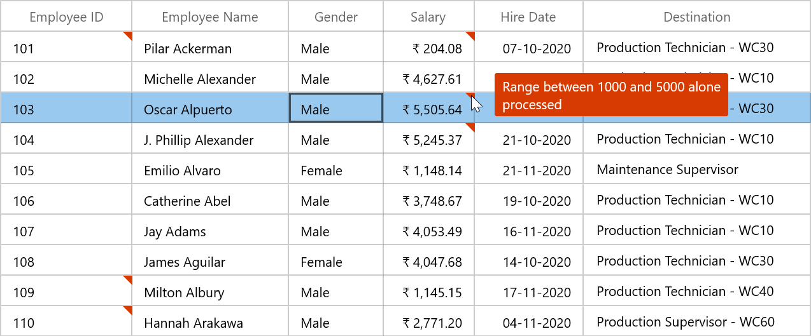
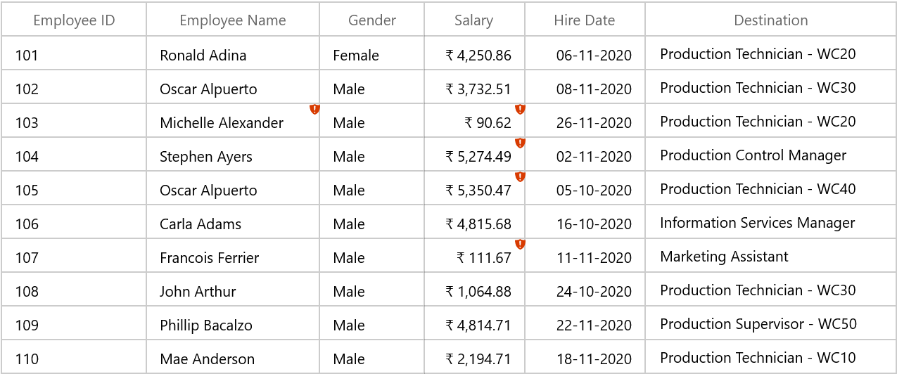
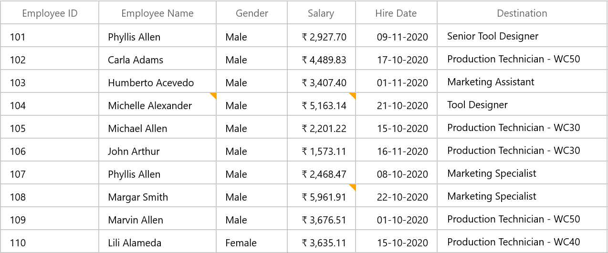
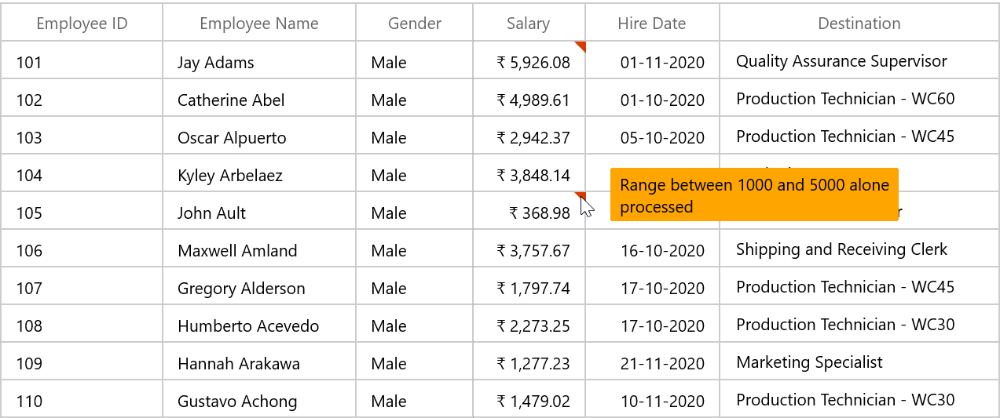
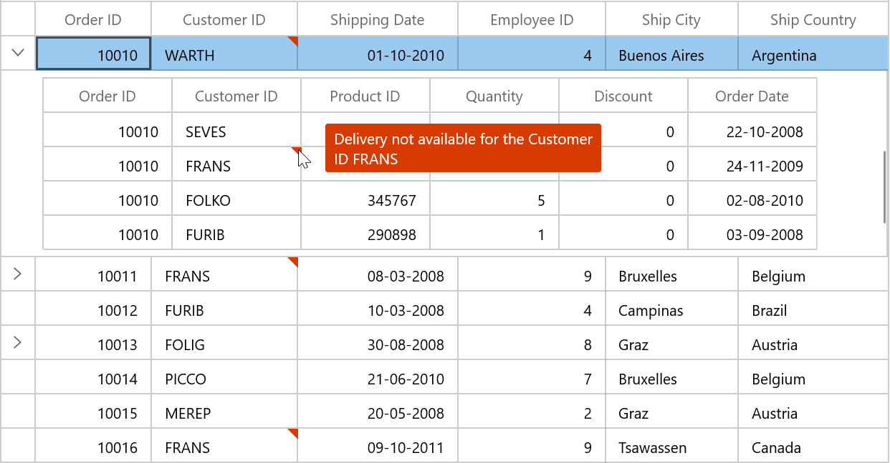

# Data Validation in WinUI DataGrid

SfDataGrid allows you to validate the data and display hints in case of validation is not passed. In case of invalid data, error icon is displayed at the top right corner of [GridCell](https://help.syncfusion.com/cr/winui/Syncfusion.UI.Xaml.DataGrid.GridCell.html). When mouse over the error icon, error information will be displayed in tooltip.
 
## Built-in validations

Built-in validations through `INotifyDataErrorInfo` and Data annotation attributes, can be enabled by setting [SfDataGrid.DataValidationMode](https://help.syncfusion.com/cr/winui/Syncfusion.UI.Xaml.Grids.SfGridBase.html#Syncfusion_UI_Xaml_Grids_SfGridBase_DataValidationMode) or [GridColumn.DataValidationMode](https://help.syncfusion.com/cr/winui/Syncfusion.UI.Xaml.Grids.GridColumnBase.html#Syncfusion_UI_Xaml_Grids_GridColumnBase_DataValidationMode) properties.

 `GridColumn.DataValidationMode` takes priority than `SfDataGrid.DataValidationMode`.

* `GridValidationMode .InView` - displays error icons and tips alone.
* `GridValidationMode .None` - disables built-in validation support.

## Built-in validation using INotifyDataErrorInfo

SfDataGrid provides support to validate the data based on [INotifyDataErrorInfo](https://docs.microsoft.com/en-us/windows/winui/api/microsoft.ui.xaml.data.inotifydataerrorinfo?view=winui-3.0-preview).

You can validate the data by inheriting the [INotifyDataErrorInfo](https://docs.microsoft.com/en-us/windows/winui/api/microsoft.ui.xaml.data.inotifydataerrorinfo?view=winui-3.0-preview) interface in model class.



public class Employee : INotifyDataErrorInfo
{
    private int _EmployeeID;

    /// 

    /// Gets or sets the employee ID.
    /// 

    /// <value>The employee ID.</value>
    public int EmployeeID
    {
        get
        {
            return this._EmployeeID;
        }
        set
        {
            this._EmployeeID = value;
        }
    }

    private List<string> errors = new List<string>();
    public IEnumerable<object> GetErrors(string propertyName)
    {
        if (!propertyName.Equals("EmployeeID"))
            return null;

        if (this.EmployeeID == 103 || this.EmployeeID == 104)
            errors.Add("Delivery not available for " + this.EmployeeID);
        return errors;
    }

    [Display(AutoGenerateField = false)]
    public bool HasErrors
    {
        get
        {
            if (this.EmployeeID == 103 || this.EmployeeID == 104)
                return true;
            return false;
        }
    }
    public event EventHandler<DataErrorsChangedEventArgs> ErrorsChanged;
}



Enable built-in validation support by setting [SfDataGrid.DataValidationMode]((https://help.syncfusion.com/cr/winui/Syncfusion.UI.Xaml.Grids.SfGridBase.html#Syncfusion_UI_Xaml_Grids_SfGridBase_DataValidationMode) or [GridColumn.DataValidationMode](https://help.syncfusion.com/cr/winui/Syncfusion.UI.Xaml.Grids.GridColumnBase.html#Syncfusion_UI_Xaml_Grids_GridColumnBase_DataValidationMode) property to `InView`.



<dataGrid:SfDataGrid  x:Name="sfDataGrid"
                        DataValidationMode="InView"
                        AutoGenerateColumns="True"
                        ItemsSource="{Binding Employees}"/>


this.sfDataGrid.DataValidationMode = GridValidationMode.InView;



## Built-in validation using Data Annotation

You can validate the data using **data annotation attributes** by setting [SfDataGrid.DataValidationMode]((https://help.syncfusion.com/cr/winui/Syncfusion.UI.Xaml.Grids.SfGridBase.html#Syncfusion_UI_Xaml_Grids_SfGridBase_DataValidationMode) or [GridColumn.DataValidationMode](https://help.syncfusion.com/cr/winui/Syncfusion.UI.Xaml.Grids.GridColumnBase.html#Syncfusion_UI_Xaml_Grids_GridColumnBase_DataValidationMode) property to `InView`.

### Using different annotations

The numeric type like int, double, decimal properties can be validated using [Range attributes](https://msdn.microsoft.com/en-us/library/system.componentmodel.dataannotations.rangeattribute.aspx).




private int _EmployeeID;

/// 

/// Gets or sets the employee ID.
/// 

/// <value>The employee ID.</value>
[Range(102, 108, ErrorMessage = "EmployeeID between 102 and 108 alone processed")]
public int EmployeeID
{
    get
    {
        return this._EmployeeID;
    }
    set
    {
        this._EmployeeID = value;
    }
}

 private double _Salary;

/// 

/// Gets or sets the Salary.
/// 

/// <value>The Salary.</value>
[Range(typeof(double), "1000", "5000", ErrorMessage = "Range between 1000 and 5000 alone processed")]
public double Salary
{
    get
    {
        return this._Salary;
    }
    set
    {
        this._Salary = value;
    }
}
 



The string type property can be validated using [Required](https://msdn.microsoft.com/en-us/library/system.componentmodel.dataannotations.requiredattribute.aspx), [String Length attributes](https://msdn.microsoft.com/en-us/library/system.componentmodel.dataannotations.stringlengthattribute.aspx)



private string _Name;

/// 

/// Gets or sets the last name.
/// 

/// <value>The last name.</value>
[StringLength(17)]
public string Name
{
    get
    {
        return this._Name;
    }
    set
    {
        this._Name = value;
    }
}

private string _Title;

/// 

/// Gets or sets the title.
/// 

/// <value>The title.</value>
[Required]
public string Title
{
    get
    {
        return this._Title;
    }
    set
    {
        this._Title = value;
    }
}




The data that has heterogeneous type (combination of number, special character) can be validated using [RegularExpressions](https://msdn.microsoft.com/en-us/library/system.componentmodel.dataannotations.regularexpressionattribute.aspx).




private string _Title;
/// 

/// Gets or sets the title.
/// 

/// <value>The title.</value>
[RegularExpressionAttribute(@"^[a-zA-Z]{1,40}$", ErrorMessage = "Numbers and special characters not allowed")]

public string Title
{
    get
    {
        return this._Title;
    }
    set
    {
        this._Title = value;
    }
}




## Cell validation

You can validate the cells using [CurrentCellValidating](https://help.syncfusion.com/cr/winui/Syncfusion.UI.Xaml.DataGrid.SfDataGrid.html#Syncfusion_UI_Xaml_DataGrid_SfDataGrid_CurrentCellValidating) event when the cell is edited. `CurrentCellValidating` event occurs when the edited cells tries to commit the data or lose the focus. DataGrid will not allow user to edit other cells if validation failed.

[CurrentCellValidatingEventArgs](https://help.syncfusion.com/cr/winui/Syncfusion.UI.Xaml.DataGrid.CurrentCellValidatingEventArgs.html) provides information to `CurrentCellValidating` event for validating the cell. [CurrentCellValidatingEventArgs.OriginalSender](https://help.syncfusion.com/cr/winui/Syncfusion.UI.Xaml.Grids.GridEventArgs.html#Syncfusion_UI_Xaml_Grids_GridEventArgs_OriginalSender) returns the DataGrid fired this event.

[CurrentCellValidatingEventArgs.NewValue](https://help.syncfusion.com/cr/winui/Syncfusion.UI.Xaml.DataGrid.CurrentCellValidatingEventArgsBase.html#Syncfusion_UI_Xaml_DataGrid_CurrentCellValidatingEventArgsBase_NewValue) returns the edited value and you can set the validation status using [CurrentCellValidatingEventArgs.IsValid](https://help.syncfusion.com/cr/winui/Syncfusion.UI.Xaml.DataGrid.CurrentCellValidatingEventArgsBase.html#Syncfusion_UI_Xaml_DataGrid_CurrentCellValidatingEventArgsBase_IsValid) property.



this.sfDataGrid.CurrentCellValidating += SfDataGrid_CurrentCellValidating; 

private void SfDataGrid_CurrentCellValidating(object sender, CurrentCellValidatingEventArgs e)
{
    if (e.NewValue.ToString().Equals("1004"))
    {
        e.IsValid = false;
        e.ErrorMessage = "EmployeeID 1004 cannot be passed";
    }
}




[SfDataGrid.CurrentCellValidated](https://help.syncfusion.com/cr/winui/Syncfusion.UI.Xaml.DataGrid.SfDataGrid.html#Syncfusion_UI_Xaml_DataGrid_SfDataGrid_CurrentCellValidated) event triggered when the cell has finished validating with valid data.



this.sfDataGrid.CurrentCellValidated += SfDataGrid_CurrentCellValidated;

private void SfDataGrid_CurrentCellValidated(object sender, CurrentCellValidatedEventArgs e)
{
   
}




## Row validation

You can validate the row using [RowValidating](https://help.syncfusion.com/cr/winui/Syncfusion.UI.Xaml.DataGrid.SfDataGrid.html#Syncfusion_UI_Xaml_DataGrid_SfDataGrid_RowValidating) event when the cell is edited. The `RowValidating` event occurs when the edited cells tries to commit the row data or lose the focus. DataGrid will not allow user to edit other rows if validation failed.
 
[RowValidatingEventArgs](https://help.syncfusion.com/cr/winui/Syncfusion.UI.Xaml.DataGrid.RowValidatingEventArgs.html) provides information to `RowValidating` event for validating row. `RowValidatingEventArgs.OriginalSender` returns the DataGrid fired this event. 

[RowValidatingEventArgs.RowData](https://help.syncfusion.com/cr/winui/Syncfusion.UI.Xaml.DataGrid.RowValidatingEventArgs.html#Syncfusion_UI_Xaml_DataGrid_RowValidatingEventArgs_RowData) returns the edited value and you can set the validation status using [RowValidatingEventArgs.IsValid](https://help.syncfusion.com/cr/winui/Syncfusion.UI.Xaml.DataGrid.RowValidatingEventArgs.html#Syncfusion_UI_Xaml_DataGrid_RowValidatingEventArgs_IsValid) property.



this.sfDataGrid.RowValidating += SfDataGrid_RowValidating;

private void SfDataGrid_RowValidating(object sender, RowValidatingEventArgs e)
{
    var data = e.RowData.GetType().GetProperty("Name").GetValue(e.RowData);

    if (data.ToString().Equals("Marvin Allen"))
    {
        e.IsValid = false;
        e.ErrorMessages.Add("Name", "Marvin Allen cannot be passed");
    }
}




[SfDataGrid.RowValidated](https://help.syncfusion.com/cr/winui/Syncfusion.UI.Xaml.DataGrid.SfDataGrid.html#Syncfusion_UI_Xaml_DataGrid_SfDataGrid_RowValidated) event triggered when the row has finished validating with valid row data.



this.sfDataGrid.RowValidated += SfDataGrid_RowValidated;

private void SfDataGrid_RowValidated(object sender, RowValidatedEventArgs e)
{
           
}



## Data validation error icon customization

You can customize the error icon by editing `GridCell` style.

### Change the shape of error icon

You can change the validation error template shape of the GridCell by changing the `Data` property of the path in the `PART_InValidCellBorder` of GridCell. And need to add the DataGrid ThemeDictionary in ResourcesDictionary.




<ResourceDictionary>
    <ResourceDictionary.MergedDictionaries>
        <ResourceDictionary Source="ms-appx:///Syncfusion.Grid.WinUI/Control/Themes/Generic.xaml" />
         <!--Other merged dictionaries here--> 
    </ResourceDictionary.MergedDictionaries>    
</ResourceDictionary>




### Change the color of error icon

You can change the validation error template color of the `GridCell` by changing the `Fill` property of the path in the `PART_InValidCellBorder` of `GridCell`.




<ResourceDictionary>
    <ResourceDictionary.MergedDictionaries>
        <ResourceDictionary Source="ms-appx:///Syncfusion.Grid.WinUI/Control/Themes/Generic.xaml" />
         <!--Other merged dictionaries here--> 
    </ResourceDictionary.MergedDictionaries>    
</ResourceDictionary>




## Data validation error tip (help tip) customization

You can customize the error tip by editing the style of `ValidationToolTipTemplate`. Get the style of `ValidationToolTipTemplate` by editing the `GridCell` style.

### Change the background and foreground color of error tip

You can change the error tip background color by setting `Background` property of the border in `ValidationToolTipTemplate`. The error tip foreground color can be changed by setting `Foreground` property of the TextBlock in `ValidationToolTipTemplate`.



<ControlTemplate x:Key="ValidationToolTipTemplate">
    <Grid x:Name="PART_ToolTipPresenter"
      Margin="5,0"
      Opacity="0"
      RenderTransformOrigin="0,0">
        <Grid.RenderTransform>
            <TranslateTransform x:Name="Transform" X="-25" />
        </Grid.RenderTransform>
        <VisualStateManager.VisualStateGroups>
            <VisualStateGroup x:Name="OpenStates">
                <VisualStateGroup.Transitions>
                    <VisualTransition GeneratedDuration="0" />
                    <VisualTransition GeneratedDuration="0:0:0.2" To="Opened">
                        <Storyboard>
                            <DoubleAnimation Duration="0:0:0.2"
                                         Storyboard.TargetName="Transform"
                                         Storyboard.TargetProperty="X"
                                         To="0">
                                <DoubleAnimation.EasingFunction>
                                    <BackEase Amplitude=".3" EasingMode="EaseOut" />
                                </DoubleAnimation.EasingFunction>
                            </DoubleAnimation>
                            <DoubleAnimation Duration="0:0:0.2"
                                         Storyboard.TargetName="PART_ToolTipPresenter"
                                         Storyboard.TargetProperty="Opacity"
                                         To="1" />
                        </Storyboard>
                    </VisualTransition>
                </VisualStateGroup.Transitions>
                <VisualState x:Name="Closed">
                    <Storyboard>
                        <DoubleAnimation Duration="0"
                                     Storyboard.TargetName="PART_ToolTipPresenter"
                                     Storyboard.TargetProperty="Opacity"
                                     To="0" />
                    </Storyboard>
                </VisualState>
                <VisualState x:Name="Opened">
                    <Storyboard>
                        <DoubleAnimation Duration="0"
                                     Storyboard.TargetName="Transform"
                                     Storyboard.TargetProperty="X"
                                     To="0" />
                        <DoubleAnimation Duration="0"
                                     Storyboard.TargetName="PART_ToolTipPresenter"
                                     Storyboard.TargetProperty="Opacity"
                                     To="1" />
                    </Storyboard>
                </VisualState>
            </VisualStateGroup>
        </VisualStateManager.VisualStateGroups>
        <Border Margin="4,4,-4,-4"
            Background="Transparent"
            CornerRadius="5" />
        <Border Margin="3,3,-3,-3"
            Background="Transparent"
            CornerRadius="4" />
        <Border Margin="2,2,-2,-2"
            Background="Transparent"
            CornerRadius="3" />
        <Border Margin="1,1,-1,-1"
            Background="Transparent"
            CornerRadius="2" />
        <Border Background="{ThemeResource SystemErrorColor}" CornerRadius="2" />
        <Border CornerRadius="2" Background="Orange" BorderBrush="{ThemeResource SystemErrorColor}">
            <TextBlock MaxWidth="250"
                   Margin="8,4,8,4"
                   SelectionHighlightColor="Transparent"
                   FontFamily="{ThemeResource SfDataGridValidationToolTipFontFamily}"
                   FontSize="{ThemeResource SfDataGridValidationToolTipFontSize}"
                   FontWeight="{ThemeResource SfDataGridValidationToolTipFontWeight}"
                   Foreground="Black"
                   Text="{TemplateBinding Tag}"
                   TextWrapping="Wrap"
                   UseLayoutRounding="false" />
        </Border>
    </Grid>
</ControlTemplate>




## Showing error details in RowHeader

SfDataGrid support to show the error icon in [GridRowHeaderCell](https://help.syncfusion.com/cr/winui/Syncfusion.UI.Xaml.DataGrid.GridRowHeaderCell.html) based on [INotifyDataErrorInfo.HasErrors](https://msdn.microsoft.com/en-us/library/system.componentmodel.inotifydataerrorinfo.haserrors.aspx) property.

### Using INotifyDataErrorInfo

You can show the error information in row header by setting [INotifyDataErrorInfo.HasErrors](https://docs.microsoft.com/en-us/windows/winui/api/microsoft.ui.xaml.data.inotifydataerrorinfo.haserrors?view=winui-3.0-preview). By default error message **Row Containing Error** will be displayed.  You can change this by changing `RowErrorMessage` in the **resx** file.



[Display(AutoGenerateField = false)]
public bool HasErrors
{
    get
    {
        if (this.EmployeeID == 103 || this.EmployeeID == 104)
            return true;
        return false;
    }
}




## Data validation with Master-details view

Master-Details View allows you to validate the bound data is valid or not. 
You can do both built-in and custom validation of data in `DetailsViewDataGrid`.

### Built-in validations

You can validate the bound data based on [INotifyDataErrorInfo](https://docs.microsoft.com/en-us/windows/winui/api/microsoft.ui.xaml.data.inotifydataerrorinfo?view=winui-3.0-preview) or [Data Annotation](https://msdn.microsoft.com/en-us/library/system.componentmodel.dataannotations.aspx) attributes by setting [DataValidationMode](https://help.syncfusion.com/cr/winui/Syncfusion.UI.Xaml.DataGrid.DataValidation.html) property of [GridViewDefinition.DataGrid]https://help.syncfusion.com/cr/winui/Syncfusion.UI.Xaml.DataGrid.GridViewDefinition.html#Syncfusion_UI_Xaml_DataGrid_GridViewDefinition_DataGrid).



<dataGrid:SfDataGrid  x:Name="sfDataGrid"
                        AutoGenerateColumns="True"
                        ItemsSource="{Binding OrdersDetails}">
            <dataGrid:SfDataGrid.DetailsViewDefinition>
                <dataGrid:GridViewDefinition RelationalColumn="OrderDetails">
                    <dataGrid:GridViewDefinition.DataGrid>
                        <dataGrid:SfDataGrid  x:Name="firstLevelDetailsViewGrid"  
                                                AutoGenerateColumns="True"   
                                                DataValidationMode="InView"/>
                    </dataGrid:GridViewDefinition.DataGrid>
                </dataGrid:GridViewDefinition>
            </dataGrid:SfDataGrid.DetailsViewDefinition>
</dataGrid:SfDataGrid>



When the relation is auto-generated, the data can be validated by setting `DataValidationMode` property to `GridViewDefinition.DataGrid` in [AutoGeneratingRelations](https://help.syncfusion.com/cr/winui/Syncfusion.UI.Xaml.DataGrid.SfDataGrid.html#Syncfusion_UI_Xaml_DataGrid_SfDataGrid_AutoGeneratingRelations) event handler.



sfDataGrid.AutoGenerateRelations = true;

sfDataGrid.AutoGeneratingRelations += SfDataGrid_AutoGeneratingRelations;

private void SfDataGrid_AutoGeneratingRelations(object sender, AutoGeneratingRelationsArgs e)
{
    e.GridViewDefinition.DataGrid.DataValidationMode = GridValidationMode.InView;
}




### Custom validation through events

Master-Details View support to validate the cells and rows using [CurrentCellValidating](https://help.syncfusion.com/cr/winui/Syncfusion.UI.Xaml.DataGrid.SfDataGrid.html#Syncfusion_UI_Xaml_DataGrid_SfDataGrid_CurrentCellValidating) and [RowValidating](https://help.syncfusion.com/cr/winui/Syncfusion.UI.Xaml.DataGrid.SfDataGrid.html#Syncfusion_UI_Xaml_DataGrid_SfDataGrid_RowValidating) events.

#### Cell Validation

You can validate the cells using [CurrentCellValidating](https://help.syncfusion.com/cr/winui/Syncfusion.UI.Xaml.DataGrid.SfDataGrid.html#Syncfusion_UI_Xaml_DataGrid_SfDataGrid_CurrentCellValidating) event of [GridViewDefinition.DataGrid](https://help.syncfusion.com/cr/winui/Syncfusion.UI.Xaml.DataGrid.GridViewDefinition.html#Syncfusion_UI_Xaml_DataGrid_GridViewDefinition_DataGrid) when the cell is edited. `CurrentCellValidating` event occurs when the edited cells tries to commit the data or lose the focus. 



<dataGrid:SfDataGrid  x:Name="sfDataGrid"
                        AutoGenerateColumns="True"
                        DataValidationMode="InView"
                        NavigationMode="Cell"
                        ItemsSource="{Binding OrdersDetails}">
            <dataGrid:SfDataGrid.DetailsViewDefinition>
                <dataGrid:GridViewDefinition RelationalColumn="OrderDetails">
                    <dataGrid:GridViewDefinition.DataGrid>
                        <dataGrid:SfDataGrid  x:Name="firstLevelDetailsViewGrid" 
                                                AutoGenerateColumns="True"       CurrentCellValidating="FirstLevelDetailsViewGrid_CurrentCellValidating">
                        </dataGrid:SfDataGrid>
                    </dataGrid:GridViewDefinition.DataGrid>
                </dataGrid:GridViewDefinition>
            </dataGrid:SfDataGrid.DetailsViewDefinition>
</dataGrid:SfDataGrid>



 



this.firstLevelDetailsViewGrid.CurrentCellValidating += FirstLevelDetailsViewGrid_CurrentCellValidating;

private void FirstLevelDetailsViewGrid_CurrentCellValidating(object sender, CurrentCellValidatingEventArgs e)
{
    if (e.NewValue.ToString().Equals("FRANS"))
    {
        e.IsValid = false;
        e.ErrorMessage = "Order not delivered for the ID FRANS";
    }
}




[CurrentCellValidated](https://help.syncfusion.com/cr/winui/Syncfusion.UI.Xaml.DataGrid.SfDataGrid.html#Syncfusion_UI_Xaml_DataGrid_SfDataGrid_CurrentCellValidated) event of [GridViewDefinition.DataGrid](https://help.syncfusion.com/cr/winui/Syncfusion.UI.Xaml.DataGrid.GridViewDefinition.html#Syncfusion_UI_Xaml_DataGrid_GridViewDefinition_DataGrid) triggered when the cell has finished validating with valid data



<dataGrid:SfDataGrid  x:Name="sfDataGrid"
                        AutoGenerateColumns="True"
                        DataValidationMode="InView"
                        NavigationMode="Cell"
                        ItemsSource="{Binding OrdersDetails}"
                        AllowEditing="True">
    <dataGrid:SfDataGrid.DetailsViewDefinition>
        <dataGrid:GridViewDefinition RelationalColumn="OrderDetails">
            <dataGrid:GridViewDefinition.DataGrid>
                <dataGrid:SfDataGrid  x:Name="firstLevelDetailsViewGrid" 
                                        AutoGenerateColumns="True" 
                                        CurrentCellValidated="FirstLevelDetailsViewGrid_CurrentCellValidated" 
                                        AllowEditing="True" 
                                        DataValidationMode="InView">
                 </dataGrid:SfDataGrid>
             </dataGrid:GridViewDefinition.DataGrid>
         </dataGrid:GridViewDefinition>
     </dataGrid:SfDataGrid.DetailsViewDefinition>
 </dataGrid:SfDataGrid>




 



this.firstLevelDetailsViewGrid.CurrentCellValidated += FirstLevelDetailsViewGrid_CurrentCellValidated;

private void FirstLevelDetailsViewGrid_CurrentCellValidated(object sender, CurrentCellValidatedEventArgs e)
{

}



When the relation is auto-generated, you can wire the `CurrentCellValidating` and `CurrentCellValidated` events for `AutoGeneratingRelations.GridViewDefinition.DataGrid` in [AutoGeneratingRelations](https://help.syncfusion.com/cr/winui/Syncfusion.UI.Xaml.DataGrid.SfDataGrid.html#Syncfusion_UI_Xaml_DataGrid_SfDataGrid_AutoGeneratingRelations) event handler.



sfDataGrid.AutoGenerateRelations = true;

sfDataGrid.AutoGeneratingRelations += SfDataGrid_AutoGeneratingRelations;

private void SfDataGrid_AutoGeneratingRelations(object sender, AutoGeneratingRelationsArgs e)
{
    e.GridViewDefinition.DataGrid.CurrentCellValidating += FirstLevelDetailsViewGrid_CurrentCellValidating;
    e.GridViewDefinition.DataGrid.CurrentCellValidated += FirstLevelDetailsViewGrid_CurrentCellValidated;
}




#### Row Validation
 
You can validate the row using [RowValidating](https://help.syncfusion.com/cr/winui/Syncfusion.UI.Xaml.DataGrid.SfDataGrid.html#Syncfusion_UI_Xaml_DataGrid_SfDataGrid_RowValidating) event of [GridViewDefinition.DataGrid](https://help.syncfusion.com/cr/winui/Syncfusion.UI.Xaml.DataGrid.GridViewDefinition.html#Syncfusion_UI_Xaml_DataGrid_GridViewDefinition_DataGrid) when the cell is edited. 

The `RowValidating` event occurs when edited cells tries to commit the row data or lose the focus. 



<dataGrid:SfDataGrid  x:Name="sfDataGrid"
                        AutoGenerateColumns="True"
                        DataValidationMode="InView"
                        ItemsSource="{Binding OrdersDetails}">
            <dataGrid:SfDataGrid.DetailsViewDefinition>
                <dataGrid:GridViewDefinition RelationalColumn="OrderDetails">
                    <dataGrid:GridViewDefinition.DataGrid>
                        <dataGrid:SfDataGrid x:Name="firstLevelDetailsViewGrid" 
                                               AutoGenerateColumns="True" 
                                               AllowEditing="True" 
                                               DataValidationMode="InView"
                                               RowValidating="FirstLevelDetailsViewGrid_RowValidating">
                        </dataGrid:SfDataGrid>
                    </dataGrid:GridViewDefinition.DataGrid>
                </dataGrid:GridViewDefinition>
            </dataGrid:SfDataGrid.DetailsViewDefinition>
</dataGrid:SfDataGrid>


 


this.firstLevelDetailsViewGrid.RowValidating += FirstLevelDetailsViewGrid_RowValidating;

private void FirstLevelDetailsViewGrid_RowValidating(object sender, RowValidatingEventArgs e)
{
    var data = e.RowData.GetType().GetProperty("CustomerID").GetValue(e.RowData);
    if (data.ToString().Equals("FRANS"))
    {
        e.IsValid = false;
        e.ErrorMessages.Add("CustomerID", "Order not delivered for the ID FRANS");
    }
}




[RowValidated](https://help.syncfusion.com/cr/winui/Syncfusion.UI.Xaml.DataGrid.SfDataGrid.html#Syncfusion_UI_Xaml_DataGrid_SfDataGrid_RowValidated) event of [GridViewDefinition.DataGrid](https://help.syncfusion.com/cr/winui/Syncfusion.UI.Xaml.DataGrid.GridViewDefinition.html#Syncfusion_UI_Xaml_DataGrid_GridViewDefinition_DataGrid) event triggered when the row has finished validating with valid row data.



<dataGrid:SfDataGrid  x:Name="sfDataGrid"
                        AutoGenerateColumns="True"
                        ItemsSource="{Binding OrdersDetails}">
            <dataGrid:SfDataGrid.DetailsViewDefinition>
                <dataGrid:GridViewDefinition RelationalColumn="OrderDetails">
                    <dataGrid:GridViewDefinition.DataGrid>
                        <dataGrid:SfDataGrid x:Name="firstLevelDetailsViewGrid" 
                                               AutoGenerateColumns="True" 
                                               AllowEditing="True" 
                                               DataValidationMode="InView"
                                               RowValidated="FirstLevelDetailsViewGrid_RowValidated">
                        </dataGrid:SfDataGrid>
                    </dataGrid:GridViewDefinition.DataGrid>
                </dataGrid:GridViewDefinition>
            </dataGrid:SfDataGrid.DetailsViewDefinition>
</dataGrid:SfDataGrid>


 


this.firstLevelDetailsViewGrid.RowValidated += FirstLevelDetailsViewGrid_RowValidated;

private void FirstLevelDetailsViewGrid_RowValidated(object sender, RowValidatedEventArgs e)
{

}




When the relation is auto-generated, you can wire the `RowValidating` and `RowValidated` events for `AutoGeneratingRelations.GridViewDefinition.DataGrid` in [AutoGeneratingRelations](https://help.syncfusion.com/cr/winui/Syncfusion.UI.Xaml.DataGrid.SfDataGrid.html#Syncfusion_UI_Xaml_DataGrid_SfDataGrid_AutoGeneratingRelations) event handler.



sfDataGrid.AutoGenerateRelations = true;

sfDataGrid.AutoGeneratingRelations += SfDataGrid_AutoGeneratingRelations;

private void SfDataGrid_AutoGeneratingRelations(object sender, AutoGeneratingRelationsArgs e)
{
    e.GridViewDefinition.DataGrid.RowValidating += FirstLevelDetailsViewGrid_RowValidating;
    e.GridViewDefinition.DataGrid.RowValidated += FirstLevelDetailsViewGrid_RowValidated;
}




## Limitations
 
1. Non editable columns will not support custom validation.
2. `CurrentCellValidating` event will not triggered for [GridTemplateColumn](https://help.syncfusion.com/cr/winui/Syncfusion.UI.Xaml.DataGrid.GridTemplateColumn.html) and [GridUnboundColumn](https://help.syncfusion.com/cr/winui/Syncfusion.UI.Xaml.DataGrid.GridUnboundColumn.html). 

