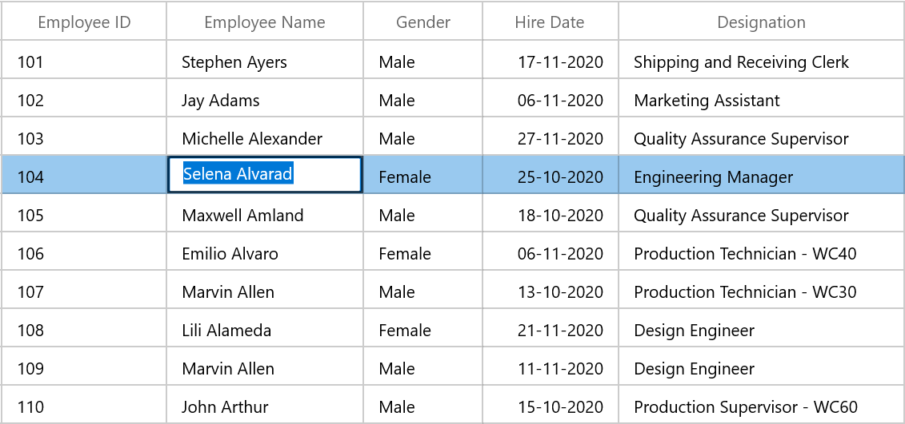

# Editing in WinUI DataGrid (SfDataGrid)

SfDataGrid provides support for editing and it can be enabled or disabled by setting [SfDataGrid.AllowEditing](https://help.syncfusion.com/cr/winui/Syncfusion.UI.Xaml.Grids.SfGridBase.html#Syncfusion_UI_Xaml_Grids_SfGridBase_AllowEditing) property.



<syncfusion:SfDataGrid  x:Name="sfDataGrid"
                        AllowEditing="True"
                        AutoGenerateColumns="True"
                        ItemsSource="{Binding Employees}"/>


dataGrid.AllowEditing = true;



You can enable or disable editing for particular column by setting [GridColumn.AllowEditing](https://help.syncfusion.com/cr/winui/Syncfusion.UI.Xaml.Grids.GridColumnBase.html#Syncfusion_UI_Xaml_Grids_GridColumnBase_AllowEditing) property.



<syncfusion:GridTextColumn HeaderText="Employee ID" MappingName="ID" AllowEditing="True"/>


sfDataGrid.Columns["ID"].AllowEditing = true;



N> [GridColumn.AllowEditing](https://help.syncfusion.com/cr/winui/Syncfusion.UI.Xaml.Grids.GridColumnBase.html#Syncfusion_UI_Xaml_Grids_GridColumnBase_AllowEditing) takes higher priority than [SfDataGrid.AllowEditing](https://help.syncfusion.com/cr/winui/Syncfusion.UI.Xaml.Grids.SfGridBase.html#Syncfusion_UI_Xaml_Grids_SfGridBase_AllowEditing).

N> It is mandatory to set the [NavigationMode](https://help.syncfusion.com/cr/winui/Syncfusion.UI.Xaml.Grids.SfGridBase.html#Syncfusion_UI_Xaml_Grids_SfGridBase_NavigationMode) to Cell to enable [CurrentCell](https://help.syncfusion.com/cr/winui/Syncfusion.UI.Xaml.DataGrid.GridCurrentCellManager.html#Syncfusion_UI_Xaml_DataGrid_GridCurrentCellManager_CurrentCell) navigation and editing.

### Entering into edit mode

You can enter into edit mode by pressing <kbd>F2</kbd> key or clicking (touch also supported) the cell. You can allow users to edit the cell in single click (OnTap) or double click (OnDoubleTab) by setting by [EditTrigger](https://help.syncfusion.com/cr/winui/Syncfusion.UI.Xaml.Grids.SfGridBase.html#Syncfusion_UI_Xaml_Grids_SfGridBase_EditTrigger) property.



<syncfusion:SfDataGrid  x:Name="sfDataGrid"
                        AllowEditing="True"
                        EditTrigger="OnDoubleTap"
                        AutoGenerateColumns="True"
                        ItemsSource="{Binding Employees}"/>


sfDataGrid.EditTrigger = EditTrigger.OnDoubleTap;



### Cursor placement

When the cell enters into edit mode, cursor is placed based on [EditorSelectionBehavior](https://help.syncfusion.com/cr/winui/Syncfusion.UI.Xaml.Grids.SfGridBase.html#Syncfusion_UI_Xaml_Grids_SfGridBase_EditorSelectionBehavior) property.
 
`SelectAll` – selects the text of edit element loaded inside cell.

`MoveLast` – places the cursor at the last of edit element loaded inside cell.



<syncfusion:SfDataGrid  x:Name="sfDataGrid"
                        AllowEditing="True"
                        EditorSelectionBehavior="MoveLast"
                        AutoGenerateColumns="True"
                        ItemsSource="{Binding Employees}"/>


sfDataGrid.EditorSelectionBehavior = EditorSelectionBehavior.MoveLast;



## Retain editing on lost focus

The editing of current cell will be ended by default while the focus is moving from DataGrid to another control. You can set the [LostFocusBehavior](https://help.syncfusion.com/cr/winui/Syncfusion.UI.Xaml.DataGrid.SfDataGrid.html#Syncfusion_UI_Xaml_DataGrid_SfDataGrid_LostFocusBehavior) property to `LostFocusBehavior.Default` if you want to retain the editing of the current cell even when focus is moved to another control.



<syncfusion:SfDataGrid  x:Name="sfDataGrid"
                        AllowEditing="True"
                        AutoGenerateColumns="True"
                        LostFocusBehavior="Default"
                        ItemsSource="{Binding Employees}"/>



sfDataGrid.LostFocusBehavior = LostFocusBehavior.Default;



## Working with IEditableObject interface

SfDataGrid supports to commit and roll back the changes in row level when underlying data object implements [IEditableObject](https://msdn.microsoft.com/en-us/library/system.componentmodel.ieditableobject.aspx) interface.

The editing changes in a row will be committed only when user move to next row or pressing enter key in `EndEdit`. Also when user press <kbd> Esc </kbd>  key, then the changes made in a row will be reverted in `CancelEdit`.
 
`IEditableObject` has the following methods to capture editing,

[BeginEdit](https://msdn.microsoft.com/en-us/library/system.componentmodel.ieditableobject.beginedit.aspx) – Gets called to begin edit on underlying data object when cell in a row get into edit mode.
 
[CancelEdit](https://msdn.microsoft.com/en-us/library/system.componentmodel.ieditableobject.canceledit.aspx) – Gets called when user press the <kbd>Esc</kbd> key to discard the changes in a row since last `BeginEdit` call.
 
[EndEdit](https://msdn.microsoft.com/en-us/library/system.componentmodel.ieditableobject.endedit.aspx) – Gets called when user move to the next row or press Enter key  to commit changes in underlying data object since last `BeginEdit` call.
 
In the below code snippet explains the simple implementation of `IEditableObject`.



 public class Employee : NotificationObject, IEditableObject
    {
        private int _EmployeeID;
        private string _Name;
        private string _Title;
        private DateTime _BirthDate;
        private string _MaritalStatus;
        private string _Gender;
        private DateTime _HireDate;
        private double _Salary;

        /// 

        /// Gets or sets the employee ID.
        /// 

        /// <value>The employee ID.</value>
        public int ID
        {
            get
            {
                return this._EmployeeID;
            }
            set
            {
                this._EmployeeID = value;
                this.RaisePropertyChanged(nameof(ID));
            }
        }

        /// 

        /// Gets or sets the last name.
        /// 

        /// <value>The last name.</value>
        public string Name
        {
            get
            {
                return this._Name;
            }
            set
            {
                this._Name = value;
                this.RaisePropertyChanged(nameof(Name));
            }
        }
       

        /// 

        /// Gets or sets the title.
        /// 

        /// <value>The title.</value>
        public string Title
        {
            get
            {
                return this._Title;
            }
            set
            {
                this._Title = value;
                this.RaisePropertyChanged(nameof(Title));
            }
        }

        

        /// 

        /// Gets or sets the BirthDate.
        /// 

        /// <value>The BirthDate.</value>
        public DateTime BirthDate
        {
            get
            {
                return this._BirthDate;
            }
            set
            {
                this._BirthDate = value;
                this.RaisePropertyChanged(nameof(BirthDate));
            }
        }

        /// 

        /// Gets or sets the MaritalStatus.
        /// 

        /// <value>The MaritalStatus.</value>
        public string MaritalStatus
        {
            get
            {
                return this._MaritalStatus;
            }
            set
            {
                this._MaritalStatus = value;
                this.RaisePropertyChanged(nameof(MaritalStatus));
            }
        }

        /// 

        /// Gets or sets the Gender.
        /// 

        /// <value>The Gender.</value>
        public string Gender
        {
            get
            {
                return this._Gender;
            }
            set
            {
                this._Gender = value;
                this.RaisePropertyChanged(nameof(Gender));
            }
        }

        /// 

        /// Gets or sets the HireDate.
        /// 

        /// <value>The HireDate.</value>
        public DateTime HireDate
        {
            get
            {
                return this._HireDate;
            }
            set
            {
                this._HireDate = value;
                this.RaisePropertyChanged(nameof(HireDate));
            }
        }

        /// 

        /// Gets or sets the Salary.
        /// 

        /// <value>The Salary.</value>
        public double Salary
        {
            get
            {
                return this._Salary;
            }
            set
            {
                this._Salary = value;
                this.RaisePropertyChanged(nameof(Salary));
            }
        }

        protected Dictionary<string, object> BackUp()
        {
            var dict = new Dictionary<string, object>();
            var itemProperties = this.GetType().GetTypeInfo().DeclaredProperties;

            foreach (var pDescriptor in itemProperties)
            {

                if (pDescriptor.CanWrite)
                    dict.Add(pDescriptor.Name, pDescriptor.GetValue(this));
            }
            return dict;
        }

        private Dictionary<string, object> storedValues;

        public void BeginEdit()
        {
            this.storedValues = this.BackUp();
        }

        public void CancelEdit()
        {
            if (this.storedValues == null)
                return;

            foreach (var item in this.storedValues)
            {
                var itemProperties = this.GetType().GetTypeInfo().DeclaredProperties;
                var pDesc = itemProperties.FirstOrDefault(p => p.Name == item.Key);

                if (pDesc != null)
                    pDesc.SetValue(this, item.Value);
            }
        }

        public void EndEdit()
        {
            if (this.storedValues != null)
            {
                this.storedValues.Clear();
                this.storedValues = null;
            }
            Debug.WriteLine("End Edit Called");
        }
    }



## Events

SfDataGrid triggers the following events during editing.
 
### CurrentCellBeginEdit Event

[CurrentCellBeginEdit](https://help.syncfusion.com/cr/winui/Syncfusion.UI.Xaml.DataGrid.SfDataGrid.html#Syncfusion_UI_Xaml_DataGrid_SfDataGrid_CurrentCellBeginEdit) event occurs when the [CurrentCell](https://help.syncfusion.com/cr/winui/Syncfusion.UI.Xaml.DataGrid.GridCurrentCellManager.html#Syncfusion_UI_Xaml_DataGrid_GridCurrentCellManager_CurrentCell) enter into edit mode. [CurrentCellBeginEditEventArgs](https://help.syncfusion.com/cr/winui/Syncfusion.UI.Xaml.DataGrid.CurrentCellBeginEditEventArgs.html) has following members which provides information for `CurrentCellBeginEdit` event.

* [Cancel](https://msdn.microsoft.com/query/dev10.query?appId=Dev10IDEF1&l=EN-US&k=k(System.ComponentModel.CancelEventArgs.Cancel)&rd=true): When set to ‘true’, the event is canceled and the `CurrentCell` does not enter into the edit mode.

* [RowColumnIndex](https://help.syncfusion.com/cr/winui/Syncfusion.UI.Xaml.DataGrid.CurrentCellBeginEditEventArgs.html#Syncfusion_UI_Xaml_DataGrid_CurrentCellBeginEditEventArgs_RowColumnIndex): Gets the current row column index of the DataGrid.

* [Column](https://help.syncfusion.com/cr/winui/Syncfusion.UI.Xaml.DataGrid.CurrentCellBeginEditEventArgs.html#Syncfusion_UI_Xaml_DataGrid_CurrentCellBeginEditEventArgs_Column): Gets the Grid Column of the SfDataGrid.



this.sfDataGrid.CurrentCellBeginEdit += SfDataGrid_CurrentCellBeginEdit;

private void SfDataGrid_CurrentCellBeginEdit(object sender, CurrentCellBeginEditEventArgs e)
{
    
}




### CurrentCellEndEdit Event

[CurrentCellEndEdit](hhttps://help.syncfusion.com/cr/winui/Syncfusion.UI.Xaml.DataGrid.SfDataGrid.html#Syncfusion_UI_Xaml_DataGrid_SfDataGrid_CurrentCellEndEdit) event occurs when the [CurrentCell](https://help.syncfusion.com/cr/winui/Syncfusion.UI.Xaml.DataGrid.GridCurrentCellManager.html#Syncfusion_UI_Xaml_DataGrid_GridCurrentCellManager_CurrentCell) exits the edit mode. [CurrentCellEndEditEventArgs](https://help.syncfusion.com/cr/winui/Syncfusion.UI.Xaml.DataGrid.CurrentCellEndEditEventArgs.html) has following members which provides information for `CurrentCellEndEdit` event.

* [RowColumnIndex](https://help.syncfusion.com/cr/winui/Syncfusion.UI.Xaml.DataGrid.CurrentCellEndEditEventArgs.html#Syncfusion_UI_Xaml_DataGrid_CurrentCellEndEditEventArgs_RowColumnIndex): Gets the value for the current row column index.



this.sfDataGrid.CurrentCellEndEdit += SfDataGrid_CurrentCellEndEdit;

private void SfDataGrid_CurrentCellEndEdit(object sender, CurrentCellEndEditEventArgs e)
{
    
}




### CurrentCellValueChanged Event

[CurrentCellValueChanged](https://help.syncfusion.com/cr/winui/Syncfusion.UI.Xaml.DataGrid.SfDataGrid.html#Syncfusion_UI_Xaml_DataGrid_SfDataGrid_CurrentCellValueChanged) event occurs whenever a value changes in GridColumn’s that supports editing.

[CurrentCellValueChangedEventArgs](https://help.syncfusion.com/cr/winui/Syncfusion.UI.Xaml.DataGrid.CurrentCellValueChangedEventArgs.html) has following members which provides information for `CurrentCellValueChanged` event.

* [Column](https://help.syncfusion.com/cr/winui/Syncfusion.UI.Xaml.DataGrid.CurrentCellValueChangedEventArgs.html#Syncfusion_UI_Xaml_DataGrid_CurrentCellValueChangedEventArgs_Column): Gets the Grid Column of the SfDataGrid.

* [RowColumnIndex](https://help.syncfusion.com/cr/winui/Syncfusion.UI.Xaml.DataGrid.CurrentCellValueChangedEventArgs.html#Syncfusion_UI_Xaml_DataGrid_CurrentCellValueChangedEventArgs_RowColumnIndex): Gets the value of the current RowColumnIndex.

* [Record](https://help.syncfusion.com/cr/winui/Syncfusion.UI.Xaml.DataGrid.CurrentCellValueChangedEventArgs.html#Syncfusion_UI_Xaml_DataGrid_CurrentCellValueChangedEventArgs_Record): Gets the record of the corresponding cell value changes.



this.sfDataGrid.CurrentCellValueChanged += SfDataGrid_CurrentCellValueChanged;

private void SfDataGrid_CurrentCellValueChanged(object sender, CurrentCellValueChangedEventArgs e)
{
   
}




N> For GridComboBoxColumn, you have to use the CurrentCellDropDownSelectionChanged event.

### CurrentCellDropDownSelectionChanged Event

[CurrentCellDropDownSelectionChanged](https://help.syncfusion.com/cr/winui/Syncfusion.UI.Xaml.DataGrid.SfDataGrid.html#Syncfusion_UI_Xaml_DataGrid_SfDataGrid_CurrentCellDropDownSelectionChanged) event occurs whenever the `SelectedItem` of  `GridComboBoxColumn` column changed.

[CurrentCellDropDownSelectionChangedEventArgs](https://help.syncfusion.com/cr/winui/Syncfusion.UI.Xaml.Grids.CurrentCellDropDownSelectionChangedEventArgs.html) has following members which provides information for `CurrentCellDropDownSelectionChanged` event.

* [RowColumnIndex](https://help.syncfusion.com/cr/winui/Syncfusion.UI.Xaml.Grids.CurrentCellDropDownSelectionChangedEventArgs.html#Syncfusion_UI_Xaml_Grids_CurrentCellDropDownSelectionChangedEventArgs_RowColumnIndex) –  Gets the RowColumnIndex of the corresponding item that were selected from the drop-down control.

* [SelectedIndex](https://help.syncfusion.com/cr/winui/Syncfusion.UI.Xaml.Grids.CurrentCellDropDownSelectionChangedEventArgs.html#Syncfusion_UI_Xaml_Grids_CurrentCellDropDownSelectionChangedEventArgs_SelectedIndex) – Gets the index of the corresponding item that were selected from the drop-down control.

* [SelectedItem](https://help.syncfusion.com/cr/winui/Syncfusion.UI.Xaml.Grids.CurrentCellDropDownSelectionChangedEventArgs.html#Syncfusion_UI_Xaml_Grids_CurrentCellDropDownSelectionChangedEventArgs_SelectedItem) – Gets the data item that were selected from the drop-down control.



this.sfDataGrid.CurrentCellDropDownSelectionChanged += SfDataGrid_CurrentCellDropDownSelectionChanged;

private void SfDataGrid_CurrentCellDropDownSelectionChanged(object sender, CurrentCellDropDownSelectionChangedEventArgs e)
{
    
}




### CellTapped Event

[CellTapped](https://help.syncfusion.com/cr/winui/Syncfusion.UI.Xaml.DataGrid.SfDataGrid.html#Syncfusion_UI_Xaml_DataGrid_SfDataGrid_CellTapped) event occurs when the user clicks or touches the `Cell` in SfDataGrid with [GridCellTappedEventArgs](https://help.syncfusion.com/cr/winui/Syncfusion.UI.Xaml.DataGrid.GridCellTappedEventArgs.html). CellTapped event does not occur for the non-selectable cells. The GridCellTappedEventArgs has following members which provides information for `CellTapped` event.
* [Column](https://help.syncfusion.com/cr/winui/Syncfusion.UI.Xaml.DataGrid.CellTappedEventArgs.html#Syncfusion_UI_Xaml_DataGrid_CellTappedEventArgs_Column) - Gets the GridColumn of the tapped cell.

* [Record](https://help.syncfusion.com/cr/winui/Syncfusion.UI.Xaml.DataGrid.CellTappedEventArgs.html#Syncfusion_UI_Xaml_DataGrid_CellTappedEventArgs_Record) - Gets the data context of the tapped cell.

* [RowColumnIndex](https://help.syncfusion.com/cr/winui/Syncfusion.UI.Xaml.DataGrid.CellTappedEventArgs.html#Syncfusion_UI_Xaml_DataGrid_CellTappedEventArgs_RowColumnIndex) - Gets the RowColumnIndex of the tapped cell.

* [PointerDeviceType](https://help.syncfusion.com/cr/winui/Syncfusion.UI.Xaml.DataGrid.CellTappedEventArgs.html#Syncfusion_UI_Xaml_DataGrid_CellTappedEventArgs_PointerDeviceType) - Gets the device type that associated with the event.

* [OriginalSender](https://help.syncfusion.com/cr/winui/Syncfusion.UI.Xaml.Grids.GridEventArgs.html#Syncfusion_UI_Xaml_Grids_GridEventArgs_OriginalSender) - Gets the original reporting source that raised the event.  



<syncfusion:SfDataGrid  x:Name="sfDataGrid"
                        CellTapped="SfDataGrid_CellTapped"             
                        AutoGenerateColumns="True"
                        ItemsSource="{Binding Employees}"/>


this.sfDataGrid.CellTapped += SfDataGrid_CellTapped;

private void SfDataGrid_CellTapped(object sender, GridCellTappedEventArgs e)
{
   
}



### CellDoubleTapped Event
[CellDoubleTapped](https://help.syncfusion.com/cr/winui/Syncfusion.UI.Xaml.DataGrid.SfDataGrid.html#Syncfusion_UI_Xaml_DataGrid_SfDataGrid_CellDoubleTapped) event occurs when the user double clicks or double taps the `GridCell` in SfDataGrid with [GridCellDoubleTappedEventArgs](https://help.syncfusion.com/cr/winui/Syncfusion.UI.Xaml.DataGrid.CellDoubleTappedEventArgs.html). CellDoubleTapped event does not occur for non-selectable cells. GridCellDoubleTappedEventArgs has following members which provides information for `CellDoubleTapped ` event.

* [Column](https://help.syncfusion.com/cr/winui/Syncfusion.UI.Xaml.DataGrid.CellDoubleTappedEventArgs.html#Syncfusion_UI_Xaml_DataGrid_CellDoubleTappedEventArgs_Column) - Gets the GridColumn of the double tapped cell.

* [Record](https://help.syncfusion.com/cr/winui/Syncfusion.UI.Xaml.DataGrid.CellDoubleTappedEventArgs.html#Syncfusion_UI_Xaml_DataGrid_CellDoubleTappedEventArgs_Record) - Gets the data context of the double tapped cell.

* [RowColumnIndex](https://help.syncfusion.com/cr/winui/Syncfusion.UI.Xaml.DataGrid.CellDoubleTappedEventArgs.html#Syncfusion_UI_Xaml_DataGrid_CellDoubleTappedEventArgs_RowColumnIndex) - Gets the RowColumnIndex of the double tapped cell.

* [PointerDeviceType](https://help.syncfusion.com/cr/winui/Syncfusion.UI.Xaml.DataGrid.CellDoubleTappedEventArgs.html#Syncfusion_UI_Xaml_DataGrid_CellDoubleTappedEventArgs_PointerDeviceType) - Gets the device type that associated with the event.

* [OriginalSender](https://help.syncfusion.com/cr/winui/Syncfusion.UI.Xaml.Grids.GridEventArgs.html#Syncfusion_UI_Xaml_Grids_GridEventArgs_OriginalSender) - Gets the original reporting source that raised the event



<syncfusion:SfDataGrid  x:Name="sfDataGrid"
                        CellDoubleTapped="SfDataGrid_CellDoubleTapped"
                        AutoGenerateColumns="True"
                        ItemsSource="{Binding Employees}"/>


this.sfDataGrid.CellDoubleTapped += SfDataGrid_CellDoubleTapped;

private void SfDataGrid_CellDoubleTapped(object sender, GridCellDoubleTappedEventArgs e)
{
    
}




## Programmatically edit the cell

### BeginEdit

SfDataGrid allows you to edit the cell programmatically by calling the [BeginEdit](https://help.syncfusion.com/cr/winui/Syncfusion.UI.Xaml.DataGrid.GridCurrentCellManager.html#Syncfusion_UI_Xaml_DataGrid_GridCurrentCellManager_BeginEdit) method. Initially the [CurrentCell](https://help.syncfusion.com/cr/winui/Syncfusion.UI.Xaml.DataGrid.GridCurrentCellManager.html#Syncfusion_UI_Xaml_DataGrid_GridCurrentCellManager_CurrentCell) need to set before calling the `BeginEdit` method when the CurrentCell value is null.




//Add this namespace to access the RowColumnIndex structure type in SfDataGrid 
using Syncfusion.UI.Xaml.Grids.ScrollAxis;

this.sfDataGrid.Loaded += SfDataGrid_Loaded; 

private void SfDataGrid_Loaded(object sender, RoutedEventArgs e)
{
    RowColumnIndex rowColumnIndex = new RowColumnIndex(3, 2);
    this.sfDataGrid.MoveCurrentCell(rowColumnIndex);
    this.sfDataGrid.SelectionController.CurrentCellManager.BeginEdit();
}




### EndEdit

You can call the [EndEdit](https://help.syncfusion.com/cr/winui/Syncfusion.UI.Xaml.DataGrid.GridCurrentCellManager.html#Syncfusion_UI_Xaml_DataGrid_GridCurrentCellManager_EndEdit_System_Boolean_) method to programmatically end edit. 



this.sfDataGrid.SelectionController.CurrentCellManager.EndEdit();



### CancelEdit

You can use the [CurrentCellBeginEdit](https://help.syncfusion.com/cr/winui/Syncfusion.UI.Xaml.DataGrid.SfDataGrid.html#Syncfusion_UI_Xaml_DataGrid_SfDataGrid_CurrentCellBeginEdit) event to cancel the editing operation for the corresponding cell.




//Add this namespace to access the RowColumnIndex structure type in SfDataGrid
using Syncfusion.UI.Xaml.Grids.ScrollAxis;

this.sfDataGrid.CurrentCellBeginEdit += SfDataGrid_CurrentCellBeginEdit;

private void SfDataGrid_CurrentCellBeginEdit(object sender, CurrentCellBeginEditEventArgs e)
{
    var recordIndex = this.sfDataGrid.ResolveToRecordIndex(e.RowColumnIndex.RowIndex);
    var columnIndex = this.sfDataGrid.ResolveToGridVisibleColumnIndex(e.RowColumnIndex.ColumnIndex);
    var mappingName = this.sfDataGrid.Columns[columnIndex].MappingName;
    var record = this.sfDataGrid.View.Records.GetItemAt(recordIndex);
    var cellValue = this.sfDataGrid.View.GetPropertyAccessProvider().GetValue(record, mappingName);

    if (e.RowColumnIndex == new RowColumnIndex(3, 2))
        e.Cancel = true;
}




