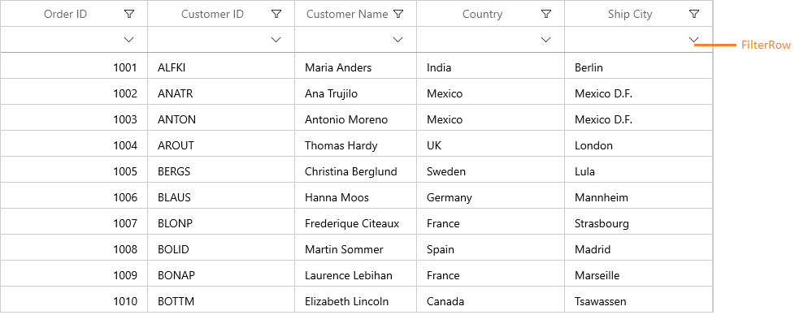
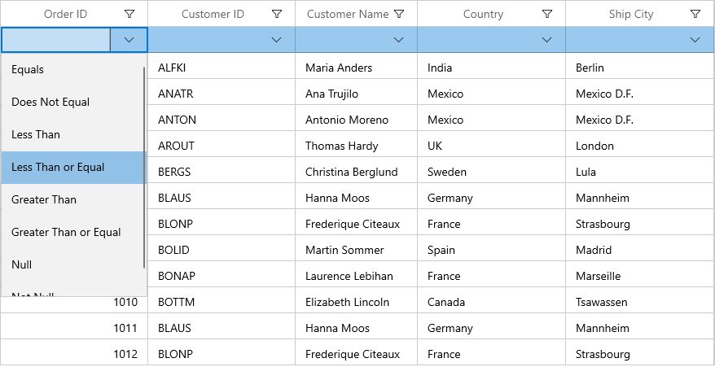
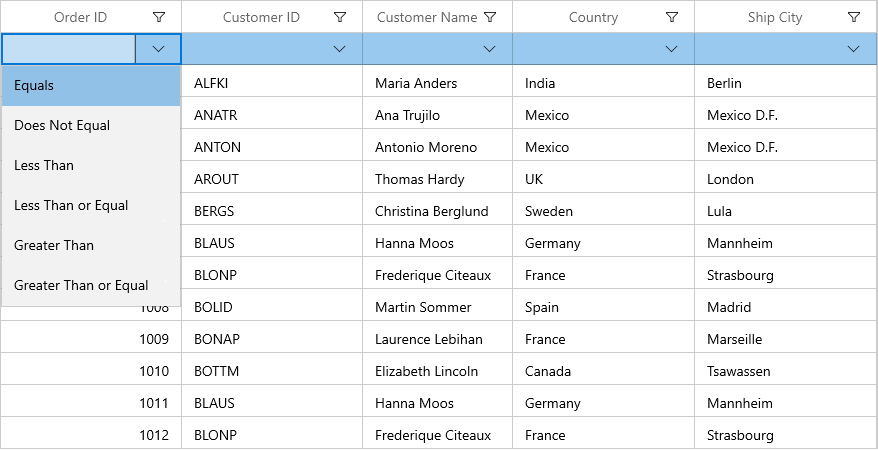
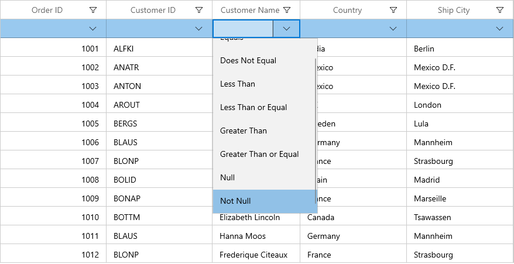

# Filter Row in WinUI DataGrid (SfDataGrid)

SfDataGrid provides built-in row (called FilterRow) to filter the records. You can enable the FilterRow by specifying the position where it should be displayed by setting [SfDataGrid.FilterRowPosition](https://help.syncfusion.com/cr/winui/Syncfusion.UI.Xaml.DataGrid.FilterRowPosition.html) property.

The `FilterRowPosition` property contains the below positions to load the FilterRow in SfDataGrid.

* [FixedTop](https://help.syncfusion.com/cr/winui/Syncfusion.UI.Xaml.DataGrid.FilterRowPosition.html#Syncfusion_UI_Xaml_DataGrid_FilterRowPosition_FixedTop) - Placed in top of the SfDataGrid in frozen state.
* [Top](https://help.syncfusion.com/cr/winui/Syncfusion.UI.Xaml.DataGrid.FilterRowPosition.html#Syncfusion_UI_Xaml_DataGrid_FilterRowPosition_Top) -  Placed in top of the SfDataGrid.
* [Bottom](https://help.syncfusion.com/cr/winui/Syncfusion.UI.Xaml.DataGrid.FilterRowPosition.html#Syncfusion_UI_Xaml_DataGrid_FilterRowPosition_Bottom) - Placed in bottom of the SfDataGrid.
* [None](https://help.syncfusion.com/cr/winui/Syncfusion.UI.Xaml.DataGrid.FilterRowPosition.html#Syncfusion_UI_Xaml_DataGrid_FilterRowPosition_None) -  No FilterRow will be placed.



<syncfusion:SfDataGrid x:Name="sfDataGrid"
                       FilterRowPosition="FixedTop"
                       AutoGenerateColumns="True"
                       ItemsSource="{Binding Orders}"/>


this.sfDataGrid.FilterRowPosition = FilterRowPosition.FixedTop;



You can get the row index of FilterRow by using the [SfDataGrid.GetFilterRowIndex ](https://help.syncfusion.com/cr/winui/Syncfusion.UI.Xaml.DataGrid.GridIndexResolver.html#Syncfusion_UI_Xaml_DataGrid_GridIndexResolver_GetFilterRowIndex_Syncfusion_UI_Xaml_DataGrid_SfDataGrid_)method.



int filterRowIndex = this.sfDataGrid.GetFilterRowIndex();



You can check whether the specified row index is FilterRow index, by using [SfDataGrid.IsFilterRowIndex](https://help.syncfusion.com/cr/winui/Syncfusion.UI.Xaml.DataGrid.GridIndexResolver.html#Syncfusion_UI_Xaml_DataGrid_GridIndexResolver_IsFilterRowIndex_Syncfusion_UI_Xaml_DataGrid_SfDataGrid_System_Int32_) helper method.



bool isFilterRowIndex = this.sfDataGrid.IsFilterRowIndex(1);



## Built-in Editors

By default, FilterRow loads the editors based on underlying property type to filter the data easily. You can change the default editors by using [GridColumn.FilterRowEditorType](https://help.syncfusion.com/cr/winui/Syncfusion.UI.Xaml.DataGrid.GridColumn.html#Syncfusion_UI_Xaml_DataGrid_GridColumn_FilterRowEditorType) property.

Below are the built-in FilterRow editor types supported in SfDataGrid. 
<table>
<tr>
<td>
{{'**FilterRowEditor Type**'| markdownify }}
</td>
<td>
{{'**Editor Control**'| markdownify }}
</td>
<td>
{{'**Renderer**'| markdownify }}
</td>
<td>
{{'**Description** '| markdownify }}
</td>
</tr>
<tr>
<td>
TextBox
</td>
<td>
TextBox
</td>
<td>
{{'[GridFilterRowTextBoxRenderer](https://help.syncfusion.com/cr/winui/Syncfusion.UI.Xaml.DataGrid.RowFilter.GridFilterRowTextBoxRenderer.html)'| markdownify }}
</td>
<td>
Used for filtering the string values.
</td>
</tr>
<tr>
<td>
Numeric
</td>
<td>
TextBox
</td>
<td>
{{'[GridFilterRowTextBoxRenderer](https://help.syncfusion.com/cr/winui/Syncfusion.UI.Xaml.DataGrid.RowFilter.GridFilterRowTextBoxRenderer.html)'| markdownify }}
</td>
<td>
Used for filtering the numeric values.
</td>
</tr>
<tr>
<td>
CheckBox
</td>
<td>
CheckBox
</td>
<td>
{{'[GridFilterRowCheckBoxRenderer](https://help.syncfusion.com/cr/winui/Syncfusion.UI.Xaml.DataGrid.RowFilter.GridFilterRowCheckBoxRenderer.html)'| markdownify }}
</td>
<td>
Used for filtering the Boolean values.
</td>
</tr>
</table>

## Filter options

Based on the editor type, FilterRowCell displays the filter conditions in dropdown where you can easily switch between the conditions to filter the data. You can disable filter options by setting [GridColumn.FilterRowOptionsVisibility](https://help.syncfusion.com/cr/winui/Syncfusion.UI.Xaml.DataGrid.GridColumn.html#Syncfusion_UI_Xaml_DataGrid_GridColumn_FilterRowOptionsVisibility) property.



<syncfusion:GridNumericColumn MappingName="OrderID" 
                              FilterRowOptionsVisibility="Collapsed"
                              FilterRowEditorType="Numeric"/>


this.sfDataGrid.Columns[0].FilterRowOptionsVisibility = Visibility.Collapsed;



Below are the filter conditions supported by different filter row editors in SfDataGrid.

<table>
<tr>
<td>
{{'**Numeric Editor**'| markdownify }}
</td>
<td>
{{'**TextBox Editor**'| markdownify }}
</td>
<td>
{{'**CheckBox Editor**'| markdownify }}
</td>
</tr>
<tr>
<td>
When integer, double, short, decimal, byte or long are bound to the {{'[GridColumn](https://help.syncfusion.com/cr/winui/Syncfusion.UI.Xaml.DataGrid.GridColumn.html)'| markdownify }}, the <code>Numeric</code> editor type are loaded in {{'[FilterRowCell](https://help.syncfusion.com/cr/winui/Syncfusion.UI.Xaml.DataGrid.RowFilter.GridFilterRowCellRenderer-2.html#Syncfusion_UI_Xaml_DataGrid_RowFilter_GridFilterRowCellRenderer_2_FilterRowCell)'| markdownify }}.

</td>
<td>
When string value is bounded to the {{'[GridColumn](https://help.syncfusion.com/cr/winui/Syncfusion.UI.Xaml.DataGrid.GridColumn.html)'| markdownify }} or the items is dynamic, then <code>TextBox</code> editor type are loaded in {{'[FilterRowCell](https://help.syncfusion.com/cr/winui/Syncfusion.UI.Xaml.DataGrid.RowFilter.GridFilterRowCellRenderer-2.html#Syncfusion_UI_Xaml_DataGrid_RowFilter_GridFilterRowCellRenderer_2_FilterRowCell)'| markdownify }}.

</td>
<td>
When Boolean type is bounded to the {{'[GridColumn](https://help.syncfusion.com/cr/winui/Syncfusion.UI.Xaml.DataGrid.GridColumn.html)'| markdownify }}, then <code>CheckBox</code> editor is loaded in {{'[FilterRowCell](https://help.syncfusion.com/cr/winui/Syncfusion.UI.Xaml.DataGrid.RowFilter.GridFilterRowCellRenderer-2.html#Syncfusion_UI_Xaml_DataGrid_RowFilter_GridFilterRowCellRenderer_2_FilterRowCell)'| markdownify }}.
</td>
</tr>
<tr>
<td>
The default filter condition is Equals, the below filter conditions are available in numeric filter.
<ol>
<li>Equals</li>
<li>Does Not Equal</li> 
<li>Null</li> 
<li>Not Null</li> 
<li>Less Than</li>
<li>Less Than or Equal</li>
<li>Greater Than</li>
<li>Greater Than or Equal</li>
</ol>
</td>
<td>
The default filter condition is Begins With, the below filter conditions are available in text filter.
<ol>
<li>Equals</li>
<li>Does Not Equal</li> 
<li>Null</li> 
<li>Not Null</li> 
<li>Begins With</li>
<li>Does Not Begin With</li>
<li>Ends With</li>
<li>Does Not End With</li>
<li>Contains</li>
<li>Does Not Contain</li>
<li>Empty</li>
<li>Not Empty</li> 
</ol>
</td>
<td>
Always equals filter condition will be applied for filtering the CheckBox value.
</td>
</tr>
</table>

You can change the default FilterRow condition for a corresponding column by using [GridColumn.FilterRowCondition](https://help.syncfusion.com/cr/winui/Syncfusion.UI.Xaml.DataGrid.GridColumn.html#Syncfusion_UI_Xaml_DataGrid_GridColumn_FilterRowCondition) property.



<syncfusion:GridNumericColumn MappingName="OrderID" 
                              FilterRowCondition="LessThanOrEqual"
                              FilterRowEditorType="Numeric"/>


this.sfDataGrid.Columns[0].FilterRowCondition = FilterRowCondition.LessThanOrEqual;



## Filtering null values

You can enable or disable filtering of null values by setting [GridColumn.AllowBlankFilters](https://help.syncfusion.com/cr/winui/Syncfusion.UI.Xaml.DataGrid.GridColumn.html#Syncfusion_UI_Xaml_DataGrid_GridColumn_AllowBlankFilters) property. The default value is `true`.
When null value filtering is enabled, the filter options loaded with two additional options (“Null” and “Not Null”) to filter the null values.



<syncfusion:GridTextColumn MappingName="OrderID" 
                              AllowBlankFilters="False"
                              FilterRowEditorType="Numeric"/>


this.sfDataGrid.Columns[0].AllowBlankFilters = false;





<syncfusion:GridTextColumn MappingName="OrderID"
                           AllowBlankFilters="True"
                           FilterRowEditorType="Numeric"/>


this.sfDataGrid.Columns[0].AllowBlankFilters = true;



## Instant Filtering

By default, filters are applied to the columns when moving to other cells or pressing enter key. You can apply filter when typing or selecting in editor itself by setting [GridColumn.ImmediateUpdateColumnFilter](https://help.syncfusion.com/cr/winui/Syncfusion.UI.Xaml.DataGrid.GridColumn.html#Syncfusion_UI_Xaml_DataGrid_GridColumn_ImmediateUpdateColumnFilter) as `true`. 



<syncfusion:GridTextColumn MappingName="CustomerName"
                           FilterRowEditorType="TextBox"
                           ImmediateUpdateColumnFilter="True"/>


this.sfDataGrid.Columns[2].ImmediateUpdateColumnFilter = true;



## Disable filtering for a particular FilterRowCell

By default, you can filter the records by editing filter row cell. You can disable this editing by using [CurrentCellBeginEdit](https://help.syncfusion.com/cr/winui/Syncfusion.UI.Xaml.DataGrid.SfDataGrid.html#Syncfusion_UI_Xaml_DataGrid_SfDataGrid_CurrentCellBeginEdit) event.


this.sfDataGrid.CurrentCellBeginEdit += sfDataGrid_CurrentCellBeginEdit;

void sfDataGrid_CurrentCellBeginEdit(object sender, CurrentCellBeginEditEventArgs e)
{
    //Cancel the editing for filter row cell in OrderID Column
    if (e.Column.MappingName == "OrderID" && sfDataGrid.IsFilterRowIndex(e.RowColumnIndex.RowIndex))
        e.Cancel = true;
}



You can collapse the FilterOption button using `FilterRowOptionsVisibility` property.



<syncfusion:GridNumericColumn MappingName="OrderID" 
                              FilterRowOptionsVisibility="Collapsed"/>



## Styling

### Filter row style

You can customize the style of filter row by writing style of TargetType [FilterRowControl](https://help.syncfusion.com/cr/winui/Syncfusion.UI.Xaml.DataGrid.RowFilter.FilterRowControl.html).



<Page.Resources>
    
</Page.Resources>



## Customizing filter row cell

You can customize the filter row cell by overriding the `GridFilterRowCell`. You have to override the [GetGridCell](https://help.syncfusion.com/cr/winui/Syncfusion.UI.Xaml.DataGrid.RowGenerator.html#Syncfusion_UI_Xaml_DataGrid_RowGenerator_GetGridCell__1) method in [RowGenerator](https://help.syncfusion.com/cr/winui/Syncfusion.UI.Xaml.DataGrid.RowGenerator.html) to load the customized `GridFilterRowCell`.



public class GridFilterRowCellExt : GridFilterRowCell
{
    public GridFilterRowCellExt()
        : base()
    { }
}

public class CustomRowGenerator : RowGenerator
{

    public CustomRowGenerator(SfDataGrid dataGrid)
        : base(dataGrid)
    {
    }

    /// 

    /// Return the Custom FilterRowCell
    /// 

    /// <typeparam name="T"></typeparam>
    /// <returns>GridCell</returns>
    protected override GridCell GetGridCell<T>()
    {
        //If the Cell is FilterRowCell return custom FilterRowCell
        if (typeof(T) == typeof(GridFilterRowCell))
            return new GridFilterRowCellExt();
        return base.GetGridCell<GridCell>();
    }
}

public MainWindow()
{
    InitializeComponent();
    this.sfDataGrid.RowGenerator = new CustomRowGenerator(this.sfDataGrid);
}



## Customizing Filter row editors

### Customizing the filter row renderer 

SfDataGrid allows you to customize the filter row renderer behavior by overriding the corresponding renderer associated with the filter row cell. Each renderer have a set of virtual methods for handling the filter row behaviors. You can also create new renderers instead of overriding the existing renderer. 
You can customize the default TextBox editor behavior by overriding `GridFilterRowTextBoxRenderer` class and add the custom renderer to [FilterRowCellRenderers](https://help.syncfusion.com/cr/winui/Syncfusion.UI.Xaml.DataGrid.SfDataGrid.html#Syncfusion_UI_Xaml_DataGrid_SfDataGrid_FilterRowCellRenderers).



<syncfusion:GridTextColumn MappingName="CustomerName"
                           FilterRowEditorType="TextBoxExt"/>


public class GridFilterRowTextBoxRendererExt : GridFilterRowTextBoxRenderer
{

    public GridFilterRowTextBoxRendererExt()
        : base()
    {
    }
}
    
public MainWindow()
{
    InitializeComponent();
    this.sfDataGrid.FilterRowCellRenderers.Add("TextBoxExt", new GridFilterRowTextBoxRendererExt());
}



