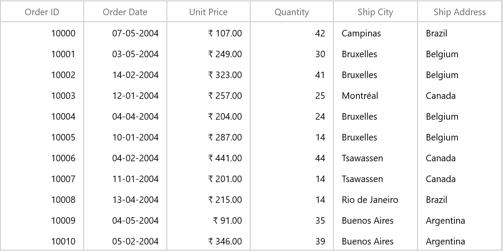
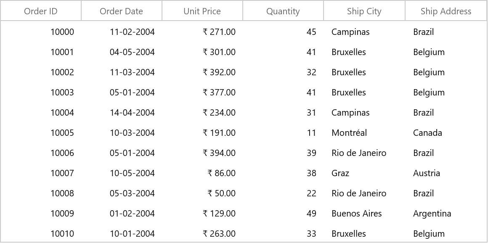

# Grid Lines customization in WinUI DataGrid (SfDataGrid)

SfDataGrid allows you to customize the grid lines visibility to vertical, horizontal, both or none. To achieve this, use the following properties.

`SfDataGrid.GridLinesVisibility`: To set the border lines for the cells other than header and stacked header cells.
`SfDataGrid.HeaderLinesVisibility`: To set the border lines only for header and stacked header cells.

The following are the list of options available to customize grid lines visibility,

* Both
* Vertical
* Horizontal
* None

## DataRow Lines

### Both

The GridLinesVisibility.Both displays the DataGrid with both horizontal and vertical grid lines. By default GridLinesVisibility value set as Both.



xmlns:dataGrid="using:Syncfusion.UI.Xaml.DataGrid"

 <dataGrid:SfDataGrid   x:Name="sfDataGrid"
                        AutoGenerateColumns="True"                       
                        GridLinesVisibility="Both"                          
                        ItemsSource="{Binding OrdersDetails}">
 </dataGrid:SfDataGrid>


 this.sfDataGrid.GridLinesVisibility = GridLinesVisibility.Both;



### Horizontal

The GridLinesVisibility.Horizontal displays the DataGrid with horizontal grid lines only.



xmlns:dataGrid="using:Syncfusion.UI.Xaml.DataGrid"

 <dataGrid:SfDataGrid   x:Name="sfDataGrid"
                        AutoGenerateColumns="True"                       
                        GridLinesVisibility="Horizontal"                          
                        ItemsSource="{Binding OrdersDetails}">
 </dataGrid:SfDataGrid>


 this.sfDataGrid.GridLinesVisibility = GridLinesVisibility.Horizontal;



### Vertical

The GridLinesVisibility.Vertical displays the DataGrid with vertical grid lines only.



xmlns:dataGrid="using:Syncfusion.UI.Xaml.DataGrid"

 <dataGrid:SfDataGrid   x:Name="sfDataGrid"
                        AutoGenerateColumns="True"                       
                        GridLinesVisibility="Vertical"                          
                        ItemsSource="{Binding OrdersDetails}">
 </dataGrid:SfDataGrid>


 this.sfDataGrid.GridLinesVisibility = GridLinesVisibility.Vertical;



### None
GridLinesVisibility.None displays the DataGrid without grid lines.



xmlns:dataGrid="using:Syncfusion.UI.Xaml.DataGrid"

 <dataGrid:SfDataGrid   x:Name="sfDataGrid"
                        AutoGenerateColumns="True" 
                        GridLinesVisibility="None"                     
                        ItemsSource="{Binding OrdersDetails}">
 </dataGrid:SfDataGrid>


 this.sfDataGrid.GridLinesVisibility = GridLinesVisibility.None;



## HeaderRow Lines

You can customize the DataGrid header lines visibility by using the SfDataGrid.HeaderLinesVisibility property. You can also customize the header lines visibility to horizontal, vertical, none or both. By default HeaderLinesVisibility value set as Both.



xmlns:dataGrid="using:Syncfusion.UI.Xaml.DataGrid"

 <dataGrid:SfDataGrid   x:Name="sfDataGrid"
                        AutoGenerateColumns="True" 
                        HeaderLinesVisibility="Horizontal"                            
                        ItemsSource="{Binding OrdersDetails}">
 </dataGrid:SfDataGrid>


 this.sfDataGrid.HeaderLinesVisibility = GridLinesVisibility.Horizontal;



## Limitations

* Grid lines customization are not supported for RowHeader.