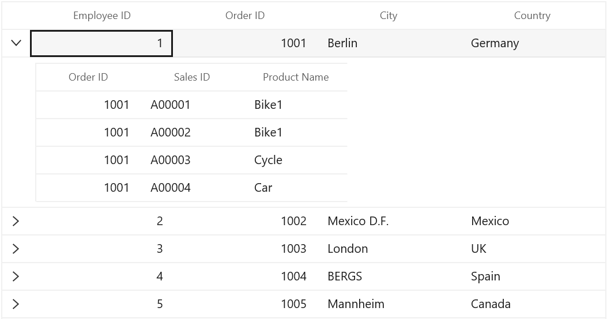

# Grid Lines Customization in WinUI DataGrid

SfDataGrid allows you to customize the grid lines visibility to vertical, horizontal, both or none. To achieve this, use the following properties.

[SfDataGrid.GridLinesVisibility](https://help.syncfusion.com/cr/winui/Syncfusion.UI.Xaml.Grids.SfGridBase.html#Syncfusion_UI_Xaml_Grids_SfGridBase_GridLinesVisibility): To set the border lines for the cells other than header and stacked header cells.
[SfDataGrid.HeaderLinesVisibility](https://help.syncfusion.com/cr/winui/Syncfusion.UI.Xaml.Grids.SfGridBase.html#Syncfusion_UI_Xaml_Grids_SfGridBase_HeaderLinesVisibility): To set the border lines only for header and stacked header cells.

The following are the list of options available to customize grid lines visibility,

* Both
* Vertical
* Horizontal
* None

## Record rows

### Both

The [GridLinesVisibility.Both](https://help.syncfusion.com/cr/winui/Syncfusion.UI.Xaml.Grids.GridLinesVisibility.html#Syncfusion_UI_Xaml_Grids_GridLinesVisibility_Both) displays the DataGrid with both horizontal and vertical grid lines. By default GridLinesVisibility value set as Both.



xmlns:dataGrid="using:Syncfusion.UI.Xaml.DataGrid"

 <dataGrid:SfDataGrid   x:Name="sfDataGrid"
                        AutoGenerateColumns="True"                       
                        GridLinesVisibility="Both"                          
                        ItemsSource="{Binding OrdersDetails}">
 </dataGrid:SfDataGrid>


 this.sfDataGrid.GridLinesVisibility = GridLinesVisibility.Both;



### Horizontal

The [GridLinesVisibility.Horizontal](https://help.syncfusion.com/cr/winui/Syncfusion.UI.Xaml.Grids.GridLinesVisibility.html#Syncfusion_UI_Xaml_Grids_GridLinesVisibility_Horizontal) displays the DataGrid with horizontal grid lines only.



xmlns:dataGrid="using:Syncfusion.UI.Xaml.DataGrid"

 <dataGrid:SfDataGrid   x:Name="sfDataGrid"
                        AutoGenerateColumns="True"                       
                        GridLinesVisibility="Horizontal"                          
                        ItemsSource="{Binding OrdersDetails}">
 </dataGrid:SfDataGrid>


 this.sfDataGrid.GridLinesVisibility = GridLinesVisibility.Horizontal;



### Vertical

The [GridLinesVisibility.Vertical](https://help.syncfusion.com/cr/winui/Syncfusion.UI.Xaml.Grids.GridLinesVisibility.html#Syncfusion_UI_Xaml_Grids_GridLinesVisibility_Vertical) displays the DataGrid with vertical grid lines only.



xmlns:dataGrid="using:Syncfusion.UI.Xaml.DataGrid"

 <dataGrid:SfDataGrid   x:Name="sfDataGrid"
                        AutoGenerateColumns="True"                       
                        GridLinesVisibility="Vertical"                          
                        ItemsSource="{Binding OrdersDetails}">
 </dataGrid:SfDataGrid>


 this.sfDataGrid.GridLinesVisibility = GridLinesVisibility.Vertical;



### None
[GridLinesVisibility.None](https://help.syncfusion.com/cr/winui/Syncfusion.UI.Xaml.Grids.GridLinesVisibility.html#Syncfusion_UI_Xaml_Grids_GridLinesVisibility_None) displays the DataGrid without grid lines.



xmlns:dataGrid="using:Syncfusion.UI.Xaml.DataGrid"

 <dataGrid:SfDataGrid   x:Name="sfDataGrid"
                        AutoGenerateColumns="True" 
                        GridLinesVisibility="None"                     
                        ItemsSource="{Binding OrdersDetails}">
 </dataGrid:SfDataGrid>


 this.sfDataGrid.GridLinesVisibility = GridLinesVisibility.None;



## Header rows

You can customize the DataGrid header lines visibility by using the [SfDataGrid.HeaderLinesVisibility](https://help.syncfusion.com/cr/winui/Syncfusion.UI.Xaml.Grids.SfGridBase.html#Syncfusion_UI_Xaml_Grids_SfGridBase_HeaderLinesVisibility) property. You can also customize the header lines visibility to horizontal, vertical, none or both. By default HeaderLinesVisibility value set as Both.



xmlns:dataGrid="using:Syncfusion.UI.Xaml.DataGrid"

 <dataGrid:SfDataGrid   x:Name="sfDataGrid"
                        AutoGenerateColumns="True" 
                        HeaderLinesVisibility="Horizontal"                            
                        ItemsSource="{Binding OrdersDetails}">
 </dataGrid:SfDataGrid>


 this.sfDataGrid.HeaderLinesVisibility = GridLinesVisibility.Horizontal;



## Grid lines for Master-Details view

SfDataGrid allows you to customize the grid lines for Master-Details view also like parent DataGrid by changing the grid lines properties in GridViewDefinition.DataGrid. 



xmlns:dataGrid="using:Syncfusion.UI.Xaml.DataGrid"

<dataGrid:SfDataGrid  x:Name="sfDataGrid"
                      AutoGenerateColumns="True"
                      ItemsSource="{Binding OrdersDetails}"
                      GridLinesVisibility="Horizontal"
                      HeaderLinesVisibility="Horizontal">
        <dataGrid:SfDataGrid.DetailsViewDefinition>
            <dataGrid:GridViewDefinition RelationalColumn="OrderDetails">
                <dataGrid:GridViewDefinition.DataGrid>
                    <dataGrid:SfDataGrid  x:Name="FirstDetailsViewGrid" 
                                          GridLinesVisibility="Horizontal"
                                          HeaderLinesVisibility="Horizontal"
                                          AutoGenerateColumns="True">
                    </dataGrid:SfDataGrid>
                </dataGrid:GridViewDefinition.DataGrid>
            </dataGrid:GridViewDefinition>
</dataGrid:SfDataGrid>



this.sfDataGrid.GridLinesVisibility = GridLinesVisibility.Horizontal;
this.sfDataGrid.HeaderLinesVisibility = GridLinesVisibility.Horizontal;
this.FirstLevelNestedGrid.GridLinesVisibility = GridLinesVisibility.Horizontal;
this.FirstLevelNestedGrid.HeaderLinesVisibility = GridLinesVisibility.Horizontal;




## Limitations

* Grid lines customization are not supported for RowHeader.
