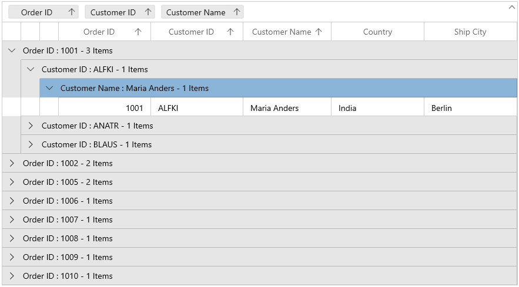
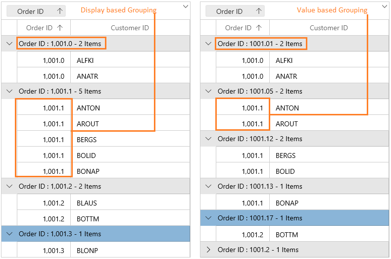
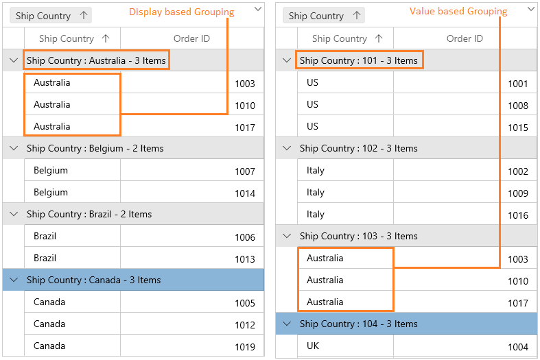
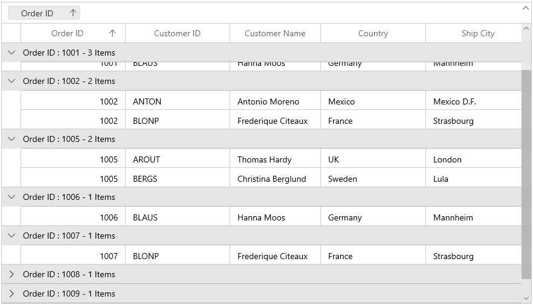
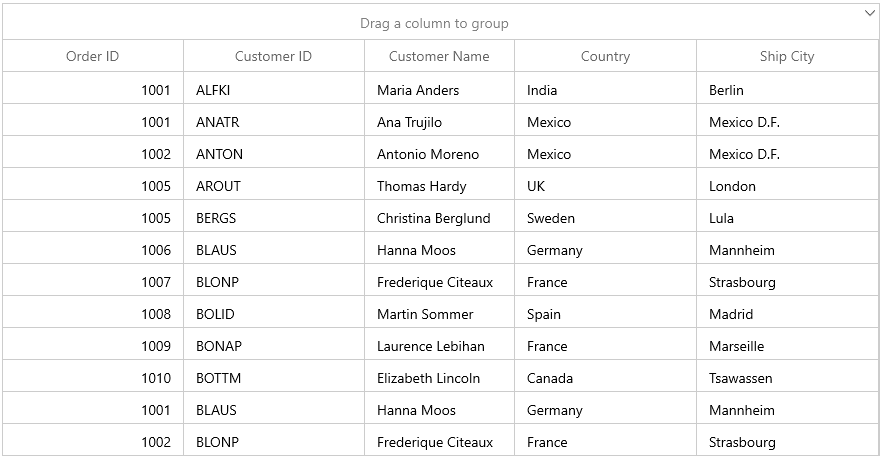

# Grouping in WinUI DataGrid (SfDataGrid)

DataGrid allows you to group the data against one or more columns. When grouping is applied, the data is organized into a hierarchical structure based on matching column values and it is sorted by ascending order.
 
SfDataGrid allows you to group the data in below ways,

* UI Grouping
* Programmatic Grouping

## UI grouping

You can allow end-user to group the data by setting  [SfDataGrid.AllowGrouping](https://help.syncfusion.com/cr/winui/Syncfusion.UI.Xaml.DataGrid.SfDataGrid.html#Syncfusion_UI_Xaml_DataGrid_SfDataGrid_AllowGrouping) property to `true` , where user can drag and drop the column into [GroupDropArea](https://help.syncfusion.com/cr/winui/Syncfusion.UI.Xaml.DataGrid.GroupDropArea.html) to group based on that column.
 
When the column is grouped, records that have an identical value in the column are combined to form a group. The `GroupDropArea` can be enabled by setting the [SfDataGrid.ShowGroupDropArea](https://help.syncfusion.com/cr/winui/Syncfusion.UI.Xaml.DataGrid.SfDataGrid.html#Syncfusion_UI_Xaml_DataGrid_SfDataGrid_ShowGroupDropArea) property to `true`.



<syncfusion:SfDataGrid  x:Name="sfDataGrid"
                        AllowGrouping="True"
                        AutoGenerateColumns="True"
                        ItemsSource="{Binding Orders}"
                        ShowGroupDropArea="True" />    


this.sfDataGrid.AllowGrouping = true;



You can enable or disable grouping on particular column by setting the [GridColumn.AllowGrouping](https://help.syncfusion.com/cr/winui/Syncfusion.UI.Xaml.DataGrid.GridColumn.html#Syncfusion_UI_Xaml_DataGrid_GridColumn_AllowGrouping) property.



<syncfusion:SfDataGrid  x:Name="sfDataGrid"
                        AutoGenerateColumns="False"
                        AllowGrouping="True"						
                        ItemsSource="{Binding Orders}"
                        ShowGroupDropArea="True">
    <syncfusion:SfDataGrid.Columns>
        <syncfusion:GridTextColumn AllowGrouping="True" MappingName="OrderID" />
        <syncfusion:GridTextColumn AllowGrouping="False" MappingName="CustomerID" />        
    </syncfusion:SfDataGrid.Columns>
</syncfusion:SfDataGrid>


this.sfDataGrid.Columns["OrderID"].AllowGrouping = true;
this.sfDataGrid.Columns["CustomerID"].AllowGrouping = false;



N> `GridColumn.AllowGrouping` takes higher priority than `SfDataGrid.AllowGrouping`.

The data can be grouped by an unlimited number of columns. To group more than one columns, drag-and-drop the desired columns in to `GroupDropArea`.

Each group is identified by its [CaptionSummaryRow](https://help.syncfusion.com/cr/winui/Syncfusion.UI.Xaml.DataGrid.SfDataGrid.html#Syncfusion_UI_Xaml_DataGrid_SfDataGrid_CaptionSummaryRow) and it is used to organize the data into a hierarchical tree structure based on identical values of that column. The underlying records in each caption summary row can be expanded or collapsed by clicking its group caption.

Each `CaptionSummaryRow` carries information about a particular group like group name, number of items (records) in the group, etc. You can refer [Caption Summaries](https://help.syncfusion.com/winui/datagrid/summaries#caption-summaries) section, for more information about `CaptionSummaryRow`.

## Programmatic grouping

SfDataGrid allows you to group the data programmatically by adding or removing [GroupColumnDescription](https://help.syncfusion.com/cr/winui/Syncfusion.UI.Xaml.DataGrid.GroupColumnDescription.html) to [SfDataGrid.GroupColumnDescriptions](https://help.syncfusion.com/cr/winui/Syncfusion.UI.Xaml.DataGrid.SfDataGrid.html#Syncfusion_UI_Xaml_DataGrid_SfDataGrid_GroupColumnDescriptions) collection.

For example, if you want to group the OrderID column programmatically, define its [MappingName](https://help.syncfusion.com/cr/winui/Syncfusion.UI.Xaml.Grids.GridColumnBase.html#Syncfusion_UI_Xaml_Grids_GridColumnBase_MappingName) to [ColumnName](https://help.syncfusion.com/cr/winui/Syncfusion.UI.Xaml.DataGrid.GroupColumnDescription.html#Syncfusion_UI_Xaml_DataGrid_GroupColumnDescription_ColumnName) property of `GroupColumnDescription`. Then add the `GroupColumnDescription` to the `SfDataGrid.GroupColumnDescriptions` collection.



<syncfusion:SfDataGrid  x:Name="sfDataGrid"
                        AllowGrouping="True"
                        AutoGenerateColumns="True"
                        ItemsSource="{Binding Orders}"
                        ShowGroupDropArea="True">
    <syncfusion:SfDataGrid.GroupColumnDescriptions>
        <syncfusion:GroupColumnDescription ColumnName="OrderID" />
    </syncfusion:SfDataGrid.GroupColumnDescriptions>
</syncfusion:SfDataGrid>


this.sfDataGrid.GroupColumnDescriptions.Add(new GroupColumnDescription() { ColumnName = "OrderID" });



You can group more than one column programmatically.



<syncfusion:SfDataGrid x:Name="sfDataGrid"
                        AllowGrouping="True"                               
                        ItemsSource="{Binding Orders}"
                        ShowGroupDropArea="True">

    <syncfusion:SfDataGrid.GroupColumnDescriptions>
        <syncfusion:GroupColumnDescription ColumnName="OrderID" />
        <syncfusion:GroupColumnDescription ColumnName="CustomerID" />
    </syncfusion:SfDataGrid.GroupColumnDescriptions>

</syncfusion:SfDataGrid>


this.sfDataGrid.View.BeginInit();
this.sfDataGrid.GroupColumnDescriptions.Add(new GroupColumnDescription() { ColumnName = "OrderID" });
this.sfDataGrid.GroupColumnDescriptions.Add(new GroupColumnDescription() { ColumnName = "CustomerID" });
this.sfDataGrid.View.EndInit();



## Group based on display text

You can group the column in DataGrid based on the value being displayed in cell by setting [GridColumn.GroupMode](https://help.syncfusion.com/cr/winui/Syncfusion.UI.Xaml.DataGrid.GridColumn.html#Syncfusion_UI_Xaml_DataGrid_GridColumn_GroupMode) as [Display](https://help.syncfusion.com/cr/winui/Syncfusion.UI.Xaml.Data.DataReflectionMode.html#Syncfusion_UI_Xaml_Data_DataReflectionMode_Display).
In the below example, OrderID column displays value with one decimal digit in cell. But when you group, groups will be created based on actual value considering all decimal digits of value (Refer right side screen shot). You can group based value displayed in the cell by setting `GridColumn.GroupMode` as `Display` (Refer left side screen shot for the same data).



xmlns:coreconverter="using:Syncfusion.UI.Xaml.Core.Converters"

<Page.Resources>
    <coreconverter:StringFormatConverter x:Key="stringFormatConverter" />
</Page.Resources>
<syncfusion:GridTextColumn HeaderText="Order ID"  
                           TextAlignment="Right"
                           DisplayBinding="{Binding OrderID, 
                           Converter={StaticResource stringFormatConverter}, ConverterParameter=\{0:N1\}}" 
                           GroupMode="Display"/>


this.sfDataGrid.Columns["OrderID"].GroupMode = DataReflectionMode.Display;



### Group caption based on DisplayMember when grouping GridComboBoxColumn

In SfDataGrid, you can group the column based on display value and also the same can be displayed  in caption summary by setting `GridColumn.GroupMode` as `Display`.



<syncfusion:GridComboBoxColumn MappingName="ShipCityID" HeaderText="Ship Country" SelectedValuePath="ShipCityID" DisplayMemberPath="ShipCityName" ItemsSource="{Binding ComboItemSource, Source={StaticResource viewModel}}" GroupMode="Display" />


this.sfDataGrid.Columns.Add(new GridComboBoxColumn()
{
    ItemsSource = viewModel.ComboItemSource,
    DisplayMemberPath = "ShipCityName",
    HeaderText= "Ship Country",
    MappingName = "ShipCityID",
    SelectedValuePath = "ShipCityID",
    GroupMode = DataReflectionMode.Display
});



## Clearing or removing group

You can remove all the groups by clearing `SfDataGrid.GroupColumnDescriptions` collection.



this.sfDataGrid.GroupColumnDescriptions.Clear();



You can ungroup the column programmatically at runtime by removing `GroupColumnDescription` from `SfDataGrid.GroupColumnDescriptions` collection.



this.sfDataGrid.View.BeginInit();            
this.sfDataGrid.GroupColumnDescriptions.Remove(this.sfDataGrid.GroupColumnDescriptions[0]);
this.sfDataGrid.View.EndInit();



To ungroup the column in UI, click the close button on column header or drag the column header from the `GroupDropArea` and drop it on the header row.

## Hiding the column when grouped

You can hide the column header when the particular column gets grouped by setting [SfDataGrid.ShowColumnWhenGrouped](https://help.syncfusion.com/cr/winui/Syncfusion.UI.Xaml.DataGrid.SfDataGrid.html#Syncfusion_UI_Xaml_DataGrid_SfDataGrid_ShowColumnWhenGrouped) property to `false`.

 


<syncfusion:SfDataGrid  x:Name="sfDataGrid"
                        AutoGenerateColumns="True"
                        AllowGrouping="True"						
                        ItemsSource="{Binding Orders}"
                        ShowColumnWhenGrouped="False"
                        ShowGroupDropArea="True" />


this.sfDataGrid.ShowColumnWhenGrouped = false;



## Freezing caption rows when scrolling 

You can freeze the group caption of the group in view until its records scrolled out of the view by setting the [SfDataGrid.AllowFrozenGroupHeaders](https://help.syncfusion.com/cr/winui/Syncfusion.UI.Xaml.DataGrid.SfDataGrid.html#Syncfusion_UI_Xaml_DataGrid_SfDataGrid_AllowFrozenGroupHeaders) property to `true`.
 


<syncfusion:SfDataGrid  x:Name="sfDataGrid"                            
                        AutoGenerateColumns="True"
                        AllowGrouping="True"						
                        AllowFrozenGroupHeaders="True"
                        ItemsSource="{Binding Orders}"
                        ShowGroupDropArea="True" />



this.sfDataGrid.AllowFrozenGroupHeaders = true;



## Expanding or collapsing the groups

By default, you can view the records in each group by expanding or collapsing its group caption.

You can allow end-user to expand or collapse the groups programmatically at runtime.
 
### Expand groups while grouping
 
You can expand all the groups while grouping by setting [SfDataGrid.AutoExpandGroups](https://help.syncfusion.com/cr/winui/Syncfusion.UI.Xaml.DataGrid.SfDataGrid.html#Syncfusion_UI_Xaml_DataGrid_SfDataGrid_AutoExpandGroups) to `true`. So, when user group any column, then all groups will be in expanded state.
 


<syncfusion:SfDataGrid  x:Name="sfDataGrid"
                        AutoExpandGroups="True"
                        AllowGrouping="True"						
                        AutoGenerateColumns="True"
                        ItemsSource="{Binding Orders}"
                        ShowGroupDropArea="True" />


this.sfDataGrid.AutoExpandGroups = true;



### Programmatically expand or collapse the groups

#### Expand or collapse all the Groups

You can expand or collapse all the groups at programmatically at runtime by using [SfDataGrid.ExpandAllGroup](https://help.syncfusion.com/cr/winui/Syncfusion.UI.Xaml.DataGrid.SfDataGrid.html#Syncfusion_UI_Xaml_DataGrid_SfDataGrid_ExpandAllGroup) and [SfDataGrid.CollapseAllGroup](https://help.syncfusion.com/cr/winui/Syncfusion.UI.Xaml.DataGrid.SfDataGrid.html#Syncfusion_UI_Xaml_DataGrid_SfDataGrid_CollapseAllGroup) methods.



this.sfDataGrid.ExpandAllGroup();
this.sfDataGrid.CollapseAllGroup();



#### Expand or Collapse the Group based on its level

You can expand or collapse the group based on its level by using [SfDataGrid.ExpandGroupsAtLevel](https://help.syncfusion.com/cr/winui/Syncfusion.UI.Xaml.DataGrid.SfDataGrid.html#Syncfusion_UI_Xaml_DataGrid_SfDataGrid_ExpandGroupsAtLevel_System_Int32_) and [SfDataGrid.CollapseGroupsAtLevel](https://help.syncfusion.com/cr/winui/Syncfusion.UI.Xaml.DataGrid.SfDataGrid.html#Syncfusion_UI_Xaml_DataGrid_SfDataGrid_CollapseGroupsAtLevel_System_Int32_) methods.



this.sfDataGrid.ExpandGroupsAtLevel(2);
this.sfDataGrid.CollapseGroupsAtLevel(2);



#### Expand or Collapse the specific Group

You can expand or collapse specific group by using [SfDataGrid.ExpandGroup](https://help.syncfusion.com/cr/winui/Syncfusion.UI.Xaml.DataGrid.SfDataGrid.html#Syncfusion_UI_Xaml_DataGrid_SfDataGrid_ExpandGroup_Syncfusion_UI_Xaml_Data_Group_) and [SfDataGrid.CollapseGroup](https://help.syncfusion.com/cr/winui/Syncfusion.UI.Xaml.DataGrid.SfDataGrid.html#Syncfusion_UI_Xaml_DataGrid_SfDataGrid_CollapseGroup_Syncfusion_UI_Xaml_Data_Group_) methods.



var group = sfDataGrid.View.CollectionGroups[0] as Group;
this.sfDataGrid.ExpandGroup(group);
this.sfDataGrid.CollapseGroup(group);



## Customize indent column width 

You can customize the width of IndentColumn in SfDataGrid by using [IndentColumnWidth](https://help.syncfusion.com/cr/wpf/Syncfusion.UI.Xaml.Grid.SfDataGrid.html#Syncfusion_UI_Xaml_Grid_SfDataGrid_IndentColumnWidth) property as like below.



<Syncfusion:SfDataGrid x:Name="sfDataGrid"                                      
                       AllowGrouping="True"
                       IndentColumnWidth="50"
                       ShowGroupDropArea="True"
                       ItemsSource="{Binding OrderInfoCollection }">


this.sfDataGrid.IndentColumnWidth = 50;



## GroupDropArea customization

### GroupDropArea text

You can change the `GroupDropArea’s` text can by setting [SfDataGrid.GroupDropAreaText](https://help.syncfusion.com/cr/winui/Syncfusion.UI.Xaml.DataGrid.SfDataGrid.html#Syncfusion_UI_Xaml_DataGrid_SfDataGrid_GroupDropAreaText) property.



<syncfusion:SfDataGrid x:Name="sfDataGrid"
                       AllowGrouping="True"
                       GroupDropAreaText="Drag and drop the columns here"
                       ItemsSource="{Binding Orders}"
                       ShowGroupDropArea="True" />



### Expanding GroupDropArea while loading

By default, the `GroupDropArea` will be expanded while dragging the column towards the `GroupDropArea`. You can set the `GroupDropArea` to be always expanded by setting the [SfDataGrid.IsGroupDropAreaExpanded](https://help.syncfusion.com/cr/winui/Syncfusion.UI.Xaml.DataGrid.SfDataGrid.html#Syncfusion_UI_Xaml_DataGrid_SfDataGrid_IsGroupDropAreaExpanded) property to `true`. 



<syncfusion:SfDataGrid  x:Name="sfDataGrid"
                        AllowGrouping="True"
                        AutoGenerateColumns="True"
                        IsGroupDropAreaExpanded="True"
                        ItemsSource="{Binding Orders}"
                        ShowGroupDropArea="True" />


this.sfDataGrid.IsGroupDropAreaExpanded = true;



## Custom grouping

DataGrid allows you to group the data based on custom logic when the built-in grouping functionality doesn’t meet your requirement. 

To perform custom grouping on a particular column , specify the custom logic through [GroupColumnDescription.KeySelector](https://help.syncfusion.com/cr/winui/Syncfusion.UI.Xaml.DataGrid.GroupColumnDescription.html#Syncfusion_UI_Xaml_DataGrid_GroupColumnDescription_KeySelector) property and the column name to [GroupColumnDescription.ColumnName](https://help.syncfusion.com/cr/winui/Syncfusion.UI.Xaml.DataGrid.GroupColumnDescription.html#Syncfusion_UI_Xaml_DataGrid_GroupColumnDescription_ColumnName) property.

For an example, the Date column is grouped based on the week basis in the following example.

 


keySelector = (string ColumnName, object o) =>
{ 
    var dt = DateTime.Now;
    var item = (o as Employee).HireDate;
    var days = (int)Math.Floor((dt - item).TotalDays);
    var dayOfWeek = (int)dt.DayOfWeek;
    var difference = days - dayOfWeek;
    if (days <= dayOfWeek)
    {
        if (days == 0)
            return "TODAY";
        if (days == 1)
            return "YESTERDAY";
        return item.Date.DayOfWeek.ToString().ToUpper();
    }
    if (difference > 0 && difference <= 7)
        return "LAST WEEK";
    if (difference > 7 && difference <= 14)
        return "TWO WEEKS AGO";
    if (difference > 14 && difference <= 21)
        return "THREE WEEKS AGO";
    if (dt.Year == item.Date.Year && dt.Month == item.Date.Month)
        return "EARLIER THIS MONTH";
    if (DateTime.Now.AddMonths(-1).Month == item.Date.Month)
        return "LAST MONTH";
    return "OLDER";
};

private Func<string, object, object> keySelector;

public Func<string, object, object> KeySelector
{
    get
    {
        return keySelector;
    }
    set
    {
        keySelector = value;
    }
}




Now , assign the `keySelector` into `GroupColumnDescription.KeySelector` and set `HireDate` property to `GroupColumnDescription.ColumnName` property.



<Page.Resources>
    <local:EmployeeViewModel x:Key="viewModel"/>
</Page.Resources>
  
<syncfusion:SfDataGrid  x:Name="sfDataGrid"                          
                        AutoGenerateColumns="True"                          
                        ItemsSource="{Binding Employees}">

    <syncfusion:SfDataGrid.GroupColumnDescriptions>
        <syncfusion:GroupColumnDescription ColumnName="HireDate" KeySelector="{Binding KeySelector, Source={StaticResource viewModel}}" />
    </syncfusion:SfDataGrid.GroupColumnDescriptions>
        
</syncfusion:SfDataGrid>



You can refer [here](https://help.syncfusion.com/winui/datagrid/sorting#custom-sorting) to apply custom sorting when grouping is applied.

### Sorting the grouped column records 

In custom grouping, you can sort all the inner records of each group by setting [GroupColumnDescription.SortGroupRecords](https://help.syncfusion.com/cr/winui/Syncfusion.UI.Xaml.DataGrid.GroupColumnDescription.html#Syncfusion_UI_Xaml_DataGrid_GroupColumnDescription_SortGroupRecords)
sorted based on the column name described in [GroupColumnDescription](https://help.syncfusion.com/cr/winui/Syncfusion.UI.Xaml.DataGrid.GroupColumnDescription.html).



<syncfusion:SfDataGrid.GroupColumnDescriptions>
    <syncfusion:GroupColumnDescription ColumnName="SickLeaveHours"
                                       KeySelector="{Binding KeySelector, Source={StaticResource viewModel}}"
                                       SortGroupRecords="True" />
</syncfusion:SfDataGrid.GroupColumnDescriptions>


GroupColumnDescription groupColumnDescription = new GroupColumnDescription()
{
    ColumnName = "SickLeaveHours",
	SortGroupRecords = true,
    KeySelector = (string ColumnName, object o) =>
    {
        var item = (o as Employee).SickLeaveHours;
        if (item >= 1 && item <= 5)
            return "SickLeaveHours between 1-5";
        if (item >= 10 && item <= 15)
            return "SickLeaveHours between 10-15";
        if (item >= 5 && item <= 10)
            return "SickLeaveHours between 5-10";
        return "SickLeaveHours above 15";
    }    
};
sfDataGrid.GroupColumnDescriptions.Add(groupColumnDescription);



In the below screenshot custom grouping is applied based on `SickLeaveHours` column and the inner records in each group are sorted based on `SickLeaveHours` value.

## Grouping events

### GroupExpanding event

The [SfDataGrid.GroupExpanding](https://help.syncfusion.com/cr/winui/Syncfusion.UI.Xaml.DataGrid.SfDataGrid.html#Syncfusion_UI_Xaml_DataGrid_SfDataGrid_GroupExpanding) event occurs when the group is being expanded. The [GroupChangingEventArgs](https://help.syncfusion.com/cr/winui/Syncfusion.UI.Xaml.DataGrid.GroupChangingEventArgs.html) of the `GroupExpanding` event provides the information about the expanding group and it has the following members.

* [Group](https://help.syncfusion.com/cr/winui/Syncfusion.UI.Xaml.DataGrid.GroupChangingEventArgs.html#Syncfusion_UI_Xaml_DataGrid_GroupChangingEventArgs_Group) - Gets the group that’s being expanded.

* [Cancel](https://docs.microsoft.com/en-us/dotnet/api/system.componentmodel.canceleventargs.cancel) – Decides whether to cancel the group expansion.
 
You can cancel the group expansion by setting `GroupChangingEventArgs.Cancel` to `true`.



this.sfDataGrid.GroupExpanding += sfDataGrid_GroupExpanding;

void sfDataGrid_GroupExpanding(object sender, GroupChangingEventArgs e)
{
    if (e.Group.Key.Equals(1001))    
        e.Cancel = true;    
}       



### GroupExpanded event

The [SfDataGrid.GroupExpanded](https://help.syncfusion.com/cr/winui/Syncfusion.UI.Xaml.DataGrid.SfDataGrid.html#Syncfusion_UI_Xaml_DataGrid_SfDataGrid_GroupExpanded) event occurs after the group is expanded. The [GroupChangedEventArgs](https://help.syncfusion.com/cr/winui/Syncfusion.UI.Xaml.DataGrid.GroupChangedEventArgs.html) of the `GroupExpanded` event provides the information about the expanded group and it has the following member.

* [Group](https://help.syncfusion.com/cr/winui/Syncfusion.UI.Xaml.DataGrid.GroupChangedEventArgs.html#Syncfusion_UI_Xaml_DataGrid_GroupChangedEventArgs_Group) - Gets the expanded group.

### GroupCollapsing event 

The [SfDataGrid.GroupCollapsing](https://help.syncfusion.com/cr/winui/Syncfusion.UI.Xaml.DataGrid.SfDataGrid.html#Syncfusion_UI_Xaml_DataGrid_SfDataGrid_GroupCollapsing) event occurs when the group is being collapsed.

The [GroupChangingEventArgs](https://help.syncfusion.com/cr/winui/Syncfusion.UI.Xaml.DataGrid.GroupChangingEventArgs.html)  of the `GroupCollapsing` event provides the information about the collapsing group and it contains the following member.

* [Group](https://help.syncfusion.com/cr/winui/Syncfusion.UI.Xaml.DataGrid.GroupChangingEventArgs.html#Syncfusion_UI_Xaml_DataGrid_GroupChangingEventArgs_Group) - Gets the group that’s being collapsed.

* [Cancel](https://docs.microsoft.com/en-us/dotnet/api/system.componentmodel.canceleventargs.cancel) – Decides whether to cancel the group collapsing.

 
You can cancel the group is being collapsed by using `GroupChangingEventArgs.Cancel` of `GroupCollapsing` event.



this.sfDataGrid.GroupCollapsing += SfDataGrid_GroupCollapsing;

void SfDataGrid_GroupCollapsing(object sender, GroupChangingEventArgs e)
{
    if (e.Group.Key.Equals(1001))    
        e.Cancel = true;    
}



### GroupCollapsed event
 
The [SfDataGrid.GroupCollapsed](https://help.syncfusion.com/cr/winui/Syncfusion.UI.Xaml.DataGrid.SfDataGrid.html#Syncfusion_UI_Xaml_DataGrid_SfDataGrid_GroupCollapsed) event occurs after the group is collapsed. [GroupChangedEventArgs](https://help.syncfusion.com/cr/winui/Syncfusion.UI.Xaml.DataGrid.GroupChangedEventArgs.html) of the `GroupCollapsed` event provides the information about collapsed group and it contains the following member.

* [Group](https://help.syncfusion.com/cr/winui/Syncfusion.UI.Xaml.DataGrid.GroupChangedEventArgs.html#Syncfusion_UI_Xaml_DataGrid_GroupChangedEventArgs_Group) - Gets the collapsed group.
