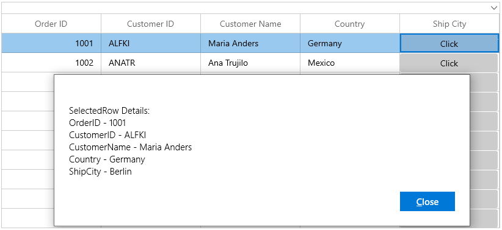

# MVVM in WinUI DataGrid (SfDataGrid)

## DataGrid SelectedItem binding

You can bind the [SelectedItem](https://help.syncfusion.com/cr/winui/Syncfusion.UI.Xaml.Grids.SfGridBase.html#Syncfusion_UI_Xaml_Grids_SfGridBase_SelectedItem) property directly to the DataGrid by setting the `SfDataGrid.SelectedItem` property.



<dataGrid:SfDataGrid x:Name="sfDataGrid"
                        AutoGenerateColumns="False"  
                        SelectedItem="{Binding SelectedItem, Mode=TwoWay, UpdateSourceTrigger=PropertyChanged}"
                        ItemsSource="{Binding Orders}"
                        NavigationMode="Cell"
                        ColumnWidthMode="Star"
                        SelectionMode="Extended"
                        ShowRowHeader="True" />



Whenever the `SelectedItem` is changed, the property in the view model will get notified.



public class ViewModel : NotificationObject
{
    public ViewModel()
    {
        _selectedItem = Orders[1];
    }

    private ObservableCollection<OrderInfo> _orders;
    public ObservableCollection<OrderInfo> Orders
    {
        get { return _orders; }
        set { _orders = value; RaisePropertyChanged("Orders"); }
    }

    private object _selectedItem;
    public object SelectedItem
    {
        get { return _selectedItem; }
        set { _selectedItem = value; RaisePropertyChanged("SelectedItem"); }      
    }
}



## DataGrid SelectedItems binding

You can bind the [SelectedItems](https://help.syncfusion.com/cr/winui/Syncfusion.UI.Xaml.Grids.SfGridBase.html#Syncfusion_UI_Xaml_Grids_SfGridBase_SelectedItems) property directly to the DataGrid by setting the `SfDataGrid.SelectedItems` property.



<dataGrid:SfDataGrid x:Name="sfDataGrid"                                
                                AutoGenerateColumns="False"                               
                                SelectedItems="{Binding SelectedItems,Mode=TwoWay,UpdateSourceTrigger=PropertyChanged}"
                                ItemsSource="{Binding Orders}"
                                NavigationMode="Cell"
                                ColumnWidthMode="Star"
                                SelectionMode="Extended"
                                ShowRowHeader="True" />



You can bind the `SelectedItems` from the property included in the view model.



public class ViewModel : NotificationObject
{
    public ViewModel()
    {
        _selectedItems = new ObservableCollection<object>();
        _selectedItems.Add(Orders[3]);
        _selectedItems.Add(Orders[6]);
        _selectedItems.Add(Orders[9]);
        _selectedItems.Add(Orders[12]);
    }
	
    private ObservableCollection<OrderInfo> _orders;
    public ObservableCollection<OrderInfo> Orders
    {
        get { return _orders; }
        set { _orders = value; RaisePropertyChanged("Orders"); }
    }

    private ObservableCollection<object> _selectedItems; 
    public ObservableCollection<object> SelectedItems
    {
        get { return _selectedItems; }
        set { _selectedItems = value; RaisePropertyChanged("SelectedItems"); }      
    }
}



## Button command binding to view model

You can load a button for the columns in the DataGrid by using [GridTemplateColumn](https://help.syncfusion.com/cr/winui/Syncfusion.UI.Xaml.DataGrid.GridTemplateColumn.html). When loading the buttons, you can bind command included in view model by using `ElementName` binding.

In the following example, the command receives the underlying data object as command parameter since the `DataContext` is binding as command parameter.



<dataGrid:SfDataGrid x:Name="sfDataGrid"                                   
                                   ColumnWidthMode="Star"
                                   AllowEditing="True"
                                   AutoGenerateColumns="False"
                                   ItemsSource="{Binding Orders}">
<dataGrid:SfDataGrid.Columns>
    <dataGrid:GridTextColumn HeaderText="Order ID" MappingName="OrderID" TextAlignment="Right" />
    <dataGrid:GridTextColumn HeaderText="Customer ID" MappingName="CustomerID"  />
    <dataGrid:GridTextColumn MappingName="CustomerName" HeaderText="Customer Name" />
    <dataGrid:GridTextColumn MappingName="Country" />
    <dataGrid:GridTemplateColumn MappingName="ShipCity" HeaderText="Ship City">
        <dataGrid:GridTemplateColumn.CellTemplate>
            <DataTemplate>
                <Button  Content="Click" Width="160" Height="30" Command="{Binding Path=DataContext.RowDataCommand,ElementName=sfDataGrid}" CommandParameter="{Binding}"/>
            </DataTemplate>
        </dataGrid:GridTemplateColumn.CellTemplate>
    </dataGrid:GridTemplateColumn>
</dataGrid:SfDataGrid.Columns>
</dataGrid:SfDataGrid>



using Syncfusion.UI.Xaml.Core;

public class ViewModel
{
    public ViewModel()
    {
        rowDataCommand = new DelegateCommand(ChangeCanExecute);
    }
        
    private DelegateCommand rowDataCommand;

    /// 

    /// Gets and sets the rowdata command.
    /// 

    public DelegateCommand RowDataCommand
    {
        get
        {                
            return rowDataCommand;
        }
        set
        {
            rowDataCommand = value;
        }
    }

    /// 

    /// Shown the selected record.
    /// 
   
    public async void ChangeCanExecute(object obj)
    {
        var rowDataContent = (obj as OrderInfo);

        MessageDialog showDialog = new MessageDialog("SelectedRow Details:\n" +
            "OrderID - " + rowDataContent.OrderID +
            "\nCustomerID - " + rowDataContent.CustomerID +
            "\nCustomerName - " + rowDataContent.CustomerName +
            "\nCountry - " + rowDataContent.Country +
            "\nShipCity - " + rowDataContent.ShipCity);                
        await showDialog.ShowAsync();
    }
}




## Binding ComboBoxColumn ItemsSource from view model

You can bind the `ItemsSource` from `ViewModel` to [GridComboBoxColumn](https://help.syncfusion.com/cr/winui/Syncfusion.UI.Xaml.DataGrid.GridComboBoxColumn.html) by using the `ElementName` binding.



<dataGrid:SfDataGrid x:Name="sfDataGrid"                                   
                                   ColumnWidthMode="Star"
                                   AllowEditing="True"
                                   AutoGenerateColumns="False"
                                   ItemsSource="{Binding Orders}">
    <dataGrid:SfDataGrid.Columns>
        <dataGrid:GridTextColumn HeaderText="Order ID" MappingName="OrderID" TextAlignment="Right"/>
        <dataGrid:GridTextColumn HeaderText="Customer ID" MappingName="CustomerID"  />
        <dataGrid:GridTextColumn MappingName="CustomerName" HeaderText="Customer Name" />    
        <dataGrid:GridTextColumn MappingName="ShipCity" HeaderText="Ship City" />
        <dataGrid:GridComboBoxColumn MappingName="Country" ItemsSource="{Binding Path=DataContext.CountryList, ElementName=sfDataGrid}" />
    </dataGrid:SfDataGrid.Columns>
</dataGrid:SfDataGrid>




public class ViewModel : NotificationObject
{
    public ViewModel()
    {
        countryList = new ObservableCollection<string>();
        countryList.Add("UK");
        countryList.Add("Sweden");
        countryList.Add("America");
        countryList.Add("Canada");
        countryList.Add("Italy");
        countryList.Add("France");
        countryList.Add("German");
        countryList.Add("Mexico");
    }

    private ObservableCollection<string> countryList; 
    public ObservableCollection<string> CountryList
    {
        get
        {
            return countryList;
        }
        set
        {
            countryList = value;
            RaisePropertyChanged("CountryList");
        }
    }
}




## Binding ItemsSource from view model to ComboBox inside data template

You can load the `ComboBox` inside the `GridTemplateColumn` and bind the `ItemsSource` from `ViewModel` to `ComboBox` by using the `ElementName` binding.



<dataGrid:SfDataGrid x:Name="sfDataGrid"                                   
                                   ColumnWidthMode="Star"
                                   AllowEditing="True"
                                   AutoGenerateColumns="False"
                                   ItemsSource="{Binding Orders}">
    <dataGrid:SfDataGrid.Columns>
        <dataGrid:GridTextColumn HeaderText="Order ID" MappingName="OrderID" TextAlignment="Right" />
        <dataGrid:GridTextColumn HeaderText="Customer ID" MappingName="CustomerID"  />
        <dataGrid:GridTextColumn MappingName="CustomerName" HeaderText="Customer Name" />    
        <dataGrid:GridTextColumn MappingName="ShipCity" HeaderText="Ship City" />
        <dataGrid:GridTemplateColumn MappingName="Country">
            <dataGrid:GridTemplateColumn.CellTemplate>
                <DataTemplate>
                    <TextBlock Text="{Binding Country}" />
                <DataTemplate>
            </dataGrid:GridTemplateColumn.CellTemplate>	
            <dataGrid:GridTemplateColumn.EditTemplate>
                <DataTemplate>
                    <ComboBox ItemsSource="{Binding Path=DataContext.CountryList, ElementName=sfDataGrid}" DisplayMemberPath="{Binding CountryList}" Width="150" />
                <DataTemplate>
            </dataGrid:GridTemplateColumn.EditTemplate>
        </dataGrid:GridTemplateColumn>	
    </dataGrid:SfDataGrid.Columns>
</dataGrid:SfDataGrid>



public class ViewModel : NotificationObject
{
    public ViewModel()
    {
        countryList = new ObservableCollection<string>();
        countryList.Add("UK");
        countryList.Add("Sweden");
        countryList.Add("America");
        countryList.Add("Canada");
        countryList.Add("Italy");
        countryList.Add("France");
        countryList.Add("German");
        countryList.Add("Mexico");
    }

    private ObservableCollection<string> countryList; 
    public ObservableCollection<string> CountryList
    {
        get
        {
            return countryList;
        }
        set
        {
            countryList = value;
            RaisePropertyChanged("CountryList");
        }
    }
}




## Binding DataGrid columns from view model

You can bind the [SfDataGrid.Columns](https://help.syncfusion.com/cr/winui/Syncfusion.UI.Xaml.DataGrid.SfDataGrid.html#Syncfusion_UI_Xaml_DataGrid_SfDataGrid_Columns) to a property in the `ViewModel` by having the `binding` property of type `Syncfusion.UI.Xaml.DataGrid.Columns`. Thus, you can set binding to the `SfDataGrid.Columns` property that provides `DataContext` of the DataGrid is `ViewModel`. 



<dataGrid:SfDataGrid x:Name="sfDataGrid"  
                        AutoGenerateColumns="False"
                        Columns="{Binding SfDataGridColumns, Mode=TwoWay}"
                        ItemsSource="{Binding Orders}" />



Refer to the following code example in which the `SfDataGridColumns` is populated with some [GridTextColumn](https://help.syncfusion.com/cr/winui/Syncfusion.UI.Xaml.DataGrid.GridTextColumn.html) when creating the `ViewModel` instance.



public class ViewModel
{
    private Columns sfDataGridColumns;

    public ViewModel()
    {
        SetSfGridColumns();        	
    }

    public Columns SfDataGridColumns
    {
       get { return sfDataGridColumns; }
       set { this.sfDataGridColumns = value; }
    }

    /// 

    /// To generate the columns for SfDataGrid.
    /// 

    protected void SetSfGridColumns()
    {
        this.sfDataGridColumns = new Columns();
        sfDataGridColumns.Add(new GridTextColumn() { MappingName = "OrderID", HeaderText = "Order ID", TextAlignment = TextAlignment.Right });
        sfDataGridColumns.Add(new GridTextColumn() { MappingName = "CustomerID", HeaderText = "Customer ID" });
        sfDataGridColumns.Add(new GridTextColumn() { MappingName = "CustomerName", HeaderText = "Customer Name" });
        sfDataGridColumns.Add(new GridTextColumn() { MappingName = "ShipCity", HeaderText = "Ship City" });
        sfDataGridColumns.Add(new GridTextColumn() { MappingName = "Country" });
    }
}


