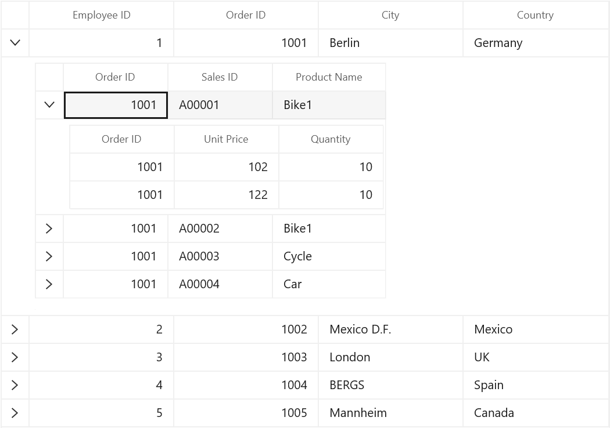
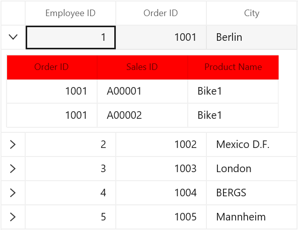
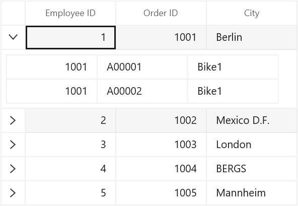
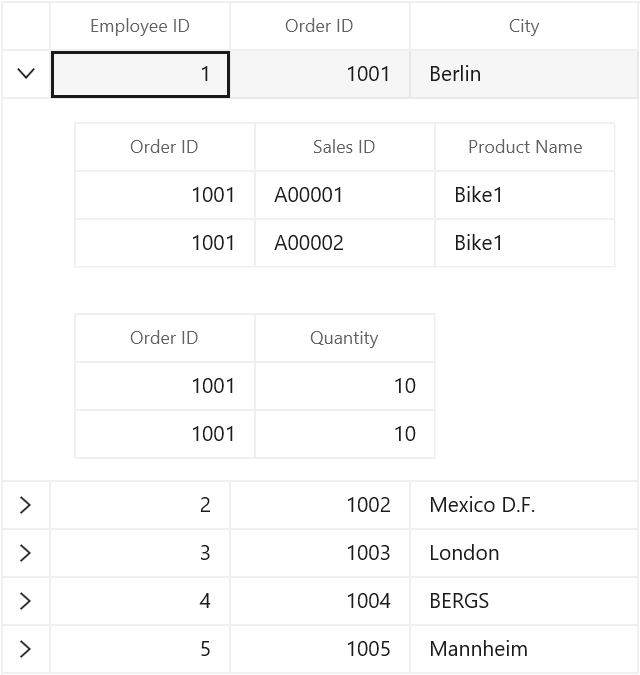
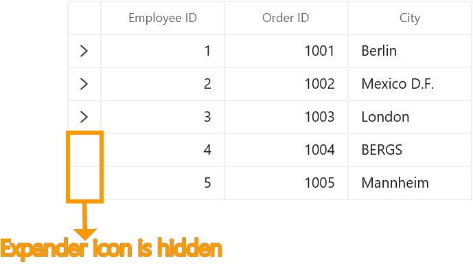
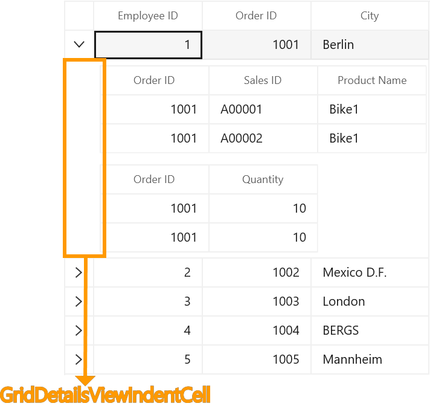
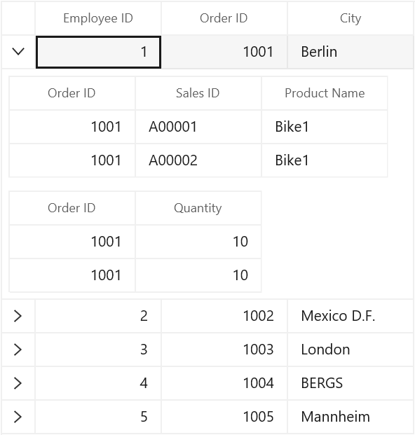

---
layout: post
title: Master Details View in WinUI DataGrid control | Syncfusion
description: Learn here all about Master Details View support in Syncfusion WinUI DataGrid(SfDataGird) control and more.
platform: winui
control: SfDataGrid
documentation: ug
--- 

# Master Details View in WinUI DataGrid

SfDataGrid provides support to represent the hierarchical data in the form of nested tables using Master-Details View. You can expand or collapse the nested tables ([DetailsViewDataGrid](https://help.syncfusion.com/cr/winui/Syncfusion.UI.Xaml.DataGrid.DetailsViewDataGrid.html)) by using an expander in a row or programmatically.  The number of tables nested with relations is unlimited.

## Generating Master-Details view from IEnumerable

Master-Details View’s relation can be generated for the properties of type [IEnumerable](https://docs.microsoft.com/en-us/dotnet/api/system.collections.ienumerable?view=net-6.0) in the underlying data object contain.
Follow the below steps to generate the Master-Details View for `IEnumerable`.

* Create the data model with relations (Here, relations are `IEnumerable` type properties)
* Defining relations
  * Auto-generating relations
  * Manually defining relations
   
### Create the data model with relations

Create an `Employee` class with `Sales` and `Orders` property of type [ObservableCollection](https://msdn.microsoft.com/en-us/library/ms668604.aspx) to form the relations. The `Sales` and `Orders` properties are defined as `ObservableCollection<SalesInfo>` and `ObservableCollection<OrderInfo>` respectively. 



public class SalesInfo : INotifyPropertyChanged
{
    private int _orderID;
    private string _salesID;
    private string _productName;

    public int OrderID
    {
        get { return _orderID; }
        set
        {
            _orderID = value;
            OnPropertyChanged("OrderID");
        }
    }

    public string SalesID
    {
        get { return _salesID; }
        set
        {
            _salesID = value;
            OnPropertyChanged("SalesID");
        }
    }

    public string ProductName
    {
        get { return _productName; }
        set
        {
            _productName = value;
            OnPropertyChanged("ProductName");
        }
    }
    public event PropertyChangedEventHandler PropertyChanged;

    private void OnPropertyChanged(String name)
    {

        if (PropertyChanged != null)
        {
            PropertyChanged(this, new PropertyChangedEventArgs(name));
        }
    }
}

public class OrderInfo : INotifyPropertyChanged
{
    private int orderId;
    private int _quantity;

    public int OrderID
    {
        get { return orderId; }
        set
        {
            orderId = value;
            OnPropertyChanged("OrderID");
        }
    }

    public int Quantity
    {
        get { return _quantity; }
        set
        {
            _quantity = value;
            OnPropertyChanged("Quantity");
        }
    }
    public event PropertyChangedEventHandler PropertyChanged;

    private void OnPropertyChanged(String name)
    {

        if (PropertyChanged != null)
        {
            PropertyChanged(this, new PropertyChangedEventArgs(name));
        }
    }
}

public class Employee : INotifyPropertyChanged
{
    private int _EmployeeID;
    private int _orderId;
    private string _city;
    private ObservableCollection<SalesInfo> _sales;
    private ObservableCollection<OrderInfo> _orders;

    public int EmployeeID
    {
        get { return this._EmployeeID; }
        set
        {
            this._EmployeeID = value;
            OnPropertyChanged("EmployeeID");
        }
    }

    public int OrderID
    {
        get { return this._orderId; }
        set
        {
            this._orderId = value;
            OnPropertyChanged("OrderID");
        }
    }

    public string City
    {
        get { return _city; }
        set
        {
            _city = value;
            OnPropertyChanged("City");
        }
    }

    public ObservableCollection<SalesInfo> Sales
    {
        get { return _sales; }
        set
        {
            _sales = value;
            OnPropertyChanged("Sales");
        }
    }

    public ObservableCollection<OrderInfo> Orders
    {
        get { return _orders; }
        set
        {
            _orders = value;
            OnPropertyChanged("Orders");
        }
    }

    public event PropertyChangedEventHandler PropertyChanged;

    private void OnPropertyChanged(String name)
    {

        if (PropertyChanged != null)
        {
            PropertyChanged(this, new PropertyChangedEventArgs(name));
        }
    }
}



Create a `ViewModel` class with `Employees` property and it is initialized with several data objects in the constructor. Similarly, the `Sales` and `Orders` property are also initialized.
 


public class ViewModel
{
    ObservableCollection<Employee> _employees;

    public ObservableCollection<Employee> Employees
    {
        get { return _employees; }
        set { _employees = value; }
    }

    public ViewModel()
    {
        this.GenerateOrders();
        this.GenerateSales();
        _employees = GetEmployeesDetails();
    }

    public ObservableCollection<Employee> GetEmployeesDetails()
    {
        var employees = new ObservableCollection<Employee>();
        employees.Add(new Employee() { EmployeeID = 1, OrderID = 1001, City = "Berlin", Orders = GetOrders(1001), Sales = GetSales(1001) });
        employees.Add(new Employee() { EmployeeID = 2, OrderID = 1002, City = "Mexico D.F.", Orders = GetOrders(1002), Sales = GetSales(1002) });
        employees.Add(new Employee() { EmployeeID = 3, OrderID = 1003, City = "London", Orders = GetOrders(1002), Sales = GetSales(1003) });
        employees.Add(new Employee() { EmployeeID = 4, OrderID = 1004, City = "BERGS", Orders = GetOrders(1002), Sales = GetSales(1004) });
        employees.Add(new Employee() { EmployeeID = 5, OrderID = 1005, City = "Mannheim", Orders = GetOrders(1002), Sales = GetSales(1005) });
        return employees;
    }

    //Orders collection is initialized here.
    ObservableCollection<OrderInfo> Orders = new ObservableCollection<OrderInfo>();

    public void GenerateOrders()
    {
        Orders.Add(new OrderInfo() { OrderID = 1001, Quantity = 10 });
        Orders.Add(new OrderInfo() { OrderID = 1001, Quantity = 10 });
        Orders.Add(new OrderInfo() { OrderID = 1002, Quantity = 20 });
        Orders.Add(new OrderInfo() { OrderID = 1002, Quantity = 20 });
        Orders.Add(new OrderInfo() { OrderID = 1003, Quantity = 50 });
        Orders.Add(new OrderInfo() { OrderID = 1004, Quantity = 70 });
        Orders.Add(new OrderInfo() { OrderID = 1005, Quantity = 20 });
        Orders.Add(new OrderInfo() { OrderID = 1005, Quantity = 20 });
    }

    private ObservableCollection<OrderInfo> GetOrders(int orderID)
    {
        ObservableCollection<OrderInfo> orders = new ObservableCollection<OrderInfo>();

        foreach (var order in Orders)

            if (order.OrderID == orderID)
                orders.Add(order);
        return orders;
    }

    //Sales collection is initialized here.
    ObservableCollection<SalesInfo> Sales = new ObservableCollection<SalesInfo>();

    public void GenerateSales()
    {
        Sales.Add(new SalesInfo() { OrderID = 1001, SalesID = "A00001", ProductName = "Bike1" });
        Sales.Add(new SalesInfo() { OrderID = 1001, SalesID = "A00002", ProductName = "Bike1" });
        Sales.Add(new SalesInfo() { OrderID = 1002, SalesID = "A00003", ProductName = "Cycle" });
        Sales.Add(new SalesInfo() { OrderID = 1003, SalesID = "A00004", ProductName = "Car" });
    }

    private ObservableCollection<SalesInfo> GetSales(int orderID)
    {
        ObservableCollection<SalesInfo> sales = new ObservableCollection<SalesInfo>();

        foreach (var sale in Sales)

            if (sale.OrderID == orderID)
                sales.Add(sale);
        return sales;
    }
}



### Defining relations in DataGrid
 
#### Auto-generating relations

SfDataGrid will automatically generate relations and inner relations for the `IEnumerable` property types in the data object. This can be enabled by setting [SfDataGrid.AutoGenerateRelations](https://help.syncfusion.com/cr/winui/Syncfusion.UI.Xaml.DataGrid.SfDataGrid.html#Syncfusion_UI_Xaml_DataGrid_SfDataGrid_AutoGenerateRelations) to `true`.
Bind the collection created in the previous step to [SfDataGrid.ItemsSource](https://help.syncfusion.com/cr/winui/Syncfusion.UI.Xaml.DataGrid.SfDataGrid.html#Syncfusion_UI_Xaml_DataGrid_SfDataGrid_ItemsSource) and set the [SfDataGrid.AutoGenerateRelations](https://help.syncfusion.com/cr/winui/Syncfusion.UI.Xaml.DataGrid.SfDataGrid.html#Syncfusion_UI_Xaml_DataGrid_SfDataGrid_AutoGenerateRelations) to `true`.
 


<syncfusion:SfDataGrid  x:Name="dataGrid"
                        ColumnWidthMode="Star"
                        AutoGenerateColumns="True"
                        AutoGenerateRelations="True"
                        ItemsSource="{Binding Employees}" />


dataGrid.AutoGenerateRelations = true;



When relations are auto-generated, you can handle the [SfDataGrid.AutoGeneratingRelations](https://help.syncfusion.com/cr/winui/Syncfusion.UI.Xaml.DataGrid.SfDataGrid.html#Syncfusion_UI_Xaml_DataGrid_SfDataGrid_AutoGenerateRelations) event to customize or cancel the [GridViewDefinition](https://help.syncfusion.com/cr/winui/Syncfusion.UI.Xaml.DataGrid.GridViewDefinition.html) before they are added to the [SfDataGrid.DetailsViewDefinition](https://help.syncfusion.com/cr/winui/Syncfusion.UI.Xaml.DataGrid.DetailsViewDefinition.html). 
Here, two relations are created from `Sales` and `Orders` collection property.

#### Manually defining Relations

You can define the Master-Details View’s relation manually using [SfDataGird.DetailsViewDefinition](https://help.syncfusion.com/cr/winui/Syncfusion.UI.Xaml.DataGrid.DetailsViewDefinition.html), when the [SfDataGrid.AutoGenerateRelations](https://help.syncfusion.com/cr/winui/Syncfusion.UI.Xaml.DataGrid.SfDataGrid.html#Syncfusion_UI_Xaml_DataGrid_SfDataGrid_AutoGenerateRelations) is `false`. 
To define Master-Details View relations, create [GridViewDefinition](https://help.syncfusion.com/cr/winui/Syncfusion.UI.Xaml.DataGrid.GridViewDefinition.html) and set the name of `IEnumerable` type property (from data object) to [ViewDefinition.RelationalColumn](https://help.syncfusion.com/cr/winui/Syncfusion.UI.Xaml.DataGrid.ViewDefinition.html#Syncfusion_UI_Xaml_DataGrid_ViewDefinition_RelationalColumn). Then, add the `GridViewDefinition` to the [SfDataGrid.DetailsViewDefinition](https://help.syncfusion.com/cr/winui/Syncfusion.UI.Xaml.DataGrid.DetailsViewDefinition.html). 



<syncfusion:SfDataGrid x:Name="dataGrid"
                AutoGenerateColumns="True"
                ColumnWidthMode="Star"
                AutoGenerateRelations="False"
                ItemsSource="{Binding Employees}">
    <syncfusion:SfDataGrid.DetailsViewDefinition>
        <!--  FirstLevelNestedGrid1 is created here  -->
        <syncfusion:GridViewDefinition RelationalColumn="Sales">
            <syncfusion:GridViewDefinition.DataGrid>
                <syncfusion:SfDataGrid x:Name="FirstLevelNestedGrid1"
                                AutoGenerateColumns="True"/>
            </syncfusion:GridViewDefinition.DataGrid>
        </syncfusion:GridViewDefinition>
        <!--  FirstLevelNestedGrid2 is created here  -->
        <syncfusion:GridViewDefinition RelationalColumn="Orders">
            <syncfusion:GridViewDefinition.DataGrid>
                <syncfusion:SfDataGrid x:Name="FirstLevelNestedGrid2"
                                AutoGenerateColumns="True"/>
            </syncfusion:GridViewDefinition.DataGrid>
        </syncfusion:GridViewDefinition>
    </syncfusion:SfDataGrid.DetailsViewDefinition>
</syncfusion:SfDataGrid>


dataGrid.AutoGenerateRelations = false;

var gridViewDefinition1 = new GridViewDefinition();
gridViewDefinition1.RelationalColumn = "Sales";
gridViewDefinition1.DataGrid = new SfDataGrid() { Name = "FirstLevelNestedGrid1", AutoGenerateColumns = true };

var gridViewDefinition2 = new GridViewDefinition();
gridViewDefinition2.RelationalColumn = "Orders";
gridViewDefinition2.DataGrid = new SfDataGrid() { Name = "FirstLevelNestedGrid2", AutoGenerateColumns = true };

dataGrid.DetailsViewDefinition.Add(gridViewDefinition1);
dataGrid.DetailsViewDefinition.Add(gridViewDefinition2);



In the same way, you can define relations for first level nested grids by defining relations to the [ViewDefinition.DataGrid](https://help.syncfusion.com/cr/winui/Syncfusion.UI.Xaml.DataGrid.GridViewDefinition.html#Syncfusion_UI_Xaml_DataGrid_GridViewDefinition_DataGrid) of first level nested grid.



<syncfusion:SfDataGrid x:Name="dataGrid"
                                AutoGenerateColumns="True"
                                ItemsSource="{Binding Path=Source,Mode=TwoWay}"
                                ColumnWidthMode="Star">
    <syncfusion:SfDataGrid.DetailsViewDefinition >
        <syncfusion:GridViewDefinition RelationalColumn="OrderDetails"  >
            <syncfusion:GridViewDefinition.DataGrid >
                <syncfusion:SfDataGrid x:Name="FirstDetailsViewGrid" 
                                        AutoGenerateColumns="True"
                                        AutoGenerateRelations="False">
                    <syncfusion:SfDataGrid.DetailsViewDefinition>
                        <syncfusion:GridViewDefinition RelationalColumn="SalesDetails">
                            <syncfusion:GridViewDefinition.DataGrid>
                                <syncfusion:SfDataGrid x:Name="SecondDetailsViewGrid" 
                                                        AutoGenerateColumns="True" >
                                </syncfusion:SfDataGrid>
                            </syncfusion:GridViewDefinition.DataGrid>
                        </syncfusion:GridViewDefinition>
                    </syncfusion:SfDataGrid.DetailsViewDefinition>
                </syncfusion:SfDataGrid>
            </syncfusion:GridViewDefinition.DataGrid>
        </syncfusion:GridViewDefinition>
    </syncfusion:SfDataGrid.DetailsViewDefinition>
</syncfusion:SfDataGrid>


dataGrid.AutoGenerateRelations = false;

// GridViewDefinition for parent DataGrid
var gridViewDefinition1 = new GridViewDefinition();
gridViewDefinition1.RelationalColumn = "OrderDetails";
var firstLevelNestedGrid = new SfDataGrid() { Name = "FirstLevelNestedGrid", AutoGenerateColumns = true };
firstLevelNestedGrid.AutoGenerateRelations = false;

// GridViewDefinition for FirstLevelNestedGrid
var gridViewDefinition = new GridViewDefinition();
gridViewDefinition.RelationalColumn = "SalesDetails";
gridViewDefinition.DataGrid = new SfDataGrid() { Name = "SecondLevelNestedGrid", AutoGenerateColumns = true };
firstLevelNestedGrid.DetailsViewDefinition.Add(gridViewDefinition);
gridViewDefinition1.DataGrid = firstLevelNestedGrid;

dataGrid.DetailsViewDefinition.Add(gridViewDefinition1);



## Populating Master-Details view through events

You can load `ItemsSource` for [DetailsViewDataGrid](https://help.syncfusion.com/cr/winui/Syncfusion.UI.Xaml.DataGrid.DetailsViewDataGrid.html) asynchronously by handling [SfDataGrid.DetailsViewExpanding](https://help.syncfusion.com/cr/winui/Syncfusion.UI.Xaml.DataGrid.SfDataGrid.html#Syncfusion_UI_Xaml_DataGrid_SfDataGrid_DetailsViewExpanding). You can set ItemsSource in on-demand when expanding record through [GridDetailsViewExpandingEventArgs.DetailsViewItemsSource](https://help.syncfusion.com/cr/winui/Syncfusion.UI.Xaml.DataGrid.GridDetailsViewExpandingEventArgs.html#Syncfusion_UI_Xaml_DataGrid_GridDetailsViewExpandingEventArgs_DetailsViewItemsSource) property in the [SfDataGrid.DetailsViewExpanding](https://help.syncfusion.com/cr/winui/Syncfusion.UI.Xaml.DataGrid.SfDataGrid.html#Syncfusion_UI_Xaml_DataGrid_SfDataGrid_DetailsViewExpanding) event handler. 



<syncfusion:SfDataGrid  x:Name="dataGrid"
                        ColumnWidthMode="Star"
                        AutoGenerateColumns="True"
                        AutoGenerateRelations="True"
                        DetailsViewExpanding="dataGrid_DetailsViewExpanding"
                        ItemsSource="{Binding Employees}" />



private void dataGrid_DetailsViewExpanding(object sender, GridDetailsViewExpandingEventArgs e)
{
    e.DetailsViewItemsSource.Clear();
    var itemsSource = GetItemSource();
    e.DetailsViewItemsSource.Add("ProductDetails", itemsSource);
}
private ObservableCollection<OrderInfo> GetItemSource()
{
    var products = new ObservableCollection<OrderInfo>();
    products.Add(new OrderInfo() { OrderID = 1001, Quantity = 10 });
    products.Add(new OrderInfo() { OrderID = 1002, Quantity = 20 });
    products.Add(new OrderInfo() { OrderID = 1003, Quantity = 30 });
    return products;
}



N> This event will be trigged only when underlying data object contains relations. Otherwise, you have to define dummy relation to notify DataGrid to fire this event.

In the below code snippet, `AutoGenerateRelations` set to false and also relation is defined with some name to `RelationalColumn`. For example, `ProductDetails` is the dummy relational column and underlying data object does not contain the `IEnumerable` type property with name `ProductDetails`.



<syncfusion:SfDataGrid  x:Name="dataGrid"
                        ColumnWidthMode="Star"
                        AutoGenerateColumns="True"
                        AutoGenerateRelations="True"
                        DetailsViewExpanding="dataGrid_DetailsViewExpanding"
                        ItemsSource="{Binding Employees}" >
    <syncfusion:SfDataGrid.DetailsViewDefinition>
        <syncfusion:GridViewDefinition RelationalColumn="ProductDetails">
            <syncfusion:GridViewDefinition.DataGrid>
                <syncfusion:SfDataGrid x:Name="FirstLevelNestedGrid"  
                                        AutoGenerateColumns="True" />
            </syncfusion:GridViewDefinition.DataGrid>
        </syncfusion:GridViewDefinition>
    </syncfusion:SfDataGrid.DetailsViewDefinition>
</syncfusion:SfDataGrid>



Now the `ItemsSource` for [DetailsViewDataGrid](https://help.syncfusion.com/cr/winui/Syncfusion.UI.Xaml.DataGrid.DetailsViewDataGrid.html) can be supplied through [DetailsViewExpanding](https://help.syncfusion.com/cr/winui/Syncfusion.UI.Xaml.DataGrid.SfDataGrid.html#Syncfusion_UI_Xaml_DataGrid_SfDataGrid_DetailsViewExpanding) event as mentioned above.

## Defining properties for DetailsViewDataGrid

You can set properties like `AllowEditing`, `AllowFiltering` and `AllowSorting` for [DetailsViewDataGrid](https://help.syncfusion.com/cr/winui/Syncfusion.UI.Xaml.DataGrid.DetailsViewDataGrid.html) by using the [GridViewDefinition.DataGrid](https://help.syncfusion.com/cr/winui/Syncfusion.UI.Xaml.DataGrid.GridViewDefinition.html#Syncfusion_UI_Xaml_DataGrid_GridViewDefinition_DataGrid) property.

### When AutoGenerateRelations is false

For manually defined relation, the properties can be directly set to the [ViewDefinition.DataGrid](https://help.syncfusion.com/cr/winui/Syncfusion.UI.Xaml.DataGrid.GridViewDefinition.html#Syncfusion_UI_Xaml_DataGrid_GridViewDefinition_DataGrid).



<syncfusion:SfDataGrid x:Name="dataGrid"
                        AutoGenerateColumns="True"
                        AutoGenerateRelations="False"
                        ItemsSource="{Binding Path=Source,Mode=TwoWay}"
                        ColumnWidthMode="Star">
    <syncfusion:SfDataGrid.DetailsViewDefinition>
        <syncfusion:GridViewDefinition RelationalColumn="OrderDetails">
            <syncfusion:GridViewDefinition.DataGrid>
                <syncfusion:SfDataGrid x:Name="FirstLevelNestedGrid"
                                        AllowEditing="True"
                                        AllowFiltering="True"
                                        AllowResizingColumns="True"
                                        AllowSorting="True"
                                        AutoGenerateColumns="False" />
            </syncfusion:GridViewDefinition.DataGrid>
        </syncfusion:GridViewDefinition>
    </syncfusion:SfDataGrid.DetailsViewDefinition>
</syncfusion:SfDataGrid>


FirstLevelNestedGrid.AllowEditing = true;
FirstLevelNestedGrid.AllowFiltering = true;
FirstLevelNestedGrid.AllowResizingColumns = true;
FirstLevelNestedGrid.AllowSorting = true;



For two levels of nesting,



<syncfusion:SfDataGrid x:Name="dataGrid"
                        AutoGenerateColumns="True"
                        AutoGenerateRelations="False"
                        ItemsSource="{Binding Path=Source,Mode=TwoWay}"
                        ColumnWidthMode="Star">
    <syncfusion:SfDataGrid.DetailsViewDefinition >
        <syncfusion:GridViewDefinition RelationalColumn="OrderDetails"  >
            <syncfusion:GridViewDefinition.DataGrid >
                <syncfusion:SfDataGrid x:Name="FirstDetailsViewGrid" 
                                        AutoGenerateColumns="True"
                                        AutoGenerateRelations="False">
                    <syncfusion:SfDataGrid.DetailsViewDefinition>
                        <syncfusion:GridViewDefinition RelationalColumn="SalesDetails">
                            <syncfusion:GridViewDefinition.DataGrid>
                                <syncfusion:SfDataGrid x:Name="SecondDetailsViewGrid" 
                                                        AllowEditing="True"
                                                        AllowFiltering="True"
                                                        AutoGenerateColumns="True" >
                                </syncfusion:SfDataGrid>
                            </syncfusion:GridViewDefinition.DataGrid>
                        </syncfusion:GridViewDefinition>
                    </syncfusion:SfDataGrid.DetailsViewDefinition>
                </syncfusion:SfDataGrid>
            </syncfusion:GridViewDefinition.DataGrid>
        </syncfusion:GridViewDefinition>
    </syncfusion:SfDataGrid.DetailsViewDefinition>
</syncfusion:SfDataGrid>


SecondDetailsViewGrid.AllowEditing = true;
SecondDetailsViewGrid.AllowFiltering = true;



### When AutoGenerateRelations is true

When the relation is auto-generated, you can get the [GridViewDefinition.DataGrid](https://help.syncfusion.com/cr/winui/Syncfusion.UI.Xaml.DataGrid.GridViewDefinition.html#Syncfusion_UI_Xaml_DataGrid_GridViewDefinition_DataGrid) in the [AutoGeneratingRelations](https://help.syncfusion.com/cr/winui/Syncfusion.UI.Xaml.DataGrid.SfDataGrid.html#Syncfusion_UI_Xaml_DataGrid_SfDataGrid_AutoGeneratingRelations) event handler to set the properties.



<syncfusion:SfDataGrid x:Name="dataGrid"
                        AutoGenerateColumns="True"
                        AutoGenerateRelations="True"
                        ItemsSource="{Binding Path=Source,Mode=TwoWay}"
                        ColumnWidthMode="Star">
</syncfusion:SfDataGrid>


dataGrid.AutoGeneratingRelations += DataGrid_AutoGeneratingRelations;

private void DataGrid_AutoGeneratingRelations(object sender, AutoGeneratingRelationsArgs e)
{
    e.GridViewDefinition.DataGrid.AllowEditing = true;
    e.GridViewDefinition.DataGrid.AllowFiltering = true;
    e.GridViewDefinition.DataGrid.AllowSorting = true;
    e.GridViewDefinition.DataGrid.AllowResizingColumns = true;
}



N> When you make any change in one [DetailsViewDataGrid](https://help.syncfusion.com/cr/winui/Syncfusion.UI.Xaml.DataGrid.DetailsViewDataGrid.html), that change will be applied to all [DetailsViewDataGrid](https://help.syncfusion.com/cr/winui/Syncfusion.UI.Xaml.DataGrid.DetailsViewDataGrid.html) in the same level. For example, when you resize the first column in one [DetailsViewDataGrid](https://help.syncfusion.com/cr/winui/Syncfusion.UI.Xaml.DataGrid.DetailsViewDataGrid.html), the same column width is applied to all [DetailsViewDataGrid](https://help.syncfusion.com/cr/winui/Syncfusion.UI.Xaml.DataGrid.DetailsViewDataGrid.html) at that level. This is applicable for features like filtering, sorting, grouping and re ordering columns also. 

N> [AllowFrozenGroupHeaders](https://help.syncfusion.com/cr/winui/Syncfusion.UI.Xaml.DataGrid.SfDataGrid.html#Syncfusion_UI_Xaml_DataGrid_SfDataGrid_AllowFrozenGroupHeaders), [FrozenRowsCount](https://help.syncfusion.com/cr/winui/Syncfusion.UI.Xaml.DataGrid.SfDataGrid.html#Syncfusion_UI_Xaml_DataGrid_SfDataGrid_FrozenRowsCount), [FrozenFooterRowsCount](https://help.syncfusion.com/cr/winui/Syncfusion.UI.Xaml.DataGrid.SfDataGrid.html#Syncfusion_UI_Xaml_DataGrid_SfDataGrid_FrozenFooterRowsCount), [FooterColumnCount](https://help.syncfusion.com/cr/winui/Syncfusion.UI.Xaml.Grids.SfGridBase.html#Syncfusion_UI_Xaml_Grids_SfGridBase_FrozenFooterColumnCount), [FrozenColumnCount](https://help.syncfusion.com/cr/winui/Syncfusion.UI.Xaml.Grids.SfGridBase.html#Syncfusion_UI_Xaml_Grids_SfGridBase_FrozenColumnCount) properties are not supported while using Master Details view.

## Defining columns for DetailsViewDataGrid

The [ViewDefinition.DataGrid](https://help.syncfusion.com/cr/winui/Syncfusion.UI.Xaml.DataGrid.GridViewDefinition.html#Syncfusion_UI_Xaml_DataGrid_GridViewDefinition_DataGrid) columns can be generated either automatically or manually like parent DataGrid. You can refer Columns section to know more about columns. 

### Auto-generating columns

You can auto-generate the ViewDefinition.DataGrid’s columns by setting the [GridViewDefinition.DataGrid.AutoGenerateColumns](https://help.syncfusion.com/cr/winui/Syncfusion.UI.Xaml.Grids.SfGridBase.html#Syncfusion_UI_Xaml_Grids_SfGridBase_AutoGenerateColumns) to `true`. You can cancel or customize the column being created for [ViewDefinition.DataGrid](https://help.syncfusion.com/cr/winui/Syncfusion.UI.Xaml.DataGrid.GridViewDefinition.html#Syncfusion_UI_Xaml_DataGrid_GridViewDefinition_DataGrid) by handling [GridViewDefinition.DataGrid.AutoGeneratingColumn](https://help.syncfusion.com/cr/winui/Syncfusion.UI.Xaml.DataGrid.SfDataGrid.html#Syncfusion_UI_Xaml_DataGrid_SfDataGrid_AutoGeneratingColumn) event.



<syncfusion:SfDataGrid x:Name="dataGrid"
                AutoGenerateColumns="True"
                AutoGenerateRelations="True"
                ItemsSource="{Binding Employees}">
    <syncfusion:SfDataGrid.DetailsViewDefinition>
        <syncfusion:GridViewDefinition RelationalColumn="Sales">
            <syncfusion:GridViewDefinition.DataGrid>
                <syncfusion:SfDataGrid x:Name="FirstLevelNestedGrid"
                                AutoGenerateColumns="True"                                        
                                AutoGeneratingColumn="FirstLevelNestedGrid_AutoGeneratingColumn" />
            </syncfusion:GridViewDefinition.DataGrid>
        </syncfusion:GridViewDefinition>
    </syncfusion:SfDataGrid.DetailsViewDefinition>
</syncfusion:SfDataGrid>


FirstLevelNestedGrid.AutoGeneratingColumn += FirstLevelNestedGrid_AutoGeneratingColumn1;



When relation is auto generated, you can set properties and wire [GridViewDefinition.DataGrid.AutoGeneratingColumn](https://help.syncfusion.com/cr/winui/Syncfusion.UI.Xaml.DataGrid.SfDataGrid.html#Syncfusion_UI_Xaml_DataGrid_SfDataGrid_AutoGeneratingColumn) event in [SfDataGrid.AutoGeneratingRelations](https://help.syncfusion.com/cr/winui/Syncfusion.UI.Xaml.DataGrid.SfDataGrid.html#Syncfusion_UI_Xaml_DataGrid_SfDataGrid_AutoGeneratingRelations) event handler.



void dataGrid_AutoGeneratingRelations(object sender, Syncfusion.UI.Xaml.Grid.AutoGeneratingRelationsArgs e)
{    
     e.GridViewDefinition.DataGrid.AutoGenerateColumns = true;       
     e.GridViewDefinition.DataGrid += FirstLevelNestedGrid_AutoGeneratingColumn;
}



### Manually defining columns

You can directly define the columns to [ViewDefinition.DataGrid](https://help.syncfusion.com/cr/winui/Syncfusion.UI.Xaml.DataGrid.GridViewDefinition.html#Syncfusion_UI_Xaml_DataGrid_GridViewDefinition_DataGrid) when [AutoGenerateColumns](https://help.syncfusion.com/cr/winui/Syncfusion.UI.Xaml.Grids.SfGridBase.html#Syncfusion_UI_Xaml_Grids_SfGridBase_AutoGenerateColumns) is `false`. When relation is manually defined, you can define the columns directly to `ViewDefinition.DataGrid` in XAML or C#, by adding desired column to the [SfDataGrid.Columns](https://help.syncfusion.com/cr/winui/Syncfusion.UI.Xaml.DataGrid.SfDataGrid.html#Syncfusion_UI_Xaml_DataGrid_SfDataGrid_Columns) collection.
 


<syncfusion:SfDataGrid x:Name="dataGrid"
                        AutoGenerateColumns="True"
                        AutoGenerateRelations="False"
                        ItemsSource="{Binding Employees}">
    <syncfusion:SfDataGrid.DetailsViewDefinition>
        <syncfusion:GridViewDefinition RelationalColumn="Sales">
            <syncfusion:GridViewDefinition.DataGrid>
                <syncfusion:SfDataGrid x:Name="FirstLevelNestedGrid"   AutoGenerateColumns="False">
                    <syncfusion:SfDataGrid.Columns>
                        <syncfusion:GridTextColumn MappingName="OrderID" />
                        <syncfusion:GridTextColumn MappingName="ProductName" />
                    </syncfusion:SfDataGrid.Columns>
                </syncfusion:SfDataGrid>
            </syncfusion:GridViewDefinition.DataGrid>
        </syncfusion:GridViewDefinition>
    </syncfusion:SfDataGrid.DetailsViewDefinition>
</syncfusion:SfDataGrid>



When relation is auto generated, you can define the [ViewDefinition.DataGrid](https://help.syncfusion.com/cr/winui/Syncfusion.UI.Xaml.DataGrid.GridViewDefinition.html#Syncfusion_UI_Xaml_DataGrid_GridViewDefinition_DataGrid)'s columns manually through the [SfDataGrid.AutoGeneratingRelations](https://help.syncfusion.com/cr/winui/Syncfusion.UI.Xaml.DataGrid.SfDataGrid.html#Syncfusion_UI_Xaml_DataGrid_SfDataGrid_AutoGeneratingRelations) event handler.



this.dataGrid.AutoGeneratingRelations += dataGrid_AutoGeneratingRelations;

void dataGrid_AutoGeneratingRelations(object sender, Syncfusion.UI.Xaml.Grid.AutoGeneratingRelationsArgs e)
{
    e.GridViewDefinition.DataGrid.AutoGenerateColumns = false;
    e.GridViewDefinition.DataGrid.Columns.Add(new GridTextColumn() { MappingName = "OrderID" });
    e.GridViewDefinition.DataGrid.Columns.Add(new GridTextColumn() { MappingName = "ProductName" });
}



## Handling events for DetailsViewDataGrid

You can handle [DetailsViewDataGrid](https://help.syncfusion.com/cr/winui/Syncfusion.UI.Xaml.DataGrid.DetailsViewDataGrid.html) events by wiring events to [ViewDefinition.DataGrid](https://help.syncfusion.com/cr/winui/Syncfusion.UI.Xaml.DataGrid.GridViewDefinition.html#Syncfusion_UI_Xaml_DataGrid_GridViewDefinition_DataGrid) where sender is  [ViewDefinition.DataGrid](https://help.syncfusion.com/cr/winui/Syncfusion.UI.Xaml.DataGrid.GridViewDefinition.html#Syncfusion_UI_Xaml_DataGrid_GridViewDefinition_DataGrid). In another way, you can handle DetailsViewDataGrid events also through ParentDataGrid events by setting [NotifyEventsToParentDataGrid](https://help.syncfusion.com/cr/winui/Syncfusion.UI.Xaml.DataGrid.SfDataGrid.html#Syncfusion_UI_Xaml_DataGrid_SfDataGrid_NotifyEventsToParentDataGrid) property of ViewDefinition.DataGrid.

### When AutoGenerateRelations is false

For manually defined relation, the events can be wired from [ViewDefinition.DataGrid](https://help.syncfusion.com/cr/winui/Syncfusion.UI.Xaml.DataGrid.GridViewDefinition.html#Syncfusion_UI_Xaml_DataGrid_GridViewDefinition_DataGrid) directly in XAML or C#.



<syncfusion:SfDataGrid x:Name="dataGrid"
                        AutoGenerateColumns="True"
                        AutoGenerateRelations="False"
                        ItemsSource="{Binding Employees}">
    <syncfusion:SfDataGrid.DetailsViewDefinition>
        <syncfusion:GridViewDefinition RelationalColumn="ProductDetails">
            <syncfusion:GridViewDefinition.DataGrid>
                <syncfusion:SfDataGrid x:Name="FirstLevelNestedGrid"
                                AutoGenerateColumns="True"                                               
                                CurrentCellBeginEdit="FirstLevelNestedGrid_CurrentCellBeginEdit"     
                                FilterChanging="FirstLevelNestedGrid_FilterChanging"                                               
                                SortColumnsChanging="FirstLevelNestedGrid_SortColumnsChanging" />
            </syncfusion:GridViewDefinition.DataGrid>
        </syncfusion:GridViewDefinition>
    </syncfusion:SfDataGrid.DetailsViewDefinition>
</syncfusion:SfDataGrid>


FirstLevelNestedGrid.CurrentCellBeginEdit += FirstLevelNestedGrid_CurrentCellBeginEdit;
FirstLevelNestedGrid.FilterChanging += FirstLevelNestedGrid_FilterChanging;
FirstLevelNestedGrid.SortColumnsChanging += FirstLevelNestedGrid_SortColumnsChanging;



For second level nested grid,



<syncfusion:SfDataGrid x:Name="dataGrid"
                        AutoGenerateColumns="True"
                        AutoGenerateRelations="False"
                        ItemsSource="{Binding Path=Source,Mode=TwoWay}"
                        ColumnWidthMode="Star">
    <syncfusion:SfDataGrid.DetailsViewDefinition >
        <syncfusion:GridViewDefinition RelationalColumn="OrderDetails"  >
            <syncfusion:GridViewDefinition.DataGrid >
                <syncfusion:SfDataGrid x:Name="FirstDetailsViewGrid" 
                                        AutoGenerateColumns="True"
                                        AutoGenerateRelations="False">
                    <syncfusion:SfDataGrid.DetailsViewDefinition>
                        <syncfusion:GridViewDefinition RelationalColumn="SalesDetails">
                            <syncfusion:GridViewDefinition.DataGrid>
                                <syncfusion:SfDataGrid x:Name="SecondDetailsViewGrid" 
                                                        CurrentCellBeginEdit="SecondDetailsViewGrid_CurrentCellBeginEdit"
                                                        FilterChanging="SecondDetailsViewGrid_FilterChanging"
                                                        AutoGenerateColumns="True" >
                                </syncfusion:SfDataGrid>
                            </syncfusion:GridViewDefinition.DataGrid>
                        </syncfusion:GridViewDefinition>
                    </syncfusion:SfDataGrid.DetailsViewDefinition>
                </syncfusion:SfDataGrid>
            </syncfusion:GridViewDefinition.DataGrid>
        </syncfusion:GridViewDefinition>
    </syncfusion:SfDataGrid.DetailsViewDefinition>
</syncfusion:SfDataGrid>


SecondDetailsViewGrid.FilterChanging += SecondDetailsViewGrid_FilterChanging;
SecondDetailsViewGrid.CurrentCellBeginEdit += SecondDetailsViewGrid_CurrentCellBeginEdit;

private void SecondDetailsViewGrid_CurrentCellBeginEdit(object sender, CurrentCellBeginEditEventArgs e)
{
}

private void SecondDetailsViewGrid_FilterChanging(object sender, GridFilterEventArgs e)
{
}




### When AutoGenerateRelations is true

When the relation is auto-generated, you can get the [GridViewDefinition.DataGrid](https://help.syncfusion.com/cr/winui/Syncfusion.UI.Xaml.DataGrid.GridViewDefinition.html#Syncfusion_UI_Xaml_DataGrid_GridViewDefinition_DataGrid) in the [AutoGeneratingRelations](https://help.syncfusion.com/cr/winui/Syncfusion.UI.Xaml.DataGrid.SfDataGrid.html#Syncfusion_UI_Xaml_DataGrid_SfDataGrid_AutoGeneratingRelations) event handler to wire the events.



<syncfusion:SfDataGrid x:Name="dataGrid"
                       AutoGenerateColumns="True"
                       AutoGenerateRelations="True"
                       ItemsSource="{Binding Employees}">
</syncfusion:SfDataGrid>


this.dataGrid.AutoGeneratingRelations += dataGrid_AutoGeneratingRelations;
private void dataGrid_AutoGeneratingRelations(object sender, AutoGeneratingRelationsArgs e)
{
    e.GridViewDefinition.DataGrid.SortColumnsChanging += FirstLevelNestedGrid_SortColumnsChanging;
    e.GridViewDefinition.DataGrid.CurrentCellBeginEdit += FirstLevelNestedGrid_CurrentCellBeginEdit;
    e.GridViewDefinition.DataGrid.FilterChanging += FirstLevelNestedGrid_FilterChanging;
}

private void FirstLevelNestedGrid_FilterChanging(object sender, GridFilterEventArgs e)
{
}

private void FirstLevelNestedGrid_SortColumnsChanging(object sender, Syncfusion.UI.Xaml.Grids.GridSortColumnsChangingEventArgs e)
{
}

private void FirstLevelNestedGrid_CurrentCellBeginEdit(object sender, CurrentCellBeginEditEventArgs e)
{
}




## Column sizing 

SfDataGrid allows you to apply column sizer to `DetailsViewDataGrid` by setting the [GridViewDefinition.DataGrid.ColumnWidthMode](https://help.syncfusion.com/cr/winui/Syncfusion.UI.Xaml.DataGrid.SfDataGrid.html#Syncfusion_UI_Xaml_DataGrid_SfDataGrid_ColumnWidthMode) like parent DataGrid. For more information, refer the Column Sizing section.

## Selection

[DetailsViewDataGrid](https://help.syncfusion.com/cr/winui/Syncfusion.UI.Xaml.DataGrid.DetailsViewDataGrid.html) allows you to select rows or cells based on the [SelectionUnit](https://help.syncfusion.com/cr/winui/Syncfusion.UI.Xaml.DataGrid.SfDataGrid.html#Syncfusion_UI_Xaml_DataGrid_SfDataGrid_SelectionUnit) property in its parent DataGrid.

### Getting the selected DetailsViewDataGrid

You can get the currently selected `DetailsViewDataGrid` by using the [SelectedDetailsViewGrid](https://help.syncfusion.com/cr/winui/Syncfusion.UI.Xaml.DataGrid.SfDataGrid.html#Syncfusion_UI_Xaml_DataGrid_SfDataGrid_SelectedDetailsViewGrid) property of parent DataGrid.



var detailsViewDataGrid = this.dataGrid.SelectedDetailsViewGrid;



For accessing nested level [SelectedDetailsViewGrid](https://help.syncfusion.com/cr/winui/Syncfusion.UI.Xaml.DataGrid.SfDataGrid.html#Syncfusion_UI_Xaml_DataGrid_SfDataGrid_SelectedDetailsViewGrid) ,



var detailsViewDataGrid = this.dataGrid.SelectedDetailsViewGrid.SelectedDetailsViewGrid;



### Getting the SelectedItem, SelectedItems and SelectedIndex of DetailsViewDataGrid

You can access DetailsViewDataGrid’s [SelectedItem](https://help.syncfusion.com/cr/winui/Syncfusion.UI.Xaml.Grids.SfGridBase.html#Syncfusion_UI_Xaml_Grids_SfGridBase_SelectedItem), [SelectedItems](https://help.syncfusion.com/cr/winui/Syncfusion.UI.Xaml.Grids.SfGridBase.html#Syncfusion_UI_Xaml_Grids_SfGridBase_SelectedItems) and [SelectedIndex](https://help.syncfusion.com/cr/winui/Syncfusion.UI.Xaml.Grids.SfGridBase.html#Syncfusion_UI_Xaml_Grids_SfGridBase_SelectedIndex)  properties by using parent dataGrid’s `SelectedDetailsViewGrid` property also.



int selectedIndex = this.dataGrid.SelectedDetailsViewGrid.SelectedIndex;
var selectedItem = this.dataGrid.SelectedDetailsViewGrid.SelectedItem;
var selectedItems = this.dataGrid.SelectedDetailsViewGrid.SelectedItems;



### Getting the CurrentCell of DetailsViewDataGrid

You can get the [CurrentCell](https://help.syncfusion.com/cr/winui/Syncfusion.UI.Xaml.DataGrid.GridCurrentCellManager.html#Syncfusion_UI_Xaml_DataGrid_GridCurrentCellManager_CurrentCell) of `DetailsViewDataGrid` by using the [SelectedDetailsViewGrid](https://help.syncfusion.com/cr/winui/Syncfusion.UI.Xaml.DataGrid.SfDataGrid.html#Syncfusion_UI_Xaml_DataGrid_SfDataGrid_SelectedDetailsViewGrid) property of parent DataGrid or [CurrentCellBeginEdit](https://help.syncfusion.com/cr/winui/Syncfusion.UI.Xaml.DataGrid.SfDataGrid.html#Syncfusion_UI_Xaml_DataGrid_SfDataGrid_CurrentCellBeginEdit) event of `DetailsViewDataGrid`.



this.FirstLevelNestedGrid.CurrentCellBeginEdit += FirstLevelNestedGrid_CurrentCellBeginEdit;

void FirstLevelNestedGrid_CurrentCellBeginEdit(object sender, CurrentCellBeginEditEventArgs args)
{
    var detailsViewDataGrid = args.OriginalSender as DetailsViewDataGrid;
    var currentCell = detailsViewDataGrid.SelectionController.CurrentCellManager.CurrentCell;
}



### Programmatic selection in DetailsViewDataGrid

In `DetailsViewDataGrid`, you can add or remove the selection programmatically like parent DataGrid. You can get particular `DetailsViewDataGrid` by using [DetailsViewLoading](https://help.syncfusion.com/cr/winui/Syncfusion.UI.Xaml.DataGrid.SfDataGrid.html#Syncfusion_UI_Xaml_DataGrid_SfDataGrid_DetailsViewLoading) event.

#### Selecting records

You can select the particular record by using [SelectedIndex](https://help.syncfusion.com/cr/winui/Syncfusion.UI.Xaml.Grids.SfGridBase.html#Syncfusion_UI_Xaml_Grids_SfGridBase_SelectedIndex) property.



this.dataGrid.DetailsViewLoading += dataGrid_DetailsViewLoading;

void dataGrid_DetailsViewLoading (object sender, DetailsViewLoadingAndUnloadingEventArgs e)
{
    e.DetailsViewDataGrid.SelectedIndex = 1;
}



Here, the record in first position is selected in `DetailsViewDataGrid`.

You can select multiple records by using [SelectedItems](https://help.syncfusion.com/cr/winui/Syncfusion.UI.Xaml.Grids.SfGridBase.html#Syncfusion_UI_Xaml_Grids_SfGridBase_SelectedItems) property.

### Customizing selection for DetailsViewDataGrid

You can also customize the selection behavior of `DetailsViewDataGrid` like the parent DataGrid. You can refer selection for more information about customizing selection behavior.
Follow the steps mentioned in selection customization section to customize selection behavior of `DetailsViewDataGrid` and set the customized selection controller to [DetailsViewDataGrid.SelectionController](https://help.syncfusion.com/cr/winui/Syncfusion.UI.Xaml.DataGrid.SfDataGrid.html#Syncfusion_UI_Xaml_DataGrid_SfDataGrid_SelectionController) in [DetailsViewLoading](https://help.syncfusion.com/cr/winui/Syncfusion.UI.Xaml.DataGrid.SfDataGrid.html#Syncfusion_UI_Xaml_DataGrid_SfDataGrid_DetailsViewLoading) event. 



public class CustomSelectionController:GridSelectionController
{
    public CustomSelectionController(SfDataGrid dataGrid)
        :base(dataGrid)
    {
    }
}
this.dataGrid.DetailsViewLoading += dataGrid_DetailsViewLoading;

void dataGrid_DetailsViewLoading(object sender, DetailsViewLoadingAndUnloadingEventArgs e)
{

     if (!(e.DetailsViewDataGrid.SelectionController is CustomSelectionController))
        e.DetailsViewDataGrid.SelectionController = new CustomSelectionController(e.DetailsViewDataGrid);
}



N> For customizing selection in second level nested grid, you can refer [here](#defining-properties-for-detailsviewdatagrid).
 
### Changing header appearance of DetailsViewDataGrid

You can customize the header appearance of [DetailsViewDataGrid](https://help.syncfusion.com/cr/winui/Syncfusion.UI.Xaml.DataGrid.DetailsViewDataGrid.html) , through `HeaderStyle` property of `DetailsViewDataGrid`.



<Page.Resources>
    
</Page.Resources>
<syncfusion:SfDataGrid x:Name="dataGrid"
                       AllowResizingColumns="True"
                       AutoGenerateColumns="True"
                       AutoGenerateRelations="False"
                       ItemsSource="{Binding Employees}" >
    <syncfusion:SfDataGrid.DetailsViewDefinition>
        <syncfusion:GridViewDefinition RelationalColumn="Sales">
            <syncfusion:GridViewDefinition.DataGrid>
                <syncfusion:SfDataGrid x:Name="FirstDetailsViewGrid"
                            AllowEditing="True"
                            AutoGenerateColumns="True"
                            HeaderStyle="{StaticResource headerStyle}" >
                </syncfusion:SfDataGrid>
            </syncfusion:GridViewDefinition.DataGrid>
        </syncfusion:GridViewDefinition>
    </syncfusion:SfDataGrid.DetailsViewDefinition>
</syncfusion:SfDataGrid>




### Hiding header row of Master-Details View
You can hide the header row of `DetailsViewDataGrid` by setting [HeaderRowHeight](https://help.syncfusion.com/cr/winui/Syncfusion.UI.Xaml.Grids.SfGridBase.html#Syncfusion_UI_Xaml_Grids_SfGridBase_HeaderRowHeight) property.



<syncfusion:SfDataGrid x:Name="dataGrid"
                       AutoGenerateColumns="True"
                       AutoGenerateRelations="True"
                       ItemsSource="{Binding Employees}" >
    <syncfusion:SfDataGrid.DetailsViewDefinition>
        <syncfusion:GridViewDefinition RelationalColumn="Sales">
            <syncfusion:GridViewDefinition.DataGrid>
                <syncfusion:SfDataGrid  x:Name="FirstLevelNestedGrid"
                                AutoGenerateColumns="True"
                                HeaderRowHeight="0" />
            </syncfusion:GridViewDefinition.DataGrid>
        </syncfusion:GridViewDefinition>
    </syncfusion:SfDataGrid.DetailsViewDefinition>
</syncfusion:SfDataGrid>






FirstLevelNestedGrid.HeaderRowHeight = 0;



### Customizing padding of the DetailsViewDataGrid

The padding of [DetailsViewDataGrid](https://help.syncfusion.com/cr/winui/Syncfusion.UI.Xaml.DataGrid.DetailsViewDataGrid.html) can be customized through the [DetailsViewPadding](https://help.syncfusion.com/cr/winui/Syncfusion.UI.Xaml.DataGrid.SfDataGrid.html#Syncfusion_UI_Xaml_DataGrid_SfDataGrid_DetailsViewPadding) property and it will be set to its corresponding parent DataGrid.



<syncfusion:SfDataGrid x:Name="dataGrid"
                       AutoGenerateColumns="True"
                       AutoGenerateRelations="False"
                       DetailsViewPadding="15"
                       ItemsSource="{Binding Employees}" >
    <syncfusion:SfDataGrid.DetailsViewDefinition>
        <syncfusion:GridViewDefinition RelationalColumn="Sales">
            <syncfusion:GridViewDefinition.DataGrid>
                <syncfusion:SfDataGrid  x:Name="FirstLevelNestedGrid"
                                AutoGenerateColumns="True"
                                HeaderRowHeight="0" />
            </syncfusion:GridViewDefinition.DataGrid>
        </syncfusion:GridViewDefinition>
    </syncfusion:SfDataGrid.DetailsViewDefinition>




N> For customizing appearance for second level nested grid, you can refer [here](#defining-properties).

### Customize expander column width 

You can customize the width of ExpanderColumn in SfDataGrid by using [ExpanderColumnWidth](https://help.syncfusion.com/cr/winui/Syncfusion.UI.Xaml.DataGrid.SfDataGrid.html#Syncfusion_UI_Xaml_DataGrid_SfDataGrid_ExpanderColumnWidth) property as like below.



<syncfusion:SfDataGrid x:Name="dataGrid"
                       ExpanderColumnWidth="50"
                       AutoGenerateColumns="True"
                       AutoGenerateRelations="True"
                       ItemsSource="{Binding Employees}" />


this.dataGrid.ExpanderColumnWidth = 50;



## Expanding and collapsing the DetailsViewDataGrid programmatically

SfDataGrid allows you to expand or collapse the `DetailsViewDataGrid` programmatically in different ways.
 
### Expand or collapse all the DetailsViewDataGrid
 
You can expand or collapse all the `DetailsViewDataGrid` programmatically by using [ExpandAllDetailsView](https://help.syncfusion.com/cr/winui/Syncfusion.UI.Xaml.DataGrid.SfDataGrid.html#Syncfusion_UI_Xaml_DataGrid_SfDataGrid_ExpandAllDetailsView) and [CollapseAllDetailsView](https://help.syncfusion.com/cr/winui/Syncfusion.UI.Xaml.DataGrid.SfDataGrid.html#Syncfusion_UI_Xaml_DataGrid_SfDataGrid_CollapseAllDetailsView) methods.



this.dataGrid.ExpandAllDetailsView();
this.dataGrid.CollapseAllDetailsView();



### Expand DetailsViewDataGrid based on level

You can expand all the `DetailsViewDataGrid` programmatically based on level using [ExpandAllDetailsView](https://help.syncfusion.com/cr/winui/Syncfusion.UI.Xaml.DataGrid.SfDataGrid.html#Syncfusion_UI_Xaml_DataGrid_SfDataGrid_ExpandAllDetailsView) method.



this.dataGrid.ExpandAllDetailsView(2);



Here, all the DetailsViewDataGrids up to second level will be expanded.

### Expand or collapse Details View based on record index	

You can expand or collapse `DetailsViewDataGrid` based on the record index by using [ExpandDetailsViewAt](https://help.syncfusion.com/cr/winui/Syncfusion.UI.Xaml.DataGrid.SfDataGrid.html#Syncfusion_UI_Xaml_DataGrid_SfDataGrid_ExpandDetailsViewAt_System_Int32_) and [CollapseDetailsViewAt](https://help.syncfusion.com/cr/winui/Syncfusion.UI.Xaml.DataGrid.SfDataGrid.html#Syncfusion_UI_Xaml_DataGrid_SfDataGrid_CollapseDetailsViewAt_System_Int32_) methods.



this.dataGrid.ExpandDetailsViewAt(0);
this.dataGrid.CollapseDetailsViewAt(0);



## Hiding expander when parent record’s relation property has an empty collection or null

By default, the expander will be visible for all the data rows in parent DataGrid even if its [RelationalColumn](https://help.syncfusion.com/cr/winui/Syncfusion.UI.Xaml.DataGrid.ViewDefinition.html#Syncfusion_UI_Xaml_DataGrid_ViewDefinition_RelationalColumn) property has an empty collection or null. You can hide the expander from the view when corresponding RelationalColumn property has an empty collection or null, by setting [HideEmptyGridViewDefinition](https://help.syncfusion.com/cr/winui/Syncfusion.UI.Xaml.DataGrid.SfDataGrid.html#Syncfusion_UI_Xaml_DataGrid_SfDataGrid_HideEmptyGridViewDefinition) property as `true`.



<syncfusion:SfDataGrid x:Name="dataGrid"
                       AutoGenerateColumns="True"
                       AutoGenerateRelations="True"
                       HideEmptyGridViewDefinition="True"
                       ItemsSource="{Binding Employees}" />



## Hiding GridDetailsViewIndentCell

[GridDetailsViewIndentCell](https://help.syncfusion.com/cr/winui/Syncfusion.UI.Xaml.DataGrid.GridDetailsViewIndentCell.html) is used to indicate the space between the expander and first column of the [DetailsViewDataGrid](https://help.syncfusion.com/cr/winui/Syncfusion.UI.Xaml.DataGrid.DetailsViewDataGrid.html). You can hide the [GridDetailsViewIndentCell](https://help.syncfusion.com/cr/winui/Syncfusion.UI.Xaml.DataGrid.GridDetailsViewIndentCell.html) by setting [SfDataGrid.ShowDetailsViewIndentCell](https://help.syncfusion.com/cr/winui/Syncfusion.UI.Xaml.DataGrid.SfDataGrid.html#Syncfusion_UI_Xaml_DataGrid_SfDataGrid_ShowDetailsViewIndentCell) property to `False` for the respective parent grid.



<syncfusion:SfDataGrid x:Name="dataGrid"
                       AutoGenerateColumns="True"
                       AutoGenerateRelations="True"
                       ShowDetailsViewIndentCell="False"
                       ItemsSource="{Binding Employees}" />


dataGrid.ShowDetailsViewIndentCell= False;



## Hiding the details view expander icon based on child items count

By default, the state of expander icon is visible for all the data rows in parent DataGrid even if its `RelationalColumn` property has an empty collection or null.

You can customize hiding the details view expander icon by handling the `SfDataGrid.QueryDetailsViewExpanderState` event. This event occurs when expander icon is changed on expanding or collapsing the details view. You can hide the expander icon by setting the `ExpanderVisibility` property to `false` in the `SfDataGrid.QueryDetailsViewExpanderState` event based on condition.



dataGrid.DetailsViewExpanding += DataGrid_DetailsViewExpanding;
dataGrid.QueryDetailsViewExpanderState += DataGrid_QueryDetailsViewExpanderState;

private void DataGrid_DetailsViewExpanding(object sender, GridDetailsViewExpandingEventArgs e)
{
    var employeeInfo = e.Record as Employee;
    if (employeeInfo != null)
    {
        if (employeeInfo.Sales.Count == 0)
            e.Cancel = true;
    }
}

private void DataGrid_QueryDetailsViewExpanderState(object sender, QueryDetailsViewExpanderStateEventArgs e)
{
    var employeeInfo = e.Record as Employee;
    if (employeeInfo != null)
    {
        if (employeeInfo.Sales.Count == 0)
        {
            e.ExpanderVisibility = false;
        }
    }
}


 

The following screenshot illustrates hiding expander icon state based on child items count.

You can download the sample from the following link: [Sample](https://github.com/SyncfusionExamples/How-to-hide-the-detailsview-expander-icon-based-on-child-records-count-in-winui-datagrid).

## Change DetailsViewDataGrid ItemsSource at runtime using LiveDataUpdateMode property

ItemsSource for DetailsViewDataGrid is populated from the DataContext of parent row based on [ViewDefinition.RelationalColumn](https://help.syncfusion.com/cr/winui/Syncfusion.UI.Xaml.DataGrid.ViewDefinition.html#Syncfusion_UI_Xaml_DataGrid_ViewDefinition_RelationalColumn). DetailsViewDataGrid doesn’t update its ItemsSource at runtime based on the property change, which is mapped the DetailsViewDataGrid ItemsSource. You can update the ItemsSource on the property change by setting [SfDataGrid.LiveDataUpdateMode](https://help.syncfusion.com/cr/winui/Syncfusion.UI.Xaml.DataGrid.SfDataGrid.html#Syncfusion_UI_Xaml_DataGrid_SfDataGrid_LiveDataUpdateMode) as `AllowChildViewUpdate`. 



<Syncfusion:SfDataGrid Name="dataGrid"  
                       AutoGenerateColumns="True"
                       AutoGenerateRelations="True"
                       ItemsSource="{Binding Source}"                              
                       LiveDataUpdateMode="AllowChildViewUpdate,AllowDataShaping">


this.dataGrid.LiveDataUpdateMode = LiveDataUpdateMode.AllowChildViewUpdate | LiveDataUpdateMode.AllowDataShaping;



You can get the sample from [here](https://github.com/SyncfusionExamples/How-to-change-the-itemssource-of-detailsview-at-runtime-in-winui-datagrid).

## Handling Events

### DetailsViewLoading 

The [DetailsViewLoading](https://help.syncfusion.com/cr/winui/Syncfusion.UI.Xaml.DataGrid.SfDataGrid.html#Syncfusion_UI_Xaml_DataGrid_SfDataGrid_DetailsViewLoading) event is raised, when the [DetailsViewDataGrid](https://help.syncfusion.com/cr/winui/Syncfusion.UI.Xaml.DataGrid.DetailsViewDataGrid.html) is being loaded in to the view (such as scrolling, window size changed and expanding the record using an expander or programmatically). This event receives two arguments where sender as SfDataGrid and [DetailsViewLoadingAndUnloadingEventArgs](https://help.syncfusion.com/cr/winui/Syncfusion.UI.Xaml.DataGrid.DetailsViewLoadingAndUnloadingEventArgs.html) which contains the following member.
`DetailsViewDataGrid` Gets the [DetailsViewDataGrid](https://help.syncfusion.com/cr/winui/Syncfusion.UI.Xaml.DataGrid.DetailsViewDataGrid.html) which is loaded into view. You can set the customized Renderers, SelectionController, ResizingController, GridColumnDragDropController, and GridColumnSizer to this. But it is not preferable to change the value of the public properties like AllowFiltering, AllowSorting, SelectionUnit, AllowDeleting, etc., here.



this.dataGrid.DetailsViewLoading += dataGrid_DetailsViewLoading;

void dataGrid_DetailsViewLoading(object sender, DetailsViewLoadingAndUnloadingEventArgs e)
{
     if (!(e.DetailsViewDataGrid.SelectionController is CustomSelectionController))
        e.DetailsViewDataGrid.SelectionController = new   CustomSelectionController(e.DetailsViewDataGrid);
}



### DetailsViewUnLoading

The [DetailsViewUnLoading](https://help.syncfusion.com/cr/winui/Syncfusion.UI.Xaml.DataGrid.SfDataGrid.html#Syncfusion_UI_Xaml_DataGrid_SfDataGrid_DetailsViewUnloading) event is raised when the `DetailsViewDataGrid` is being unloaded from the view. 
This event receives two arguments where sender as SfDataGrid and [DetailsViewLoadingAndUnloadingEventArgs](https://help.syncfusion.com/cr/winui/Syncfusion.UI.Xaml.DataGrid.DetailsViewLoadingAndUnloadingEventArgs.html) which contains the following member.
`DetailsViewDataGrid` - Gets the `DetailsViewDataGrid` which was unloaded from the view (such as scrolling, window size changed, Sorting, Grouping, Filtering and collapsing the DetailsViewDataGrid using expander or programmatically).



this.dataGrid.DetailsViewUnloading += DataGrid_DetailsViewUnloading;

private void DataGrid_DetailsViewUnloading(object sender, DetailsViewLoadingAndUnloadingEventArgs e)
{
}



### DetailsViewExpanding

The [DetailsViewExpanding](https://help.syncfusion.com/cr/winui/Syncfusion.UI.Xaml.DataGrid.SfDataGrid.html#Syncfusion_UI_Xaml_DataGrid_SfDataGrid_DetailsViewExpanding) event is raised when the [DetailsViewDataGrid](https://help.syncfusion.com/cr/winui/Syncfusion.UI.Xaml.DataGrid.DetailsViewDataGrid.html) is being expanded by using an expander.



this.dataGrid.DetailsViewExpanding += DataGrid_DetailsViewExpanding;

private void DataGrid_DetailsViewExpanding(object sender, GridDetailsViewExpandingEventArgs e)
{
}



### DetailsViewExpanded

The [DetailsViewExpanded](https://help.syncfusion.com/cr/winui/Syncfusion.UI.Xaml.DataGrid.SfDataGrid.html#Syncfusion_UI_Xaml_DataGrid_SfDataGrid_DetailsViewExpanded) event is raised after the [DetailsViewDataGrid](https://help.syncfusion.com/cr/winui/Syncfusion.UI.Xaml.DataGrid.DetailsViewDataGrid.html) is expanded by using an expander.




this.dataGrid.DetailsViewExpanded += DataGrid_DetailsViewExpanded;

private void DataGrid_DetailsViewExpanded(object sender, GridDetailsViewExpandedEventArgs e)
{
}



### DetailsViewCollapsing

The [DetailsViewCollapsing](https://help.syncfusion.com/cr/winui/Syncfusion.UI.Xaml.DataGrid.SfDataGrid.html#Syncfusion_UI_Xaml_DataGrid_SfDataGrid_DetailsViewCollapsing) event is raised when the `DetailsViewDataGrid` is being collapsed from the view by using an expander.



this.dataGrid.DetailsViewCollapsing += DataGrid_DetailsViewCollapsing;

private void DataGrid_DetailsViewCollapsing(object sender, GridDetailsViewCollapsingEventArgs e)
{
}



### DetailsViewCollapsed

The [DetailsViewCollapsed](https://help.syncfusion.com/cr/winui/Syncfusion.UI.Xaml.DataGrid.SfDataGrid.html#Syncfusion_UI_Xaml_DataGrid_SfDataGrid_DetailsViewCollapsed) event is raised after the `DetailsViewDataGrid` is collapsed by using an expander.



this.dataGrid.DetailsViewCollapsed += DataGrid_DetailsViewCollapsed;

private void DataGrid_DetailsViewCollapsed(object sender, GridDetailsViewCollapsedEventArgs e)
{
}



### Cancel expanding or collapsing operations through events

You can cancel expanding operation while expanding the `DetailsViewDataGrid` by using [GridDetailsViewExpandingEventArgs.Cancel](https://msdn.microsoft.com/en-us/library/system.componentmodel.canceleventargs.cancel.aspx) property in the [DetailsViewExpanding](https://help.syncfusion.com/cr/winui/Syncfusion.UI.Xaml.DataGrid.SfDataGrid.html#Syncfusion_UI_Xaml_DataGrid_SfDataGrid_DetailsViewExpanding) event handler.



this.dataGrid.DetailsViewExpanding += DataGrid_DetailsViewExpanding;

private void dataGrid_DetailsViewExpanding(object sender, GridDetailsViewExpandingEventArgs e)
{
    if ((e.Record as Employee).OrderID == 1002)
        e.Cancel = true;
}



Similarly, the collapsing operation can be canceled through the [GridDetailsViewCollapsingEventArgs.Cancel](https://msdn.microsoft.com/en-us/library/system.componentmodel.canceleventargs.cancel.aspx) property in the [DetailsViewCollapsing](https://help.syncfusion.com/cr/winui/Syncfusion.UI.Xaml.DataGrid.SfDataGrid.html#Syncfusion_UI_Xaml_DataGrid_SfDataGrid_DetailsViewCollapsing) event handler.



this.dataGrid.DetailsViewCollapsing += DataGrid_DetailsViewCollapsing;

private void DataGrid_DetailsViewCollapsing(object sender, GridDetailsViewCollapsingEventArgs e)
{
    if ((e.Record as Employee).OrderID == 1002)
        e.Cancel = true;
}



## Master-Details View limitations 

Following are the limitations of Master-Details View in SfDataGrid.

1. `DetailsViewDataGrid` does not have GroupDropArea.
2. `DetailsViewDataGrid` does not support `AutoGenerateColumnsMode.ResetAll`. Instead it works based on `Reset`.
3. Master-Details View doesn’t support Data Virtualization.
4. Master-Details View doesn’t support [AllowFrozenGroupHeader](https://help.syncfusion.com/cr/winui/Syncfusion.UI.Xaml.DataGrid.SfDataGrid.html#Syncfusion_UI_Xaml_DataGrid_SfDataGrid_AllowFrozenGroupHeaders).
5. Master-Details View doesn’t support Freeze Pane.
6. Master-Details View doesn’t support AutoRowHeight.
7. For `DetailsViewDataGrid`, SelectionMode, SelectionUnit, NavigationMode, DetailsViewPadding properties are assigned from its parent grid only. So both parent DataGrid and `DetailsViewDataGrid` cannot have different values for these properties.
