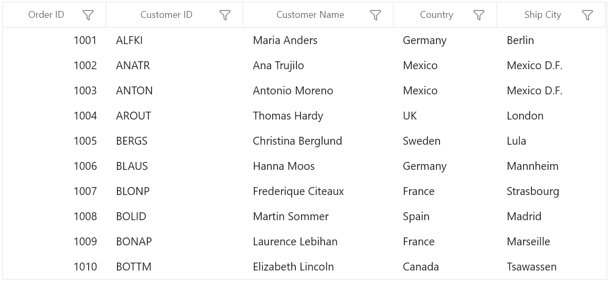

# WinUI DataGrid Overview

The [WinUI DataGrid](https://www.syncfusion.com/winui-controls/datagrid) is used to display and manipulate tabular data. Its rich feature set includes functionalities like data binding, editing, sorting, filtering, and grouping. It has also been optimized to work with millions of records, as well as to handle high-frequency, real-time updates. The following feature highlights will be included:

* **Data binding** – Supports to bind different types of data sources.
* **Columns** – Support for various column types including unbound columns.
* **Editing** – Various built-in and template column types handle different types of data.
* **Sorting** – Sort one or more columns by tapping a header.
* **Grouping** – Use user-interactive grouping to group one or more columns.
* **Summaries** – Extensive support to show concise information about the individual data columns or groups of rows.
* **Filtering** – Filter the data using an intuitive, built-in, Excel-inspired filtering UI.
* **Selection** - Select rows or cells in a similar way to Excel for all keyboard navigations.
* **Data validation** – Support to validate the data on errors.
* **Master-Detail View** – Support to display relational data using hierarchies.
* **RowHeight** - Users can adjust (auto fit) the row height based on the content of any column or certain columns to enhance the readability of content. It’s also possible to set the row height conditionally.
* **Styling** – Extensive support for customizing styles of cells and rows in SfDataGrid.
* **Stacked Headers** – Extensive support to show multiple headers called stacked headers.
* **Unbound rows** – Support to display unbound rows.

