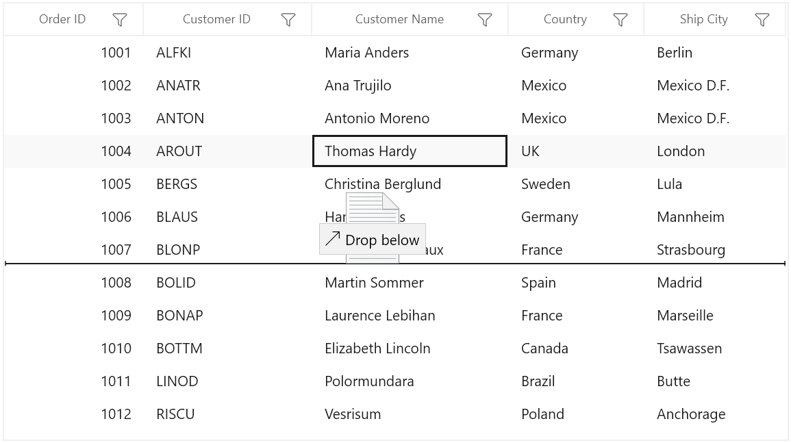
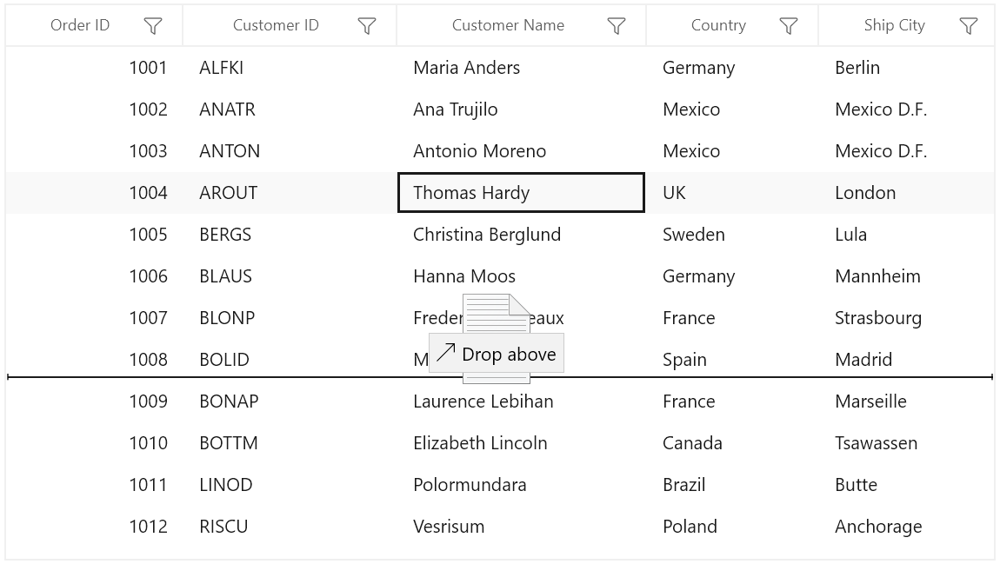

# Row drag and drop in WinUI DataGrid (SfDataGrid)

[WinUI DataGrid](https://help.syncfusion.com/cr/winui/Syncfusion.UI.Xaml.DataGrid.SfDataGrid.html) allows you to drag and drop the rows by setting the `AllowDraggingRows` and [AllowDrop](https://docs.microsoft.com/en-us/dotnet/api/system.windows.uielement.allowdrop) property to `true`. You can also drag and drop the rows between Datagrid and other controls such as `ListView` , `SfTreeView` and `SfTreeGrid`. 



<syncfusion:SfDataGrid x:Name="sfDataGrid"
                     AllowDraggingRows="True"
                     AllowDrop="True"               
                     AutoGenerateColumns="True"
                     ItemsSource="{Binding Orders}" />



this.sfDataGrid.AllowDraggingRows = true;
this.sfDataGrid.AllowDrop = true;



While dropping, the dragged rows can be added above or below the target record based on their drop position.

For example, if you drop record at the bottom of the target record, it will be added below the target record.

If you drop above the target record, it will be added above the target record.

## Dragging multiple rows

WinUI DataGrid (SfDataGrid) allows to select and drag multiple rows. To enable multiple selection, set the [SfDataGrid.SelectionMode](https://help.syncfusion.com/cr/winui/Syncfusion.UI.Xaml.Grids.SfGridBase.html#Syncfusion_UI_Xaml_Grids_SfGridBase_SelectionMode) as `Multiple` or `Extended`. 

N> The drag selection cannot be performed while the `AllowDraggingRows` enabled as `true` in the SfDataGrid.

## Drag and drop events

When dragging and dropping the rows `SfDataGrid` triggers the following events:

### RowDragStarting event

`RowDragStarting` event occurs when you start to drag the records in the Datagrid. The `DataGridRowDragStartingEventArgs` has the following member, which provides information for the `RowDragStarting` event.
* `DraggingRows` : Gets the records which contains the data associated while dragging the rows.
* `Cancel` : Gets or sets a value indicating whether the event is canceled or not. 



this.sfDataGrid.RowDragStarting += SfDataGrid_RowDragStarting;

private void SfDataGrid_RowDragStarting(object sender, DataGridRowDragStartingEventArgs e)
{
    
}



### RowDragOver event

`RowDragOver` event occurs continuously while dragging the record in the SfDataGrid. The `DataGridRowDragOverEventArgs` has the following members, which provide information for the `RowDragOver` event.
* `Data` : Gets a data object that contains the data associated with dragging the rows. 
* `DraggingRows` : Gets the records that contains the data associated with dragging the rows.
* `DropPosition` : Gets a value indicating the drop position which is based on dropped location. 
* `ShowDragUI` : Gets or sets the visibility of Dragging UI.  
* `TargetIndex` : Gets a value that indicates the target index where the record is going to be drop.



this.sfDataGrid.RowDragOver += SfDataGrid_RowDragOver;

private void SfDataGrid_RowDragOver(object sender, DataGridRowDragOverEventArgs e)
{

}



### RowDropping event

`RowDropping` event occurs when a record is dropping in the SfDataGrid. The `DataGridRowDroppingEventArgs` has the following members, which provide information for the `RowDropping` event.
* `Cancel` : Gets or sets a value indicating whether the event is canceled or not. 
* `Data` : Gets a data object that contains the data associated with dragging the rows. 
* `DraggingRows` : Gets the records that contains the data associated with dragging the rows. 
* `DropPosition` : Gets a value indicating the drop position based on the dropped location. 
* `TargetIndex` : Gets a value that indicates the target index where the record is going to be drop.



this.sfDataGrid.RowDropping += SfDataGrid_RowDropping;

private void SfDataGrid_RowDropping(object sender, DataGridRowDroppingEventArgs e)
{

}



### RowDropped event

`RowDropped` event occurs after dropping the record. The `DataGridRowDroppedEventArgs` has the following members, which provide information for the `Dropped` event.
* `Data` : Gets a data object that contains the data associated with dragging the rows. 
* `DraggingRows` : Gets the records that contains the data associated with dragging the rows.
* `DropPosition` : Gets a value indicating the drop position based on the dropped location.
* `TargetIndex` : Gets a value that indicates the target index where the record is going to be drop.



this.sfDataGrid.RowDropped += SfDataGrid_RowDropped;

private void SfDataGrid_RowDropped(object sender, DataGridRowDroppedEventArgs e)
{
    
}



## Customizing row drag and drop operation

### Disable dragging of certain rows in WinUI DataGrid

You can restrict the dragging of certain rows in SfDataGrid by using the  `SfDataGrid.RowDragStarting` event.



this.sfDataGrid.RowDragStarting += SfDataGrid_RowDragStarting;

private void SfDataGrid_RowDragStarting(object sender, DataGridRowDragStartingEventArgs e)
{
    var records = e.DraggingRows;
    var orders = records[0] as OrderInfo;
    if (orders.OrderID > 1005)
        e.Cancel = true;
}



### Disable dropping over certain rows in WinUI DataGrid

You can restrict the dropping the records in certain rows in SfDataGrid by using the `SfDataGrid.RowDropping` event.



this.sfDataGrid.RowDropping += SfDataGrid_RowDropping;

private void SfDataGrid_RowDropping(object sender, DataGridRowDroppingEventArgs e)
{
    if(e.TargetIndex > 6)
        e.Cancel = true;
}



### Disable the drag UI

You can disable the draggable pop-up by setting the `ShowDragUI` as `false` in `SfDataGrid.RowDragOver` event.



this.sfDataGrid.RowDragOver += SfDataGrid_RowDragOver;

private void SfDataGrid_RowDragOver(object sender, DataGridRowDragOverEventArgs e)
{
    e.ShowDragUI = false;
}



### Reorder the source collection while dragging and dropping the rows

You can reorder the source collection after dragging and dropping the row by handling the  `SfDataGrid.RowDropped` event.



this.sfDataGrid.RowDropped += SfDataGrid_RowDropped;

private void SfDataGrid_RowDropped(object sender, DataGridRowDroppedEventArgs e)
{
    if (e.DropPosition != DataGridRowDropPosition.None)
    {
        // Get Dragging records
        ObservableCollection<object> draggingRecords = e.DraggingRows as ObservableCollection<object>;

        // Gets the TargetRecord from the underlying collection using record index of the TargetRecord (e.TargetIndex)
        ViewModel viewmodel = sfDataGrid.DataContext as ViewModel;
        OrderInfo targetRecord = viewmodel.Orders[e.TargetIndex];

        // Removes the dragging records from the underlying collection
        foreach (OrderInfo item in draggingRecords)
        {
            viewmodel.Orders.Remove(item);
        }

        // Find the target record index after removing the records
        int targetIndex = viewmodel.Orders.IndexOf(targetRecord);
        int insertionIndex = e.DropPosition == DataGridRowDropPosition.Above ? targetIndex : targetIndex + 1;
        insertionIndex = insertionIndex < 0 ? 0 : insertionIndex;

        // Insert dragging records to the target position
        for (int i = draggingRecords.Count - 1; i >= 0; i--)
        {
            viewmodel.Orders.Insert(insertionIndex, draggingRecords[i] as OrderInfo);
        }
    }
}


