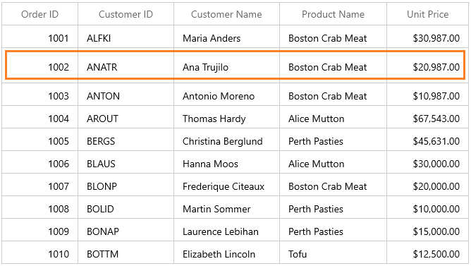
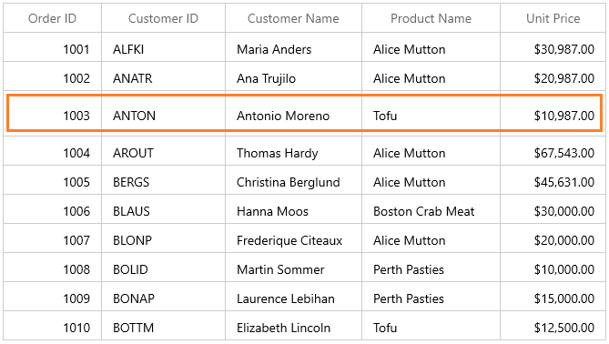
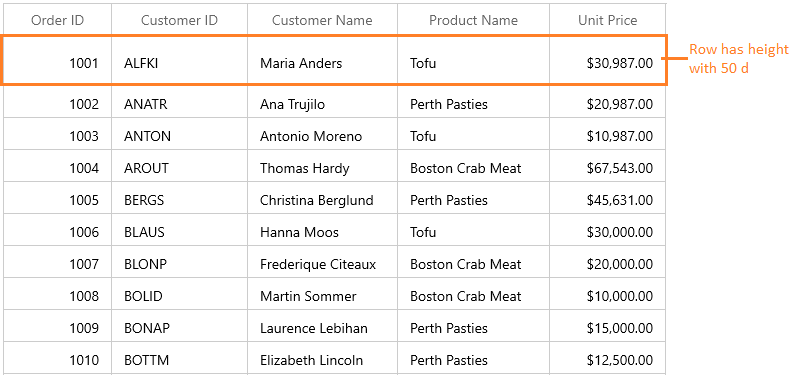
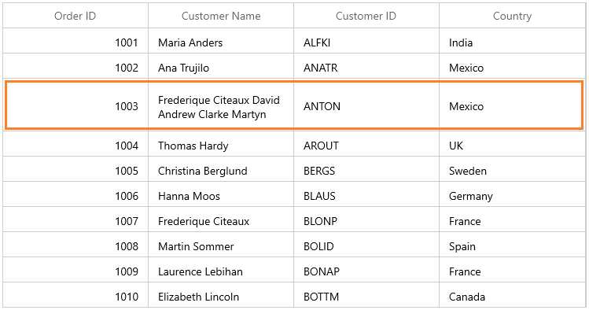
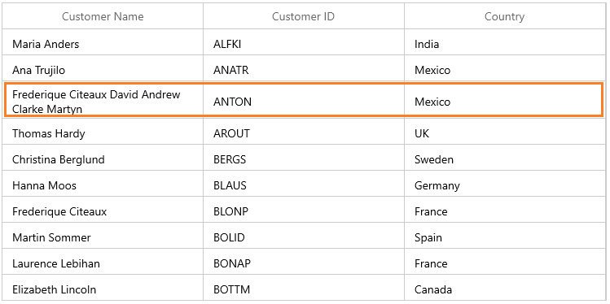
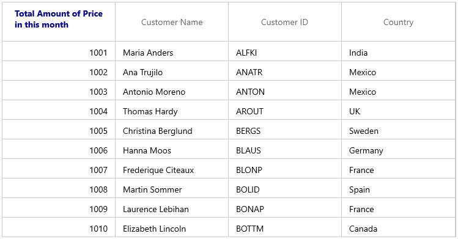
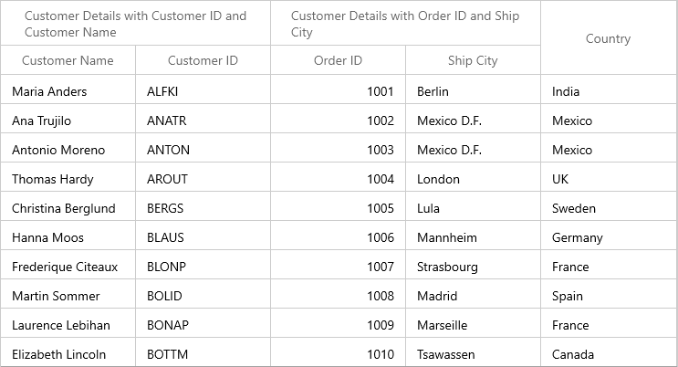

# Row Height customization in WinUI DataGrid (SfDataGrid)

You can change the header row height by setting [SfDataGrid.HeaderRowHeight](https://help.syncfusion.com/cr/winui/Syncfusion.UI.Xaml.Grids.SfGridBase.html#Syncfusion_UI_Xaml_Grids_SfGridBase_HeaderRowHeight) and the other rows height can be changed by setting [SfDataGrid.RowHeight](https://help.syncfusion.com/cr/winui/Syncfusion.UI.Xaml.Grids.SfGridBase.html#Syncfusion_UI_Xaml_Grids_SfGridBase_RowHeight) property.



<syncfusion:SfDataGrid x:Name="sfDataGrid" 
                       RowHeight="30"
                       HeaderRowHeight="50"
                       ItemsSource="{Binding Orders}" />


this.sfDataGrid.HeaderRowHeight = 50;
this.sfDataGrid.RowHeight = 30;



You can also change the particular row height using [VisualContainer.RowHeights](https://help.syncfusion.com/cr/winui/Syncfusion.UI.Xaml.DataGrid.VisualContainer.html#Syncfusion_UI_Xaml_DataGrid_VisualContainer_RowHeights) property.



this.sfDataGrid.Loaded += SfDataGrid_Loaded;

private void SfDataGrid_Loaded(object sender, RoutedEventArgs e)
{
    var visualContainer = this.sfDataGrid.GetType().GetProperty("VisualContainer", System.Reflection.BindingFlags.Instance | System.Reflection.BindingFlags.NonPublic).GetValue(this.sfDataGrid) as VisualContainer; 

    //Set RowHeight to 2'nd row
    visualContainer.RowHeights[2] = 50;
    visualContainer.InvalidateMeasure();
}



You can also change the row height of particular row using [QueryRowHeight](https://help.syncfusion.com/winui/datagrid/row-height-customization#queryrowheight-event) event.



this.sfDataGrid.QueryRowHeight += SfDataGrid_QueryRowHeight;

private void SfDataGrid_QueryRowHeight(object sender, QueryRowHeightEventArgs e)
{
    if (e.RowIndex == 3) //Sets Height to the third row.
    {
        e.Height = 50;
        e.Handled = true;
    }
}




## QueryRowHeight event

You can change the row height in on-demand based on the row index or row data using [SfDataGrid.QueryRowHeight](https://help.syncfusion.com/cr/winui/Syncfusion.UI.Xaml.DataGrid.SfDataGrid.html#Syncfusion_UI_Xaml_DataGrid_SfDataGrid_QueryRowHeight) event.

`QueryRowHeight` event triggered for each row when it becomes visible.[QueryRowHeightEventArgs](https://help.syncfusion.com/cr/winui/Syncfusion.UI.Xaml.DataGrid.QueryRowHeightEventArgs.html) provides information to `QueryRowHeight` event with following members,

* [RowIndex](https://help.syncfusion.com/cr/winui/Syncfusion.UI.Xaml.DataGrid.QueryRowHeightEventArgs.html#Syncfusion_UI_Xaml_DataGrid_QueryRowHeightEventArgs_RowIndex) – denotes index of the row in SfDataGrid.

* [Height](https://help.syncfusion.com/cr/winui/Syncfusion.UI.Xaml.DataGrid.QueryRowHeightEventArgs.html#Syncfusion_UI_Xaml_DataGrid_QueryRowHeightEventArgs_Height) – Gets or sets the height of the row.

* [Handled](https://help.syncfusion.com/cr/winui/Syncfusion.UI.Xaml.Grids.GridHandledEventArgs.html#Syncfusion_UI_Xaml_Grids_GridHandledEventArgs_Handled) – Gets or sets a value indicating whether the `QueryRowHeight` event handled to change height of the row. Its default value is `false`.



this.sfDataGrid.QueryRowHeight += SfDataGrid_QueryRowHeight;

void SfDataGrid_QueryRowHeight(object sender, QueryRowHeightEventArgs e)
{
    if (e.RowIndex == 1) //Sets Height to the first row.
    {
        e.Height = 50;
        e.Handled = true;
    }
}



### Limitations

1. This event is not supported for `DetailsViewGrid`.

## Fit the row height based on its content

You can fit the row height based on its content in `QueryRowHeight` event handler using [GetAutoRowHeight](https://help.syncfusion.com/cr/winui/Syncfusion.UI.Xaml.DataGrid.GridColumnSizer.html#Syncfusion_UI_Xaml_DataGrid_GridColumnSizer_GetAutoRowHeight_System_Int32_Syncfusion_UI_Xaml_DataGrid_GridRowSizingOptions_System_Double__System_Boolean_) method. This improves the readability of the content and it does not affect the loading performance of the SfDataGrid as the `QueryRowHeight` event triggered for rows in on-demand.

`GetAutoRowHeight` method returns `true` when the row height is calculated for record & header rows and returns `false` for other rows. Calculated height based on content set to the `out` parameter and you can assign the calculated height to the `Height` property of `QueryRowHeightEventArgs`.

Below are the parameter to `GetAutoRowHeight` method, 

1. `RowIndex` – denotes the index of row in SfDataGrid.

2. [GridRowSizingOptions](https://help.syncfusion.com/cr/winui/Syncfusion.UI.Xaml.DataGrid.GridRowSizingOptions.html) – A class with properties to customize the row height calculation.



<syncfusion:SfDataGrid x:Name="sfDataGrid" ItemsSource="{Binding Orders}">
    <syncfusion:SfDataGrid.Columns>
        <syncfusion:GridTextColumn HeaderText="Order ID" MappingName="OrderID" TextAlignment="Right"/>
        <syncfusion:GridTextColumn HeaderText="Customer Name" MappingName="CustomerName" TextWrapping="Wrap" />
        <syncfusion:GridTextColumn HeaderText="Customer ID" MappingName="CustomerID" TextWrapping="Wrap" />
        <syncfusion:GridTextColumn MappingName="Country" TextWrapping="Wrap" />
    </syncfusion:SfDataGrid.Columns>
</syncfusion:SfDataGrid>


GridRowSizingOptions gridRowResizingOptions = new GridRowSizingOptions();

//To get the calculated height from GetAutoRowHeight method.
double autoHeight;
this.sfDataGrid.QueryRowHeight += SfDataGrid_QueryRowHeight;

private void SfDataGrid_QueryRowHeight(object sender, QueryRowHeightEventArgs e)
{
    if (this.sfDataGrid.GridColumnSizer.GetAutoRowHeight(e.RowIndex, gridRowResizingOptions, out autoHeight))
    {
        if (autoHeight > 32)
        {
            e.Height = autoHeight;
            e.Handled = true;
        }
    }
}   



Here, row heights are customized based on the large text content.

#### GridRowSizingOptions

[GridRowSizingOptions](https://help.syncfusion.com/cr/winui/Syncfusion.UI.Xaml.DataGrid.GridRowSizingOptions.html) have the following properties,

1. [ExcludeColumns](https://help.syncfusion.com/cr/winui/Syncfusion.UI.Xaml.DataGrid.GridRowSizingOptions.html#Syncfusion_UI_Xaml_DataGrid_GridRowSizingOptions_ExcludeColumns) – If you want to skips specific column from row height calculation, you can add that columns to `GridRowSizingOptions.ExcludeColumns`. By default, `GetAutoRowHeight` method calculates the row height based on all columns.
 
2. [CanIncludeHiddenColumns](https://help.syncfusion.com/cr/winui/Syncfusion.UI.Xaml.DataGrid.GridRowSizingOptions.html#Syncfusion_UI_Xaml_DataGrid_GridRowSizingOptions_CanIncludeHiddenColumns) – If you want to consider the hidden columns while calculating row height, you can set `GridRowSizingOptions.CanIncludeHiddenColumns` as `true`.

### Calculate height based on certain columns

You can exclude columns from row height calculation using `GridRowSizingOptions.ExcludeColumns`. This will helps to reduce the count of loop run for height calculation for better performance.

You can add the columns which needs to exclude from height calculation using `GridRowSizingOptions.ExcludeColumns` collection.



GridRowSizingOptions gridRowResizingOptions = new GridRowSizingOptions();

//To get the calculated height from GetAutoRowHeight method.    
double autoHeight = double.NaN;

// The list contains the column names that will excluded from the height calculation in GetAutoRowHeight method.
List<string> excludeColumns = new List<string>() { "CustomerID", "Country" }; 
this.sfDataGrid.QueryRowHeight += SfDataGrid_QueryRowHeight;
gridRowResizingOptions.ExcludeColumns = excludeColumns;
    
private void SfDataGrid_QueryRowHeight(object sender, QueryRowHeightEventArgs e)
{
    if (this.sfDataGrid.GridColumnSizer.GetAutoRowHeight(e.RowIndex, gridRowResizingOptions, out autoHeight))
    {
        if (autoHeight > 32)
        {
            e.Height = autoHeight;
            e.Handled = true;
        }
    }
}   



Here `CustomerID` and `Country` columns are excluded from height calculation and the row height is calculated based on `CustomerName` column only.
 

## Reset row height at runtime

You can reset height of the particular or all rows in View at runtime to get the updated height from `QueryRowHeight` event handler using below methods. You have to call [InvalidateMeasureInfo](https://help.syncfusion.com/cr/winui/Syncfusion.UI.Xaml.DataGrid.VisualContainer.html#Syncfusion_UI_Xaml_DataGrid_VisualContainer_InvalidateMeasureInfo) method of `VisualContainer` to refresh the View.
 
* [InvalidateRowHeight](https://help.syncfusion.com/cr/winui/Syncfusion.UI.Xaml.DataGrid.SfDataGrid.html#Syncfusion_UI_Xaml_DataGrid_SfDataGrid_InvalidateRowHeight_System_Int32_) – Resets the height of particular row.




sfDataGrid.InvalidateRowHeight(2);
var visualContainer = this.sfDataGrid.GetType().GetProperty("VisualContainer", System.Reflection.BindingFlags.Instance | System.Reflection.BindingFlags.NonPublic).GetValue(this.sfDataGrid) as VisualContainer;
visualContainer.InvalidateMeasureInfo();




* [RowHeightManager.Reset](https://help.syncfusion.com/cr/winui/Syncfusion.UI.Xaml.DataGrid.RowHeightManager.html#Syncfusion_UI_Xaml_DataGrid_RowHeightManager_Reset) – Resets the height for all rows in View.




var visualContainer = this.sfDataGrid.GetType().GetProperty("VisualContainer", System.Reflection.BindingFlags.Instance | System.Reflection.BindingFlags.NonPublic).GetValue(this.sfDataGrid) as VisualContainer;
visualContainer.RowHeightManager.Reset();
visualContainer.InvalidateMeasureInfo();




## Changes header row height based on its Content

By default, auto height is supported for the headers is `QueryRowHeight` event. If you want to set the auto height to header row alone, you can use the [GetHeaderIndex](https://help.syncfusion.com/cr/winui/Syncfusion.UI.Xaml.DataGrid.GridIndexResolver.html#Syncfusion_UI_Xaml_DataGrid_GridIndexResolver_GetHeaderIndex_Syncfusion_UI_Xaml_DataGrid_SfDataGrid_) method to decide whether the row index is header or not in `QueryRowHeight` event.



xmlns:core="using:Syncfusion.UI.Xaml.Core"

<Page.Resources>
    <core:StringFormatConverter x:Key="stringFormatConverter" />
    <DataTemplate x:Key="headerTemplate">
        <TextBlock Height="50"
                    FontWeight="Bold"
                    Foreground="DarkBlue"
                    Text="Total Amount of Price in this month"
                    TextWrapping="Wrap" />
    </DataTemplate>
</Page.Resources>

<syncfusion:SfDataGrid x:Name="sfDataGrid" ItemsSource="{Binding Orders}">
    <syncfusion:SfDataGrid.Columns>
        <syncfusion:GridTextColumn MappingName="TotalPrice" DisplayBinding="{Binding Path=TotalPrice, Converter={StaticResource stringFormatConverter}, ConverterParameter='{}{0:C}'}" TextAlignment="Right" HeaderTemplate="{StaticResource headerTemplate}" TextWrapping="Wrap" />
        <syncfusion:GridTextColumn MappingName="CustomerName" HeaderText="Customer Name" />
        <syncfusion:GridTextColumn MappingName="CustomerID" HeaderText="Customer ID" />
        <syncfusion:GridTextColumn MappingName="Country" />
    </syncfusion:SfDataGrid.Columns>
</syncfusion:SfDataGrid>


GridRowSizingOptions gridRowResizingOptions = new GridRowSizingOptions();

//To get the calculated height from the GetAutoRowHeight method.
double autoHeight;
this.sfDataGrid.QueryRowHeight += SfDataGrid_QueryRowHeight;

private void SfDataGrid_QueryRowHeight(object sender, QueryRowHeightEventArgs e)
{    
    //checked whether the row index is header or not.
    if (this.sfDataGrid.GetHeaderIndex() == e.RowIndex)
    {
        if (this.sfDataGrid.GridColumnSizer.GetAutoRowHeight(e.RowIndex, gridRowResizingOptions, out autoHeight))
        {
            if (autoHeight > 32)
            {
                e.Height = autoHeight;
                e.Handled = true;
            }
        }
    }
}   



## Change StackedHeaderRow height based on its content

By default, auto height is supported for [StackedHeaderRows](https://help.syncfusion.com/cr/winui/Syncfusion.UI.Xaml.Grids.StackedHeaderRows.html) in `QueryRowHeight` event. You can also set the auto height to the StackedHeaderRows alone using `QueryRowHeight` event by checking the row index with StackedHeaderRows count.
Also you can wrap stacked header text by writing style of TargetType [GridStackedHeaderCellControl](https://help.syncfusion.com/cr/winui/Syncfusion.UI.Xaml.DataGrid.GridStackedHeaderCellControl.html) and set the `TextWrapping` as Wrap as below,






GridRowSizingOptions gridRowResizingOptions = new GridRowSizingOptions();

//To get the calculated height from the GetAutoRowHeight method.
double autoHeight;

this.sfDataGrid.QueryRowHeight += SfDataGrid_QueryRowHeight;

private void SfDataGrid_QueryRowHeight(object sender, QueryRowHeightEventArgs e)
{    
    if (e.RowIndex < this.sfDataGrid.StackedHeaderRows.Count)
    {
        if (this.sfDataGrid.GridColumnSizer.GetAutoRowHeight(e.RowIndex, gridRowResizingOptions, out autoHeight))
        {
            if (autoHeight > 32)
            {
                e.Height = autoHeight;
                e.Handled = true;
            }
        }
    }
}   



## Change TableSummaryRow height

You can change the table summary row height by using `QueryRowHeight` event. You can use [IsTableSummaryIndex](https://help.syncfusion.com/cr/winui/Syncfusion.UI.Xaml.DataGrid.GridIndexResolver.html#Syncfusion_UI_Xaml_DataGrid_GridIndexResolver_IsTableSummaryIndex_Syncfusion_UI_Xaml_DataGrid_SfDataGrid_System_Int32_) extension method to identify whether the row is table summary or not by passing row index. 




this.sfDataGrid.QueryRowHeight += SfDataGrid_QueryRowHeight;

private void SfDataGrid_QueryRowHeight(object sender, QueryRowHeightEventArgs e)
{
    if (sfDataGrid.IsTableSummaryIndex(e.RowIndex))
    {
        e.Height = 40;
        e.Handled = true;
    }
}



