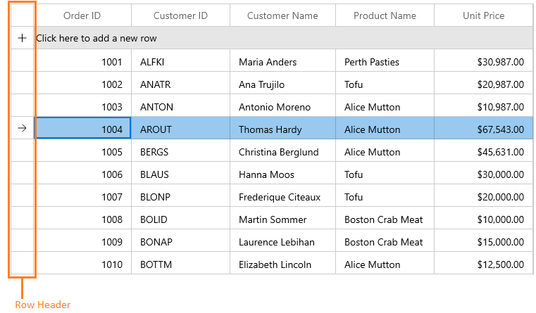
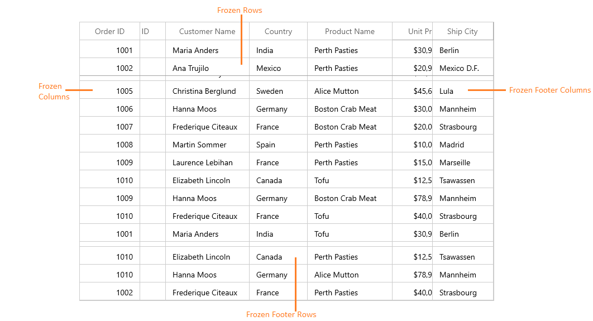

# Rows in WinUI DataGrid (SfDataGrid)

This section explains about various row types in SfDataGrid.

[StackedHeaderRow](https://help.syncfusion.com/winui/datagrid/stacked-headers)

[AddNewRow](https://help.syncfusion.com/winui/datagrid/data-manipulation#add-new-rows)

[SummaryRow](https://help.syncfusion.com/winui/datagrid/summaries)

[UnboundRow](https://help.syncfusion.com/winui/datagrid/unbound-rows)

## Row Header

RowHeader is a special column used to indicate the status of row (current row, editing status, errors in row, etc.) which is placed as first cell of each row. You can show or hide the row header by setting [SfDataGrid.ShowRowHeader](https://help.syncfusion.com/cr/winui/Syncfusion.UI.Xaml.Grids.SfGridBase.html#Syncfusion_UI_Xaml_Grids_SfGridBase_ShowRowHeader) property.



<syncfusion:SfDataGrid x:Name="sfDataGrid"
                       AddNewRowPosition="Top"
                       ItemsSource="{Binding Orders}"
                       ShowRowHeader="True">


sfDataGrid.ShowRowHeader = true;



### Row indicators and its description

<table>
<tr>
<th>
Row Indicator
</th>
<th>
Description
</th>
</tr>
<tr>
<td>

</td>
<td>
Denotes the row which has current cell or selected item.
</td>
</tr>
<tr>
<td>

</td>
<td>
Denotes row is being edited. 
</td>
</tr>
<tr>
<td>

</td>
<td>
Denotes row is AddNewRow.
</td>
</tr>
<tr>
<td>

</td>
<td>
Denotes the row has errors. 
</td>
</tr>
<tr>
<td>

</td>
<td>
Denotes that the current row which has errors.
</td>
</tr>
</table>

### Row header width

You can change the width of the row header by setting [SfDataGrid.RowHeaderWidth](https://help.syncfusion.com/cr/winui/Syncfusion.UI.Xaml.Grids.SfGridBase.html#Syncfusion_UI_Xaml_Grids_SfGridBase_RowHeaderWidth) property.



<syncfusion:SfDataGrid x:Name="sfDataGrid"
                       ShowRowHeader="True"
                       RowHeaderWidth="50"
                       ItemsSource="{Binding Orders}"  />



sfDataGrid.RowHeaderWidth = 50;



### Display the row index in row header

You can display the corresponding row index in each row header, by customizing the `ControlTemplate` of [GridRowHeaderCell](https://help.syncfusion.com/cr/winui/Syncfusion.UI.Xaml.DataGrid.GridRowHeaderCell.html). You have to bind the `RowIndex` property to `TextBlock.Text` like the below code example.







### Change the current row indicator

You can change the CurrentRowIndicator in the row header by customizing the control template of `GridRowHeaderCell`.







## Header Row

Header row is present in top of the DataGrid which has column headers in it. Column header describes the caption to identify the column content.

You can change the header row height by setting [SfDataGrid.HeaderRowHeight](https://help.syncfusion.com/cr/winui/Syncfusion.UI.Xaml.Grids.SfGridBase.html#Syncfusion_UI_Xaml_Grids_SfGridBase_HeaderRowHeight) property.

### Hiding Header row

You can hide the header row by setting `SfDataGrid.HeaderRowHeight` as `0` (zero).



<syncfusion:SfDataGrid x:Name="sfDataGrid"
                       HeaderRowHeight="0"
                       ItemsSource="{Binding Orders}">



You can also hide the header row of DetailsViewDataGrid by setting `HeaderRowHeight` as `0` (zero) to [ViewDefinition.DataGrid](https://help.syncfusion.com/cr/winui/Syncfusion.UI.Xaml.DataGrid.GridViewDefinition.html#Syncfusion_UI_Xaml_DataGrid_GridViewDefinition_DataGrid).



<syncfusion:SfDataGrid x:Name="sfDataGrid" ItemsSource="{Binding Orders}">
    <syncfusion:SfDataGrid.DetailsViewDefinition>
        <syncfusion:GridViewDefinition RelationalColumn="OrderDetails">
            <syncfusion:GridViewDefinition.DataGrid>
                <syncfusion:SfDataGrid x:Name="firstLevelNestedGrid" HeaderRowHeight="0" />
            </syncfusion:GridViewDefinition.DataGrid>
        </syncfusion:GridViewDefinition>
    </syncfusion:SfDataGrid.DetailsViewDefinition>
</ syncfusion:SfDataGrid>



## Freeze panes

DataGrid provides support to freeze the rows and columns at top and bottom similar to excel. You can freeze the rows and columns by setting following properties,

<table>
<tr>
<th>
Property Name
</th>
<th>
Description
</th>
</tr>
<tr>
<td>
{{'[FrozenRowsCount](https://help.syncfusion.com/cr/winui/Syncfusion.UI.Xaml.DataGrid.SfDataGrid.html#Syncfusion_UI_Xaml_DataGrid_SfDataGrid_FrozenRowsCount)'| markdownify }}
</td>
<td>
Set the frozen rows count at <kbd>top</kbd> of the SfDataGrid.
</td>
</tr>
<tr>
<td>
{{'[FrozenFooterRowsCount](https://help.syncfusion.com/cr/winui/Syncfusion.UI.Xaml.DataGrid.SfDataGrid.html#Syncfusion_UI_Xaml_DataGrid_SfDataGrid_FrozenFooterRowsCount)'| markdownify }}
</td>
<td>
Set the footer rows count at </kbd>bottom</kbd> of the SfDataGrid.
</td>
</tr>
<tr>
<td>
{{'[FrozenColumnCount](https://help.syncfusion.com/cr/winui/Syncfusion.UI.Xaml.Grids.SfGridBase.html#Syncfusion_UI_Xaml_Grids_SfGridBase_FrozenColumnCount)'| markdownify }}
</td>
<td>
Set the frozen columns count in <kbd>left side</kbd> of the SfDataGrid. 
</td>
</tr>
<tr>
<td>
{{'[FrozenFooterColumnCount ](https://help.syncfusion.com/cr/winui/Syncfusion.UI.Xaml.Grids.SfGridBase.html#Syncfusion_UI_Xaml_Grids_SfGridBase_FrozenFooterColumnCount)'| markdownify }}
</td>
<td>
Set the frozen columns in <kbd>right side</kbd> of the SfDataGrid.
</td>
</tr>
</table>



<syncfusion:SfDataGrid x:Name="sfDataGrid"
                       FrozenFooterColumnCount="1"
                       FrozenColumnCount="1"
                       FrozenRowsCount="2"                       
                       FrozenFooterRowsCount="3"
                       ItemsSource="{Binding Orders}">


sfDataGrid.FrozenFooterColumnCount = 1;
sfDataGrid.FrozenColumnCount = 1;
sfDataGrid.FrozenRowsCount = 2;
sfDataGrid.FrozenFooterRowsCount = 3;



### Differentiate frozen rows from normal rows

You can differentiate the frozen rows and footer rows from normal rows by writing style for [VirtualizingCellsControl](http://help.syncfusion.com/cr/wpf/Syncfusion.UI.Xaml.Grid.VirtualizingCellsControl.html) and by customizing the `FrozenRow` and `FooterRow` visual states.







### Disable drag and drop between frozen and non-frozen columns

You can disable the drag and drop between frozen and non-frozen columns by handling [QueryColumnDragging](https://help.syncfusion.com/cr/winui/Syncfusion.UI.Xaml.DataGrid.SfDataGrid.html#Syncfusion_UI_Xaml_DataGrid_SfDataGrid_ColumnDragging) event.
Using [Reason](https://help.syncfusion.com/cr/winui/Syncfusion.UI.Xaml.DataGrid.QueryColumnDraggingEventArgs.html#Syncfusion_UI_Xaml_DataGrid_QueryColumnDraggingEventArgs_Reason) property in [QueryColumnDraggingEventArgs](https://help.syncfusion.com/cr/winui/Syncfusion.UI.Xaml.DataGrid.QueryColumnDraggingEventArgs.html), you can cancel the column dropping operation. 

In the below code, if the Reason is [QueryColumnDraggingReason.Dropping](https://help.syncfusion.com/cr/winui/Syncfusion.UI.Xaml.Grids.QueryColumnDraggingReason.html#Syncfusion_UI_Xaml_Grids_QueryColumnDraggingReason_Dropping) and the column is dragged from frozen region to non-frozen region or vice versa, you can cancel the dropping action by setting `e.Cancel` as `true` in the event.



this.sfDataGrid.QueryColumnDragging += SfDataGrid_QueryColumnDragging;

void SfDataGrid_QueryColumnDragging(object sender, QueryColumnDraggingEventArgs e)
{
    if (e.Reason == QueryColumnDraggingReason.Dropping)
    {
        //used to get frozen column index from the  frozen column count
        var frozenColIndex = dataGrid.FrozenColumnCount +
                                              this.dataGrid.ResolveToStartColumnIndex();
        //cancels dragging from frozen column to non-frozen column

        if (e.From < frozenColIndex && e.To > frozenColIndex - 1)
            e.Cancel = true;

        // cancels dragging from non-frozen column to frozen column

        if (e.From > frozenColIndex && e.To < frozenColIndex ||
             (e.From == frozenColIndex && e.To < frozenColIndex))
            e.Cancel = true;
    }
}



### Limitations

1. When using `DetailsView` with freeze panes, exception will be raised like **DetailsView is not supported with Freeze panes support**.

2. When [AllowFrozenGroupHeaders](https://help.syncfusion.com/cr/winui/Syncfusion.UI.Xaml.DataGrid.SfDataGrid.html#Syncfusion_UI_Xaml_DataGrid_SfDataGrid_AllowFrozenGroupHeaders) is `true`, frozen rows will not be considered.

3. SfDataGrid has support to freeze the number of rows from top or bottom. There is no support to freeze a specific row.

N> 
1. Header rows, table summary rows and row header are frozen regardless of `FrozenRowsCount` and `FooterRowsCount`.
2. `FrozenRowsCount` and `FooterRowsCount` values should be less than the number of rows and column visible.
