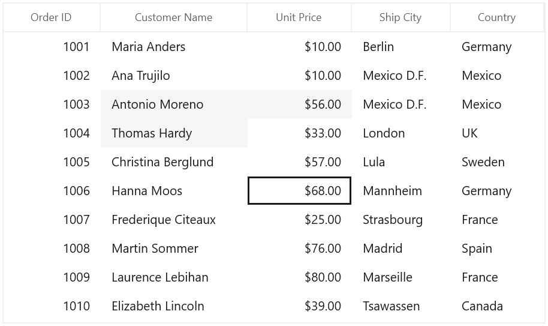
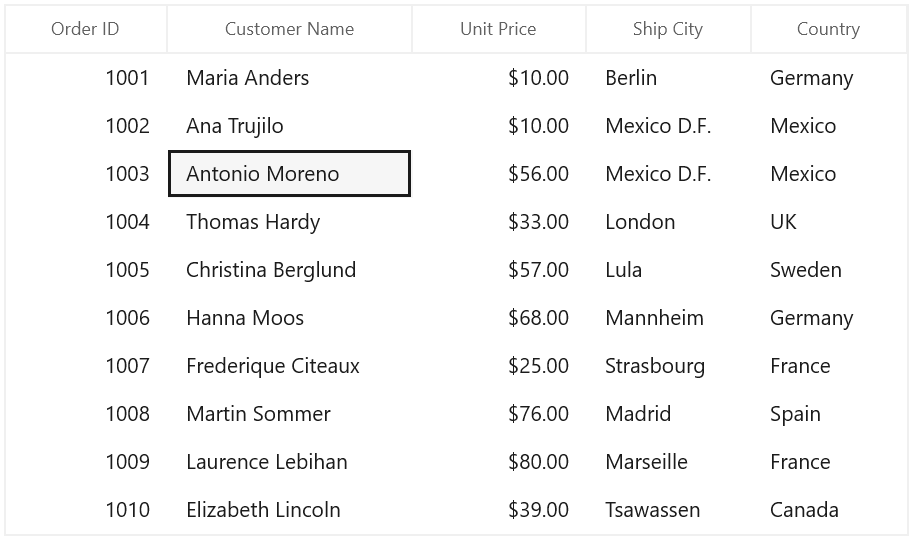
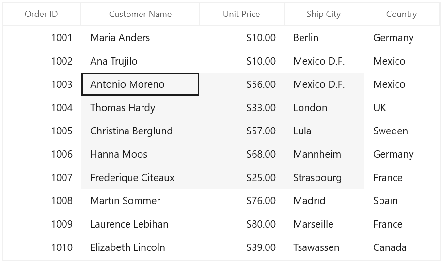
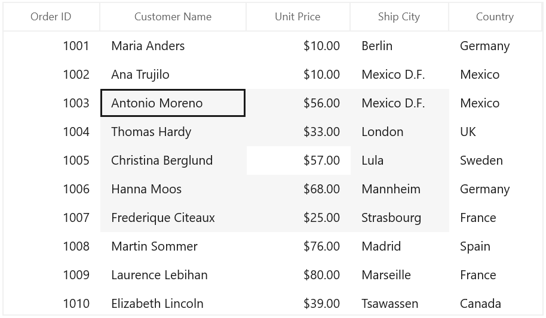
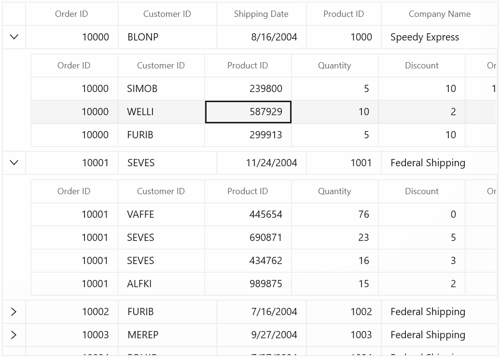
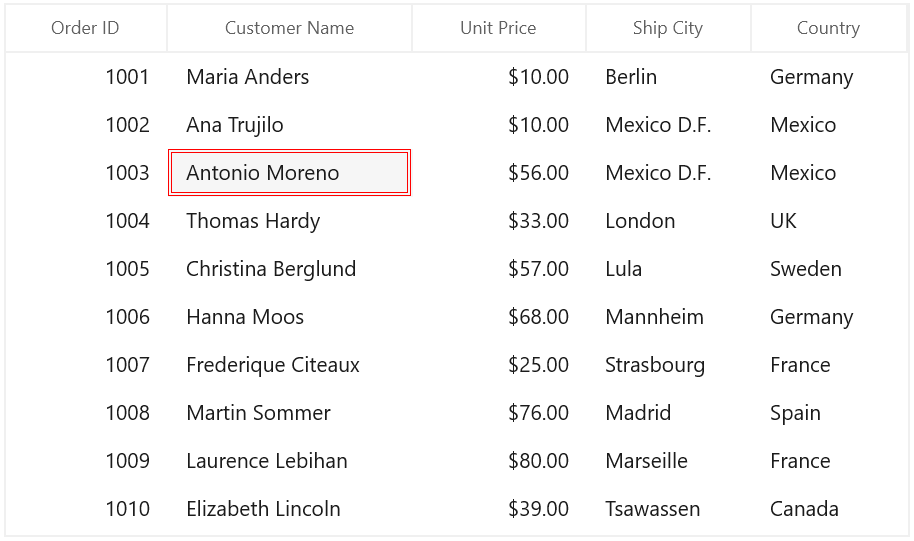

# Selection in WinUI DataGrid

SfDataGrid allows you to select one or more rows or cells. For selecting specific row or group of rows you have to set [SelectionUnit](https://help.syncfusion.com/cr/winui/Syncfusion.UI.Xaml.DataGrid.SfDataGrid.html#Syncfusion_UI_Xaml_DataGrid_SfDataGrid_SelectionUnit) as [Row](https://help.syncfusion.com/cr/winui/Syncfusion.UI.Xaml.Grids.GridSelectionUnit.html#Syncfusion_UI_Xaml_Grids_GridSelectionUnit_Row) and for selecting a specific cell or group of cells you have to set  `SelectionUnit` as [Cell](https://help.syncfusion.com/cr/winui/Syncfusion.UI.Xaml.Grids.GridSelectionUnit.html#Syncfusion_UI_Xaml_Grids_GridSelectionUnit_Cell) or [Any](https://help.syncfusion.com/cr/winui/Syncfusion.UI.Xaml.Grids.GridSelectionUnit.html#Syncfusion_UI_Xaml_Grids_GridSelectionUnit_Any). In `Any` option you can select the row by clicking on row header.

### Current Cell Navigation

Keyboard navigation through the cells and rows is determined based on the [NavigationMode](https://help.syncfusion.com/cr/winui/Syncfusion.UI.Xaml.Grids.SfGridBase.html#Syncfusion_UI_Xaml_Grids_SfGridBase_NavigationMode) property. [NavigationMode.Cell](https://help.syncfusion.com/cr/winui/Syncfusion.UI.Xaml.Grids.NavigationMode.html#Syncfusion_UI_Xaml_Grids_NavigationMode_Cell) allows you to navigate between the cells in a row as well as between rows. [NavigationMode.Row](https://help.syncfusion.com/cr/winui/Syncfusion.UI.Xaml.Grids.NavigationMode.html#Syncfusion_UI_Xaml_Grids_NavigationMode_Row) allows you to navigate only between rows. It is not possible to set `NavigationMode.Row` when cell selection is enabled (`SelectionUnit` is `Cell` or `Any`). 

### Selection Modes

The `SelectionUnit` and [SelectionMode](https://help.syncfusion.com/cr/winui/Syncfusion.UI.Xaml.Grids.SfGridBase.html#Syncfusion_UI_Xaml_Grids_SfGridBase_SelectionMode) properties together define the behavior of selection in SfDataGrid. If the `SelectionMode` is [Single](https://help.syncfusion.com/cr/winui/Syncfusion.UI.Xaml.Grids.GridSelectionMode.html#Syncfusion_UI_Xaml_Grids_GridSelectionMode_Single), you can able to select single row or cell, and if the `SelectionMode` is [Extended](https://help.syncfusion.com/cr/winui/Syncfusion.UI.Xaml.Grids.GridSelectionMode.html#Syncfusion_UI_Xaml_Grids_GridSelectionMode_Extended) or [Multiple](https://help.syncfusion.com/cr/winui/Syncfusion.UI.Xaml.Grids.GridSelectionMode.html#Syncfusion_UI_Xaml_Grids_GridSelectionMode_Multiple), you can able to select multiple rows or cell, and if you want to disable the selection you need to set `SelectionMode` as [None](https://help.syncfusion.com/cr/winui/Syncfusion.UI.Xaml.Grids.GridSelectionMode.html#Syncfusion_UI_Xaml_Grids_GridSelectionMode_None).



<dataGrid:SfDataGrid x:Name="sfDataGrid"
                       SelectionUnit="Row"
                       NavigationMode="Cell"
                       SelectionMode="Single"
                       ItemsSource="{Binding Orders}">



### Disable selection for rows and columns

You can disable selection and navigation on particular column by setting [GridColumn.AllowFocus](https://help.syncfusion.com/cr/winui/Syncfusion.UI.Xaml.Grids.GridColumnBase.html#Syncfusion_UI_Xaml_Grids_GridColumnBase_AllowFocus) property. You can disable selection on particular row or cell or column by handling [CurrentCellActivating](https://help.syncfusion.com/cr/winui/Syncfusion.UI.Xaml.DataGrid.SfDataGrid.html#Syncfusion_UI_Xaml_DataGrid_SfDataGrid_CurrentCellActivating)  event. 

N> It is not possible to select header rows, table summary rows, unbound rows which are above the table summary row when it’s placed in top and the unbound rows which are below table summary rows when it’s placed in bottom of SfDataGrid. 

## Multiple Row or Cell Selection

The SfDataGrid allows you to select multiple rows or cells by setting `SelectionMode` property as `Extended` or `Multiple`, where you can select multiple rows or cells by dragging the mouse on SfDataGrid and also using the key modifiers.

While using `Extended`, you can select multiple rows or cells by pressing the key modifiers <kbd>Ctrl</kbd> and <kbd>Shift</kbd>. 



<dataGrid:SfDataGrid x:Name="sfDataGrid"
                       SelectionUnit="Cell"
                       NavigationMode="Cell"
                       SelectionMode="Extended"
                       ItemsSource="{Binding Orders}">



N> When the `SelectionMode` as `Multiple`, you can select or deselect multiple rows and cells by clicking the respective cell or row.  Also in multiple selection pressing navigation keys will move only the current cell and you can select or deselect by pressing <kbd>space</kbd> key.



<dataGrid:SfDataGrid x:Name="sfDataGrid"
                       SelectionUnit="Cell"
                       NavigationMode="Cell"
                       SelectionMode="Multiple"
                       ItemsSource="{Binding Orders}">



## Get Selected Rows and Cells

The [SelectedItem](https://help.syncfusion.com/cr/winui/Syncfusion.UI.Xaml.Grids.SfGridBase.html#Syncfusion_UI_Xaml_Grids_SfGridBase_SelectedItem) property returns the data object of the selected row and the [SelectedIndex](https://help.syncfusion.com/cr/winui/Syncfusion.UI.Xaml.Grids.SfGridBase.html#Syncfusion_UI_Xaml_Grids_SfGridBase_SelectedIndex) property returns the index of the `SelectedItem` in SfDataGrid. `SelectedItem` denotes the first selected row in multiple selection. 

The [CurrentItem](https://help.syncfusion.com/cr/winui/Syncfusion.UI.Xaml.DataGrid.SfDataGrid.html#Syncfusion_UI_Xaml_DataGrid_SfDataGrid_CurrentItem) returns the data object that currently has the focus and the [CurrentColumn](https://help.syncfusion.com/cr/winui/Syncfusion.UI.Xaml.DataGrid.SfDataGrid.html#Syncfusion_UI_Xaml_DataGrid_SfDataGrid_CurrentColumn) denotes the [GridColumn](https://help.syncfusion.com/cr/winui/Syncfusion.UI.Xaml.DataGrid.GridColumn.html) that currently has the focus. The [CurrentCellInfo](https://help.syncfusion.com/cr/winui/Syncfusion.UI.Xaml.DataGrid.SfDataGrid.html#Syncfusion_UI_Xaml_DataGrid_SfDataGrid_CurrentCellInfo) returns an instance [GridCellInfo](https://help.syncfusion.com/cr/winui/Syncfusion.UI.Xaml.DataGrid.GridCellInfo.html) which contains the information about the cell that currently has the focus. 

### Row Selection

You can gets all the selected records through [SelectedItems](https://help.syncfusion.com/cr/winui/Syncfusion.UI.Xaml.Grids.SfGridBase.html#Syncfusion_UI_Xaml_Grids_SfGridBase_SelectedItems) property and you can also get all selected rows information through [SfDataGrid.SelectionController.SelectedRows](https://help.syncfusion.com/cr/winui/Syncfusion.UI.Xaml.DataGrid.IGridSelectionController.html#Syncfusion_UI_Xaml_DataGrid_IGridSelectionController_SelectedRows) which is the collection of [GridRowInfo](https://help.syncfusion.com/cr/winui/Syncfusion.UI.Xaml.DataGrid.GridRowInfo.html). 

### Cell Selection

You can get all selected cells information through [SfDataGrid.SelectionController.SelectedCells](https://help.syncfusion.com/cr/winui/Syncfusion.UI.Xaml.DataGrid.IGridSelectionController.html#Syncfusion_UI_Xaml_DataGrid_IGridSelectionController_SelectedCells) property which is the collection of [GridSelectedCellsInfo](https://help.syncfusion.com/cr/winui/Syncfusion.UI.Xaml.DataGrid.GridSelectedCellsInfo.html).

You can get the selected cells as [GridCellInfo](https://help.syncfusion.com/cr/winui/Syncfusion.UI.Xaml.DataGrid.GridCellInfo.html) collection by using [GetSelectedCells](https://help.syncfusion.com/cr/winui/Syncfusion.UI.Xaml.DataGrid.SfDataGrid.html#Syncfusion_UI_Xaml_DataGrid_SfDataGrid_GetSelectedCells) method.




List<GridCellInfo> selectedCells = this.sfDataGrid.GetSelectedCells();




### CurrentItem vs SelectedItem

Both `SelectedItem` and `CurrentItem` returns the same data object when there is single cell or row is selected in SfDataGrid. When you have selected more than one rows or cells, the record that had been selected initially is maintained in `SelectedItem` and the record that currently have focus is maintained in `CurrentItem`. 

## Programmatic selection

### Process selection using properties

You can select a single row or cell by setting `SelectedIndex` property. 




var recordIndex = this.sfDataGrid.ResolveToRecordIndex(5);
this.sfDataGrid.SelectedIndex = recordIndex;







var recordIndex = this.sfDataGrid.ResolveToRecordIndex(6);
object record = null;
if (this.sfDataGrid.View.GroupDescriptions.Count > 0)
{
    var displayElement = this.sfDataGrid.View.TopLevelGroup.DisplayElements[recordIndex];
    if (displayElement is RecordEntry)
        record = ((RecordEntry)displayElement).Data;
}
else
    record = this.sfDataGrid.View.Records[recordIndex].Data;

this.sfDataGrid.SelectedItem = record;




In Row selection, you can select multiple rows by adding data objects to `SelectedItems` property.




var viewModel = this.sfDataGrid.DataContext as ViewModel;

foreach(var order in viewModel.Orders)
{
    if (order.Country == "Mexico")
        this.sfDataGrid.SelectedItems.Add(order);
}




### Process selection using methods

You can select range of rows through [SelectRows](https://help.syncfusion.com/cr/winui/Syncfusion.UI.Xaml.DataGrid.SfDataGrid.html#Syncfusion_UI_Xaml_DataGrid_SfDataGrid_SelectRows_System_Int32_System_Int32_) method in row selection.




this.sfDataGrid.SelectRows(3, 7);




You can select a specific cell by using the [SelectCell](https://help.syncfusion.com/cr/winui/Syncfusion.UI.Xaml.DataGrid.SfDataGrid.html#Syncfusion_UI_Xaml_DataGrid_SfDataGrid_SelectCells_System_Object_Syncfusion_UI_Xaml_DataGrid_GridColumn_System_Object_Syncfusion_UI_Xaml_DataGrid_GridColumn_System_Boolean_) method in cell selection.




object record = null;
var recordIndex = this.sfDataGrid.ResolveToRecordIndex(3);
if (this.sfDataGrid.View.GroupDescriptions.Count > 0)
{
    var displayElement = this.sfDataGrid.View.TopLevelGroup.DisplayElements[recordIndex];
    if (displayElement is RecordEntry)
        record = ((RecordEntry)displayElement).Data;
}
else
    record = this.sfDataGrid.View.Records[recordIndex].Data;

var column = this.sfDataGrid.Columns[1];
this.sfDataGrid.SelectCell(record, column);




You can select a range of cells through [SelectCells](https://help.syncfusion.com/cr/winui/Syncfusion.UI.Xaml.DataGrid.SfDataGrid.html#Syncfusion_UI_Xaml_DataGrid_SfDataGrid_SelectCells_System_Object_Syncfusion_UI_Xaml_DataGrid_GridColumn_System_Object_Syncfusion_UI_Xaml_DataGrid_GridColumn_System_Boolean_) method in cell selection.




public MainWindow()
{
    InitializeComponent();
    this.sfDataGrid.Loaded += SfDataGrid_Loaded;
}

private void dataGrid_Loaded(object sender, RoutedEventArgs e)
{
    object firstRecord = null, lastRecord = null;

    var recordIndex1 = this.sfDataGrid.ResolveToRecordIndex(3);
    var recordIndex2 = this.sfDataGrid.ResolveToRecordIndex(7);

    if (this.sfDataGrid.View.GroupDescriptions.Count > 0)
    {
        var displayElement1 = this.sfDataGrid.View.TopLevelGroup.DisplayElements[recordIndex1];
        if (displayElement1 is RecordEntry)
            firstRecord = ((RecordEntry)displayElement1).Data;

        var displayElement2 = this.sfDataGrid.View.TopLevelGroup.DisplayElements[recordIndex2];
        if (displayElement2 is RecordEntry)
            lastRecord = ((RecordEntry)displayElement2).Data;
    }
    else
    {
        firstRecord = this.sfDataGrid.View.Records[recordIndex1].Data;
        lastRecord = this.sfDataGrid.View.Records[recordIndex2].Data;
    }

    var firstColumn = this.sfDataGrid.Columns[1];
    var lastColumn = this.sfDataGrid.Columns[3];

    this.sfDataGrid.SelectCells(firstRecord, firstColumn, lastRecord, lastColumn);
}




You can select all the rows or cells using [SelectAll](https://help.syncfusion.com/cr/winui/Syncfusion.UI.Xaml.DataGrid.SfDataGrid.html#Syncfusion_UI_Xaml_DataGrid_SfDataGrid_SelectAll_System_Boolean_) method.




this.sfDataGrid.SelectAll();




### Process Current Cell

When you set the `CurrentItem` to particular record, the [CurrentCell](https://help.syncfusion.com/cr/winui/Syncfusion.UI.Xaml.DataGrid.GridCurrentCellManager.html#Syncfusion_UI_Xaml_DataGrid_GridCurrentCellManager_CurrentCell) will be moved to corresponding record when the `SelectionMode` is `Multiple` or `Extended` and the selection will added to the particular record item when the `SelectionMode` is `Single`.




var viewModel = this.sfDataGrid.DataContext as ViewModel;
this.sfDataGrid.CurrentItem = viewModel.Orders.FirstOrDefault(order => order.Country == "Spain");




You can move the `CurrentCell` to a particular rowColumnIndex by using the [MoveCurrentCell](https://help.syncfusion.com/cr/winui/Syncfusion.UI.Xaml.DataGrid.SfDataGrid.html#Syncfusion_UI_Xaml_DataGrid_SfDataGrid_MoveCurrentCell_Syncfusion_UI_Xaml_Grids_ScrollAxis_RowColumnIndex_System_Boolean_) method.




this.sfDataGrid.MoveCurrentCell(new RowColumnIndex(3,2), false);




### Clear Selection

You can clear the selection by using the [ClearSelection](https://help.syncfusion.com/cr/winui/Syncfusion.UI.Xaml.DataGrid.SfDataGrid.html#Syncfusion_UI_Xaml_DataGrid_SfDataGrid_ClearSelections_System_Boolean_) method. In Row Selection you can also remove the selection by setting null to `SelectedItem` or clearing the `SelectedItems` property.




this.sfDataGrid.SelectionController.ClearSelections(true);




You can clear selection on group of cells by using the [UnSelectCells](https://help.syncfusion.com/cr/winui/Syncfusion.UI.Xaml.DataGrid.SfDataGrid.html#Syncfusion_UI_Xaml_DataGrid_SfDataGrid_UnSelectCells_System_Object_Syncfusion_UI_Xaml_DataGrid_GridColumn_System_Object_Syncfusion_UI_Xaml_DataGrid_GridColumn_) method in cell selection.




object firstRecord = null, lastRecord = null;

var recordIndex1 = this.sfDataGrid.ResolveToRecordIndex(3);
var recordIndex2 = this.sfDataGrid.ResolveToRecordIndex(7);

if (this.sfDataGrid.View.GroupDescriptions.Count > 0)
{
    var displayElement1 = this.sfDataGrid.View.TopLevelGroup.DisplayElements[recordIndex1];
    if (displayElement1 is RecordEntry)
        firstRecord = ((RecordEntry)displayElement1).Data;

    var displayElement2 = this.sfDataGrid.View.TopLevelGroup.DisplayElements[recordIndex2];
    if (displayElement2 is RecordEntry)
        lastRecord = ((RecordEntry)displayElement2).Data;
}
else
{
    firstRecord = this.sfDataGrid.View.Records[recordIndex1].Data;
    lastRecord = this.sfDataGrid.View.Records[recordIndex2].Data;
}

var firstColumn = this.sfDataGrid.Columns[1];
var lastColumn = this.sfDataGrid.Columns[3];
this.sfDataGrid.UnSelectCells(firstRecord, firstColumn, lastRecord, lastColumn);




You can clear the selection on particular cell by using the [UnSelectCell](https://help.syncfusion.com/cr/winui/Syncfusion.UI.Xaml.DataGrid.SfDataGrid.html#Syncfusion_UI_Xaml_DataGrid_SfDataGrid_UnSelectCell_System_Object_Syncfusion_UI_Xaml_DataGrid_GridColumn_) method in cell selection.




object record = null;
var recordIndex = this.sfDataGrid.ResolveToRecordIndex(3);

if (this.sfDataGrid.View.GroupDescriptions.Count > 0)
{
    var displayElement = this.sfDataGrid.View.TopLevelGroup.DisplayElements[recordIndex];
    if (displayElement is RecordEntry)
        record = ((RecordEntry)displayElement).Data;
}
else
    record = this.sfDataGrid.View.Records[recordIndex].Data;

var column = this.sfDataGrid.Columns[1];
this.sfDataGrid.UnSelectCell(record, column);




## Selection in Master-Details View

Master-Details View provides support to select one or more rows or cells in [DetailsViewDataGrid](https://help.syncfusion.com/cr/winui/Syncfusion.UI.Xaml.DataGrid.DetailsViewDataGrid.html). You can’t able to maintain the selection in both ParentDataGrid and `DetailsViewDataGrid`. Selection will be maintained either in ParentDataGrid or in `DetailsViewDataGrid`.

### Getting SelectedDetailsViewDataGrid

You can get the currently selected `DetailsViewDataGrid` by using the [SelectedDetailsViewGrid](https://help.syncfusion.com/cr/winui/Syncfusion.UI.Xaml.DataGrid.SfDataGrid.html#Syncfusion_UI_Xaml_DataGrid_SfDataGrid_SelectedDetailsViewGrid) property of parent DataGrid.




var detailsViewDataGrid = this.sfDataGrid.SelectedDetailsViewGrid;




For accessing nested level `SelectedDetailsViewGrid`,




var detailsViewDataGrid = this.sfDataGrid.SelectedDetailsViewGrid.SelectedDetailsViewGrid;




### Getting SelectedItem from DetailsViewDataGrid

You can get the selected record of `DetailsViewDataGrid` by using the `SelectedItem` property.




var detailsViewDataGrid = this.sfDataGrid.SelectedDetailsViewGrid;
var selectedItem = detailsViewDataGrid.SelectedItem;




You can get the `SelectedItem` while it’s changed using [SelectionChanged](https://help.syncfusion.com/cr/winui/Syncfusion.UI.Xaml.DataGrid.SfDataGrid.html#Syncfusion_UI_Xaml_DataGrid_SfDataGrid_SelectionChanged) event of [ViewDefinition.DataGrid](https://help.syncfusion.com/cr/winui/Syncfusion.UI.Xaml.DataGrid.GridViewDefinition.html#Syncfusion_UI_Xaml_DataGrid_GridViewDefinition_DataGrid). 



<dataGrid:GridViewDefinition RelationalColumn="OrderDetails">
    <dataGrid:GridViewDefinition.DataGrid>
        <dataGrid:SfDataGrid x:Name="firstDetailsViewGrid" 
                               SelectionChanged="firstDetailsViewGrid_SelectionChanged">
        </dataGrid:SfDataGrid>
    </dataGrid:GridViewDefinition.DataGrid>
</dataGrid:GridViewDefinition>





firstDetailsViewGrid.SelectionChanged += firstDetailsViewGrid_SelectionChanged;

private void firstDetailsViewGrid_SelectionChanged(object sender, Syncfusion.UI.Xaml.Grid.GridSelectionChangedEventArgs e)
{
    var selectedItem = (e.OriginalSender as DetailsViewDataGrid).SelectedItem;
}




N> You can get the `SelectedIndex` and `SelectedItems` also in `SelectionChanged` event.

### Get the CurrentItem of DetailsViewDataGrid

You can get the current record of the `DetailsViewDataGrid` by using the `CurrentItem` property.




var detailsViewDataGrid = this.sfDataGrid.SelectedDetailsViewGrid;
var currentItem = detailsViewDataGrid.CurrentItem;




You can get the `CurrentItem` while it’s changed using `SelectionChanged` event of `ViewDefinition.DataGrid`.




<dataGrid:GridViewDefinition RelationalColumn="OrderDetails">
    <dataGrid:GridViewDefinition.DataGrid>
        <dataGrid:SfDataGrid x:Name="firstDetailsViewGrid" 
                               SelectionChanged="firstDetailsViewGrid_SelectionChanged">
        </dataGrid:SfDataGrid>
    </dataGrid:GridViewDefinition.DataGrid>
</dataGrid:GridViewDefinition>





firstDetailsViewGrid.SelectionChanged+=firstDetailsViewGrid_SelectionChanged;

private void firstDetailsViewGrid_SelectionChanged(object sender, Syncfusion.UI.Xaml.Grid.GridSelectionChangedEventArgs e)
{
    var currentItem = (e.OriginalSender as DetailsViewDataGrid).CurrentItem;
}




### Get CurrentCell of DetailsViewDataGrid

You can get the `CurrentCell` of `DetailsViewDataGrid` by using the `SelectedDetailsViewGrid` property. You can use different events of `ViewDefinition.DataGrid` like [CurrentCellBeginEdit](https://help.syncfusion.com/cr/winui/Syncfusion.UI.Xaml.DataGrid.SfDataGrid.html#Syncfusion_UI_Xaml_DataGrid_SfDataGrid_CurrentCellBeginEdit), [CurrentCellActivated](https://help.syncfusion.com/cr/winui/Syncfusion.UI.Xaml.DataGrid.SfDataGrid.html#Syncfusion_UI_Xaml_DataGrid_SfDataGrid_CurrentCellActivated) to get the `CurrentCell`.




var currentCell = this.sfDataGrid.SelectedDetailsViewGrid.SelectionController.CurrentCellManager.CurrentCell;




You can get the `CurrentCell` using `CurrentCellBeginEdit` event `ViewDefinition.DataGrid`.




<dataGrid:GridViewDefinition RelationalColumn="OrderDetails">
    <dataGrid:GridViewDefinition.DataGrid>
        <dataGrid:SfDataGrid x:Name="firstLevelNestedGrid"                                                   
                               CurrentCellBeginEdit="firstLevelNestedGrid_CurrentCellBeginEdit">
        </dataGrid:SfDataGrid>
    </dataGrid:GridViewDefinition.DataGrid>
</dataGrid:GridViewDefinition>





this.firstLevelNestedGrid.CurrentCellBeginEdit += firstLevelNestedGrid_CurrentCellBeginEdit;

void firstLevelNestedGrid_CurrentCellBeginEdit(object sender, CurrentCellBeginEditEventArgs e)
{
    var detailsViewDataGrid = e.OriginalSender as DetailsViewDataGrid;
    var currentCell = detailsViewDataGrid.SelectionController.CurrentCellManager.CurrentCell;
}




### Programmatic Selection in DetailsViewDataGrid

You can select data objects while loading DetailsViewDataGrid using [DetailsViewLoading](https://help.syncfusion.com/cr/winui/Syncfusion.UI.Xaml.DataGrid.SfDataGrid.html#Syncfusion_UI_Xaml_DataGrid_SfDataGrid_DetailsViewLoading) event.




<dataGrid:SfDataGrid Name="sfDataGrid" 
                       DetailsViewLoading="sfDataGrid_DetailsViewLoading" >
</dataGrid:SfDataGrid>





void sfDataGrid_DetailsViewLoading(object sender, DetailsViewLoadingAndUnloadingEventArgs e)
{
    object record = null;
    var recordIndex = e.DetailsViewDataGrid.ResolveToRecordIndex(2);
    if (this.sfDataGrid.View.GroupDescriptions.Count > 0)
    {
        var displayElement = e.DetailsViewDataGrid.View.TopLevelGroup.DisplayElements[recordIndex];
        if (displayElement is RecordEntry)
            record = ((RecordEntry)displayElement).Data;
    }
    else
        record = e.DetailsViewDataGrid.View.Records[recordIndex].Data;

    e.DetailsViewDataGrid.SelectedItem = record;
}




### Programmatically expanding and scrolling DetailsViewDataGrid 

You can expand the `DetailsViewDataGrid` programmatically by calling [ExpandDetailsViewAt](https://help.syncfusion.com/cr/winui/Syncfusion.UI.Xaml.DataGrid.SfDataGrid.html#Syncfusion_UI_Xaml_DataGrid_SfDataGrid_ExpandDetailsViewAt_System_Int32_) method by passing the record index.




int parentRowIndex = 2;
var recordIndex = this.sfDataGrid.ResolveToRecordIndex(parentRowIndex);
if (this.sfDataGrid.View.GroupDescriptions.Count > 0)
{
    var displayElement = this.sfDataGrid.View.TopLevelGroup.DisplayElements[recordIndex];
    if (displayElement is RecordEntry)
        if (!((RecordEntry)displayElement).IsExpanded)
            this.sfDataGrid.ExpandDetailsViewAt(recordIndex);
}
else
{
    var record = this.sfDataGrid.View.Records[recordIndex];
    if (!record.IsExpanded)
        this.sfDataGrid.ExpandDetailsViewAt(recordIndex);
}



                
### Customizing the SelectionController for DetailsViewDataGrid

The `DetailsViewDataGrid` process the selection operations in selection controller. Below are the built-in selection controllers,

* [GridSelectionController](https://help.syncfusion.com/cr/winui/Syncfusion.UI.Xaml.DataGrid.GridSelectionController.html) – Process selection operations when selection unit as row.

* [GridCellSelectionController](https://help.syncfusion.com/cr/winui/Syncfusion.UI.Xaml.DataGrid.GridCellSelectionController.html) – Process selection operations when selection unit as cell or Any.

You can customize the default row selection behavior by overriding `GridSelectionController` class and set it to `DetailsViewDataGrid.SelectionController`.

The below code-snippet explains you about the customization of `GridSelectionController` class.




this.sfDataGrid.DetailsViewLoading += sfDataGrid_DetailsViewLoading;

void sfDataGrid_DetailsViewLoading(object sender, DetailsViewLoadingAndUnloadingEventArgs e)
{

    if (!(e.DetailsViewDataGrid.SelectionController is GridSelectionControllerExt))
    e.DetailsViewDataGrid.SelectionController = new GridSelectionControllerExt (e.DetailsViewDataGrid);
}
public class GridSelectionControllerExt : GridSelectionController
{      
    public GridSelectionControllerExt(SfDataGrid datagrid)
        : base(datagrid)
    {             
    }
}




## Scrolling Rows or Columns

### Automatic scrolling on Drag Selection

SfDataGrid will scrolls rows and columns automatically when you try to perform the drag selection like in excel. You can enable or disable AutoScrolling by setting the [AutoScroller.AutoScrolling](https://help.syncfusion.com/cr/winui/Syncfusion.UI.Xaml.DataGrid.AutoScroller.html#Syncfusion_UI_Xaml_DataGrid_AutoScroller_AutoScrolling) property.




this.sfDataGrid.AutoScroller.AutoScrolling = AutoScrollOrientation.Both;




### Scroll to particular RowColumnIndex

You can scroll programmatically to particular cell using [ScrollInView](https://help.syncfusion.com/cr/winui/Syncfusion.UI.Xaml.DataGrid.SfDataGrid.html#Syncfusion_UI_Xaml_DataGrid_SfDataGrid_ScrollInView_Syncfusion_UI_Xaml_Grids_ScrollAxis_RowColumnIndex_) method by passing row and column index. 




this.sfDataGrid.ScrollInView(new RowColumnIndex(50, 10));




### Scroll to SelectedItem

You can scroll programmatically to the `SelectedItem` using the `ScrollInView` method.




var rowIndex = this.sfDataGrid.ResolveToRowIndex(this.sfDataGrid.SelectedItem);
var columnIndex = this.sfDataGrid.ResolveToStartColumnIndex();
this.sfDataGrid.ScrollInView(new RowColumnIndex(rowIndex, columnIndex));




## Mouse and Keyboard Behaviors

### Keyboard Behavior

<table>
<tr>
<th>
Key or KeyCombinations
</th>
<th>
Description
</th>
</tr>
<tr>
<td>
<kbd>DownArrow</kbd>
</td>
<td>
Moves CurrentCell directly below the active current cell. If the CurrentCell is in last row, pressing <kbd>DownArrow</kbd> does nothing.
</td>
</tr>
<tr>
<td>
<kbd>UpArrow</kbd>
</td>
<td>
Moves the CurrentCell directly above the active current cell. If the CurrentCell is in first row, pressing <kbd>UpArrow</kbd> does nothing.
</td>
</tr>
<tr>
<td>
<kbd>LeftArrow</kbd>
</td>
<td>
Moves the current cell to previous to the active current cell. If the CurrentCell is in first cell, pressing <kbd>LeftArrow</kbd> does nothing. If the focused row is group header, the group will be collapsed when it is in expanded state.
</td>
</tr>
<tr>
<td>
<kbd>RightArrow</kbd>
</td>
<td>
Moves the current cell to next to the active current cell. If the CurrentCell is in last cell, pressing <kbd>RightArrow</kbd> does nothing. If the focused row is group header, the group will expanded when it is in collapsed state.
</td>
</tr>
<tr>
<td>
<kbd>Home</kbd> / <kbd> Ctrl</kbd> + <kbd>LeftArrow</kbd>
</td>
<td>
Moves the current cell to the first cell of the current row.
</td>
</tr>
<tr>
<td>
<kbd>End</kbd> / <kbd>Ctrl</kbd> + <kbd>RightArrow</kbd>
</td>
<td>
Moves the current cell to the last cell of the current row.
</td>
</tr>
<tr>
<td>
<kbd>PageDown</kbd>
</td>
<td>
The SfDataGrid will be scrolled to next set of rows that are not displayed in view, including the row that are partially displayed and the current cell is set to last row.
</td>
</tr>
<tr>
<td>
<kbd>PageUp</kbd>
</td>
<td>
The SfDataGrid will be scrolled to previous set of rows that are not displayed in view, including the row that are partially displayed and the current cell is set to the first row.
</td>
</tr>
<tr>
<td>
<kbd>Tab</kbd>
</td>
<td>
Moves the current cell to next to the active current cell. If the active current cell is the last cell of the current row, the focus will moved to first cell of the row next to the current row.If the active current cell is the last cell of the last row, the focus will be moved to next control in the tab order of the parent container.
</td>
</tr>
<tr>
<td>
<kbd>Shift</kbd> + <kbd>Tab</kbd>
</td>
<td>
Moves the current cell to previous to the active current cell. If the active current cell is the first cell of the current row, the current cell will moved to last cell of the row previous to the current row.If the active current cell is the first cell of the first row, the focus will be moved to previous control in the tab order of the parent container.
</td>
</tr>
<tr>
<td>
<kbd>Ctrl</kbd> + <kbd>DownArrow</kbd>
</td>
<td>
Moves the current cell to the current column of the last row.
</td>
</tr>
<tr>
<td>
<kbd>Ctrl</kbd> + <kbd>UpArrow</kbd>
</td>
<td>
Moves the current cell to the current column of the first row.
</td>
</tr>
<tr>
<td>
<kbd>Ctrl</kbd> + <kbd>Home</kbd>
</td>
<td>
Moves the current cell to the first cell of the first row.
</td>
</tr>
<tr>
<td>
<kbd>Ctrl</kbd> + <kbd>End</kbd>
</td>
<td>
Moves the current cell to the last cell of the last row.
</td>
</tr>
<tr>
<td>
<kbd>Enter</kbd>
</td>
<td>
If the active current cell is in edit mode, the changes will committed and moves the current cell to below the active current cell. If the active current cell is in last row, commits changes only and retains in the same cell.
</td>
</tr>
<tr>
<td>
<kbd>Ctrl</kbd> + <kbd>Enter</kbd>
</td>
<td>
Commits only the changes when the current cell in edit mode and retains the focus in same cell.
</td>
</tr>
<tr>
<td>
<kbd>F2</kbd>
</td>
<td>
If the {{'[DataGrid.AllowEditing](https://help.syncfusion.com/cr/winui/Syncfusion.UI.Xaml.Grids.SfGridBase.html#Syncfusion_UI_Xaml_Grids_SfGridBase_AllowEditing)'| markdownify }} property is <kbd>true</kbd> and the {{'[GridColumn.AllowEditing](https://help.syncfusion.com/cr/winui/Syncfusion.UI.Xaml.Grids.GridColumnBase.html#Syncfusion_UI_Xaml_Grids_GridColumnBase_AllowEditing)'| markdownify }} property is <kbd>true</kbd> for the current column, the current cell enters into edit mode.
</td>
</tr>
<tr>
<td>
<kbd>Esc</kbd>
</td>
<td>
If the current cell is in edit mode, reverts the changes that had been done in the current cell. If the underlying source implements the {{'[IEditableObject](https://msdn.microsoft.com/en-us/library/system.componentmodel.ieditableobject#"")'| markdownify }}, on pressing of <kbd>Esc</kbd> key for the second time will cancel the edit mode for entire row.
</td>
</tr>
<tr>
<td>
<kbd>Delete</kbd>
</td>
<td>
If the current cell is not in edit mode, the current row will be deleted.
</td>
</tr>
<tr>
<td>
<kbd>Ctrl</kbd> + <kbd>A</kbd>
</td>
<td>
All rows or cells will be selected.
</td>
</tr>
</table>
N> When the [NavigationMode](https://help.syncfusion.com/cr/winui/Syncfusion.UI.Xaml.Grids.SfGridBase.html#Syncfusion_UI_Xaml_Grids_SfGridBase_NavigationMode) is in [Row](https://help.syncfusion.com/cr/winui/Syncfusion.UI.Xaml.Grids.NavigationMode.html#Syncfusion_UI_Xaml_Grids_NavigationMode_Row), the <kbd>RightArrow</kbd> and <kbd>LeftArrow</kbd> only work for grouping headers and the following keys <kbd>Tab</kbd>, <kbd>Shift</kbd> + <kbd>Tab</kbd>, <kbd>Delete</kbd>, <kbd>Home</kbd>, <kbd>End</kbd> will not work. 

### Shift Key Combinations

When the [SelectionMode](https://help.syncfusion.com/cr/winui/Syncfusion.UI.Xaml.Grids.SfGridBase.html#Syncfusion_UI_Xaml_Grids_SfGridBase_SelectionMode) is set to [Extended](https://help.syncfusion.com/cr/winui/Syncfusion.UI.Xaml.Grids.GridSelectionMode.html#Syncfusion_UI_Xaml_Grids_GridSelectionMode_Extended), you can select multiple rows or cells using the navigation keys along with the <kbd>Shift</kbd> key. Before navigation starts, the current cell will be marked as a pressed cell and the selection will be done in all rows or cells between the pressed cell and current cell. 

<table>
<tr>
<th>
Key Combinations
</th>
</tr>
<tr>
<td>
<kbd>Shift</kbd> + <kbd>DownArrow</kbd>
</td>
</tr>
<tr>
<td>
<kbd>Shift</kbd> + <kbd>UpArrow</kbd>
</td>
</tr>
<tr>
<td>
<kbd>Shift</kbd> + <kbd>RightArrow</kbd>
</td>
</tr>
<tr>
<td>
<kbd>Shift</kbd> + <kbd>LeftArrow</kbd>
</td>
</tr>
<tr>
<td>
<kbd>Shift</kbd> + <kbd>Home</kbd>
</td>
</tr>
<tr>
<td>
<kbd>Shift</kbd> +<kbd> End</kbd>
</td>
</tr>
<tr>
<td>
<kbd>Shift</kbd> + <kbd>PageDown</kbd>
</td>
</tr>
<tr>
<td>
<kbd>Shift</kbd> + <kbd>PageUp</kbd>
</td>
</tr>
<tr>
<td>
<kbd>Shift</kbd> + <kbd>Ctrl</kbd> + <kbd>DownArrow</kbd>
</td>
</tr>
<tr>
<td>
<kbd>Shift</kbd> + <kbd> Ctrl</kbd> + <kbd>UpArrow</kbd>
</td>
</tr>
<tr>
<td>
<kbd>Shift</kbd> + <kbd>Ctrl</kbd> + <kbd>RightArrow</kbd>
</td>
</tr>
<tr>
<td>
<kbd>Shift</kbd> + <kbd>Ctrl</kbd> + <kbd>LeftArrow</kbd>
</td>
</tr>
<tr>
<td>
<kbd>Shift</kbd> + <kbd>Ctrl</kbd> + <kbd>Home</kbd>
</td>
</tr>
<tr>
<td>
<kbd>Shift</kbd> + <kbd>Ctrl</kbd> + <kbd>End</kbd>
</td>
</tr>
<tr>
<td>
<kbd>Shift</kbd> + <kbd>Ctrl</kbd> + <kbd>PageDown</kbd>
</td>
</tr>
<tr>
<td>
<kbd>Shift</kbd> + <kbd>Ctrl</kbd> + <kbd>PageUp</kbd>
</td>
</tr>
</table>

### Mouse Behavior

You can enable/disable the selection when the mouse button is in pressed state by setting the [AllowSelectionOnPointerPressed](https://help.syncfusion.com/cr/winui/Syncfusion.UI.Xaml.Grids.SfGridBase.html#Syncfusion_UI_Xaml_Grids_SfGridBase_AllowSelectionOnPointerPressed) property.

When the `SelectionMode` is set to `Extended`, you can select multiple rows or cells by clicking on any cell along with <kbd>ctrl</kbd> and <kbd>Shift</kbd> key. When you click a cell along with <kbd>Ctrl</kbd> key, you can select or deselect the particular row or cell. When you click a cell along with <kbd>Shift</kbd> key, you can select the range rows or cells from the pressed cell to the current cell.

### Customizing mouse and keyboard behaviors

You can customize mouse and keyboard behaviors by overriding the selection controller. You can refer the section [Customizing Selection Behaviors](https://help.syncfusion.com/winui/datagrid/selection#customizing-selection-behaviors) to override the selection controller.

## Events Processed on Selection

### CurrentCellActivating Event

The [CurrentCellActivating](https://help.syncfusion.com/cr/winui/Syncfusion.UI.Xaml.DataGrid.SfDataGrid.html#Syncfusion_UI_Xaml_DataGrid_SfDataGrid_CurrentCellActivating) event will occurs before moving the current cell to particular cell. [CurrentCellActivatingEventArgs](https://help.syncfusion.com/cr/winui/Syncfusion.UI.Xaml.DataGrid.CurrentCellActivatingEventArgs.html) has following members which provides information for `CurrentCellActivating` event.

* [ActivationTrigger](https://help.syncfusion.com/cr/winui/Syncfusion.UI.Xaml.DataGrid.CurrentCellActivatingEventArgs.html#Syncfusion_UI_Xaml_DataGrid_CurrentCellActivatingEventArgs_ActivationTrigger) – Returns the reason for moving the current cell.

* [CurrentRowColumnIndex](https://help.syncfusion.com/cr/winui/Syncfusion.UI.Xaml.DataGrid.CurrentCellActivatingEventArgs.html#Syncfusion_UI_Xaml_DataGrid_CurrentCellActivatingEventArgs_CurrentRowColumnIndex) – [RowColumnIndex](https://help.syncfusion.com/cr/winui/Syncfusion.UI.Xaml.Grids.ScrollAxis.RowColumnIndex.html) of the cell where the current cell need to move.

* [PreviousRowColumnIndex](https://help.syncfusion.com/cr/winui/Syncfusion.UI.Xaml.DataGrid.CurrentCellActivatingEventArgs.html#Syncfusion_UI_Xaml_DataGrid_CurrentCellActivatingEventArgs_PreviousRowColumnIndex) – `RowColumnIndex` of the cell from where the current cell was move.



<dataGrid:SfDataGrid x:Name="sfDataGrid"
                       CurrentCellActivating="sfDataGrid_CurrentCellActivating"
                       ItemsSource="{Binding Orders}">





this.sfDataGrid.CurrentCellActivating += sfDataGrid_CurrentCellActivating;

void sfDataGrid_CurrentCellActivating(object sender, CurrentCellActivatingEventArgs e)
{
}




You can cancel the current cell moving process within this event by setting [GridCurrentCellActivatingEventArgs.Cancel](https://help.syncfusion.com/cr/winui/Syncfusion.UI.Xaml.DataGrid.CurrentCellActivatingEventArgs.html) as true.




void sfDataGrid_CurrentCellActivating(object sender, CurrentCellActivatingEventArgs e)
{
    object record = null;
    var provider = this.sfDataGrid.View.GetPropertyAccessProvider();
    var rowIndex = this.sfDataGrid.ResolveToRecordIndex(e.CurrentRowColumnIndex.RowIndex);
    if (this.sfDataGrid.View.GroupDescriptions.Count > 0)
    {
        var displayElement = this.sfDataGrid.View.TopLevelGroup.DisplayElements[rowIndex];

        if (displayElement == null)
            return;
        if (displayElement is RecordEntry)
            record = ((RecordEntry)displayElement).Data;
    }
    else
    {
        record = this.sfDataGrid.View.Records[rowIndex].Data;
        if (record == null)
            return;
    }

    var column = this.sfDataGrid.Columns[this.sfDataGrid.ResolveToGridVisibleColumnIndex(e.CurrentRowColumnIndex.ColumnIndex)];
    var cellValue = provider.GetValue(record, column.MappingName);
    if (cellValue.ToString() == "1001")
        e.Cancel = true;
}




### CurrentCellActivated Event

The [CurrentCellActivated](https://help.syncfusion.com/cr/winui/Syncfusion.UI.Xaml.DataGrid.SfDataGrid.html#Syncfusion_UI_Xaml_DataGrid_SfDataGrid_CurrentCellActivated) event will occur once the current cell is moved to corresponding cell. [CurrentCellActivatedEventArgs](https://help.syncfusion.com/cr/winui/Syncfusion.UI.Xaml.DataGrid.CurrentCellActivatedEventArgs.html) has following members which provides information for `CurrentCellActivated` event.

* [ActivationTrigger](https://help.syncfusion.com/cr/winui/Syncfusion.UI.Xaml.DataGrid.CurrentCellActivatedEventArgs.html#Syncfusion_UI_Xaml_DataGrid_CurrentCellActivatedEventArgs_ActivationTrigger) – Returns the reason of the current cell movement.

* [CurrentRowColumnIndex](https://help.syncfusion.com/cr/winui/Syncfusion.UI.Xaml.DataGrid.CurrentCellActivatedEventArgs.html#Syncfusion_UI_Xaml_DataGrid_CurrentCellActivatedEventArgs_CurrentRowColumnIndex) – `RowColumnIndex` of the cell where the current cell was moved.

* [PreviousRowColumnIndex](https://help.syncfusion.com/cr/winui/Syncfusion.UI.Xaml.DataGrid.CurrentCellActivatedEventArgs.html#Syncfusion_UI_Xaml_DataGrid_CurrentCellActivatedEventArgs_PreviousRowColumnIndex) – `RowColumnIndex` of the cell from where the current cell has been moved.




<dataGrid:SfDataGrid x:Name="sfDataGrid"
                       CurrentCellActivated="sfDataGrid_CurrentCellActivated"
                       ItemsSource="{Binding Orders}">





this.sfDataGrid.CurrentCellActivated += sfDataGrid_CurrentCellActivated;

void sfDataGrid_CurrentCellActivated(object sender, CurrentCellActivatedEventArgs e)
{
}




### SelectionChanging Event

[SelectionChanging](https://help.syncfusion.com/cr/winui/Syncfusion.UI.Xaml.DataGrid.SfDataGrid.html#Syncfusion_UI_Xaml_DataGrid_SfDataGrid_SelectionChanging) event occurs before processing the selection to particular row or cell. This event will be triggered only to the keyboard and mouse interactions. [GridSelectionChangingEventArgs](https://help.syncfusion.com/cr/winui/Syncfusion.UI.Xaml.Grids.GridSelectionChangingEventArgs.html) has the following members which provides the information for `SelectionChanging` event.  

* [AddedItems](https://help.syncfusion.com/cr/winui/Syncfusion.UI.Xaml.Grids.GridSelectionChangingEventArgs.html#Syncfusion_UI_Xaml_Grids_GridSelectionChangingEventArgs_AddedItems) – Collection of [GridRowInfo](https://help.syncfusion.com/cr/winui/Syncfusion.UI.Xaml.DataGrid.GridRowInfo.html) or [GridCellInfo](https://help.syncfusion.com/cr/winui/Syncfusion.UI.Xaml.DataGrid.GridCellInfo.html) where the selection going to process.

* [RemovedItems](https://help.syncfusion.com/cr/winui/Syncfusion.UI.Xaml.Grids.GridSelectionChangingEventArgs.html#Syncfusion_UI_Xaml_Grids_GridSelectionChangingEventArgs_RemovedItems) – Collection of `GridRowInfo` or `GridCellInfo` where the selection going to remove.




<dataGrid:SfDataGrid x:Name="sfDataGrid"
                       SelectionChanging="sfDataGrid_SelectionChanging"
                       ItemsSource="{Binding Orders}">





this.sfDataGrid.SelectionChanging += sfDataGrid_SelectionChanging;

void sfDataGrid_SelectionChanging(object sender, GridSelectionChangingEventArgs e)
{
}




You can cancel the selection process within this event by setting [GridSelectionChangingEventArgs.Cancel](https://help.syncfusion.com/cr/winui/Syncfusion.UI.Xaml.Grids.GridSelectionChangingEventArgs.html) property as true.




private void Datagrid_SelectionChanging(object sender, GridSelectionChangingEventArgs e)
{
    var unBoundRow = e.AddedItems.Where(rowInfo => (rowInfo as GridRowInfo).IsUnBoundRow).ToList();
  
    if (unBoundRow.Count() > 0)
        e.Cancel = true;
}




### SelectionChanged Event

The [SelectionChanged](https://help.syncfusion.com/cr/winui/Syncfusion.UI.Xaml.DataGrid.SfDataGrid.html#Syncfusion_UI_Xaml_DataGrid_SfDataGrid_SelectionChanged) event will occurs once the selection process has been completed for particular row or cell in SfDataGrid. [GridSelectionChangedEventArgs](https://help.syncfusion.com/cr/winui/Syncfusion.UI.Xaml.Grids.GridSelectionChangedEventArgs.html) has following members which provides information for `SelectionChanged` event.

* [AddedItems](https://help.syncfusion.com/cr/winui/Syncfusion.UI.Xaml.Grids.GridSelectionChangedEventArgs.html#Syncfusion_UI_Xaml_Grids_GridSelectionChangedEventArgs_AddedItems) – Collection of [GridRowInfo](https://help.syncfusion.com/cr/winui/Syncfusion.UI.Xaml.DataGrid.GridRowInfo.html) or [GridCellInfo](https://help.syncfusion.com/cr/winui/Syncfusion.UI.Xaml.DataGrid.GridCellInfo.html) where the selection has been processed.

* [RemovedItems](https://help.syncfusion.com/cr/winui/Syncfusion.UI.Xaml.Grids.GridSelectionChangedEventArgs.html#Syncfusion_UI_Xaml_Grids_GridSelectionChangedEventArgs_RemovedItems) – Collection of `GridRowInfo` or `GridCellInfo` from where the selection has been removed.




<dataGrid:SfDataGrid x:Name="sfDataGrid"
                       SelectionChanged="sfDataGrid_SelectionChanged"
                       ItemsSource="{Binding Orders}">





this.sfDataGrid.SelectionChanged += sfDataGrid_SelectionChanged;

void sfDataGrid_SelectionChanged(object sender, GridSelectionChangedEventArgs e)
{
}




## Appearance

### Changing Selection Background and Foreground

You can change the selection background and foreground using [SelectionBackground](https://help.syncfusion.com/cr/winui/Syncfusion.UI.Xaml.DataGrid.SfDataGrid.html#Syncfusion_UI_Xaml_DataGrid_SfDataGrid_SelectionBackground), [GroupRowSelectionBackground](https://help.syncfusion.com/cr/winui/Syncfusion.UI.Xaml.DataGrid.SfDataGrid.html#Syncfusion_UI_Xaml_DataGrid_SfDataGrid_GroupRowSelectionBackground) and [SelectionForeground](https://help.syncfusion.com/cr/winui/Syncfusion.UI.Xaml.DataGrid.SfDataGrid.html#Syncfusion_UI_Xaml_DataGrid_SfDataGrid_SelectionForeground) properties. The `SelectionBackground` is only applied to the rows other than summary rows and the `GroupRowSelectionBackground` is applied for caption summary and group summary rows.




<syncfusion:SfDataGrid x:Name="sfDataGrid"
                       AllowGrouping="True"
                       ShowGroupDropArea="True"
                       SelectionBackground="#FFDFF3F4"
                       GroupRowSelectionBackground="#FFC8E3E3"
                       SelectionForegroundBrush="DarkBlue"
                       SelectionMode="Extended"
                       ItemsSource="{Binding Orders}">




### Changing Current Cell Border Style

You can change the current cell border thickness and border color using [CurrentCellBorderThickness](https://help.syncfusion.com/cr/winui/Syncfusion.UI.Xaml.Grids.SfGridBase.html#Syncfusion_UI_Xaml_Grids_SfGridBase_CurrentCellBorderThickness) and [CurrentCellBorderBrush](https://help.syncfusion.com/cr/winui/Syncfusion.UI.Xaml.Grids.SfGridBase.html#Syncfusion_UI_Xaml_Grids_SfGridBase_CurrentCellBorderBrush) property.




<dataGrid:SfDataGrid x:Name="sfDataGrid"
                       CurrentCellBorderBrush="Red"
                       CurrentCellBorderThickness="1.6"
                       ItemsSource="{Binding Orders}">




### Customizing Row Selection Border

You can customize the row selection by editing the control template of corresponding row controls.

* `Data Row / Add New Row` – [DataGridRowControl](https://help.syncfusion.com/cr/winui/Syncfusion.UI.Xaml.DataGrid.DataGridRowControl.html)

* `CaptionSummary Row` – [CaptionSummaryRowControl](https://help.syncfusion.com/cr/winui/Syncfusion.UI.Xaml.DataGrid.CaptionSummaryRowControl.html)

* `GroupSummary Row` – [GroupSummaryRowControl](https://help.syncfusion.com/cr/winui/Syncfusion.UI.Xaml.DataGrid.GroupSummaryRowControl.html)

* `UnBound Row` – [UnBoundRowControl](https://help.syncfusion.com/cr/winui/Syncfusion.UI.Xaml.DataGrid.UnboundRowControl.html) 

* `Filter Row` - [FilterRowControl](https://help.syncfusion.com/cr/winui/Syncfusion.UI.Xaml.DataGrid.RowFilter.FilterRowControl.html)







### Customizing Cell Selection

You can customize the cell selection by editing the control template of the corresponding cell control.

* `DataRow / AddNewRow` – [GridCell](https://help.syncfusion.com/cr/winui/Syncfusion.UI.Xaml.DataGrid.GridCell.html)

* `UnBound Row` – [GridUnBoundRowCell](https://help.syncfusion.com/cr/winui/Syncfusion.UI.Xaml.DataGrid.GridUnboundRowCell.html)

* `Filter Row` - [GridFilterRowCell](https://help.syncfusion.com/cr/winui/Syncfusion.UI.Xaml.DataGrid.RowFilter.GridFilterRowCell.html)







## Binding Selection Properties

You can bind the selection properties like `SelectedItem`, `SelectedIndex` and `CurrentItem` to the properties in `ViewModel` directly. 




<dataGrid:SfDataGrid x:Name="sfDataGrid"
                       SelectedItem="{Binding DataGridSelectedItem, Mode=TwoWay}"
                       CurrentItem="{Binding DataGridCurrentItem, Mode=TwoWay}"
                       SelectedIndex="{Binding DataGridSelectedIndex, Mode=TwoWay}"
                       ItemsSource="{Binding Orders}">




## Customizing Selection Behaviors

The SfDataGrid process the selection operations in selection controller. Below are the built-in selection controllers,

* [GridSelectionController](https://help.syncfusion.com/cr/winui/Syncfusion.UI.Xaml.DataGrid.GridSelectionController.html) – Process selection operations when selection unit as row.

* [GridCellSelectionController](https://help.syncfusion.com/cr/winui/Syncfusion.UI.Xaml.DataGrid.GridCellSelectionController.html) – process selection operations when selection unit as cell or Any.

You can customize the default row selection behaviors by overriding `GridSelectionController` class and set it to `SfDataGrid.SelectionController`.




this.sfDataGrid.SelectionController = new GridSelectionControllerExt(this.sfDataGrid);

public class GridSelectionControllerExt:GridSelectionController
{
    public GridSelectionControllerExt(SfDataGrid dataGrid):base(dataGrid)
    {     
    }
}




### Selecting all rows in a group when expanding

You can select all the rows in the group which is expanding through mouse click. To achieve this, you have to set [SelectionMode](https://help.syncfusion.com/cr/winui/Syncfusion.UI.Xaml.Grids.SfGridBase.html#Syncfusion_UI_Xaml_Grids_SfGridBase_SelectionMode) as [Extended](https://help.syncfusion.com/cr/winui/Syncfusion.UI.Xaml.Grids.GridSelectionMode.html#Syncfusion_UI_Xaml_Grids_GridSelectionMode_Extended) or [Multiple](https://help.syncfusion.com/cr/winui/Syncfusion.UI.Xaml.Grids.GridSelectionMode.html#Syncfusion_UI_Xaml_Grids_GridSelectionMode_Multiple) and also need to override [HandlePointerOperations](https://help.syncfusion.com/cr/winui/Syncfusion.UI.Xaml.DataGrid.GridBaseSelectionController.html#Syncfusion_UI_Xaml_DataGrid_GridBaseSelectionController_HandlePointerOperations_Syncfusion_UI_Xaml_Grids_GridPointerEventArgs_Syncfusion_UI_Xaml_Grids_ScrollAxis_RowColumnIndex_) method in selection controller.



	
public class GridSelectionControllerExt:GridSelectionController
{

    public GridSelectionControllerExt(SfDataGrid dataGrid)
        :base(dataGrid)
    {     
    }
    
    public override void HandlePointerOperations(GridPointerEventArgs args, Syncfusion.UI.Xaml.Grids.ScrollAxis.RowColumnIndex rowColumnIndex)
    {
        base.HandlePointerOperations(args, rowColumnIndex);

        if (args.Operation == PointerOperation.Released)
        {

            if (this.DataGrid.View.TopLevelGroup != null)
            {

                //Get the group from the DisplayElements by resolving record index of corresponding row index
                var group = this.DataGrid.View.TopLevelGroup.DisplayElements[this.DataGrid.ResolveToRecordIndex(rowColumnIndex.RowIndex)];

                if (group != null && group is Group)
                SelectGroupRows(group as Group);
            }
        }
    }
    
    private void SelectGroupRows(Group group)
    {
 
        if (group == null || !group.IsExpanded)
            return;
 
        //Check whether the group contains inner level groups.
 
        if (group.Groups == null)
 
        {
 
            //Get the corresponding start index of record by getting it from DisplayElements .
            var startIndex = this.DataGrid.View.TopLevelGroup.DisplayElements.IndexOf(group as Group);
 
            //Resolve the recordIndex to RowIndex.
            var startRowIndex = this.DataGrid.ResolveToRowIndex(startIndex);
 
            //Gets the count of rows in the group.
            var count = group.ItemsCount + this.DataGrid.GroupSummaryRows.Count;
 
            //Select the rows from corresponding start and end row index
            this.DataGrid.SelectionController.SelectRows(startRowIndex, startRowIndex + count);
        }
 
        else
        {
 
            foreach (var gr in group.Groups)
            {
 
                //Called recursively, to traverse it inner level of group.
                SelectGroupRows(gr);
                var startIndex = this.DataGrid.View.TopLevelGroup.DisplayElements.IndexOf(group as Group);
                var startRowIndex = this.DataGrid.ResolveToRowIndex(startIndex);
 
                //Get the corresponding end index of the group by getting it from DisplayElements using the inner level group.
                var endIndex = this.DataGrid.View.TopLevelGroup.DisplayElements.IndexOf(gr as Group);
                var endRowIndex = this.DataGrid.ResolveToRowIndex(endIndex);
                this.DataGrid.SelectionController.SelectRows(startRowIndex, endRowIndex);
            }
        }
    }
}




### Avoid CaptionSummaryRow selection on Grouping

While grouping any column, by default the first CaptionSummaryRow will be selected when the [CurrentItem](https://help.syncfusion.com/cr/winui/Syncfusion.UI.Xaml.DataGrid.SfDataGrid.html#Syncfusion_UI_Xaml_DataGrid_SfDataGrid_CurrentItem) is null. You can change this action by overriding the [ProcessOnGroupChanged](https://help.syncfusion.com/cr/winui/Syncfusion.UI.Xaml.DataGrid.GridBaseSelectionController.html#Syncfusion_UI_Xaml_DataGrid_GridBaseSelectionController_ProcessOnGroupChanged_Syncfusion_UI_Xaml_DataGrid_GridGroupingEventArgs_) method in selection controller. 




public class GridSelectionControllerExt : GridSelectionController
{
 
    public GridSelectionControllerExt(SfDataGrid dataGrid) : base(dataGrid)
    {
    }       
 
    protected override void ProcessOnGroupChanged(GridGroupingEventArgs args)
    {
        base.ProcessOnGroupChanged(args);
        var removedItems = new List<object>();
 
        //Refresh the selection only in record rows.
        this.RefreshSelectedItems(ref removedItems);
 
        //Updates the current cell and current row.
        this.UpdateCurrentRowIndex();
    }
}



