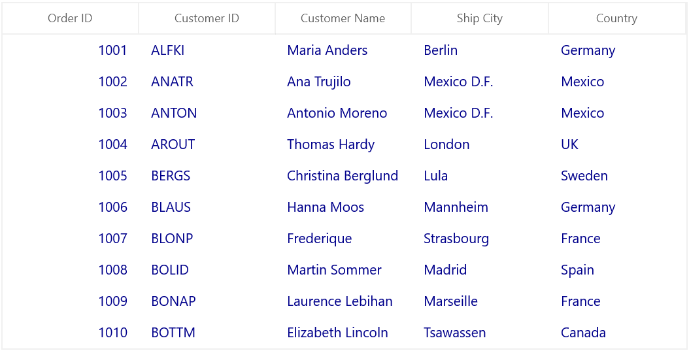
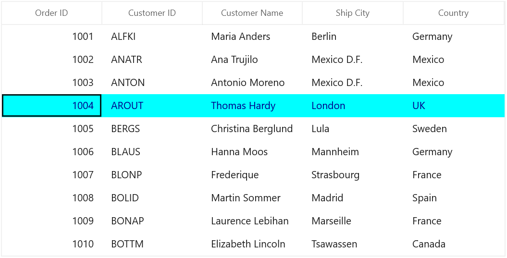
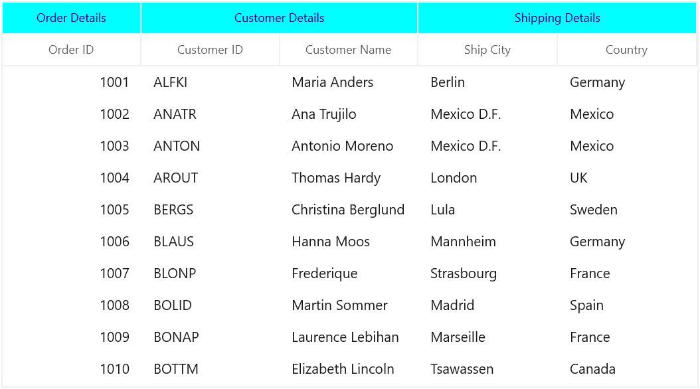
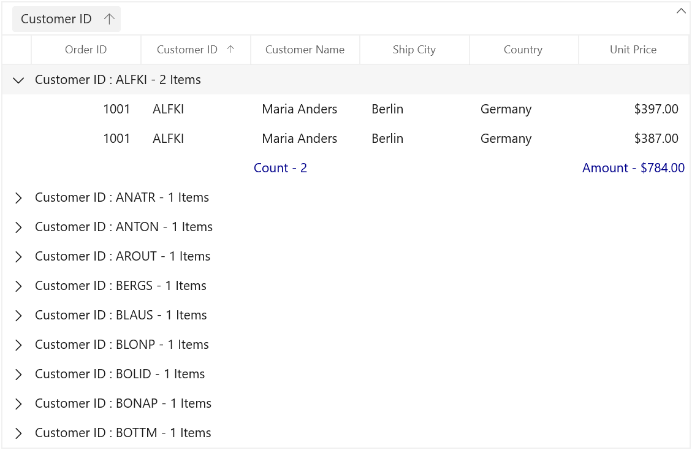
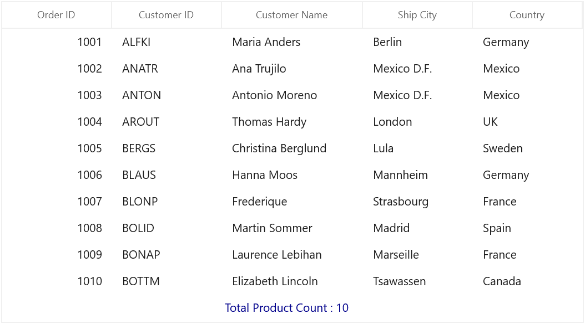
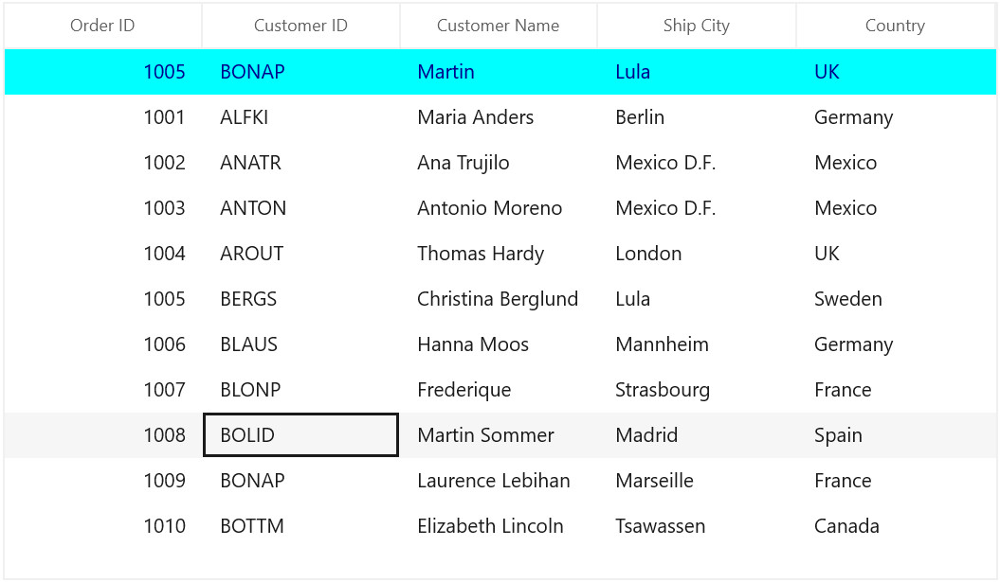
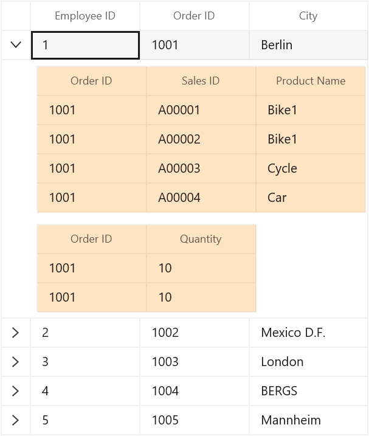

# UI Customization of the WinUI DataGrid (SfDataGrid)

The appearance of SfDataGrid and its inner elements (example: Cell, Row, Header, Summary etc.) can be customized using various properties exposed and using key's.
 
## Styling Record row

The record rows can be customized by using `SyncfusionDataGridRowControlForeground` this key.




<dataGrid:SfDataGrid x:Name="sfDataGrid"
                     ColumnWidthMode="Auto"
                     AutoGenerateColumns="False"
                     ItemsSource="{Binding Orders}" >
    <dataGrid:SfDataGrid.Columns>
        <dataGrid:GridNumericColumn MappingName="OrderID" HeaderText="Order ID" />
        <dataGrid:GridTextColumn MappingName="CustomerID" HeaderText="Customer ID" />
        <dataGrid:GridTextColumn MappingName="CustomerName" HeaderText="Customer Name" />
        <dataGrid:GridTextColumn MappingName="ShipCity" HeaderText="Ship City" />
        <dataGrid:GridTextColumn MappingName="Country" />
    </dataGrid:SfDataGrid.Columns>
    <dataGrid:SfDataGrid.Resources>
        <SolidColorBrush x:Key="SyncfusionDataGridRowControlForeground" Color="DarkBlue"/>
    </dataGrid:SfDataGrid.Resources>
</dataGrid:SfDataGrid>



## Selection

The foreground and background for the selected row, cell can be customized by using `SyncfusionDataGridRowSelectedBackground` and `SyncfusionDataGridRowSelectedForeground` these key's.



<dataGrid:SfDataGrid x:Name="sfDataGrid"
                     ColumnWidthMode="Auto"
                     AutoGenerateColumns="False"
                     ItemsSource="{Binding Orders}" >
    <dataGrid:SfDataGrid.Columns>
        <dataGrid:GridNumericColumn MappingName="OrderID" HeaderText="Order ID" />
        <dataGrid:GridTextColumn MappingName="CustomerID" HeaderText="Customer ID" />
        <dataGrid:GridTextColumn MappingName="CustomerName" HeaderText="Customer Name" />
        <dataGrid:GridTextColumn MappingName="ShipCity" HeaderText="Ship City" />
        <dataGrid:GridTextColumn MappingName="Country" />
    </dataGrid:SfDataGrid.Columns>
    <dataGrid:SfDataGrid.Resources>
        <SolidColorBrush x:Key="SyncfusionDataGridRowSelectedBackground" Color="Cyan"/>
        <SolidColorBrush x:Key="SyncfusionDataGridRowSelectedForeground" Color="DarkBlue"/>
    </dataGrid:SfDataGrid.Resources>
</dataGrid:SfDataGrid>



## Styling Column Header

### Styling Header cell

The header cell can be customized by using `SyncfusionGridHeaderCellControlBackground ` and `SyncfusionGridHeaderCellControlForeground` these key's.



<dataGrid:SfDataGrid x:Name="sfDataGrid"
                     ColumnWidthMode="Auto"
                     AutoGenerateColumns="False"
                     ItemsSource="{Binding Orders}" >
    <dataGrid:SfDataGrid.Columns>
        <dataGrid:GridNumericColumn MappingName="OrderID" HeaderText="Order ID" />
        <dataGrid:GridTextColumn MappingName="CustomerID" HeaderText="Customer ID" />
        <dataGrid:GridTextColumn MappingName="CustomerName" HeaderText="Customer Name" />
        <dataGrid:GridTextColumn MappingName="ShipCity" HeaderText="Ship City" />
        <dataGrid:GridTextColumn MappingName="Country" />
    </dataGrid:SfDataGrid.Columns>
    <dataGrid:SfDataGrid.Resources>
        <SolidColorBrush x:Key="SyncfusionGridHeaderCellControlBackground" Color="Cyan"/>
        <SolidColorBrush x:Key="SyncfusionGridHeaderCellControlForeground" Color="DarkBlue"/>
    </dataGrid:SfDataGrid.Resources>
</dataGrid:SfDataGrid>



### Styling Stacked Headers

The appearance of stacked header can be customized by using `SyncfusionGridStackedHeaderCellControlBackground` and `SyncfusionGridStackedHeaderCellControlForeground` these key's.



<dataGrid:SfDataGrid x:Name="sfDataGrid"
                     ColumnWidthMode="Auto"
                     AutoGenerateColumns="False"
                     ItemsSource="{Binding Orders}" >
    <dataGrid:SfDataGrid.StackedHeaderRows>
        <grid:StackedHeaderRow>
            <grid:StackedHeaderRow.StackedColumns>
                <grid:StackedColumn ChildColumns="OrderID" HeaderText="Order Details" />
                <grid:StackedColumn ChildColumns="CustomerID,CustomerName" HeaderText="Customer Details" />
                <grid:StackedColumn ChildColumns="ShipCity,Country" HeaderText="Shipping Details" />
            </grid:StackedHeaderRow.StackedColumns>
        </grid:StackedHeaderRow>
    </dataGrid:SfDataGrid.StackedHeaderRows>
    <dataGrid:SfDataGrid.Columns>
        <dataGrid:GridNumericColumn MappingName="OrderID" HeaderText="Order ID" />
        <dataGrid:GridTextColumn MappingName="CustomerID" HeaderText="Customer ID" />
        <dataGrid:GridTextColumn MappingName="CustomerName" HeaderText="Customer Name" />
        <dataGrid:GridTextColumn MappingName="ShipCity" HeaderText="Ship City" />
        <dataGrid:GridTextColumn MappingName="Country" />
    </dataGrid:SfDataGrid.Columns>
    <dataGrid:SfDataGrid.Resources>
        <SolidColorBrush x:Key="SyncfusionGridStackedHeaderCellControlBackground" Color="Cyan"/>
        <SolidColorBrush x:Key="SyncfusionGridStackedHeaderCellControlForeground" Color="DarkBlue"/>
    </dataGrid:SfDataGrid.Resources>
</dataGrid:SfDataGrid>



## Styling CaptionSummary rows

The caption summary rows can be customized by using `SyncfusionCaptionSummaryRowControlForeground` this key.



<dataGrid:SfDataGrid x:Name="sfDataGrid"
                     ColumnWidthMode="Auto"
                     AllowGrouping="True"
                     ShowGroupDropArea="True"
                     AutoGenerateColumns="False"
                     ItemsSource="{Binding Orders}" >
    <dataGrid:SfDataGrid.Columns>
        <dataGrid:GridNumericColumn MappingName="OrderID" HeaderText="Order ID" />
        <dataGrid:GridTextColumn MappingName="CustomerID" HeaderText="Customer ID" />
        <dataGrid:GridTextColumn MappingName="CustomerName" HeaderText="Customer Name" />
        <dataGrid:GridTextColumn MappingName="ShipCity" HeaderText="Ship City" />
        <dataGrid:GridTextColumn MappingName="Country" />
    </dataGrid:SfDataGrid.Columns>
    <dataGrid:SfDataGrid.GroupColumnDescriptions>
        <dataGrid:GroupColumnDescription ColumnName="CustomerID" />
    </dataGrid:SfDataGrid.GroupColumnDescriptions>
    <dataGrid:SfDataGrid.Resources>
        <SolidColorBrush x:Key="SyncfusionCaptionSummaryRowControlForeground" Color="DarkBlue"/>
    </dataGrid:SfDataGrid.Resources>
</dataGrid:SfDataGrid>



## Styling GroupSummary rows

The group summary cells can be customized by using `SyncfusionGroupSummaryRowControlForeground` and `SyncfusionGroupSummaryRowControlBackground` these key's.



<dataGrid:SfDataGrid x:Name="sfDataGrid"
                     ColumnWidthMode="Auto"
                     AllowGrouping="True"
                     ShowGroupDropArea="True"
                     AutoGenerateColumns="False"
                     ItemsSource="{Binding Orders}" >
    <dataGrid:SfDataGrid.GroupSummaryRows>
        <dataGrid:GridSummaryRow ShowSummaryInRow="False">
            <dataGrid:GridSummaryRow.SummaryColumns>
                <dataGrid:GridSummaryColumn Name="CustomerCount"
                                          Format="'Count - {Count:d}'"
                                          MappingName="CustomerName"
                                          SummaryType="CountAggregate" />
            </dataGrid:GridSummaryRow.SummaryColumns>
        </dataGrid:GridSummaryRow>
    </dataGrid:SfDataGrid.GroupSummaryRows>
    <dataGrid:SfDataGrid.Columns>
        <dataGrid:GridNumericColumn MappingName="OrderID" HeaderText="Order ID" />
        <dataGrid:GridTextColumn MappingName="CustomerID" HeaderText="Customer ID" />
        <dataGrid:GridTextColumn MappingName="CustomerName" HeaderText="Customer Name" />
        <dataGrid:GridTextColumn MappingName="ShipCity" HeaderText="Ship City" />
        <dataGrid:GridTextColumn MappingName="Country" />
    </dataGrid:SfDataGrid.Columns>
    <dataGrid:SfDataGrid.GroupColumnDescriptions>
        <dataGrid:GroupColumnDescription ColumnName="CustomerID" />
    </dataGrid:SfDataGrid.GroupColumnDescriptions>
    <dataGrid:SfDataGrid.Resources>
        <SolidColorBrush x:Key="SyncfusionGroupSummaryRowControlForeground" Color="DarkBlue"/>
    </dataGrid:SfDataGrid.Resources>
</dataGrid:SfDataGrid>



## Styling TableSummary rows

The table summary rows can be customized by using `SyncfusionTableSummaryRowControlForeground` this key.



<dataGrid:SfDataGrid x:Name="sfDataGrid"
                     ColumnWidthMode="Star"
                     AllowGrouping="True"
                     AutoGenerateColumns="False"
                     ItemsSource="{Binding Orders}" >
    <dataGrid:SfDataGrid.TableSummaryRows>
        <dataGrid:GridTableSummaryRow ShowSummaryInRow="False">
            <dataGrid:GridSummaryRow.SummaryColumns>
                <dataGrid:GridSummaryColumn Name="CustomerCount"
                                          Format="'Total Product Count : {Count:d}'"
                                          MappingName="CustomerName"
                                          SummaryType="CountAggregate" />
            </dataGrid:GridSummaryRow.SummaryColumns>
        </dataGrid:GridTableSummaryRow>
    </dataGrid:SfDataGrid.TableSummaryRows>
    <dataGrid:SfDataGrid.Columns>
        <dataGrid:GridNumericColumn MappingName="OrderID" HeaderText="Order ID" />
        <dataGrid:GridTextColumn MappingName="CustomerID" HeaderText="Customer ID" />
        <dataGrid:GridTextColumn MappingName="CustomerName" HeaderText="Customer Name" />
        <dataGrid:GridTextColumn MappingName="ShipCity" HeaderText="Ship City" />
        <dataGrid:GridTextColumn MappingName="Country" />
    </dataGrid:SfDataGrid.Columns>
    <dataGrid:SfDataGrid.Resources>
        <SolidColorBrush x:Key="SyncfusionTableSummaryRowControlForeground" Color="DarkBlue"/>
    </dataGrid:SfDataGrid.Resources>
</dataGrid:SfDataGrid>



## Styling unbound row 

The unbound row cells can be customized by using `SyncfusionUnboundRowControlForeground` and `SyncfusionUnboundRowControlBackground` these key's.



<dataGrid:SfDataGrid x:Name="sfDataGrid"
                     ColumnWidthMode="Star"
                     AllowGrouping="True"
                     AllowEditing="True"
                     AutoGenerateColumns="False"
                     ItemsSource="{Binding Orders}" >
    <dataGrid:SfDataGrid.UnboundRows>
        <dataGrid:GridUnboundRow  Position="Top"/>
    </dataGrid:SfDataGrid.UnboundRows>
    <dataGrid:SfDataGrid.Columns>
        <dataGrid:GridNumericColumn MappingName="OrderID" HeaderText="Order ID" />
        <dataGrid:GridTextColumn MappingName="CustomerID" HeaderText="Customer ID" />
        <dataGrid:GridTextColumn MappingName="CustomerName" HeaderText="Customer Name" />
        <dataGrid:GridTextColumn MappingName="ShipCity" HeaderText="Ship City" />
        <dataGrid:GridTextColumn MappingName="Country" />
    </dataGrid:SfDataGrid.Columns>
    <dataGrid:SfDataGrid.Resources>
        <SolidColorBrush x:Key="SyncfusionUnboundRowControlBackground" Color="Cyan"/>
        <SolidColorBrush x:Key="SyncfusionUnboundRowControlForeground" Color="DarkBlue"/>
    </dataGrid:SfDataGrid.Resources>
</dataGrid:SfDataGrid>          



## Styling AddNewRow

The appearance of AddNewRow can customized by using `SyncfusionAddNewRowControlBackground` and `SyncfusionAddNewRowControlForeground` these key's.



<dataGrid:SfDataGrid x:Name="sfDataGrid"
                     ColumnWidthMode="Star"
                     AllowGrouping="True"
                     AddNewRowPosition="Top"
                     AllowEditing="True"
                     AutoGenerateColumns="False"
                     ItemsSource="{Binding Orders}" >
    <dataGrid:SfDataGrid.Columns>
        <dataGrid:GridNumericColumn MappingName="OrderID" HeaderText="Order ID" />
        <dataGrid:GridTextColumn MappingName="CustomerID" HeaderText="Customer ID" />
        <dataGrid:GridTextColumn MappingName="CustomerName" HeaderText="Customer Name" />
        <dataGrid:GridTextColumn MappingName="ShipCity" HeaderText="Ship City" />
        <dataGrid:GridTextColumn MappingName="Country" />
    </dataGrid:SfDataGrid.Columns>
    <dataGrid:SfDataGrid.Resources>
        <SolidColorBrush x:Key="SyncfusionAddNewRowControlBackground" Color="Cyan"/>
        <SolidColorBrush x:Key="SyncfusionAddNewRowControlForeground" Color="DarkBlue"/>
    </dataGrid:SfDataGrid.Resources>
</dataGrid:SfDataGrid>



## Styling RowHeader

The appearance of header row can be customized by using `SyncfusionGridHeaderCellControlBackground` and `SyncfusionGridHeaderCellControlForeground` these key's.


s
<dataGrid:SfDataGrid x:Name="sfDataGrid"
                     ColumnWidthMode="Star"
                     AllowGrouping="True"
                     AllowEditing="True"
                     AutoGenerateColumns="False"
                     ItemsSource="{Binding Orders}" >
    <dataGrid:SfDataGrid.Columns>
        <dataGrid:GridNumericColumn MappingName="OrderID" HeaderText="Order ID" />
        <dataGrid:GridTextColumn MappingName="CustomerID" HeaderText="Customer ID" />
        <dataGrid:GridTextColumn MappingName="CustomerName" HeaderText="Customer Name" />
        <dataGrid:GridTextColumn MappingName="ShipCity" HeaderText="Ship City" />
        <dataGrid:GridTextColumn MappingName="Country" />
    </dataGrid:SfDataGrid.Columns>
    <dataGrid:SfDataGrid.Resources>
        <SolidColorBrush x:Key="SyncfusionGridHeaderCellControlBackground" Color="Cyan"/>
        <SolidColorBrush x:Key="SyncfusionGridHeaderCellControlForeground" Color="DarkBlue"/>
    </dataGrid:SfDataGrid.Resources>
</dataGrid:SfDataGrid>



## Styling DetailsViewDataGrid

The appearance of [DetailsViewDataGrid](https://help.syncfusion.com/cr/winui/Syncfusion.UI.Xaml.DataGrid.DetailsViewDataGrid.html) can be customized by using `SyncfusionDetailsViewGridBackground` this key.



<dataGrid:SfDataGrid x:Name="sfDataGrid"
                    ColumnWidthMode="Star"
                    AutoGenerateColumns="True"
                    GridLinesVisibility="Both"
                    AutoGenerateRelations="True"
                    ItemsSource="{Binding Employees}" >
    <dataGrid:SfDataGrid.Resources>
        <SolidColorBrush x:Key="SyncfusionDetailsViewGridBackground" Color="Bisque"/>
    </dataGrid:SfDataGrid.Resources>
</dataGrid:SfDataGrid> 



