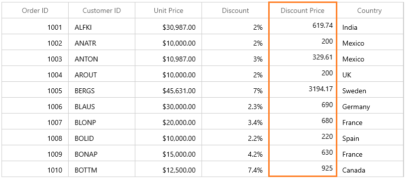
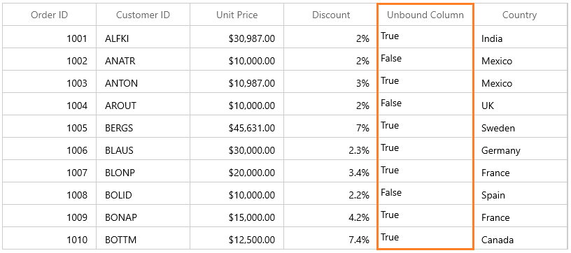
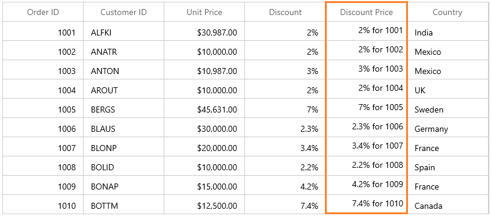

# Unbound Column in WinUI DataGrid

SfDataGrid allows you to add **additional columns** which are **not bound with data object** from underlying data source. You can add unbound column using [GridUnboundColumn](https://help.syncfusion.com/cr/winui/Syncfusion.UI.Xaml.DataGrid.GridUnboundColumn.html) class. Unbound columns supports for sorting, filtering, grouping, exporting and printing as normal columns.



xmlns:dataGrid="using:Syncfusion.UI.Xaml.DataGrid"

<dataGrid:SfDataGrid x:Name="sfDataGrid"
                       AutoGenerateColumns="False" 
                       ItemsSource="{Binding Orders}">
    <dataGrid:SfDataGrid.Columns>
        <dataGrid:GridUnboundColumn Expression="UnitPrice*Discount/100"
                                    HeaderText="Discount Price" TextAlignment="Right" 
                                    MappingName="DiscountPrice" />
    </dataGrid:SfDataGrid.Columns>
</dataGrid:SfDataGrid>




this.sfDataGrid.Columns.Add(new GridUnboundColumn() { HeaderText = "Discount Price", MappingName = "DiscountPrice", TextAlignment = TextAlignment.Right, Expression = "UnitPrice*Discount/100" });




N> It is mandatory to specify the [GridColumn.MappingName](https://help.syncfusion.com/cr/winui/Syncfusion.UI.Xaml.Grids.GridColumnBase.html#Syncfusion_UI_Xaml_Grids_GridColumnBase_MappingName) for `GridUnboundColumn` with some name to identify the column. It is not necessary to define name of field in the data object.

## Populating data for unbound column

You can populate the data for unbound column by setting [Expression](https://help.syncfusion.com/cr/winui/Syncfusion.UI.Xaml.DataGrid.GridUnboundColumn.html#Syncfusion_UI_Xaml_DataGrid_GridUnboundColumn_Expression) or [Format](https://help.syncfusion.com/cr/winui/Syncfusion.UI.Xaml.DataGrid.GridUnboundColumn.html#Syncfusion_UI_Xaml_DataGrid_GridUnboundColumn_Format) property or through [QueryUnboundColumnValue](https://help.syncfusion.com/cr/winui/Syncfusion.UI.Xaml.DataGrid.SfDataGrid.html#Syncfusion_UI_Xaml_DataGrid_SfDataGrid_QueryUnboundColumnValue) event.

### Using Expression

You can specify the arithmetic or logic expression using `Expression` property to compute the display value. By default `GridUnboundColumn` evaluates the expression with casing. You can disable the casing while evaluate the expression by setting [CaseSensitive](https://help.syncfusion.com/cr/winui/Syncfusion.UI.Xaml.DataGrid.GridUnboundColumn.html#Syncfusion_UI_Xaml_DataGrid_GridUnboundColumn_CaseSensitive) property to `false`. 

Below are the list of Arithmetic and logical operations supported.

<table>
<tr>
<th>
Arithmetic operations
</th>
<th>
Operator
</th>
</tr>
<tr>
<td>
Add
</td>
<td>
+
</td>
</tr>
<tr>
<td>
Subtract
</td>
<td>
-
</td>
</tr>
<tr>
<td>
Multiply
</td>
<td>
*
</td>
</tr>
<tr>
<td>
Divide
</td>
<td>
/
</td>
</tr>
<tr>
<td>
Power
</td>
<td>
^
</td>
</tr>
<tr>
<td>
Mod
</td>
<td>
%
</td>
</tr>
<tr>
<td>
Greater Than
</td>
<td>
>
</td>
</tr>
<tr>
<td>
Less Than
</td>
<td>
<
</td>
</tr>
<tr>
<td>
Equal
</td>
<td>
=
</td>
</tr>
<tr>
<td>
GreaterThanOrEqual
</td>
<td>
>=
</td>
</tr>
<tr>
<td>
LessThanOrEqual
</td>
<td>
<=
</td>
</tr>
</table>

<table>
<tr>
<th>
Logical operations
</th>
<th>
Operators
</th>
</tr>
<tr>
<td>
AND
</td>
<td>
(char)135
</td>
</tr>
<tr>
<td>
OR
</td>
<td>
(char)136
</td>
</tr>
<tr>
<td>
NOT
</td>
<td>
(char)137
</td>
</tr>
</table>



<dataGrid:SfDataGrid x:Name="sfDataGrid"
                       AutoGenerateColumns="False" 
                       ItemsSource="{Binding Orders}">
    <dataGrid:SfDataGrid.Columns>
        <dataGrid:GridUnboundColumn HeaderText="Unbound Column"
                                      MappingName="UnboundColumn" />
    </dataGrid:SfDataGrid.Columns>
</dataGrid:SfDataGrid>



(this.sfDataGrid.Columns[4] as GridUnboundColumn).Expression = "Discount * UnitPrice > 25000" + (char)135 + "UnitPrice * Quantity > 25000";




### Using Format

You can format the values of other columns and display the formatted value in unbound column using `Format` property.



<dataGrid:SfDataGrid x:Name="sfDataGrid"
                       AutoGenerateColumns="False" 
                       ItemsSource="{Binding Orders}">
    <dataGrid:SfDataGrid.Columns>
        <dataGrid:GridUnboundColumn Format="'{Discount}% for {OrderID}'"
                                      HeaderText="Discount Price" TextAlignment="Right"
                                      MappingName="DiscountPrice" />
    </dataGrid:SfDataGrid.Columns>
</dataGrid:SfDataGrid>






this.sfDataGrid.Columns.Add(new GridUnboundColumn() { HeaderText = "Discount Price", MappingName = "DiscountPrice", TextAlignment = TextAlignment.Right, Format = "'{Discount}% for {OrderID}'" });




### Using QueryUnboundColumnValue event

You can populate the data for unbound column by handling the [QueryUnboundColumnValue](https://help.syncfusion.com/cr/winui/Syncfusion.UI.Xaml.DataGrid.SfDataGrid.html#Syncfusion_UI_Xaml_DataGrid_SfDataGrid_QueryUnboundColumnValue) event.
[GridUnboundColumnEventArgs](https://help.syncfusion.com/cr/winui/Syncfusion.UI.Xaml.DataGrid.GridUnboundColumnEventsArgs.html) of the `QueryUnboundColumnValue` event provides the information about the cell triggered this event. [GridUnboundColumnValueEventsArgs.OriginalSender](https://help.syncfusion.com/cr/winui/Syncfusion.UI.Xaml.Grids.GridEventArgs.html#Syncfusion_UI_Xaml_Grids_GridEventArgs_OriginalSender) returns the DataGrid fired this event for DetailsView. 

You can get or set the [GridUnboundColumnEventArgs.Value](https://help.syncfusion.com/cr/winui/Syncfusion.UI.Xaml.DataGrid.GridUnboundColumnEventsArgs.html#Syncfusion_UI_Xaml_DataGrid_GridUnboundColumnEventsArgs_Value) property based on the [UnBoundAction](https://help.syncfusion.com/cr/winui/Syncfusion.UI.Xaml.DataGrid.GridUnboundColumnEventsArgs.html#Syncfusion_UI_Xaml_DataGrid_GridUnboundColumnEventsArgs_UnBoundAction). 
* `UnBoundAction` - [QueryData](https://help.syncfusion.com/cr/winui/Syncfusion.UI.Xaml.DataGrid.UnboundActions.html#Syncfusion_UI_Xaml_DataGrid_UnboundActions_QueryData) denotes the event triggered to query value and cell information.
* `UnBoundAction` - [CommitData](https://help.syncfusion.com/cr/winui/Syncfusion.UI.Xaml.DataGrid.UnboundActions.html#Syncfusion_UI_Xaml_DataGrid_UnboundActions_CommitData) denotes the event triggered to save the edited value. 



this.sfDataGrid.QueryUnboundColumnValue += SfDataGrid_QueryUnboundColumnValue;

void SfDataGrid_QueryUnboundColumnValue(object sender, GridUnboundColumnEventsArgs e)
{

    if (e.UnBoundAction == UnboundActions.QueryData)
    {
        var unitPrice = Convert.ToDouble(e.Record.GetType().GetProperty("UnitPrice").GetValue(e.Record));
        var disCount = Convert.ToDouble(e.Record.GetType().GetProperty("Discount").GetValue(e.Record));
        var discountPrice = unitPrice * disCount / 100;
        e.Value = discountPrice.ToString() + "$";
    }
}



## Editing unbound column

### Cancel the editing for unbound column cell

You can cancel the editing of unbound column cell by handling the [SfDataGrid.CurrentCellBeginEdit](https://help.syncfusion.com/cr/winui/Syncfusion.UI.Xaml.DataGrid.SfDataGrid.html#Syncfusion_UI_Xaml_DataGrid_SfDataGrid_CurrentCellBeginEdit) event.




this.sfDataGrid.CurrentCellBeginEdit += SfDataGrid_CurrentCellBeginEdit;

void SfDataGrid_CurrentCellBeginEdit(object sender, CurrentCellBeginEditEventArgs e)
{
    e.Cancel = e.Column is GridUnboundColumn;   
}




### Saving edited value of unbound column using QueryUnboundColumnValue event

You can get the edited value of unbound column from `GridUnboundColumnEventsArgs.Value` property of `QueryUnboundColumnValue` event when UnBoundAction is `CommitData`.




this.sfDataGrid.QueryUnboundColumnValue += SfDataGrid_QueryUnboundColumnValue;

void SfDataGrid_QueryUnboundColumnValue(object sender, GridUnboundColumnEventsArgs e)
{
    if(e.UnBoundAction == UnboundActions.CommitData)
    {
        var editedValue = e.Value;
    }
}




### Read unbound column values

You can get the value of `GridUnboundColumn` using [GetUnboundCellValue](https://help.syncfusion.com/cr/winui/Syncfusion.UI.Xaml.DataGrid.SfDataGrid.html#Syncfusion_UI_Xaml_DataGrid_SfDataGrid_GetUnboundCellValue_Syncfusion_UI_Xaml_DataGrid_GridColumn_System_Object_) method.




this.sfDataGrid.CurrentCellValueChanged += SfDataGrid_CurrentCellValueChanged;

void SfDataGrid_CurrentCellValueChanged(object sender, CurrentCellValueChangedEventArgs e)
{
    var updateValue = this.sfDataGrid.GetUnboundCellValue(sfDataGrid.Columns[4], this.sfDataGrid.CurrentItem);
}




## Customize the unbound column behavior

SfDataGrid allows you to customize the operations like key navigation and UI related interactions by overriding the corresponding renderer associated with the unbound column.  
Below table lists the available cell types for unbound column.

<table>
<tr>
<th>
Cell Type
</th>
<th>
Renderer
</th>
</tr>
<tr>
<td>
UnboundTemplateColumn
</td>
<td>
{{'[GridUnboundCellTemplateRenderer](https://help.syncfusion.com/cr/winui/Syncfusion.UI.Xaml.DataGrid.Renderers.GridUnboundCellTemplateRenderer.html)'| markdownify }}
</td>
</tr>
<tr>
<td>
UnboundTextColumn
</td>
<td>
{{'[GridUnboundCellTextBoxRenderer](https://help.syncfusion.com/cr/winui/Syncfusion.UI.Xaml.DataGrid.Renderers.GridUnboundCellTextBoxRenderer.html)'| markdownify }}
</td>
</tr>
</table>

If the [GridUnboundColumn.EditTemplate](https://help.syncfusion.com/cr/winui/Syncfusion.UI.Xaml.DataGrid.GridTemplateColumn.html#Syncfusion_UI_Xaml_DataGrid_GridTemplateColumn_EditTemplate) not defined then the `UnboundTextColumn` set as default cell type of `GridUnboundColumn`. 
If `GridUnboundColumn.EditTemplate` property defined then `UnboundTemplateColumn` set as cell type of `GridUnboundColumn`.

### Overriding existing cell type

You can customize the unbound row cell behavior by overriding existing renderer and replace the default one in [SfDataGrid.CellRenderers](https://help.syncfusion.com/cr/winui/Syncfusion.UI.Xaml.DataGrid.SfDataGrid.html#Syncfusion_UI_Xaml_DataGrid_SfDataGrid_CellRenderers).

In the below code snippet, `GridUnboundCellTextBoxRenderer` is customized to change the foreground and replaced the default renderer with customized renderer in `SfDataGrid.CellRenderer` collection.




this.sfDataGrid.CellRenderers.Remove("UnboundTextColumn");
this.sfDataGrid.CellRenderers.Add("UnboundTextColumn", new GridUnboundCellTextBoxRendererExt());

public class GridUnboundCellTextBoxRendererExt : GridUnboundCellTextBoxRenderer
{
    public override void OnInitializeDisplayElement(DataColumnBase dataColumn, TextBlock uiElement, object dataContext)
    {
        object cellValue = null;

        if (dataContext != null)
            cellValue = DataGrid.GetUnboundCellValue(dataColumn.GridColumn, dataContext);
        uiElement.Text = cellValue == null ? string.Empty : cellValue.ToString() + "$";
        uiElement.TextAlignment = TextAlignment.Right;
        uiElement.Foreground = new SolidColorBrush(Colors.Blue);
    }

    public override void OnInitializeEditElement(DataColumnBase dataColumn, TextBox uiElement, object dataContext)
    {
        object cellValue = null;

        if (dataContext != null)
            cellValue = DataGrid.GetUnboundCellValue(dataColumn.GridColumn, dataContext);
        uiElement.Text = cellValue == null ? string.Empty : cellValue.ToString();
        uiElement.TextAlignment = TextAlignment.Right;
    }
}




### Custom renderer

You can change the renderer of unbound column by removing the predefined cell type value from [CellRenderers](https://help.syncfusion.com/cr/winui/Syncfusion.UI.Xaml.DataGrid.SfDataGrid.html#Syncfusion_UI_Xaml_DataGrid_SfDataGrid_CellRenderers) collection and add the newly derived renderer from [GridVirtualizingCellRenderer](https://help.syncfusion.com/cr/winui/Syncfusion.UI.Xaml.DataGrid.Renderers.GridVirtualizingCellRenderer-2.html).

## Templating unbound column

You can load any WinUI control in the display mode for `GridUnboundColumn` by setting [GridColumn.CellTemplate](https://help.syncfusion.com/cr/wpf/Syncfusion.UI.Xaml.Grid.GridColumnBase.html#Syncfusion_UI_Xaml_Grid_GridColumnBase_CellTemplate) property. In edit mode, corresponding editor will be loaded based on column type.
