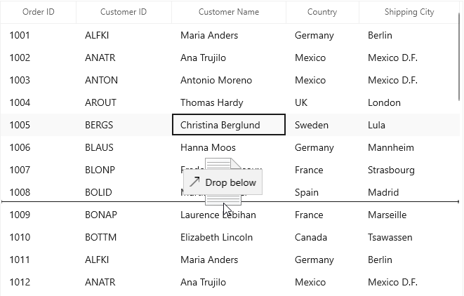

# Row drag and drop in WinUI DataGrid (SfDataGrid)

[WinUI DataGrid](https://help.syncfusion.com/cr/winui/Syncfusion.UI.Xaml.DataGrid.SfDataGrid.html) allows drag and drop the rows within and between controls by setting the `AllowDraggingRows` and [AllowDrop](https://docs.microsoft.com/en-us/dotnet/api/system.windows.uielement.allowdrop) property as `true`. It is also possible to drag and drop the rows between datagrid and other controls such as `ListView` , `SfTreeView` and `SfTreeGrid`. SfDataGrid allows dropping rows when `AllowDrop` is `true` and allows dragging when `AllowDraggingRows` is `true`.



<syncfusion:SfDataGrid x:Name="sfDataGrid"
                     AllowDraggingRows="True"
                     AllowDrop="True"               
                     AutoGenerateColumns="True"
                     ItemsSource="{Binding Orders}" />



this.sfDataGrid.AllowDraggingRows = true;
this.sfDataGrid.AllowDrop = true;



While dropping, the dragged records can be added above or below to the target record based on its drop position

For example, if you dropped record at the bottom of the targeted record, it will be added below the targeted record.

If you drop above the targeted record, it will be added above the targeted record

## Dragging multiple rows

WinUI DataGrid (SfDataGrid) allows to drag multiple selected rows. To enable multiple selection, set the [SfDataGrid.SelectionMode](https://help.syncfusion.com/cr/winui/Syncfusion.UI.Xaml.Grids.SfGridBase.html#Syncfusion_UI_Xaml_Grids_SfGridBase_SelectionMode) as `Multiple` or `Extended`. 

N> The drag selection cannot be performed while the `AllowDraggingRows` enabled as `true` in the SfDataGrid.

## Drag and drop events

SfDataGrid triggers the following events when drag and drop:

### Row Drag starting event

`RowDragStarting` event occurs when you start to drag the records in datagrid. The `DataGridRowDragStartingEventArgs` has the following member, which provides information for the `RowDragStarting` event.
* `DraggingRows` : Gets the Records which contains the data associated while dragging the rows.
* `Cancel` : Gets and Sets a value indicating whether the event is Canceled or not. 



this.sfDataGrid.RowDragStarting += SfDataGrid_RowDragStarting;

private void SfDataGrid_RowDragStarting(object sender, DataGridRowDragStartingEventArgs e)
{
    
}



### Row Drag over event

`RowDragOver` event occurs continuously while record is dragged within the target SfDataGrid. The `DataGridRowDragOverEventArgs` has the following members, which provide information for the `RowDragOver` event.
* `Data` : Gets a data object that contains the data associated while dragging the rows. 
* `DraggingRows` : Gets the Records which contains the data associated while dragging the rows.
* `DropPosition` : Gets a value indicating the drop position which is based on dropped location 
* `ShowDragUI` : Gets or sets a value indicating the default Dragging UI.  
* `TargetIndex` : Gets a value indicating the target index which is going to drop.



this.sfDataGrid.RowDragOver += SfDataGrid_RowDragOver;

private void SfDataGrid_RowDragOver(object sender, DataGridRowDragOverEventArgs e)
{

}



### Row Dropping event

`RowDropping` event occurs when a record is dropping within the target SfDataGrid.The `DataGridRowDroppingEventArgs` has the following members, which provide information for the `RowDropping` event.
* `Cancel` : Gets and Sets a value indicating whether the event is Canceled or not. 
* `Data` : Gets a data object that contains the data associated while dragging the rows. 
* `DraggingRows` : Gets the Records which contains the data associated while dragging the rows. 
* `DropPosition` : Gets a value indicating the drop position which is based on dropped location 
* `TargetIndex` : Gets a value indicating the target record which is going to drop.



this.sfDataGrid.RowDropping += SfDataGrid_RowDropping;

private void SfDataGrid_RowDropping(object sender, DataGridRowDroppingEventArgs e)
{

}



### Row Dropped event

`RowDropped` event occurs when a record is dropping within the target SfDataGrid.The `DataGridRowDroppedEventArgs` has the following members, which provide information for the `Dropping` event.
* `Data` : Gets a data object that contains the data associated while dragging the rows. 
* `DraggingRows` : Gets the Records which contains the data associated while dragging the rows.
* `DropPosition` : Gets a value indicating the drop position which is based on dropped location 
* `TargetIndex` : Gets a value indicating the target record which is going to drop.



this.sfDataGrid.RowDropped += SfDataGrid_RowDropped;

private void SfDataGrid_RowDropped(object sender, DataGridRowDroppedEventArgs e)
{
    
}



## Customizing row drag and drop operation

### Disable dragging of certain rows in WinUI DataGrid

You can restrict the dragging of certain rows in SfDataGrid by using the  `SfDataGrid.RowDragStarting` event.



this.sfDataGrid.RowDragStarting += SfDataGrid_RowDragStarting;

private void SfDataGrid_RowDragStarting(object sender, DataGridRowDragStartingEventArgs e)
{
    var records = e.DraggingRows;
    var orders = records[0] as OrderInfo;
    // You can restrict the dragging for certain rows based on the record value also. 
    var rowIndex = this.sfDataGrid.ResolveToRowIndex(orders);
    var recordIndex = this.sfDataGrid.ResolveToRecordIndex(rowIndex);
    if (recordIndex > 5)
        e.Cancel = true;
}



### Disable dropping over certain rows in WinUI DataGrid

You can restrict the dropping the records in certain rows in SfDataGrid by using the [SfDataGrid.RowDropping] event.



this.sfDataGrid.RowDropping += SfDataGrid_RowDropping;

private void SfDataGrid_RowDropping(object sender, DataGridRowDroppingEventArgs e)
{
    var records = e.DraggingRows;
    var orders = records[0] as OrderInfo;
    // You can restrict the dropping for certain rows based on the target record value also.
    var rowIndex = this.sfDataGrid.ResolveToRowIndex(orders);
    var recordIndex = this.sfDataGrid.ResolveToRecordIndex(rowIndex);
    if (recordIndex > 5)
        e.Cancel = true;
}



### Disable the default drag UI

You can disable the draggable popup by setting the `ShowDragUI` as `false` in the `RowDragOver` event of  `SfDataGrid.RowDragOver` event.



this.sfDataGrid.RowDragOver += SfDataGrid_RowDragOver;

private void SfDataGrid_RowDragOver(object sender, DataGridRowDragOverEventArgs e)
{
    e.ShowDragUI = false;
}



### Reorder the source collection while drag and drop the rows

You can reorder the source collection after drag and drop the row by handling `SfDataGrid.RowDropped` event.



this.sfDataGrid.RowDropped += SfDataGrid_RowDropped;

private void SfDataGrid_RowDropped(object sender, DataGridRowDroppedEventArgs e)
{
    if (e.DropPosition != DataGridRowDropPosition.None)
    {
        // Get Dragging records
        ObservableCollection<object> draggingRecords = e.DraggingRows as ObservableCollection<object>;

        // Gets the TargetRecord from the underlying collection using record index of the TargetRecord (e.TargetIndex)
        ViewModel model = sfDataGrid.DataContext as ViewModel;
        OrderInfo targetRecord = model.Orders[e.TargetIndex];

        // Removes the dragging records from the underlying collection
        foreach (OrderInfo item in draggingRecords)
        {
            model.Orders.Remove(item);
        }

        // Find the target record index after removing the records
        int targetIndex = model.Orders.IndexOf(targetRecord);
        int insertionIndex = e.DropPosition == DataGridRowDropPosition.Above ? targetIndex : targetIndex + 1;
        insertionIndex = insertionIndex < 0 ? 0 : insertionIndex;

        // Insert dragging records to the target position
        for (int i = draggingRecords.Count - 1; i >= 0; i--)
        {
            model.Orders.Insert(insertionIndex, draggingRecords[i] as OrderInfo);
        }
    }
}


