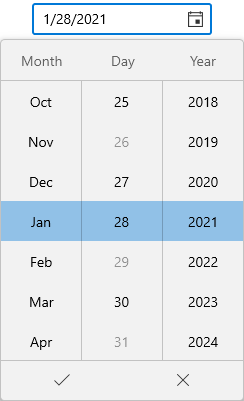

# Date Restriction in WinUI Date Picker

This section explains how to restrict the date selection in WinUI [Date Picker](https://help.syncfusion.com/cr/winui/Syncfusion.UI.Xaml.Editors.SfDatePicker.html) control.

## Limit the available dates

You can restrict the users from selecting a date within the particular range by specifying [`MinDate`](https://help.syncfusion.com/cr/winui/Syncfusion.UI.Xaml.Editors.SfDatePicker.html#Syncfusion_UI_Xaml_Editors_SfDatePicker_MinDate) and [`MaxDate`](https://help.syncfusion.com/cr/winui/Syncfusion.UI.Xaml.Editors.SfDatePicker.html#Syncfusion_UI_Xaml_Editors_SfDatePicker_MaxDate) properties in `Date Picker` control. The default value of `MinDate` property is `1/1/1921` and `MaxDate` property is `12/31/2121`.




SfDatePicker sfDatePicker = new SfDatePicker();
sfDatePicker.MinDate = new DateTimeOffset(new DateTime(2020,12,18));
sfDatePicker.MaxDate = new DateTimeOffset(new DateTime(2020,12,20));




N> Download demo application from [GitHub](https://github.com/SyncfusionExamples/syncfusion-winui-tools-datepicker-examples/blob/main/Samples/DateRestriction)

## Disable dates using BlackoutDates

If you want to block particular dates from the date selection, add that dates into the [`BlackoutDates`](https://help.syncfusion.com/cr/winui/Syncfusion.UI.Xaml.Editors.SfDatePicker.html#Syncfusion_UI_Xaml_Editors_SfDatePicker_BlackoutDates) collection. You can add more block out dates to the `BlackoutDates` collection. The default value of `BlackoutDates` property is `null`.




public class ViewModel
{       
    public DateTimeOffsetCollection BlockedDates { get; set; }
    public ViewModel()
    {
        BlockedDates = new DateTimeOffsetCollection();
        BlockedDates.Add(new DateTimeOffset(new DateTime(2018, 1, 28)));
        BlockedDates.Add(new DateTimeOffset(new DateTime(2021, 1, 26)));
        BlockedDates.Add(new DateTimeOffset(new DateTime(2021, 1, 29)));
        BlockedDates.Add(new DateTimeOffset(new DateTime(2021, 1, 31)));
        BlockedDates.Add(new DateTimeOffset(new DateTime(2023, 1, 28)));
        BlockedDates.Add(new DateTimeOffset(new DateTime(2024, 1, 28)));
    }
}







<editors:SfDatePicker BlackoutDates="{Binding BlockedDates}" 
                      x:Name="sfDatePicker">
    <editors:SfDatePicker.DataContext>
        <local:ViewModel/>
    </editors:SfDatePicker.DataContext>
</editors:SfDatePicker>




sfDatePicker.DataContext = new ViewModel();
sfDatePicker.BlackoutDates = (sfDatePicker.DataContext as ViewModel).BlockedDates;;




N> Download demo application from [GitHub](https://github.com/SyncfusionExamples/syncfusion-winui-tools-datepicker-examples/blob/main/Samples/ViewAndItemCustomization)

## Disable dates dynamically (disable weekends)

If you want to block all weekend dates or any dates from the date selection, handle the [`DateFieldItemPrepared`](https://help.syncfusion.com/cr/winui/Syncfusion.UI.Xaml.Editors.SfDatePicker.html#Syncfusion_UI_Xaml_Editors_SfDatePicker_DateFieldItemPrepared) event and use the [`DateTimeFieldItemPreparedEventArgs.ItemInfo.IsEnabled`](https://help.syncfusion.com/cr/winui/Syncfusion.UI.Xaml.Editors.DateTimeFieldItemPreparedEventArgs.html#Syncfusion_UI_Xaml_Editors_DateTimeFieldItemPreparedEventArgs_ItemInfo) property value as `true`.




<editors:SfDatePicker x:Name="sfDatePicker" 
                      DateFieldItemPrepared = "SfDatePicker_DateFieldItemPrepared"/>




sfDatePicker.DateFieldItemPrepared += SfDatePicker_DateFieldItemPrepared;




You can handle the event as follows,




private void SfDatePicker_DateFieldItemPrepared(object sender, DateTimeFieldItemPreparedEventArgs e)
{
    //Restrict the weekend days
    if (e.ItemInfo.DateTime.Value.DayOfWeek == DayOfWeek.Saturday ||
            e.ItemInfo.DateTime.Value.DayOfWeek == DayOfWeek.Sunday)
    {
        e.ItemInfo.IsEnabled = true;
    }
}




N> Download demo application from [GitHub](https://github.com/SyncfusionExamples/syncfusion-winui-tools-datepicker-examples/blob/main/Samples/DateRestriction)

## Select date as you scroll spinner

If you want to hide the submit button and select the date directly from the dropdown date spinner without clicking the `Ok` button, use the [`ShowSubmitButtons`](https://help.syncfusion.com/cr/winui/Syncfusion.UI.Xaml.Editors.SfDropDownBase.html#Syncfusion_UI_Xaml_Editors_SfDropDownBase_ShowSubmitButtons) property value as `false`. The default value of `ShowSubmitButtons` property is `true`.




<editors:SfDatePicker ShowSubmitButtons="False"
                      x:Name="sfDatePicker"/>




SfDatePicker sfDatePicker = new SfDatePicker();
sfDatePicker.ShowSubmitButtons = false;




N> Download demo application from [GitHub](https://github.com/SyncfusionExamples/syncfusion-winui-tools-datepicker-examples/blob/main/Samples/ViewAndItemCustomization)

## Cancel a date that is being changed

The [`DateChanging`](https://help.syncfusion.com/cr/winui/Syncfusion.UI.Xaml.Editors.SfDatePicker.html#Syncfusion_UI_Xaml_Editors_SfDatePicker_DateChanging) event will be triggered, as soon as a date is selected but before `SelectedDate` property is updated. If the change is considered invalid, it can be canceled. The `DateChanging` event contains the following properties.

* `OldDate` - Gets a date which is previously selected.
* `NewDate` - Gets a date which is currently selected.
* `Cancel` - Gets or sets whether to cancel the selected date value update.

Users are restricted to select a blackout date from dropdown, however user can give text input through editor. As selecting a blackout date leads to crash, we can cancel the change using `DateChanging` event.

N> `DateChanging` event is called before the `DateChanged` event when a date is selected.




<editor:SfDatePicker Height="35" Width="150" DateChanging="SfDatePicker_DateChanging" />




SfDatePicker sfDatePicker = new SfDatePicker();
sfDatePicker.DateChanging += SfDatePicker_DateChanging;




You can handle the event as follows:




 private void SfDatePicker_DateChanging(object sender, Syncfusion.UI.Xaml.Editors.DateChangingEventArgs e)
{
    var OldDate = e.OldDate;
    var NewDate = e.NewDate;

    //Cancel Selected date update
    e.Cancel = true;
}



