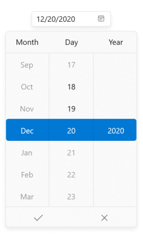
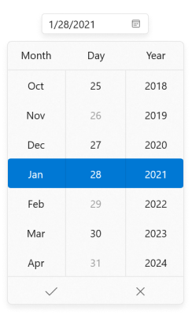
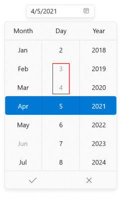

# Date Restriction in WinUI Date Picker

This section explains how to restrict the date selection in WinUI [Date Picker](https://help.syncfusion.com/cr/winui/Syncfusion.UI.Xaml.Editors.SfDatePicker.html) control.

## Limit the available dates

You can restrict users from selecting a date within a particular range by specifying the [`MinDate`](https://help.syncfusion.com/cr/winui/Syncfusion.UI.Xaml.Editors.SfDatePicker.html#Syncfusion_UI_Xaml_Editors_SfDatePicker_MinDate) and [`MaxDate`](https://help.syncfusion.com/cr/winui/Syncfusion.UI.Xaml.Editors.SfDatePicker.html#Syncfusion_UI_Xaml_Editors_SfDatePicker_MaxDate) properties in the `Date Picker` control. The default value of the `MinDate` property is `1/1/1921` and the `MaxDate` property is `12/31/2121`.




using Syncfusion.UI.Xaml.Editors;

SfDatePicker sfDatePicker = new SfDatePicker();
sfDatePicker.MinDate = new DateTimeOffset(new DateTime(2020,12,18));
sfDatePicker.MaxDate = new DateTimeOffset(new DateTime(2020,12,20));




N> Download demo application from [GitHub](https://github.com/SyncfusionExamples/syncfusion-winui-tools-datepicker-examples/blob/main/Samples/DateRestriction)

## Disable dates using BlackoutDates

If you want to block particular dates from date selection, add those dates to the [`BlackoutDates`](https://help.syncfusion.com/cr/winui/Syncfusion.UI.Xaml.Editors.SfDatePicker.html#Syncfusion_UI_Xaml_Editors_SfDatePicker_BlackoutDates) collection. You can add more blackout dates to the `BlackoutDates` collection. The default value of the `BlackoutDates` property is `null`.




using Syncfusion.UI.Xaml.Editors;

public class ViewModel
{       
    public DateTimeOffsetCollection BlockedDates { get; set; }
    public ViewModel()
    {
        BlockedDates = new DateTimeOffsetCollection();
        BlockedDates.Add(new DateTimeOffset(new DateTime(2018, 1, 28)));
        BlockedDates.Add(new DateTimeOffset(new DateTime(2021, 1, 26)));
        BlockedDates.Add(new DateTimeOffset(new DateTime(2021, 1, 29)));
        BlockedDates.Add(new DateTimeOffset(new DateTime(2021, 1, 31)));
        BlockedDates.Add(new DateTimeOffset(new DateTime(2023, 1, 28)));
        BlockedDates.Add(new DateTimeOffset(new DateTime(2024, 1, 28)));
    }
}







<Window
    ...
     xmlns:editors="using:Syncfusion.UI.Xaml.Editors">
    <editors:SfDatePicker  
                          x:Name="sfDatePicker"
                          BlackoutDates="{Binding BlockedDates}">
        <editors:SfDatePicker.DataContext>
            <local:ViewModel/>
        </editors:SfDatePicker.DataContext>
    </editors:SfDatePicker>
</Window>




sfDatePicker.DataContext = new ViewModel();
sfDatePicker.BlackoutDates = (sfDatePicker.DataContext as ViewModel).BlockedDates;




N> Download demo application from [GitHub](https://github.com/SyncfusionExamples/syncfusion-winui-tools-datepicker-examples/blob/main/Samples/ViewAndItemCustomization)

## Disable dates dynamically (disable weekends)

If you want to block all weekend dates or any dates from date selection, handle the [`DateFieldItemPrepared`](https://help.syncfusion.com/cr/winui/Syncfusion.UI.Xaml.Editors.SfDatePicker.html#Syncfusion_UI_Xaml_Editors_SfDatePicker_DateFieldItemPrepared) event and set the [`DateTimeFieldItemPreparedEventArgs.ItemInfo.IsEnabled`](https://help.syncfusion.com/cr/winui/Syncfusion.UI.Xaml.Editors.DateTimeFieldItemPreparedEventArgs.html#Syncfusion_UI_Xaml_Editors_DateTimeFieldItemPreparedEventArgs_ItemInfo) property value to `false`.




<Window
    ...
     xmlns:editors="using:Syncfusion.UI.Xaml.Editors">
    <editors:SfDatePicker x:Name="sfDatePicker" 
                          DateFieldItemPrepared = "SfDatePicker_DateFieldItemPrepared"/>
</Window>




sfDatePicker.DateFieldItemPrepared += SfDatePicker_DateFieldItemPrepared;




You can handle the event as follows:




private void SfDatePicker_DateFieldItemPrepared(object sender, DateTimeFieldItemPreparedEventArgs e)
{
    //Restrict the weekend days
    if (e.ItemInfo.DateTime.Value.DayOfWeek == DayOfWeek.Saturday ||
            e.ItemInfo.DateTime.Value.DayOfWeek == DayOfWeek.Sunday)
    {
        e.ItemInfo.IsEnabled = false;
    }
}




N> Download demo application from [GitHub](https://github.com/SyncfusionExamples/syncfusion-winui-tools-datepicker-examples/blob/main/Samples/DateRestriction)

## Select date as you scroll spinner

If you want to hide the submit button and select the date directly from the drop-down date spinner without clicking the `Ok` button, set the [`ShowSubmitButtons`](https://help.syncfusion.com/cr/winui/Syncfusion.UI.Xaml.Editors.SfDropDownBase.html#Syncfusion_UI_Xaml_Editors_SfDropDownBase_ShowSubmitButtons) property value to `false`. The default value of the `ShowSubmitButtons` property is `true`.




<Window
    ...
     xmlns:editors="using:Syncfusion.UI.Xaml.Editors">
    <editors:SfDatePicker 
                          x:Name="sfDatePicker"
                          ShowSubmitButtons="False"/>
</Window>




SfDatePicker sfDatePicker = new SfDatePicker();
sfDatePicker.ShowSubmitButtons = false;




N> Download demo application from [GitHub](https://github.com/SyncfusionExamples/syncfusion-winui-tools-datepicker-examples/blob/main/Samples/ViewAndItemCustomization)

## Cancel a date that is being changed

The [`SelectedDateChanging`](https://help.syncfusion.com/cr/winui/Syncfusion.UI.Xaml.Editors.SfDatePicker.html#Syncfusion_UI_Xaml_Editors_SfDatePicker_SelectedDateChanging) event will be triggered as soon as a date is selected, but before the `SelectedDate` property is updated. If the change is considered invalid, it can be canceled. The `SelectedDateChanging` event contains the following properties.

* `OldDate` - Gets the date that was previously selected.
* `NewDate` - Gets the date that is currently selected.
* `Cancel` - Gets or sets whether to cancel the selected date value update.

Users are restricted from selecting a blackout date from the dropdown; however, the user can provide text input through the editor. Since selecting a blackout date leads to a crash, the change can be canceled using the `SelectedDateChanging` event.

N> `SelectedDateChanging` event is called before the `SelectedDateChanged` event when a date is selected.




<Window
    ...
     xmlns:editors="using:Syncfusion.UI.Xaml.Editors">
    <editors:SfDatePicker Height="35" 
                         Width="150" 
                         SelectedDateChanging="SfDatePicker_DateChanging" />
</Window>




SfDatePicker sfDatePicker = new SfDatePicker();
sfDatePicker.SelectedDateChanging += SfDatePicker_DateChanging;




You can handle the event as follows:




 private void SfDatePicker_DateChanging(object sender, Syncfusion.UI.Xaml.Editors.DateChangingEventArgs e)
{
    var oldDate = e.OldDate;
    var newDate = e.NewDate;

    //Cancel selected date update
    e.Cancel = true;
}


