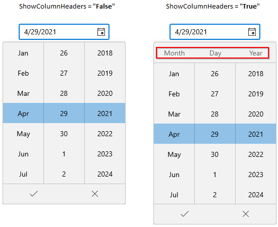

# Dropdown Header Customization in WinUI Date Picker

This section describes about various dropdown header customization options available in [Date Picker](https://help.syncfusion.com/cr/winui/Syncfusion.UI.Xaml.Editors.SfDatePicker.html) control.

## Setting hints in dropdown header

You can add a hints in dropdown header by using the [DropDownHeader](https://help.syncfusion.com/cr/winui/Syncfusion.UI.Xaml.Editors.SfDatePicker.html#Syncfusion_UI_Xaml_Editors_SfDatePicker_DropDownHeader) property. The dropdown hints will be shown only by setting the [ShowDropDownHeader](https://help.syncfusion.com/cr/winui/Syncfusion.UI.Xaml.Editors.SfDatePicker.html#Syncfusion_UI_Xaml_Editors_SfDatePicker_ShowDropDownHeader) property values as `true`. Otherwise, dropdown header will not be shown. The default value of `DropDownHeader` property is `null` and `ShowDropDownHeader` property is `false`.




<editors:SfDatePicker DropDownHeader="Select journey date" 
                      ShowDropDownHeader="True"
                      x:Name="sfDatePicker"/>




SfDatePicker sfDatePicker = new SfDatePicker();
sfDatePicker.DropDownHeader = "Select journey date";
sfDatePicker.ShowDropDownHeader = true;




N> Download demo application from [GitHub](https://github.com/SyncfusionExamples/syncfusion-winui-tools-datepicker-examples/blob/main/Samples/ViewAndItemCustomization)

## Customize the dropdown header

You can customize the header of dropdown date spinner by using the [`DropDownHeaderTemplate`](https://help.syncfusion.com/cr/winui/Syncfusion.UI.Xaml.Editors.SfDatePicker.html#Syncfusion_UI_Xaml_Editors_SfDatePicker_DropDownHeaderTemplate) property. The `DataContext` of `DropDownHeaderTemplate` property is `SfDatePicker.DropDownHeader`.




<editors:SfDatePicker DropDownHeader="Choose a Travel Date" 
                      ShowDropDownHeader="True" 
                      x:Name="sfDatePicker">
    <editors:SfDatePicker.DropDownHeaderTemplate>
        <DataTemplate>
            <StackPanel>
                <TextBlock
                    HorizontalAlignment="Center"
                    VerticalAlignment="Center"
                    Foreground="Green"
                    Text="{Binding}" />
                <Path
                    Width="32"
                    Height="32"
                    Margin="5,5,5,10"
                    HorizontalAlignment="Center"
                    VerticalAlignment="Bottom"
                    Fill="Blue"
                    Data="M5.0499409,20.854989C5.6799391,20.854989 6.1909379,21.365994 6.1909379,21.995999 6.1909379,22.626004 5.6799391,23.137007 5.0499409,23.137007 4.4199427,23.137007 3.9099439,22.626004 3.9099437,21.995999 3.9099439,21.365994 4.4199427,20.854989 5.0499409,20.854989z M14.596949,20.759993C15.226947,20.759993 15.737946,21.270998 15.737946,21.901003 15.737946,22.531008 15.226947,23.042012 14.596949,23.042012 13.966951,23.042012 13.456952,22.531008 13.456952,21.901003 13.456952,21.270998 13.966951,20.759993 14.596949,20.759993z M5.4789585,10.087996C5.2049588,10.087996,4.9809588,10.311996,4.9809588,10.585996L4.9809588,12.577998C4.9809588,14.500999,6.5449585,16.065,8.4669574,16.065L11.455957,16.065C13.377957,16.065,14.941956,14.500999,14.941956,12.577998L14.941956,10.585996C14.941956,10.311996,14.718956,10.087996,14.443957,10.087996z M5.4789585,9.0919948L14.443957,9.0919948C15.267956,9.0919948,15.937956,9.7619953,15.937956,10.585996L15.937956,12.577998C15.937956,15.05,13.927957,17.061,11.455957,17.061L8.4669574,17.061C5.9959587,17.061,3.984959,15.05,3.9849592,12.577998L3.9849592,10.585996C3.984959,9.7619953,4.6549586,9.0919948,5.4789585,9.0919948z M10.605848,6.2067145C10.182643,6.2076663,9.9221548,6.2276208,9.9099678,6.2286375L9.8250068,6.2326353C3.4400006,6.2326355,2.1699818,8.8086996,1.9920029,9.2787094L1.9920029,23.634949C1.9920033,24.403944,2.6179796,25.030968,3.3879987,25.030968L16.945976,25.030968C17.489004,25.030968,17.929983,24.588944,17.929983,24.044928L17.931997,9.3637023C16.43066,6.4917114,12.266111,6.202981,10.605848,6.2067145z M10.652609,4.2130087C12.769905,4.2105492,17.93724,4.6332789,19.83196,8.7126899L19.924001,8.9116983 19.922963,24.044928C19.922963,25.686985,18.586965,27.023009,16.945976,27.023009L15.744038,27.023009 18.39861,30.386019C18.739616,30.818005 18.665614,31.444987 18.234607,31.785977 18.051605,31.929972 17.8336,31.99997 17.617597,31.99997 17.322593,31.99997 17.030588,31.870974 16.834585,31.621981L13.203441,27.023009 7.3373374,27.023009 3.7063731,31.621964C3.5103699,31.869967 3.2183651,31.99997 2.92336,31.99997 2.7073566,31.99997 2.489353,31.929968 2.3063499,31.785967 1.8753428,31.444962 1.8013416,30.817952 2.1423472,30.385945L4.7967409,27.023009 3.3879987,27.023009C1.5189811,27.023009,1.5606929E-09,25.502963,0,23.634949L0.018981917,8.9346786C0.057983368,8.7426891 1.067016,4.2546039 9.7849678,4.2405961 9.9051145,4.2323452 10.21317,4.2135194 10.652609,4.2130087z M9.9619535,0C10.772957,0 11.430959,0.65799594 11.430959,1.4689908 11.430959,2.2799857 10.772957,2.9379814 9.9619535,2.9379817 9.1509508,2.9379814 8.4929479,2.2799857 8.4929479,1.4689908 8.4929479,0.65799594 9.1509508,0 9.9619535,0z"
                    Stretch="Uniform" />
            </StackPanel>
        </DataTemplate>
    </editors:SfDatePicker.DropDownHeaderTemplate>
</editors:SfDatePicker>




N> Download demo application from [GitHub](https://github.com/SyncfusionExamples/syncfusion-winui-tools-datepicker-examples/blob/main/Samples/CustomUI)

## Hide the dropdown column headers

If you want to hide the dropdown day, month and year spinner's column headers, use the [ShowColumnHeaders](https://help.syncfusion.com/cr/winui/Syncfusion.UI.Xaml.Editors.SfDatePicker.html#Syncfusion_UI_Xaml_Editors_SfDatePicker_ShowColumnHeaders) property value as `false`. The default value of `ShowColumnHeaders` property is `true`.

N> To customize the column headers, refer the [Customize the columns in dropdown spinner](https://help.syncfusion.com/winui/date-picker/spinner-customization#customize-the-columns-in-dropdown-spinner) topic.




<editors:SfDatePicker ShowColumnHeaders="False" 
                      x:Name="sfDatePicker"/>




SfDatePicker sfDatePicker = new SfDatePicker();
sfDatePicker.ShowColumnHeaders = false;




N> Download demo application from [GitHub](https://github.com/SyncfusionExamples/syncfusion-winui-tools-datepicker-examples/blob/main/Samples/ViewAndItemCustomization)
