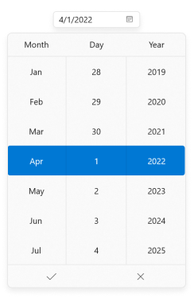
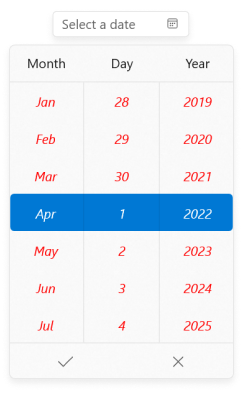
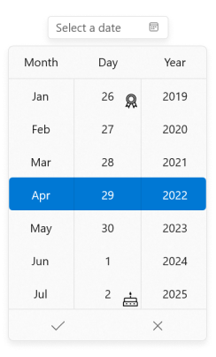
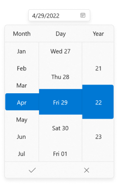

# Dropdown Spinner Customization in WinUI Date Picker

This section describes about various spinner customization options available in [Date Picker](https://help.syncfusion.com/cr/winui/Syncfusion.UI.Xaml.Editors.SfDatePicker.html) control.

## Change the size of dropdown cells

You can change the cell size in the dropdown date spinner by setting the values to [`ItemWidth`](https://help.syncfusion.com/cr/winui/Syncfusion.UI.Xaml.Editors.SfDatePicker.html#Syncfusion_UI_Xaml_Editors_SfDatePicker_ItemWidth) and [`ItemHeight`](https://help.syncfusion.com/cr/winui/Syncfusion.UI.Xaml.Editors.SfDatePicker.html#Syncfusion_UI_Xaml_Editors_SfDatePicker_ItemHeight) properties. The default value of the `ItemWidth` and `ItemHeight` properties is `80` and `40`. 

You can also restrict the width of dropdown date spinner cells with particular pixels by using the [`MinItemWidth`](https://help.syncfusion.com/cr/winui/Syncfusion.UI.Xaml.Editors.SfDatePicker.html#Syncfusion_UI_Xaml_Editors_SfDatePicker_MinItemWidth) and [`MaxItemWidth`](https://help.syncfusion.com/cr/winui/Syncfusion.UI.Xaml.Editors.SfDatePicker.html#Syncfusion_UI_Xaml_Editors_SfDatePicker_MaxItemWidth) properties. The default value of `MinItemWidth` property is `0` and `MaxItemWidth` property is `Infinity`.

N> `ItemWidth` values must be within the `MinItemWidth` and `MaxItemWidth`values. Otherwise, `ItemWidth` will take the closest value from `MinItemWidth` or `MaxItemWidth` value.




<editors:SfDatePicker x:Name="sfDatePicker" 
                      MinItemWidth="70" 
                      MaxItemWidth="120"
                      ItemWidth="100"
                      ItemHeight="50"
                      />




SfDatePicker sfDatePicker = new SfDatePicker();
sfDatePicker.MinItemWidth = 70;
sfDatePicker.MaxItemWidth = 120;
sfDatePicker.ItemWidth = 100;
sfDatePicker.ItemHeight = 50;




N> Download demo application from [GitHub](https://github.com/SyncfusionExamples/syncfusion-winui-tools-datepicker-examples/blob/main/Samples/ViewAndItemCustomization)

## Customize the cell's style in dropdown spinner

You can customize all the dropdown date spinner cells by using the `ItemContainerStyle` properties. The `DataContext` of `ItemContainerStyle` or `ItemTemplate` properties is [`SpinnerItem`](https://help.syncfusion.com/cr/winui/Syncfusion.UI.Xaml.Editors.SpinnerItem.html).




<editors:SfDatePicker
    x:Name="sfDatePicker">
    <editors:SfDatePicker.ItemContainerStyle>
        
    </editors:SfDatePicker.ItemContainerStyle>
</editors:SfDatePicker>




N> Download demo application from [GitHub](https://github.com/SyncfusionExamples/syncfusion-winui-tools-datepicker-examples/tree/main/Samples/SpinnerCustomUI)

## Customize the cell's appearance in dropdown spinner

You can change the UI of specific date, month or year cells in dropdown spinner by using the `ItemTemplateSelector` property. The `DataContext` of `ItemTemplateSelector` is `SpinnerItem`.




public class DateItemTemplateSelector : DataTemplateSelector
{
    public DataTemplate DefaultTemplate { get; set; }
    public DataTemplate BirthdayTemplate { get; set; }
    public DataTemplate GiftTemplate { get; set; }
    public DataTemplate AwardTemplate { get; set; }

    protected override DataTemplate SelectTemplateCore(object item, DependencyObject container)
    {
        DateTimeFieldItemInfo dateTimeField = item as DateTimeFieldItemInfo;
        if (dateTimeField.Field == DateTimeField.Day)
        {
            switch (dateTimeField.DateTime.Value.Day)
            {
                case 2:
                    return BirthdayTemplate as DataTemplate;
                case 7:
                    return GiftTemplate as DataTemplate;
                case 12:
                    return AwardTemplate as DataTemplate;
                case 17:
                    return BirthdayTemplate as DataTemplate;
                case 20:
                    return GiftTemplate as DataTemplate;
                case 26:
                    return AwardTemplate as DataTemplate;
            }
        }
        return base.SelectTemplateCore(item, container);
    }
}







 <Grid>
    <Grid.Resources>
        <x:String x:Key="birthday">M24.188005,24.530994C24.999008,24.530994 25.657011,25.188997 25.657011,26 25.657011,26.811003 24.999008,27.469006 24.188005,27.469006 23.377003,27.469006 22.719,26.811003 22.719,26 22.719,25.188997 23.377003,24.530994 24.188005,24.530994z M16.000006,24.530994C16.811008,24.530994 17.469011,25.188997 17.469011,26 17.469011,26.811003 16.811008,27.469006 16.000006,27.469006 15.189002,27.469006 14.530999,26.811003 14.530999,26 14.530999,25.188997 15.189002,24.530994 16.000006,24.530994z M7.813005,24.405994C8.6240082,24.405994 9.282011,25.063997 9.282011,25.875 9.282011,26.686003 8.6240082,27.344006 7.813005,27.344006 7.0020018,27.344006 6.3439994,26.686003 6.3439994,25.875 6.3439994,25.063997 7.0020018,24.405994 7.813005,24.405994z M3,22.5C2.4490051,22.5,2,22.949005,2,23.5L2,29.5 30,29.5 30,23.5C30,22.949005,29.550995,22.5,29,22.5z M5,14.5C4.4489999,14.5,4,14.949,4,15.5L4,20.5 28,20.5 28,15.5C28,14.949,27.551001,14.5,27,14.5L16,14.5z M16,8.5C16.552,8.5,17,8.948,17,9.5L17,12.5 27,12.5C28.653999,12.5,30,13.846,30,15.5L30,20.672067 30.030354,20.68236C31.178461,21.103616,32,22.207819,32,23.5L32,30.5C32,31.052002,31.552002,31.5,31,31.5L1,31.5C0.44799805,31.5,0,31.052002,0,30.5L0,23.5C0,22.207819,0.82153827,21.103616,1.969646,20.68236L2,20.672067 2,15.5C2,13.846,3.346,12.5,5,12.5L15,12.5 15,9.5C15,8.948,15.448,8.5,16,8.5z M16.019098,0C16.450115,1.7290001 18.144182,3.5890007 18.144182,4.7290001 18.219185,6.1879997 17.684164,7 16.019098,7 14.354033,7 13.856012,6.0419998 13.856012,4.7290001 13.856012,3.323 14.56604,1.3330002 16.019098,0z</x:String>
        <x:String x:Key="gift">M14.072999,21.71989L14.173005,21.71989 23.954012,21.71989 23.954012,30.402982C23.954012,31.300994,23.255007,31.999997,22.356997,31.999997L14.072999,31.999997z M1.2980041,21.71989L11.178987,21.71989 11.178987,31.999997 2.8949892,31.999997C1.9960022,31.999997,1.2980041,31.300994,1.2980041,30.402982z M19.661989,3.2556945C19.06299,3.2556945,14.072999,7.3477336,12.975007,8.545744L12.975007,8.8447515C13.674012,8.6447526 15.670015,7.1477343 17.267,6.1497227 19.162996,5.0517112 19.962008,3.7546926 19.661989,3.2556945z M5.5889899,3.2556945C5.3899848,3.7546926 6.1879889,5.0517112 7.984986,6.2497221 9.4819957,7.2477342 11.578004,8.6447526 12.277009,8.9447509L12.277009,8.6447526C11.178987,7.3477336,6.287995,3.2556945,5.5889899,3.2556945z M17.864281,0.00017286225C18.476668,-0.0068490629 19.175909,0.19928326 19.962008,0.76066515 22.756014,2.6566814 22.656008,4.2536984 22.656008,5.2517105 22.157015,7.447733 19.463015,8.4457446 16.868014,8.9447509L23.355013,8.9447509C24.252993,8.9447509,24.951998,9.6427566,24.951998,10.541768L24.951998,13.235797C24.951998,13.834803,24.553011,14.433808,24.053988,14.633815L24.053988,19.723867 14.173005,19.723867 14.173005,9.3437568 13.574006,9.3437568 13.075013,9.3437568 12.675996,9.3437568 12.277009,9.3437568 11.578004,9.3437568 11.477998,9.3437568 11.178987,9.3437568 11.178987,19.723867 1.2980041,19.723867 1.2980041,14.732815C0.59899889,14.533815,-2.3291432E-07,13.934802,0,13.136797L0,10.441769C-2.3291432E-07,9.5437566,0.69900499,8.8447515,1.5969848,8.8447515L8.4840099,8.8447515C5.8890082,8.545744 3.0939943,7.447733 2.6950075,5.2517105 2.6950075,4.353706 2.5950014,2.7566885 5.3899848,0.76066515 6.0889899,0.261659 6.7869879,0.061659901 7.385987,0.061660053 8.9830028,0.061659901 10.080995,1.4586705 10.480012,1.8586761 10.878999,2.2576827 12.076997,4.452706 12.675996,6.6487285 13.274995,4.452706 14.471986,2.2576827 14.871003,1.8586761 15.301535,1.4281411 16.29929,0.018116923 17.864281,0.00017286225z</x:String>
        <x:String x:Key="award">M6.4050484,19.617198L3.7509956,25.34103 6.5209923,24.451031 7.7069907,27.094029 10.305956,21.486943 10.209199,21.463142C8.8243089,21.103976,7.5456314,20.475896,6.431808,19.637838z M20.198464,18.975471L19.810075,19.313839C18.872342,20.092266,17.802781,20.71557,16.640677,21.144267L16.418594,21.22308 18.634039,27.072047 19.967047,24.487023 22.674016,25.519068z M12.916001,5.5320349C9.9759998,5.5320349 7.5829983,7.9410334 7.5829983,10.903033 7.5829983,13.865032 9.9759998,16.274031 12.916001,16.274031 15.857003,16.274031 18.250004,13.865032 18.250004,10.903033 18.250004,7.9410334 15.857003,5.5320349 12.916001,5.5320349z M12.916001,3.5320349C16.960003,3.5320349 20.250005,6.8390341 20.250005,10.903033 20.250005,14.968032 16.960003,18.274031 12.916001,18.274031 8.8729992,18.274031 5.5829973,14.968032 5.5829973,10.903033 5.5829973,6.8390341 8.8729992,3.5320349 12.916001,3.5320349z M12.91602,2.0000057C8.0390205,2.0000057 4.0710211,5.9940157 4.0710211,10.903028 4.0710211,15.81304 8.0390205,19.80705 12.91602,19.80705 17.79302,19.80705 21.761019,15.81304 21.761019,10.903028 21.761019,5.9940157 17.79302,2.0000057 12.91602,2.0000057z M12.91602,0C18.89502,0 23.761019,4.8920126 23.761019,10.903028 23.761019,13.251471 23.018526,15.429016 21.757237,17.210832L21.674238,17.325164 21.711064,17.311053 26.135013,28.99606 20.926031,27.007045 18.356024,31.999053 14.455157,21.696701 14.295179,21.719278C13.843446,21.777196 13.383129,21.807055 12.91602,21.807055 12.822598,21.807055 12.729448,21.805861 12.636584,21.803486L12.375046,21.793458 7.6759906,31.926026 5.4279938,26.921029 0,28.665028 4.8565531,18.189458 4.5508928,17.834802C3.0024042,15.949165 2.0710211,13.533284 2.0710211,10.903028 2.0710211,4.8920126 6.9370208,0 12.91602,0z</x:String>
        <DataTemplate x:Key="defaultTemplate">
            <TextBlock Text="{Binding DisplayText}" />
        </DataTemplate>
        <DataTemplate x:Key="birthdayTemplate">
            <Grid>
                <TextBlock
                    HorizontalAlignment="Center"
                    VerticalAlignment="Center"
                    Text="{Binding DisplayText}" />
                    <Path
                    Width="18"
                    Height="18"
                    Margin="3"
                    HorizontalAlignment="Right"
                    VerticalAlignment="Bottom"
                    Data="{StaticResource birthday}"
                    Fill="{ThemeResource SystemBaseHighColor}"
                    Stretch="Uniform" />
            </Grid>
            </DataTemplate>
            <DataTemplate x:Key="giftTemplate">
                <Grid>
                    <TextBlock
                    HorizontalAlignment="Center"
                    VerticalAlignment="Center"
                    Text="{Binding DisplayText}" />
                    <Path
                    Width="18"
                    Height="18"
                    Margin="3"
                    HorizontalAlignment="Right"
                    VerticalAlignment="Bottom"
                    Data="{StaticResource gift}"
                    Fill="{ThemeResource SystemBaseHighColor}"
                    Stretch="Uniform" />
                </Grid>
            </DataTemplate>
            <DataTemplate x:Key="awardTemplate">
                <Grid>
                    <TextBlock
                    HorizontalAlignment="Center"
                    VerticalAlignment="Center"
                    Text="{Binding DisplayText}" />
                    <Path
                    Width="18"
                    Height="18"
                    Margin="3"
                    HorizontalAlignment="Right"
                    VerticalAlignment="Bottom"
                    Data="{StaticResource award}"
                    Fill="{ThemeResource SystemBaseHighColor}"
                    Stretch="Uniform" />
                </Grid>
            </DataTemplate>

            <local:DateItemTemplateSelector
            x:Key="selector"
            AwardTemplate="{StaticResource awardTemplate}"
            BirthdayTemplate="{StaticResource birthdayTemplate}"
            DefaultTemplate="{StaticResource defaultTemplate}"
            GiftTemplate="{StaticResource giftTemplate}" />
    </Grid.Resources>
    <editors:SfDatePicker Name="sfDatePicker" ItemTemplateSelector="{StaticResource selector}" VerticalAlignment="Top" Width="150" Height="30">
    </editors:SfDatePicker>
</Grid>




N> Download demo application from [GitHub](https://github.com/SyncfusionExamples/syncfusion-winui-tools-datepicker-examples/blob/main/Samples/CustomUI)

## Customize the columns in dropdown spinner

You can change the date format, header text, size of date field cells, customize the UI of date field cells and enables the date looping, etc., by using the [`DateFieldPrepared`](https://help.syncfusion.com/cr/winui/Syncfusion.UI.Xaml.Editors.SfDatePicker.html#Syncfusion_UI_Xaml_Editors_SfDatePicker_DateFieldPrepared) event.

Here, date format, header and cell size of the dropdown date field is customized by using `DateFieldPrepared` event.

N> This will effective only for the date field cells.




<editors:SfDatePicker 
                      x:Name="sfDatePicker"
                      DateFieldPrepared="SfDatePicker_DateFieldPrepared"/>




SfDatePicker sfDatePicker = new SfDatePicker();
sfDatePicker.DateFieldPrepared += SfDatePicker_DateFieldPrepared;




You can handle the event as follows,




private void SfDatePicker_DateFieldPrepared(object sender, DateTimeFieldPreparedEventArgs e)
{
    if (e.Column != null)
    {
        if (e.Column.Field == DateTimeField.Day)
        {
            e.Column.Format = "ddd dd";
            e.Column.ShowHeader = true;
            e.Column.Header = "Day";
            e.Column.ItemHeight = 60;
            e.Column.ItemWidth = 100;
            e.Column.ShouldLoop = true;
        }
        else if (e.Column.Field == DateTimeField.MonthName)
        {
            e.Column.ShowHeader = true;
            e.Column.Header = "Month";
            e.Column.ItemHeight = 40;
            e.Column.ItemWidth = 75;
            e.Column.ShouldLoop = true;
        }
        else if (e.Column.Field == DateTimeField.Year)
        {
            e.Column.Format = "yy";
            e.Column.ShowHeader = true;
            e.Column.Header = "Year";
            e.Column.ItemHeight = 80;
            e.Column.ItemWidth = 75;
            e.Column.ShouldLoop = true;
        }
    }
}




N> Download demo application from [GitHub](https://github.com/SyncfusionExamples/syncfusion-winui-tools-datepicker-examples/blob/main/Samples/DateFieldPrepared)