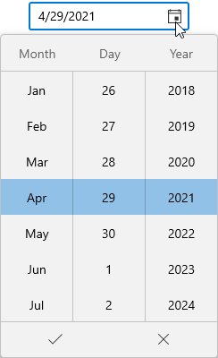
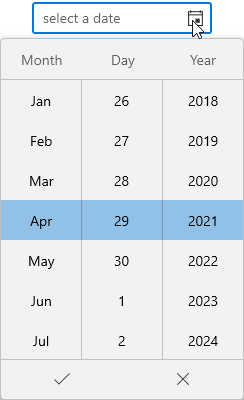

# Getting Started with WinUI Date Picker

This section explains the steps required to add the WINUI [Date Picker](https://help.syncfusion.com/cr/winui/Syncfusion.UI.Xaml.Editors.SfDatePicker.html) control and its date selection options. This section covers only basic features needed to get started with Syncfusion `Date Picker` control.

## Structure of Date Picker control

## Creating an application with WinUI Date Picker

In this walkthrough, you will create a WinUI application that contains the `Date Picker` control.

## Adding control manually in XAML

To add `Date Picker` control manually in XAML , follow the below steps.

1. Create a [WinUI 3 desktop app for C# and .NET 5](https://docs.microsoft.com/en-us/windows/apps/winui/winui3/get-started-winui3-for-desktop).
2. Download and refer the following NuGet in the project.
    * [Syncfusion.Editors.WinUI](https://www.nuget.org/packages/Syncfusion.Editors.WinUI)
3. Import the control namespace `Syncfusion.UI.Xaml.Editors` in XAML or C# code.
4. Initialize the `SfDatePicker` control.




<Page
    x:Class="GettingStarted.MainPage"
    xmlns="http://schemas.microsoft.com/winfx/2006/xaml/presentation"
    xmlns:x="http://schemas.microsoft.com/winfx/2006/xaml"
    xmlns:local="using:GettingStarted"
    xmlns:d="http://schemas.microsoft.com/expression/blend/2008"
    xmlns:mc="http://schemas.openxmlformats.org/markup-compatibility/2006"
    xmlns:editors="using:Syncfusion.UI.Xaml.Editors"
    mc:Ignorable="d"
    Background="{ThemeResource ApplicationPageBackgroundThemeBrush}">
    <Grid Name="grid">
        <!--Adding Date Picker control -->
        <editors:SfDatePicker Name="sfDatePicker"/>
    </Grid>
</Page>




## Adding control manually in C#

To add the `Date Picker` control manually in C#, follow the below steps.

1. Create a [WinUI 3 desktop app for C# and .NET 5](https://docs.microsoft.com/en-us/windows/apps/winui/winui3/get-started-winui3-for-desktop) or [WinUI 3 app in UWP for C#](https://docs.microsoft.com/en-us/windows/apps/winui/winui3/get-started-winui3-for-uwp).
2. Download and refer the following NuGet in the project.
    * [Syncfusion.Editors.WinUI](https://www.nuget.org/packages/Syncfusion.Editors.WinUI)
3. Import the `Date Picker` namespace `Syncfusion.UI.Xaml.Editors` in C# page.
4. Initialize the `Date Picker` control.




using Syncfusion.UI.Xaml.Editors;

namespace GettingStarted
{
    /// 

    /// An empty page that can be used on its own or navigated to within a Frame.
    /// 

    public sealed partial class MainPage : Page
    {
        public MainPage()
        {
            this.InitializeComponent();
            // Creating an instance of the Date Picker control
            SfDatePicker sfDatePicker = new SfDatePicker();

            grid.Children.Add(sfDatePicker);
        }
    }
}




N> Download demo application from [GitHub](https://github.com/SyncfusionExamples/syncfusion-winui-tools-datepicker-examples/blob/main/Samples/Getting_Started)

## Select date programmatically

You can set or change the selected date programmatically by using [`SelectedDate`](https://help.syncfusion.com/cr/winui/Syncfusion.UI.Xaml.Editors.SfDatePicker.html#Syncfusion_UI_Xaml_Editors_SfDatePicker_SelectedDate) property. If you not assign any value for the `SelectedDate` property, `Date Picker` will automatically assign the current system date as `SelectedDate`.




SfDatePicker sfDatePicker= new SfDatePicker();
sfDatePicker.SelectedDate = new DateTimeOffset(new DateTime(2021, 10, 29));




N> Download demo application from [GitHub](https://github.com/SyncfusionExamples/syncfusion-winui-tools-datepicker-examples/blob/main/Samples/ViewAndItemCustomization)

## Select date interactively

You can change the selected date interactively by enter the date value using keyboard or select from dropdown date spinner. You can get the selected date from the `SelectedDate` property.




<editors:SfDatePicker Name="sfDatePicker" />




SfDatePicker sfDatePicker= new SfDatePicker();




N> Download demo application from [GitHub](https://github.com/SyncfusionExamples/syncfusion-winui-tools-datepicker-examples/blob/main/Samples/Getting_Started)

## Restrict selection

You can restrict users from:
* Selecting date within a specific minimum and maximum range using [`MinDate`](https://help.syncfusion.com/cr/winui/Syncfusion.UI.Xaml.Editors.SfDatePicker.html#Syncfusion_UI_Xaml_Editors_SfDatePicker_MinDate) and [`MaxDate`](https://help.syncfusion.com/cr/winui/Syncfusion.UI.Xaml.Editors.SfDatePicker.html#Syncfusion_UI_Xaml_Editors_SfDatePicker_MaxDate) properties.
* Selecting a date from blocked dates using [`BlackoutDates`](https://help.syncfusion.com/cr/winui/Syncfusion.UI.Xaml.Editors.SfDatePicker.html#Syncfusion_UI_Xaml_Editors_SfDatePicker_BlackoutDates) property.
* Selecting a date from specifically blocked set of dates (example : blocking weekend dates) using [`DateFieldItemPrepared`](https://help.syncfusion.com/cr/winui/Syncfusion.UI.Xaml.Editors.SfDatePicker.html#Syncfusion_UI_Xaml_Editors_SfDatePicker_DateFieldItemPrepared) event.

For further reference [click_here](date-restriction).

## Setting null value

If you want to set null value for the `Date Picker`, set the [`AllowNull`](https://help.syncfusion.com/cr/winui/Syncfusion.UI.Xaml.Editors.SfDatePicker.html#Syncfusion_UI_Xaml_Editors_SfDatePicker_AllowNull) property as `true` and set `SelectedDate` property as `null`. If `AllowNull` property is `false`, then the current system date is updated in `SelectedDate` property and displayed instead of `null`.




<editors:SfDatePicker SelectedDate="{x:Null}"
                      AllowNull="True"
                      Name="sfDatePicker" />




SfDatePicker sfDatePicker= new SfDatePicker();
sfDatePicker.SelectedDate = null;
sfDatePicker.AllowNull = true;




N> Download demo application from [GitHub](https://github.com/SyncfusionExamples/syncfusion-winui-tools-datepicker-examples/blob/main/Samples/DateRestriction)

## Setting watermark text

You can prompt the user with some information by using the [`PlaceholderText`](https://help.syncfusion.com/cr/winui/Syncfusion.UI.Xaml.Editors.SfDatePicker.html#Syncfusion_UI_Xaml_Editors_SfDatePicker_PlaceholderText) property. This will be displayed only when the `TimePicker` contains the `SelectedDate` property as `null` and `AllowNull` property as `true`. If `AllowNull` property is `false`, then the current system time is updated in `SelectedDate` property and displayed instead of `PlaceholderText`.




<editors:SfDatePicker PlaceholderText="select a journey date"
                      SelectedDate="{x:Null}"
                      AllowNull="True"
                      Name="sfDatePicker" />




SfDatePicker sfDatePicker= new SfDatePicker();
sfDatePicker.PlaceholderText = "select a journey date";
sfDatePicker.SelectedDate = null;
sfDatePicker.AllowNull = true;




N> Download demo application from [GitHub](https://github.com/SyncfusionExamples/syncfusion-winui-tools-datepicker-examples/blob/main/Samples/DateRestriction)

## Date changed notification

You will be notified when selected date changed in `Date Picker` by using [`SelectedDateChanged`](https://help.syncfusion.com/cr/winui/Syncfusion.UI.Xaml.Editors.SfDatePicker.html#Syncfusion_UI_Xaml_Editors_SfDatePicker_DateChanged) event. The `SelectedDateChanged` event contains the old and newly selected date in the [`OldDateTime`](https://help.syncfusion.com/cr/winui/Syncfusion.UI.Xaml.Editors.SelectedDateTimeChangedEventArgs.html#Syncfusion_UI_Xaml_Editors_SelectedDateTimeChangedEventArgs_OldDateTime), [`NewDateTime`](https://help.syncfusion.com/cr/winui/Syncfusion.UI.Xaml.Editors.SelectedDateTimeChangedEventArgs.html#Syncfusion_UI_Xaml_Editors_SelectedDateTimeChangedEventArgs_NewDateTime) properties.

* `OldDateTime` - Gets a date which is previously selected.
* `NewDateTime` - Gets a date which is currently selected.




<editors:SfDatePicker SelectedDateChanged="SfDatePicker_DateChanged" 
                      Name="sfDatePicker"/>




SfDatePicker sfDatePicker = new SfDatePicker();
sfDatePicker.SelectedDateChanged += SfDatePicker_DateChanged;




You can handle the event as follows:




private void SfDatePicker_DateChanged(DependencyObject d, DependencyPropertyChangedEventArgs e) {          
    Console.WriteLine("The previously selected Date: " + e.OldDateTime.ToString());
    Console.WriteLine("The newly selected Date: " + e.NewDateTime.ToString());            
}



