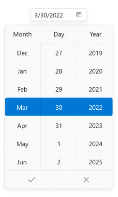
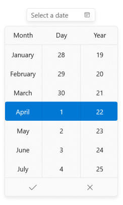
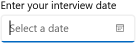
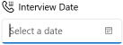

# Getting Started with WinUI Date Picker

This section explains the steps required to add the WinUI [Date Picker](https://help.syncfusion.com/cr/winui/Syncfusion.UI.Xaml.Editors.SfDatePicker.html) control and its date selection options. This section covers only the basic features needed to get started with the Syncfusion `Date Picker` control.

## Structure of Date Picker control

## Creating an application with WinUI Date Picker

In this walkthrough, you will create a WinUI application that contains the `Date Picker` control.

## Adding control manually in XAML

To add the `Date Picker` control manually in XAML, follow the below steps.

1. Create a [WinUI 3 desktop app for C# and .NET 5](https://docs.microsoft.com/en-us/windows/apps/winui/winui3/get-started-winui3-for-desktop).
2. Download and refer to the following NuGet in the project.
    * [Syncfusion.Editors.WinUI](https://www.nuget.org/packages/Syncfusion.Editors.WinUI)
3. Import the control namespace `Syncfusion.UI.Xaml.Editors` in XAML or C# code.
4. Initialize the `SfDatePicker` control.





<Window
    x:Class="GettingStarted.MainWindow"
    xmlns="http://schemas.microsoft.com/winfx/2006/xaml/presentation"
    xmlns:x="http://schemas.microsoft.com/winfx/2006/xaml"
    xmlns:local="using:GettingStarted"
    xmlns:d="http://schemas.microsoft.com/expression/blend/2008"
    xmlns:mc="http://schemas.openxmlformats.org/markup-compatibility/2006"
    xmlns:editors="using:Syncfusion.UI.Xaml.Editors"
    mc:Ignorable="d">
    <Grid Name="grid">
        <!--Adding Date Picker control -->
        <editors:SfDatePicker Name="sfDatePicker"/>
    </Grid>
</Window>




{{ codesnippet1 | OrderList_Indent_Level_1 }}

## Adding control manually in C#

To add the `Date Picker` control manually in C#, follow the below steps.

1. Create a [WinUI 3 desktop app for C# and .NET 5](https://docs.microsoft.com/en-us/windows/apps/winui/winui3/get-started-winui3-for-desktop) or [WinUI 3 app in UWP for C#](https://learn.microsoft.com/en-us/windows/apps/winui/winui3/create-your-first-winui3-app).
2. Download and refer to the following NuGet in the project.
    * [Syncfusion.Editors.WinUI](https://www.nuget.org/packages/Syncfusion.Editors.WinUI)
3. Import the `Date Picker` namespace `Syncfusion.UI.Xaml.Editors` in the C# page.
4. Initialize the `Date Picker` control.





using Syncfusion.UI.Xaml.Editors;

namespace GettingStarted
{
    /// 

    /// An empty window that can be used on its own or navigated to within a Frame.
    /// 

    public sealed partial class MainWindow : Window
    {
        public MainWindow()
        {
            this.InitializeComponent();
            // Creating an instance of the Date Picker control
            SfDatePicker sfDatePicker = new SfDatePicker();
            this.Content = sfDatePicker;
        }
    }
}




{{ codesnippet2 | OrderList_Indent_Level_1 }}

N> Download demo application from [GitHub](https://github.com/SyncfusionExamples/syncfusion-winui-tools-datepicker-examples/blob/main/Samples/Getting_Started)

## Select date programmatically

You can set or change the selected date programmatically by using the [`SelectedDate`](https://help.syncfusion.com/cr/winui/Syncfusion.UI.Xaml.Editors.SfDatePicker.html#Syncfusion_UI_Xaml_Editors_SfDatePicker_SelectedDate) property. If you do not assign any value to the `SelectedDate` property, the `Date Picker` will automatically assign the current system date as `SelectedDate`.




SfDatePicker sfDatePicker= new SfDatePicker();
sfDatePicker.SelectedDate = new DateTimeOffset(new DateTime(2021, 10, 29));




N> Download demo application from [GitHub](https://github.com/SyncfusionExamples/syncfusion-winui-tools-datepicker-examples/blob/main/Samples/ViewAndItemCustomization)

## Select date interactively

You can change the selected date interactively by entering the date value using the keyboard or selecting from the drop-down date spinner. You can get the selected date from the `SelectedDate` property.




<editors:SfDatePicker Name="sfDatePicker" />




SfDatePicker sfDatePicker= new SfDatePicker();




N> Download demo application from [GitHub](https://github.com/SyncfusionExamples/syncfusion-winui-tools-datepicker-examples/blob/main/Samples/Getting_Started)

## Restrict selection

You can restrict users from:
* Selecting a date within a specific minimum and maximum range using the [`MinDate`](https://help.syncfusion.com/cr/winui/Syncfusion.UI.Xaml.Editors.SfDatePicker.html#Syncfusion_UI_Xaml_Editors_SfDatePicker_MinDate) and [`MaxDate`](https://help.syncfusion.com/cr/winui/Syncfusion.UI.Xaml.Editors.SfDatePicker.html#Syncfusion_UI_Xaml_Editors_SfDatePicker_MaxDate) properties.
* Selecting a date from blocked dates using the [`BlackoutDates`](https://help.syncfusion.com/cr/winui/Syncfusion.UI.Xaml.Editors.SfDatePicker.html#Syncfusion_UI_Xaml_Editors_SfDatePicker_BlackoutDates) property.
* Selecting a date from a specifically blocked set of dates (example: blocking weekend dates) using the [`DateFieldItemPrepared`](https://help.syncfusion.com/cr/winui/Syncfusion.UI.Xaml.Editors.SfDatePicker.html#Syncfusion_UI_Xaml_Editors_SfDatePicker_DateFieldItemPrepared) event.

For further reference, [click here](date-restriction).

## Setting null value

If you want to set a null value for the `Date Picker`, set the [`AllowNull`](https://help.syncfusion.com/cr/winui/Syncfusion.UI.Xaml.Editors.SfDatePicker.html#Syncfusion_UI_Xaml_Editors_SfDatePicker_AllowNull) property to `true` and set the `SelectedDate` property to `null`. If the `AllowNull` property is `false`, then the current system date is updated in the `SelectedDate` property and displayed instead of `null`.




<editors:SfDatePicker Name="sfDatePicker"
                      SelectedDate="{x:Null}"
                      AllowNull="True"
                       />




SfDatePicker sfDatePicker= new SfDatePicker();
sfDatePicker.SelectedDate = null;
sfDatePicker.AllowNull = true;




N> Download demo application from [GitHub](https://github.com/SyncfusionExamples/syncfusion-winui-tools-datepicker-examples/blob/main/Samples/DateRestriction)

## Header and description
This section explains the `Header` and `Description` properties of the `Date Picker`.
### Header
The `Header` property is used to display the title for the `Date Picker` control.
     



<editors:SfDatePicker x:Name="datePicker" 
                      Height="75" 
                      Width="200"
                      Header="Enter your interview date" />




SfDatePicker datePicker = new SfDatePicker();
datePicker.Header = "Enter your interview date";




#### Header customization
By using the control's `HeaderTemplate` property, you can customize the appearance of the control's header. The following code sample shows how to use a header template to customize the header.




<editors:SfDatePicker  Width="250" Height="75">
    <editors:SfDatePicker.HeaderTemplate>
        <DataTemplate>
            <StackPanel Orientation="Horizontal">
                <FontIcon FontFamily="Segoe MDL2 Assets" Glyph="&#xE80B;"/>
                <TextBlock Text="Interview Date" FontSize="14" Margin="5"/>
            </StackPanel>
        </DataTemplate>
    </editors:SfDatePicker.HeaderTemplate>
</editors:SfDatePicker>




### Description
The `Description` support is used to display the content beneath the control as well as to provide guidance on the input that the control expects.




<editors:SfDatePicker x:Name="DatePicker" 
                      Height="75" 
                      Width="300" 
                      Header="Enter your interview date" 
                      Description="The chosen date must be within the next 5 days."/>




SfDatePicker datePicker = new SfDatePicker();
datePicker.Description = "The chosen date must be within the next 5 days.";




## Setting watermark text

You can prompt the user with some information by using the [`PlaceholderText`](https://help.syncfusion.com/cr/winui/Syncfusion.UI.Xaml.Editors.SfDatePicker.html#Syncfusion_UI_Xaml_Editors_SfDatePicker_PlaceholderText) property. This will be displayed only when the `Date Picker` contains the `SelectedDate` property as `null` and the `AllowNull` property as `true`. If the `AllowNull` property is `false`, then the current system date is updated in the `SelectedDate` property and displayed instead of `PlaceholderText`.




<editors:SfDatePicker Name="sfDatePicker"
                      PlaceholderText="select a journey date"
                      SelectedDate="{x:Null}"
                      AllowNull="True"
                       />




SfDatePicker sfDatePicker= new SfDatePicker();
sfDatePicker.PlaceholderText = "select a journey date";
sfDatePicker.SelectedDate = null;
sfDatePicker.AllowNull = true;




N> Download demo application from [GitHub](https://github.com/SyncfusionExamples/syncfusion-winui-tools-datepicker-examples/blob/main/Samples/DateRestriction)

## Date changed notification

You will be notified when the selected date changes in the `Date Picker` by using the [`SelectedDateChanged`](https://help.syncfusion.com/cr/winui/Syncfusion.UI.Xaml.Editors.SfDatePicker.html#Syncfusion_UI_Xaml_Editors_SfDatePicker_DateChanged) event. The `SelectedDateChanged` event contains the old and newly selected date in the [`OldDateTime`](https://help.syncfusion.com/cr/winui/Syncfusion.UI.Xaml.Editors.SelectedDateTimeChangedEventArgs.html#Syncfusion_UI_Xaml_Editors_SelectedDateTimeChangedEventArgs_OldDateTime) and [`NewDateTime`](https://help.syncfusion.com/cr/winui/Syncfusion.UI.Xaml.Editors.SelectedDateTimeChangedEventArgs.html#Syncfusion_UI_Xaml_Editors_SelectedDateTimeChangedEventArgs_NewDateTime) properties.

* `OldDateTime` - Gets the date that was previously selected.
* `NewDateTime` - Gets the date that is currently selected.




<editors:SfDatePicker 
                      Name="sfDatePicker"
                      SelectedDateChanged="SfDatePicker_DateChanged" />




SfDatePicker sfDatePicker = new SfDatePicker();
sfDatePicker.SelectedDateChanged += SfDatePicker_DateChanged;




You can handle the event as follows:




private void SfDatePicker_DateChanged(object sender, SelectedDateTimeChangedEventArgs e) {          
    Console.WriteLine("The previously selected Date: " + e.OldDateTime.ToString());
    Console.WriteLine("The newly selected Date: " + e.NewDateTime.ToString());            
}


