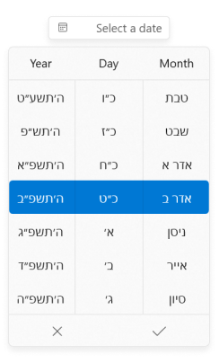
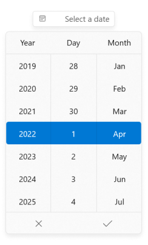
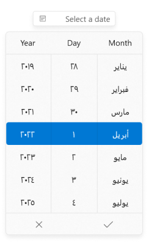
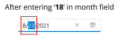

# Localization and Formatting in WinUI Date Picker

This section describes how to localize and format the WinUI [Date Picker](https://help.syncfusion.com/cr/winui/Syncfusion.UI.Xaml.Editors.SfDatePicker.html) control using [`CalendarIdentifier`](https://help.syncfusion.com/cr/winui/Syncfusion.UI.Xaml.Calendar.SfCalendar.html#Syncfusion_UI_Xaml_Calendar_SfCalendar_CalendarIdentifier) and `Language` properties and to change the display formats.

## Change the type of calendar

The `Date Picker` control supports different type of calendar such as Gregorian, Julian, Hebrew, etc. You can change the calendar type by using `CalendarIdentifier` property. The default value of `CalendarIdentifier` property is `GregorianCalendar`.

You can select the required `CalendarIdentifier` value from below types.

 * JulianCalendar
 * GregorianCalendar
 * HebrewCalendar
 * HijriCalendar
 * KoreanCalendar
 * TaiwanCalendar
 * ThaiCalendar
 * UmAlQuraCalendar
 * PersianCalendar




<editors:SfDatePicker 
                      x:Name="sfDatePicker"
                      CalendarIdentifier="HebrewCalendar"/>




SfDatePicker sfDatePicker = new SfDatePicker();
sfDatePicker.CalendarIdentifier = "HebrewCalendar";




N> `Date Picker` control updates the flow direction visually based on the `CalendarIdentifier` property value.

N> When `CalendarIdentifier` and `FlowDirection` properties are set, `FlowDirection` property have higher precedence.

N> Download demo application from [GitHub](https://github.com/SyncfusionExamples/syncfusion-winui-tools-datepicker-examples/tree/main/Samples/Localization)

## Change flow direction

You can change the flow direction of the `Date Picker` layout from right to left by setting the `FlowDirection` property value as `RightToLeft`. The default value of `FlowDirection` property is `LeftToRight`.




<editors:SfDatePicker  
                      x:Name="sfDatePicker"
                      FlowDirection="RightToLeft" />




SfDatePicker sfDatePicker = new SfDatePicker();
sfDatePicker.FlowDirection = FlowDirection.RightToLeft;




N> Download demo application from [GitHub](https://github.com/SyncfusionExamples/syncfusion-winui-tools-datepicker-examples/blob/main/Samples/ViewAndItemCustomization)

## Change the language

You can localize the `Date Picker` using the `Language` property. The default value of `Language` property is **en-US**.




<editors:SfDatePicker 
                      x:Name="sfDatePicker"
                      Language="ar-SA"/>




SfDatePicker sfDatePicker = new SfDatePicker();
sfDatePicker.Language = "ar-SA";




N> `Date Picker` control updates the flow direction visually based on the `Language` property value.

N> When `Language` and `FlowDirection` properties are set, `FlowDirection` property have higher precedence.

N> Download demo application from [GitHub](https://github.com/SyncfusionExamples/syncfusion-winui-tools-datepicker-examples/tree/main/Samples/Localization)

## Change editor display format

You can edit and display the selected date with various formatting like date, month and year formats by using the [`DisplayDateFormat`](https://help.syncfusion.com/cr/winui/Syncfusion.UI.Xaml.Editors.SfDatePicker.html#Syncfusion_UI_Xaml_Editors_SfDatePicker_DisplayDateFormat) property. The default value of `DisplayDateFormat` property is `d`.




<editors:SfDatePicker x:Name="sfDatePicker" 
                      DisplayDateFormat="MM/dd" />




SfDatePicker sfDatePicker = new SfDatePicker();
sfDatePicker.DisplayDateFormat= "MM/dd";




N> Download demo application from [GitHub](https://github.com/SyncfusionExamples/syncfusion-winui-tools-datepicker-examples/blob/main/Samples/DateRestriction)

## Change the field value format in Spinner

You can customize the format of the date, month and year fields in the spinner of the `DatePicker` control by using the [`DayFormat`](https://help.syncfusion.com/cr/winui/Syncfusion.UI.Xaml.Editors.SfDatePicker.html#Syncfusion_UI_Xaml_Editors_SfDatePicker_DayFormat), [`MonthFormat`](https://help.syncfusion.com/cr/winui/Syncfusion.UI.Xaml.Editors.SfDatePicker.html#Syncfusion_UI_Xaml_Editors_SfDatePicker_MonthFormat) and [`YearFormat`](https://help.syncfusion.com/cr/winui/Syncfusion.UI.Xaml.Editors.SfDatePicker.html#Syncfusion_UI_Xaml_Editors_SfDatePicker_YearFormat) properties. By default, the value of `DayFormat` property is `{}{day.integer}`, the value `MonthFormat` property is `{}{month.abbreviated}` and the value of `YearFormat` property is `{}{year.full}`.




<editor:SfDatePicker HorizontalAlignment="Center"
                    VerticalAlignment="Center"
                    DayFormat="{}{day.integer}"
                    MonthFormat="{}{month.full}"
                    YearFormat="{}{year.abbreviated}"
                    />




SfDatePicker sfDatePicker = new SfDatePicker();
sfDatePicker.DayFormat = "{day.integer}";
sfDatePicker.MonthFormat = "{month.full}";
sfDatePicker.YearFormat = "{year.abbreviated}";
sfDatePicker.HorizontalAlignment = HorizontalAlignment.Center;
sfDatePicker.VerticalAlignment = VerticalAlignment.Center;




## Edit date using mask mode

By default ‘Mask’ editing is enabled, which ensure that it contains only valid value. As soon as in input is given, the value is validated and correction is done immediately. Once input is completed for a field, cursor moves to next field automatically.

Based on the `DisplayDateFormat` and your input values, date, month and year field values are automatically corrected. 

For example,

|    Default Masking   |    Input     |     Output      |
|:---------------------|:-------------|:---------------:|
| If you enter `29` into the date field and `2(Feb)` in the month field, the year field value automatically changed to the upcoming leap year. | 29 (in date field) |   |
| If you try to enter values between `13-19` the month field, it will add last input digit(3-9) in the month field and move the cursor to the next field. | 18 (in month field)  |  |
| If you try to enter input in month field that is greater than `19`, it will add first digit in month field and last digit added into next field. | 58 (in month field) |  |




<editors:SfDatePicker 
                      x:Name="sfDatePicker" 
                      EditMode="Mask" />




SfDatePicker sfDatePicker = new SfDatePicker();
sfDatePicker.EditMode = DateTimeEditMode.Mask;




N> Download demo application from [GitHub](https://github.com/SyncfusionExamples/syncfusion-winui-tools-datepicker-examples/blob/main/Samples/DateRestriction)

## Edit date using free form editing

If you want to perform the validation after the user completely entering their date inputs, use the [`EditMode`](https://help.syncfusion.com/cr/winui/Syncfusion.UI.Xaml.Editors.SfDatePicker.html#Syncfusion_UI_Xaml_Editors_SfDatePicker_EditMode) property value as `Normal`. Then the entered date value is validated with the `DisplayDateFormat` property value by pressing the `Enter` key or lost focus. If entered value is not suit with `DisplayDateFormat` property, the previously selected date value sets to `SelectedDate` property.




<editors:SfDatePicker 
                      x:Name="sfDatePicker"
                      EditMode="Normal" />




SfDatePicker sfDatePicker = new SfDatePicker();
sfDatePicker.EditMode = DateTimeEditMode.Normal;




N> Download demo application from [GitHub](https://github.com/SyncfusionExamples/syncfusion-winui-tools-datepicker-examples/blob/main/Samples/DateRestriction)

## Hide clear button in the editor

By default, the clear button `X` will be displayed in the editor of the `Date Picker` control, which can be used to clear the entered input. You can hide the clear button in `Date Picker` control using the [ShowClearButton](https://help.syncfusion.com/cr/winui/Syncfusion.UI.Xaml.Editors.DateTimePickerBase.html#Syncfusion_UI_Xaml_Editors_DateTimePickerBase_ShowClearButton) property. The default value of `ShowClearButton` property value is **true**.




<editors:SfDatePicker 
                      Name="sfDatePicker"
                      ShowClearButton="False"/>




SfDatePicker sfDatePicker = new SfDatePicker();
sfDatePicker.ShowClearButton = false;




