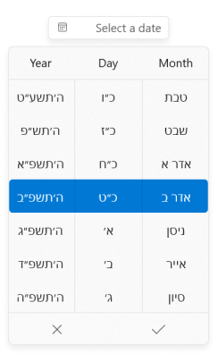
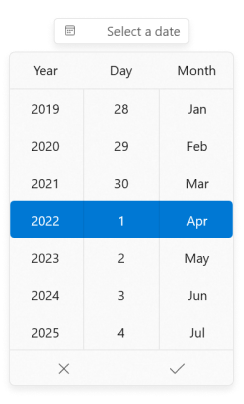
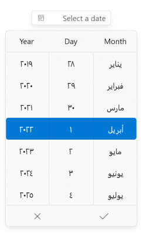
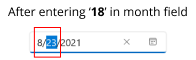

# Localization and Formatting in WinUI Date Picker

This section describes how to localize and format the WinUI [Date Picker](https://help.syncfusion.com/cr/winui/Syncfusion.UI.Xaml.Editors.SfDatePicker.html) control using the [`CalendarIdentifier`](https://help.syncfusion.com/cr/winui/Syncfusion.UI.Xaml.Editors.SfDatePicker.html#Syncfusion_UI_Xaml_Editors_SfDatePicker_CalendarIdentifier) and `Language` properties and to change the display formats.

## Change the type of calendar

The `Date Picker` control supports different types of calendars such as Gregorian, Julian, Hebrew, etc. You can change the calendar type by using the `CalendarIdentifier` property. The default value of the `CalendarIdentifier` property is `GregorianCalendar`.

You can select the required `CalendarIdentifier` value from the below types.

 * JulianCalendar
 * GregorianCalendar
 * HebrewCalendar
 * HijriCalendar
 * KoreanCalendar
 * TaiwanCalendar
 * ThaiCalendar
 * UmAlQuraCalendar
 * PersianCalendar




<editors:SfDatePicker 
                      x:Name="sfDatePicker"
                      CalendarIdentifier="HebrewCalendar"/>




SfDatePicker sfDatePicker = new SfDatePicker();
sfDatePicker.CalendarIdentifier = "HebrewCalendar";




N> The `Date Picker` control updates the flow direction visually based on the `CalendarIdentifier` property value.

N> When the `CalendarIdentifier` and `FlowDirection` properties are set, the `FlowDirection` property has higher precedence.

N> Download demo application from [GitHub](https://github.com/SyncfusionExamples/syncfusion-winui-tools-datepicker-examples/tree/main/Samples/Localization)

## Change flow direction

You can change the flow direction of the `Date Picker` layout from right to left by setting the `FlowDirection` property value to `RightToLeft`. The default value of the `FlowDirection` property is `LeftToRight`.




<editors:SfDatePicker  
                      x:Name="sfDatePicker"
                      FlowDirection="RightToLeft" />




SfDatePicker sfDatePicker = new SfDatePicker();
sfDatePicker.FlowDirection = FlowDirection.RightToLeft;




N> Download demo application from [GitHub](https://github.com/SyncfusionExamples/syncfusion-winui-tools-datepicker-examples/blob/main/Samples/ViewAndItemCustomization)

## Change the language

You can localize the `Date Picker` using the `Language` property. The default value of the `Language` property is **en-US**.




<editors:SfDatePicker 
                      x:Name="sfDatePicker"
                      Language="ar-SA"/>




SfDatePicker sfDatePicker = new SfDatePicker();
sfDatePicker.Language = "ar-SA";




N> The `Date Picker` control updates the flow direction visually based on the `Language` property value.

N> When the `Language` and `FlowDirection` properties are set, the `FlowDirection` property has higher precedence.

N> Download demo application from [GitHub](https://github.com/SyncfusionExamples/syncfusion-winui-tools-datepicker-examples/tree/main/Samples/Localization)

## Change editor display format

You can edit and display the selected date with various formatting options like date, month, and year formats by using the [`DisplayDateFormat`](https://help.syncfusion.com/cr/winui/Syncfusion.UI.Xaml.Editors.SfDatePicker.html#Syncfusion_UI_Xaml_Editors_SfDatePicker_DisplayDateFormat) property. The default value of the `DisplayDateFormat` property is `d`.




<editors:SfDatePicker x:Name="sfDatePicker" 
                      DisplayDateFormat="MM/dd" />




SfDatePicker sfDatePicker = new SfDatePicker();
sfDatePicker.DisplayDateFormat = "MM/dd";




N> Download demo application from [GitHub](https://github.com/SyncfusionExamples/syncfusion-winui-tools-datepicker-examples/blob/main/Samples/DateRestriction)

## Change the field value format in Spinner

You can customize the format of the date, month, and year fields in the spinner of the `Date Picker` control by using the [`DayFormat`](https://help.syncfusion.com/cr/winui/Syncfusion.UI.Xaml.Editors.SfDatePicker.html#Syncfusion_UI_Xaml_Editors_SfDatePicker_DayFormat), [`MonthFormat`](https://help.syncfusion.com/cr/winui/Syncfusion.UI.Xaml.Editors.SfDatePicker.html#Syncfusion_UI_Xaml_Editors_SfDatePicker_MonthFormat), and [`YearFormat`](https://help.syncfusion.com/cr/winui/Syncfusion.UI.Xaml.Editors.SfDatePicker.html#Syncfusion_UI_Xaml_Editors_SfDatePicker_YearFormat) properties. By default, the value of the `DayFormat` property is `{}{day.integer}`, the value of the `MonthFormat` property is `{}{month.abbreviated}`, and the value of the `YearFormat` property is `{}{year.full}`.




<editors:SfDatePicker HorizontalAlignment="Center"
                    VerticalAlignment="Center"
                    DayFormat="{}{day.integer}"
                    MonthFormat="{}{month.full}"
                    YearFormat="{}{year.abbreviated}"
                    />




SfDatePicker sfDatePicker = new SfDatePicker();
sfDatePicker.DayFormat = "{day.integer}";
sfDatePicker.MonthFormat = "{month.full}";
sfDatePicker.YearFormat = "{year.abbreviated}";
sfDatePicker.HorizontalAlignment = HorizontalAlignment.Center;
sfDatePicker.VerticalAlignment = VerticalAlignment.Center;




## Edit date using mask mode

By default, 'Mask' editing is enabled, which ensures that it contains only valid values. As soon as input is given, the value is validated and correction is done immediately. Once input is completed for a field, the cursor moves to the next field automatically.

Based on the `DisplayDateFormat` and your input values, date, month, and year field values are automatically corrected. 

For example,

|    Default Masking   |    Input     |     Output      |
|:---------------------|:-------------|:---------------:|
| If you enter `29` into the date field and `2 (Feb)` in the month field, the year field value is automatically changed to the upcoming leap year. | 29 (in date field) |   |
| If you try to enter values between `13-19` in the month field, it will add the last input digit (3-9) in the month field and move the cursor to the next field. | 18 (in month field)  |  |
| If you try to enter input in the month field that is greater than `19`, it will add the first digit in the month field and the last digit is added to the next field. | 58 (in month field) |  |




<editors:SfDatePicker 
                      x:Name="sfDatePicker" 
                      EditMode="Mask" />




SfDatePicker sfDatePicker = new SfDatePicker();
sfDatePicker.EditMode = DateTimeEditMode.Mask;




N> Download demo application from [GitHub](https://github.com/SyncfusionExamples/syncfusion-winui-tools-datepicker-examples/blob/main/Samples/DateRestriction)

## Edit date using free form editing

If you want to perform the validation after the user has completely entered their date inputs, set the [`EditMode`](https://help.syncfusion.com/cr/winui/Syncfusion.UI.Xaml.Editors.SfDatePicker.html#Syncfusion_UI_Xaml_Editors_SfDatePicker_EditMode) property value to `Normal`. Then the entered date value is validated with the `DisplayDateFormat` property value when pressing the `Enter` key or losing focus. If the entered value does not match the `DisplayDateFormat` property, the previously selected date value is set to the `SelectedDate` property.




<editors:SfDatePicker 
                      x:Name="sfDatePicker"
                      EditMode="Normal" />




SfDatePicker sfDatePicker = new SfDatePicker();
sfDatePicker.EditMode = DateTimeEditMode.Normal;




N> Download demo application from [GitHub](https://github.com/SyncfusionExamples/syncfusion-winui-tools-datepicker-examples/blob/main/Samples/DateRestriction)

## Hide clear button in the editor

By default, the clear button `X` will be displayed in the editor of the `Date Picker` control, which can be used to clear the entered input. You can hide the clear button in the `Date Picker` control using the [ShowClearButton](https://help.syncfusion.com/cr/winui/Syncfusion.UI.Xaml.Editors.DateTimePickerBase.html#Syncfusion_UI_Xaml_Editors_DateTimePickerBase_ShowClearButton) property. The default value of the `ShowClearButton` property is **true**.




<editors:SfDatePicker 
                      Name="sfDatePicker"
                      ShowClearButton="False"/>




SfDatePicker sfDatePicker = new SfDatePicker();
sfDatePicker.ShowClearButton = false;




