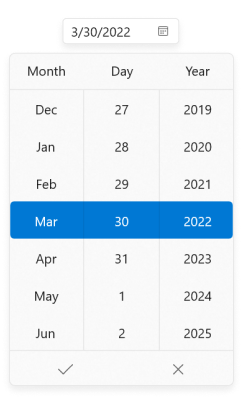

# WinUI Date Picker Overview

The WinUI [Date Picker](https://help.syncfusion.com/cr/winui/Syncfusion.UI.Xaml.Editors.SfDatePicker.html) control provides an intuitive, touch-friendly interface to quickly select a date from a drop-down spinner. It supports different date formats. Date selection can be restricted by specifying minimum and maximum dates. Dates can also be hidden or disabled from selection. In addition, it supports editing with validation and built-in watermark text display.

### Normal view

### Expanded view

### Key Features

* **Formatting** – The control displays the selected date value in various formats.
* **Date Spinner** – The drop-down portion is used for selecting the date and it can be customized.
* **Restrict dates** – Restrict the user from selecting specific dates.