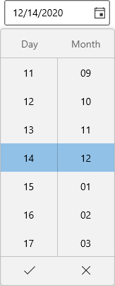

# Dropdown date spinner in WPF DatePicker (SfDatePicker)

This section describes how to select a date from drop down date spinner and its customization options in [SfDatePicker]() control.

## Change date format for Spinner

You can allow the user to select the pair of date, month and year spinner or any single spinner cell from the drop down date spinner by using the [DropdownFormatString]() property. The default value of `DropdownFormatString` property is `d`.




<editors:SfDatePicker x:Name="sfDatePicker" 
                         DropdownFormatString="dd/MM"/>




SfDatePicker sfDatePicker = new SfDatePicker();
sfDatePicker.DropdownFormatString = "dd/MM";




Here, you can only able to select the date and month value from the drop down spinner.

N> Download demo application from [GitHub]()

## Block dates using BlackoutDates

If you want to block particular dates from the date selection, add that date ranges to the [BlackoutDates]() collection. You can add more block out date ranges to the `BlackoutDates` collection.




<editors:SfDatePicker x:Name="sfDatePicker"/>




SfDatePicker sfDatePicker = new SfDatePicker();




## Restrict date selection by editing

If you want to restrict the date selection by editing, use the `EditMode` property value as `None`. Then, you can change the date only using drop down date spinner. The default value of `EditMode` property is `Mask`.




<editors:SfDatePicker EditMode="None"
                      x:Name="sfDatePicker" />




SfDatePicker sfDatePicker = new SfDatePicker();
sfDatePicker.EditMode = DateTimeEditingMode.None;




## Show or hide Dropdown button

If you want to restrict the user to select a date from a drop down date spinner, hide the drop down button by using the [ShowDropDownButton]() property value as `false`. The default value of `ShowDropDownButton` property is `true`.




<editors:SfDatePicker ShowDropDownButton="False" 
	                     x:Name="sfDatePicker"/>




SfDatePicker sfDatePicker = new SfDatePicker();
sfDatePicker.ShowDropDownButton = false;




N> Download demo application from [GitHub]()

## Hide Dropdown submit button(Select date directly from date spinner)

If you want to hide the submit button and select the date directly from the drop down date spinner without clicking the `Ok` button, use the [ShowSubmitButtons]() property value as `false`. The default value of `ShowSubmitButtons` property is `true`.




<editors:SfDatePicker ShowSubmitButtons="False" 
	                  x:Name="sfDatePicker"/>




SfDatePicker sfDatePicker = new SfDatePicker();
sfDatePicker.ShowSubmitButtons = false;




N> Download demo application from [GitHub]()

## Change Dropdown alignment

You can change alignment of the drop down date spinner as full, center, left, right, top or bottom with edge of the `DatePicker` by using the [DropDownPlacement]() property. The default value of `DropDownPlacement` property is `Auto`.




<editors:SfDatePicker DropDownPlacement="BottomEdgeAlignedRight" 
	                     x:Name="sfDatePicker"/>




SfDatePicker sfDatePicker = new SfDatePicker();
sfDatePicker.DropDownPlacement = FlyoutPlacementMode.BottomEdgeAlignedRight;




N> Download demo application from [GitHub]()

## Setting the Dropdown header text

You can add the drop down date spinner's header text by using the [DropDownHeader]() property.
If you want to show the drop down header, use the [ShowDropDownHeader]() property value as `true`. Otherwise, drop down header will not be shown. The default value of `DropDownHeader` property is `null` and `ShowDropDownHeader` property is `false`.




<editors:SfDatePicker DropDownHeader="Select Date" 
						 ShowDropDownHeader="True" 
	                     x:Name="sfDatePicker"/>




SfDatePicker sfDatePicker = new SfDatePicker();
sfDatePicker.DropDownHeader = "Select Date";
sfDatePicker.ShowDropDownHeader = true;




N> Download demo application from [GitHub]()

## Custom UI of Dropdown header

You can customize the header of drop down date spinner by using the [DropDownHeaderTemplate]() property. The `DataContext` of `DropDownHeaderTemplate` property is `SfDatePicker.DropDownHeader`.




<editors:SfDatePicker DropDownHeader="Select Date" 
						 ShowDropDownHeader="True" 
	                     x:Name="sfDatePicker">
    <editors:SfDatePicker.DropDownHeaderTemplate>
        <DataTemplate>
            <Grid>
                <TextBlock 
                    Foreground="Red" 
                    Text="{Binding}"/>
            </Grid>
        </DataTemplate>
    </editors:SfDatePicker.DropDownHeaderTemplate>
</editors:SfDatePicker>




N> Download demo application from [GitHub]()

## Hide the Dropdown column headers

If you want to hide the drop down day, month and year spinner's column headers, use the [ShowColumnHeaders]() property value as `false`. The default value of `ShowColumnHeaders` property is `true`.




<editors:SfDatePicker ShowColumnHeaders="False" 
	                     x:Name="sfDatePicker"/>




SfDatePicker sfDatePicker = new SfDatePicker();
sfDatePicker.ShowColumnHeaders = false;




N> Download demo application from [GitHub]()

## Change the number of dates to be shown in the Dropdown

You can change the number of dates to be shown in the drop down date spinner by using the [VisibleItemsCount]() property. The default value of `VisibleItemsCount` property is `-1`.




<editors:SfDatePicker VisibleItemsCount="BottomEdgeAlignedRight" 
	                     x:Name="sfDatePicker"/>




SfDatePicker sfDatePicker = new SfDatePicker();
sfDatePicker.VisibleItemsCount = FlyoutPlacementMode.BottomEdgeAlignedRight;




N> Download demo application from [GitHub]()

## Change Dropdown height

You can change the height of drop down date spinner by using the [DropDownHeight]() property. The default value of `DropDownHeight` property is `NaN`.




<editors:SfDatePicker DropDownHeight="200"
						 x:Name="sfDatePicker"/>




SfDatePicker sfDatePicker = new SfDatePicker();
sfDatePicker.DropDownHeight = 200;




N> Download demo application from [GitHub]()

## Change the size of Dropdown cells

You can change the cell size in the drop down date spinner by setting the values to [ItemWidth]() and [ItemHeight]() properties. The default value of the `ItemWidth` and `ItemHeight` properties is `80` and `40`. 

You can also restrict the width of drop down date spinner cells with particular pixels by using the [MinItemWidth]() and [MaxItemWidth]() properties. The default value of `MinItemWidth` property is `0` and `MaxItemWidth` property is `Infinity`.

N> `ItemWidth` values must be within the `MinItemWidth` and `MaxItemWidth`values. Otherwise, `ItemWidth` will take the closest value from `MinItemWidth` or `MaxItemWidth` value.




<editors:SfDatePicker MinItemWidth="70" 
						 MaxItemWidth="120" 
						 ItemWidth="100"
						 ItemHeight="50" 
	                     x:Name="sfDatePicker"/>




SfDatePicker sfDatePicker = new SfDatePicker();
sfDatePicker.MinItemWidth = 70;
sfDatePicker.MaxItemWidth = 120;
sfDatePicker.ItemWidth = 100;
sfDatePicker.ItemHeight = 50;




N> Download demo application from [GitHub]()

## Change flow direction

You can change the flow direction of the `DatePicker` layout from right to left by setting the `FlowDirection` property value as `RightToLeft`. The default value of `FlowDirection` property is `LeftToRight`.




<editors:SfDatePicker FlowDirection="RightToLeft" 
	                     x:Name="sfDatePicker"/>




SfDatePicker sfDatePicker = new SfDatePicker();
sfDatePicker.FlowDirection = FlowDirection.RightToLeft;




N> Download demo application from [GitHub]()