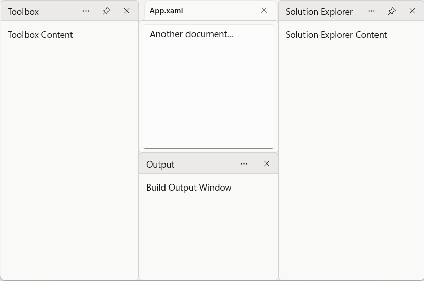
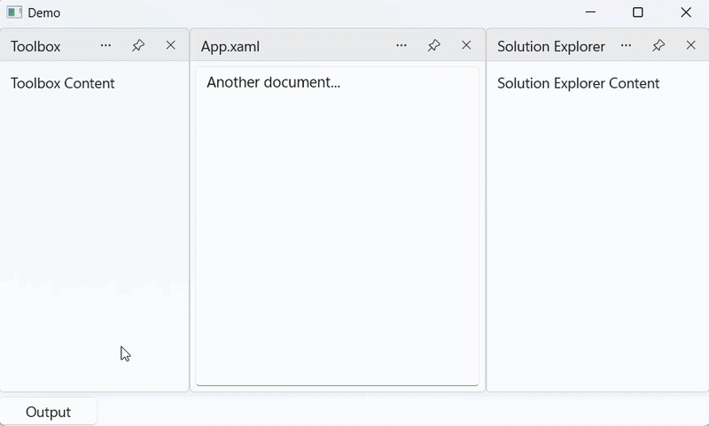

# Auto-Hide Panels in WinUI DockingManager

The DockingManager control allows panes to be automatically hidden when they are not in use. Auto-hidden panes remain accessible through edge tabs and can be displayed temporarily when selected.

This behavior helps maximize the available workspace while keeping important tool windows easily accessible.

## Auto-Hide a Pane

A pane can be displayed as an auto-hidden window by setting its `DockState` property to `AutoHidden`.




<Grid>
    <docking:SfDockingManager>
         <!-- Left Docked -->
        <docking:DockPane x:Name="ToolBoxPane"
                Header="Toolbox"
                DockDirection="Left"
                DockState="Docked">
            <TextBlock Text="Toolbox Content" Margin="10"/>
        </docking:DockPane>
        <!-- Right Docked -->
        <docking:DockPane x:Name="SolutionExplorerPane"
                Header="Solution Explorer"
                DockDirection="Right"
                DockState="Docked">
            <TextBlock Text="Solution Explorer Content" Margin="10"/>
        </docking:DockPane>
        <!-- Bottom Docked -->
        <docking:DockPane x:Name="OutputPane"
                Header="Output"
                DockDirection="Bottom"
                DockState="Docked">
            <TextBlock Text="Build Output Window" Margin="10"/>
        </docking:DockPane>
        <!-- Another Document Window -->
        <docking:DockPane x:Name="Document2"
                Header="App.xaml"
                DockState="Document">
            <TextBox AcceptsReturn="True"
        Text="Another document..."
        Margin="5"/>
        </docking:DockPane>
    </docking:SfDockingManager>
</Grid>





DockPane toolBoxPane = new DockPane()
{
    Header = "Toolbox",
    DockDirection = DockDirection.Left,
    DockState = DockState.Docked,
    Content = new TextBlock()
    {
        Text = "Toolbox Content"
    }
};
DockPane SolutionExplorerPane = new DockPane()
{
    Header = "Solution Explorer",
    DockDirection = DockDirection.Right,
    DockState = DockState.Docked,
    Content = new TextBlock()
    {
        Text = "Solution Explorer Content"
    }
};
DockPane OutputPane = new DockPane()
{
    Header = "Output",
    DockDirection = DockDirection.Bottom,
    DockState = DockState.Docked,
    Content = new TextBlock()
    {
        Text = "Output Content"
    }
};
DockPane documentPane = new DockPane()
{
    Header = "App.xaml",
    DockDirection = DockDirection.Left,
    DockState = DockState.Docked,
    Content = new TextBlock()
    {
        Text = "App.xaml Content"
    }
};

dockingManager.Panes.Add(toolBoxPane);
dockingManager.Panes.Add(SolutionExplorerPane);
dockingManager.Panes.Add(OutputPane);
dockingManager.Panes.Add(documentPane);




## Display an Auto-Hidden Pane

When a pane is auto-hidden, it is displayed as a tab along the edge of the docking layout. Selecting the tab temporarily expands the pane and displays its content. When the pane loses focus, it automatically collapses back to its hidden state.

