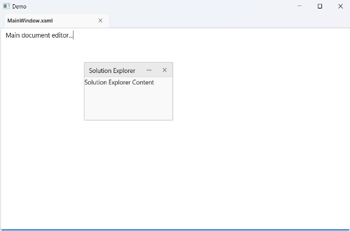
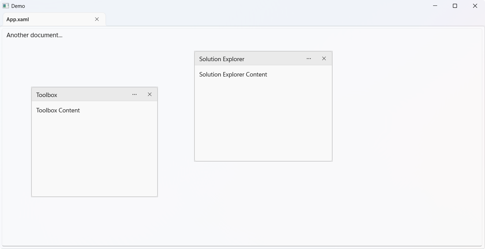

# Floating Windows in WinUI DockingManager

The DockingManager control allows panes to be displayed as floating windows. Floating windows can be moved independently within the DockingManager layout, providing greater flexibility for organizing content and customizing the workspace.

## Create a Floating Window

A pane can be displayed as a floating window by setting its `DockState` property to `Floating`.




<Grid>
    <docking:SfDockingManager>

        <docking:DockPane Header="MainWindow.xaml"
                          DockState="Document">
            <TextBox Text="Main document editor..."
                     AcceptsReturn="True"/>
        </docking:DockPane>

        <docking:DockPane Header="Solution Explorer"
                          DockState="Floating">
            <TextBlock Text="Solution Explorer Content"/>
        </docking:DockPane>

    </docking:SfDockingManager>
</Grid>





DockPane documentPane = new DockPane()
{
    Header = "MainWindow.xaml",
    DockState = DockState.Document
};

DockPane floatingPane = new DockPane()
{
    Header = "Solution Explorer",
    DockState = DockState.Floating,
    Content = new TextBlock()
    {
        Text = "Solution Explorer Content"
    }
};

dockingManager.Panes.Add(documentPane);
dockingManager.Panes.Add(floatingPane);




## Floating Multiple Windows

The DockingManager control supports multiple floating windows within the same layout. Floating windows can be positioned independently and rearranged to suit different workspace requirements.




<Grid>
    <docking:SfDockingManager>

        <docking:DockPane Header="MainWindow.xaml"
                          DockState="Document">
            <TextBox Text="Main document editor..."
                     AcceptsReturn="True"/>
        </docking:DockPane>

        <docking:DockPane Header="Solution Explorer"
                          DockState="Floating">
            <TextBlock Text="Solution Explorer Content"/>
        </docking:DockPane>

        <docking:DockPane Header="ToolBox"
                          DockState="Floating">
            <TextBlock Text="ToolBox Window"/>
        </docking:DockPane>

    </docking:SfDockingManager>
</Grid>





DockPane documentPane = new DockPane()
{
    Header = "MainWindow.xaml",
    DockState = DockState.Document
};

DockPane solutionExplorerPane = new DockPane()
{
    Header = "Solution Explorer",
    DockState = DockState.Floating
};

DockPane toolBoxPane = new DockPane()
{
    Header = "ToolBox",
    DockState = DockState.Floating
};

dockingManager.Panes.Add(documentPane);
dockingManager.Panes.Add(solutionExplorerPane);
dockingManager.Panes.Add(toolBoxPane);




